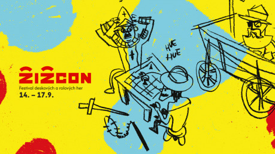

Těšit se můžete na bohatý program plný her, přednášek a jiných doprovodných aktivit. To vše v úžasné atmosféře husitského kostela naplněného skvělými lidmi. Do 14. července je možné zakoupit zlevněné vstupné. Také se můžete přihlásit jako organizátoři aktivit a dosáhnout tak na vstupné zdarma. Více na [Facebooku](https://www.facebook.com/festivalzizcon/) či na stránkách [www.zizcon.cz](http://www.zizcon.cz/).

