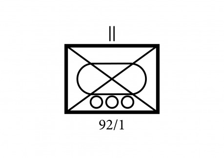
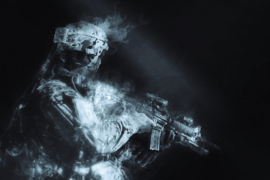
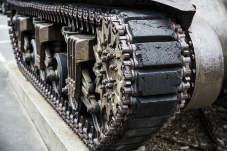
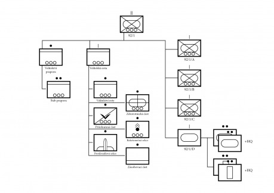

> „Američané v roce 1950 znovu objevili něco, co od Hirošimy zapomněli: Můžete věčně létat nad zemí, můžete ji bombardovat, vysypat na ni atomovky, rozdrtit ji na prach a vyhladit na ní vše živé – ale pokud ji toužíte získat, bránit a uchovat ji pro civilizaci, musíte to udělat na zemi, stejným způsobem jako kdysi římské legie – tím, že postavíte své mladé muže do bahna.“
>
> _– Vojenský historik T. R. Fehrenbach_

#### Zařazení pluku:
92/1 – 1. prapor 92. pluku („Pohraniční rváči“)

#### Velitel pluku:
plukovník H. J. „Pirát“ Roberts (výrazné rysy: Agresivní, Inspirativní, Nehledí na ztráty)

#### Velitel 1. praporu:
podplukovnice Laurie Cheng (výrazné rysy: Přirozená autorita, Muži ji budou následovat do pekla a zpět, Veterán)

#### Zástupce velitele:
major Andrew D. Dalton (výrazné rysy: Úředník, Silné brýle, Srdce v kalhotách)

#### Seržant praporu:
hlavní seržant Jens Lundbland (výrazné rysy: Oči zabijáka, Profesionál každým coulem, Výkonný)

#### Doktor praporu:
major Frank „Tequila“ Rodriguez (výrazné rysy:  Flaška ve stole, Temperament, Spolehlivý doktor)

#### Kaplan praporu:
poručík Elijah „Padre“ Silverman (výrazné rysy: Nezdolný optimismus; Jsem tu, pokud si chceš promluvit; „Padre“)

#### Velitel střelecké roty Alfa:
kapitánka Willa Norwoodová (výrazné rysy: Vpřed!, Drsnější než hřebíky, Hromada metálů)

#### Velitel střelecké roty Bravo:
kapitán Dietrich Landau (výrazné rysy: Arogantní zmetek, Studený jak psí čumák, Má výsledky)

#### Velitel střelecké roty Charlie:
kapitán E. Baldwine III. (výrazné rysy: Všechno podle příručky, Přímo z&#160;důstojnické školy, Nezkušený)

#### Velitel podpůrné roty Delta:
kapitán James „Jimmy“ Kiery (výrazné rysy: Ostřílený tankista, Ocelový pohled, Excelentní taktik)

Součástí space opery a science fiction jsou často velké bitvy, vojenská tažení na cizích planetách, boj proti přesile nepřátel, stejně jako války proti lidem nebo mimozemským rasám. Tento článek (a dvojice předchozích) by vám měly nabídnout možnost použít pro takové scény připravené jednotky námořní pěchoty různých velikostí, se kterými se nemusíte vymýšlet. Četa představuje jednotku velikosti asi 50 mužů, rota okolo 200 mužů a prapor (který představuje tento článek) už je větší bojová jednotka, která má okolo 800 mužů a v její sestavě jsou také těžké a podpůrné zbraně jako tanky, takže může provádět samostatně operace většího rozsahu.

V tomto díle je popsána podoba a struktura posledně zmínění jednotky na příkladu 1. praporu 92. pluku námořní pěchoty, známého jako „Pohraniční rváči“. Jde o prapor mechanizované pěchoty, který je složen z velitelství praporu (velitelská sekce a štáb), velitelské roty (poskytující praporu zdravotnické zázemí, průzkum a palebnou podporu), trojice střeleckých rot (vyzbrojené obrněnými transportéry a útočnými drony) a podpůrné roty (vyzbrojená tanky a titány). Pěší roty prvního praporu jsou tradičně označeny jako A, B a C (Alfa, Bravo a Charlie), pro podpůrnou rotu je vyhrazeno D (Delta).

Přestože střelecké roty dokážou fungovat na bojišti jako samostatné oddíly, prapor je zpravidla nejnižší jednotkou, která je nasazována na samostatné bojové operace. Velitel praporu (v tomto případě velitelka, podplukovnice Cheng) má k dispozici vlastní štáb, který mu umožňuje efektivně koordinovat podřízené oddíly, plánovat bitvu a bojové nasazení jednotky. Prapor má k dispozici vlastní těžké zbraně, palebnou podporu (v podobě vícehlavňových raketometů, které mohou posílit palebnou podporu jednotlivých rot nebo samostatně útočit na strategické cíle, zatímco raketomety jednotlivých rot jsou zaneprázdněny podporou svých rot) a zdravotnickou četu, která se dokáže postarat o nemocné a zraněné.

Prapor si veze vlastní náboje, jídlo, vodu, náhradní díly, léky a baterie, aby vydržel v poli dva až tři týdny. Pokud budou muži mít snížené příděly, budou moci vydržet měsíc, ale ne o mnoho déle. V případě delšího nasazení potřebuje prapor nějakou možnost doplnit zásoby, případně potřebuje další zásobování. V rámci nadřízené jednotky (pluku) jsou zařazeny zásobovací jednotky, které dokážou udržet prapor v boji mnohem déle.

## Struktura praporu

Součástí mechanizovaného praporu je mimo celkem 793 mužů, 92 bojových transportérů Avenger, 28 zvláštních verzí transportérů Avenger různých verzí (zdravotnických, průzkumných, raketometných, minometných), 27 bojových dronů, 10 tanků a 14 titánů. Prapor je rozdělen na pět částí – HQ (velitelství a velitelská rota), tři střelecké roty a podpůrná rota.

### HQ (92/1/HQ)

a) Velitelství praporu

__Velitelská sekce praporu__ (2 důstojníci, 10 mužů, VI Legion, 1× Avenger HQ – velitelská verze, 3× jeep): Tato sekce sestává z velitele praporu, virtuální inteligence Legion (která dokáže propojit VI AITE a ORCA, které používají podřízené jednotky do jedné sítě), zástupce velitele, hlavního seržanta, střeleckého taktického týmu čtyř vybraných mužů (kteří slouží jako tělesná stráž velitele, která má na starosti jeho fyzické bezpečí), osádky transportéru (řidič a střelec) a tří řidičů džípů, které jsou pro velitele k dispozici.

Velitel má k dispozici bojový transportér ve velitelské verzi a několik kolových jeepů, které umožňují přesun velitelského personálu po bojišti a na klíčová místa.

__Štáb praporu__ (54 důstojníků a mužů, 3× Avenger, 13× jeep, 2× nákladní vozidlo): Štáb představuje podporu velitele a má k dispozici vše potřebné, aby mohl vybudovat polní velitelství, dodávat potřebná data a informace pro velitele, aby mohl vést bitvu a svůj prapor. Obsahuje personální a administrační sekci, zpravodajskou sekci, logistickou sekci, komunikační sekci a zvláštní personál jako vojenský kaplan. Všechny části štábu pomáhají veliteli praporu s plánováním, organizací, koordinací, nasazením a udržováním bojeschopnosti praporu.

b) Velitelská rota

__Velitelská sekce roty__ (1 důstojník, 7 mužů, 2× jeep): Má na starosti koordinaci velitelské roty a jejích jednotlivých částí.

__Zdravotnická četa__ (2 důstojníci, 30 mužů, 4× Avenger ME, 8× evakuační dron, 4× jeep): Četě velí hlavní lékař praporu v hodnosti majora a zastupuje jej druhý lékař v hodnosti kapitána, kteří mají k dispozici několik mediků a řidiče vozidel. V případě potřeby vytvoří zdravotnická četa stanici první pomoci, kam bude za pomocí pancéřovaných zdravotnických transportérů, evakuačních jednomístných dron (každý transportér veze dvě na střeše) a jeepů soustředit zraněné celého praporu, provádět jednoduché operace, obvazovat zranění a těžké případy odesílat za frontu do nemocnic. V případě, že žádná další zdravotnická zařízení nejsou k dispozici, slouží stanice první pomoci také jako hlavní operační sál pro zraněné.

__Průzkumná četa__ (10 mužů, 2× Avenger RE – průzkumná verze): Avenger v průzkumné verzi veze osm malých průzkumných dronů pro přímý průzkum a na korbě veze ultralehký skládací letoun s velkým rozpětím křídel, který létá na hranici stratosféry a slouží pro přenos komunikace a snímkování z velké výšky. Velitel praporu má k dispozici v rámci průzkumné čety dva tyto transportéry a jejich informace, společně s informacemi získanými průzkumnými drony rot a čet mu poskytují přehled o situaci na bojišti. Jedno z průzkumných vozidel je zpravidla zaparkováno vedle jeho velitelského vozidla a spojeno pro rychlejší přenos kabely. Druhé bývá naopak umístěno na vzdálenějším místě, aby přímý zásah nemohl vyřadit oba průzkumné transportéry.

__Raketometná četa__ (16 mužů, 4× Avenger RL – raketometná verze): Četa má v sestavě dvě sekce po dvou transportérech Avenger v raketometné verzi. Každý z nich nese dvanáctihlavňový raketomet, který může střílet neřízené nebo řízené rakety až do vzdálenosti 90 km a poskytuje přímou palebnou podporu praporu v bitvě.

__Protiletadlová sekce__ (8 mužů, 2× Avenger AA –protiletadlová verze): Sekce obsahuje dva transportéry Avenger v protiletadlové verzi, které zajišťují protiletadlové krytí velitelství praporu.

__Zásobovací četa__ (34 mužů, 10× nákladní vozidlo, 2 vyprošťovací titáni, 2 stavební titáni): Dvě nákladní vozidla vezou zásoby pro velitelskou rotu a velitelství praporu, dvě pro podpůrnou rotu, zatímco ostatních šest veze jídlo, potraviny, zásoby, náhradní munici a složitější náhradní díly pro celý prapor, který díky tomu dokáže vydržet v poli mnohem déle a opravit poškozené transportéry, pro které by jinak nebyly náhradní díly. K četě patří také 2 titáni určení ke stavebním pracím, budování velitelství, stanice první pomoci, hloubení zákopů a obranných pozic, stejně jako 2 titáni určení k vyprošťování poškozených, zničených nebo zaseklých vozidel.

### Střelecká rota Alfa (92/1/A)

Součástí mechanizované roty je 7 důstojníků, 187 členů mužstva a 4 entity virtuální inteligence (3× VI ORCA a 1× VI AITE). Rota disponuje bojovou silou 9 bojových družstev, 14 bojovými transportéry Avenger, 8 zvláštními verzemi transportéru Avenger (které jsou určeny pro bojovou podporu, kdy rota má vlastní minomety, vícehlavňové raketomety a protiletecké krytí), 9 bojovými drony, 4 terénními vozidly a 2 tahači s nákladními přívěsy. _(Bližší popis roty najdete v Drakkaru 55.)_

### Střelecká rota Bravo (92/1/B)

Součástí mechanizované roty je 7 důstojníků, 187 členů mužstva a 4 entity virtuální inteligence (3× VI ORCA a 1× VI AITE). Rota disponuje bojovou silou 9 bojových družstev, 14 bojovými transportéry Avenger, 8 zvláštními verzemi transportéru Avenger (které jsou určeny pro bojovou podporu, kdy rota má vlastní minomety, vícehlavňové raketomety a protiletecké krytí), 9 bojovými drony, 4 terénními vozidly a 2 tahači s nákladními přívěsy. _(Bližší popis roty najdete v Drakkaru 55.)_

### Střelecká rota Charlie (92/1/C)

Součástí mechanizované roty je 7 důstojníků, 187 členů mužstva a 4 entity virtuální inteligence (3× VI ORCA a 1× VI AITE). Rota disponuje bojovou silou 9 bojových družstev, 14 bojovými transportéry Avenger, 8 zvláštními verzemi transportéru Avenger (které jsou určeny pro bojovou podporu, kdy rota má vlastní minomety, vícehlavňové raketomety a protiletecké krytí), 9 bojovými drony, 4 terénními vozidly a 2 tahači s nákladními přívěsy. _(Bližší popis roty najdete v Drakkaru 55.)_

### Podpůrná rota Delta (92/1/D)

Podpůrná rota má ve svém stavu tanky a titány, kteří poskytují praporu podporu těžkých zbraní a slouží jak útočná síla schopná postavit se tankům a opevněným pozicím nepřítele, stejně jako rozbít nepřátelskou frontu nebo posílit ohrožená místa na bojišti a odvrátit nepřátelský protiútok. Podpůrná rota obsahuje dvě tankové čety (každou po 4 tancích) s velitelskou sekcí (o dvou tancích) a dvou četách titánů (také po 4 titánech) s velitelskou sekcí (dva titáni).

- Tank _Charger III:_ Tanky představují hlavní útočnou sílu praporu. Hlavní zbraní třídy Charger III je elektromagnetické dělo, které vystřeluje projektily urychlené elektrickým impulzem, které dokážou vyřadit pancéřované cíle protivníka, zničit nejtěžší nepřátelské tanky, stejně jako prorazit zdi bunkrů a opevnění. Kromě toho jsou vyzbrojeny dvojicí automaticky zaměřovaných kulometů určených k ničení nepřátelské pěchoty a jednorázově odpálitelných náloží, které vrhnou do okolí tanku oblaka střepin a zničí nepřátele, kteří se dostanou příliš blízko. Tank má k dispozici dvojici dronů třídy Katana, které mimo bitvu veze na střeše. Každý dron je vyzbrojen kulometem a slouží jako dodatečná ochrana tanku před nepřáteli. V případě potřeby dokáže dron provést sebevražedný nálet a zničit nepřátelský cíl zabudovanou výbušninou. Tanky třídy Charger III jsou těžce pancéřované a vydrží velká poškození, takže dokážou operovat na bojišti dlouhou dobu.

- Titán _Minuteman C:_ Titáni jsou bojové stroje, které se vyvinuly z vojenských exoskeletů. Kromě armády se různé verze titánů využívají také jako nakladače nákladu, při těžbě nerostných surovin, v těžkém průmyslu pro přesouvání materiálu a pro průzkum a záchranu lodí v hlubokém vesmíru. I bojové stroje jsou velice univerzální a dokážou v případě nutnosti operovat v podpůrných a pracovních rolích. Jsou velice efektivní v nehostinných prostředích a obtížných terénech cizích planet, kde mají kolová vozidla a tanky problémy projet. Titáni dosahují výšky asi jeden a půl až dvojnásobku výšky člověka, jsou pancéřovaní a slouží jako nosiče podpůrných a protitankových zbraní, kterými mohou vyřadit těžší nepřátelské stroje, se kterými si neporadí palebná síla jednotlivých čet. Titáni třídy Minuteman C jsou vyzbrojeni kulomety proti pěchotě, rychlopalnými kanóny velké ráže, výbušnými a protipancéřovými raketami.
