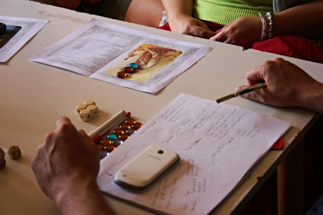
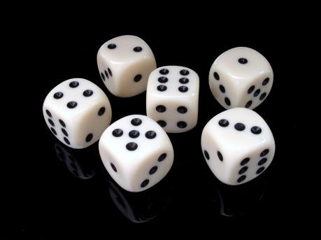
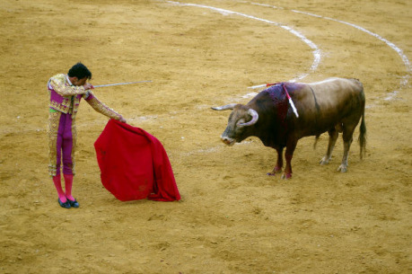

Někdy při hraní RPG dává Vypravěč hráčům možnost ovlivnit dění nebo skutečnosti ve hře nejen skrze jednání jejich postav, ale také přímo z pozice hráče. Anebo jim tuto možnost zajišťují samotná pravidla hry. Ať tak, nebo tak, má to své výhody, ale i rizika. Tomu všemu se bude věnovat následující text, a nejvíc se zaměří na to, jak hrát tak, aby hráči neměli tzv. obsahové či Vypravěčské pravomoci pouze jako občasnou možnost, ale aby pomocí nich měli možnost do hry zasáhnout prakticky kdykoliv. Možná vás při čtení budou napadat připomínky či námitky, na konci článku je oddíl „Troubleshooting“, v němž se pokusím doporučit techniky, jak některým problémům předcházet.

## Proč hrát s obsahovými pravomocemi

Protože jsem přesvědčený, že je to větší zábava, než hrát bez nich. Ačkoli to tak možná nevypadá, znamená to pro Vypravěče jednodušší přípravu – ta totiž může být pro některá sezení či celé hry a s trochou zkušeností i nulová, protože všechno vymyslíte až společně s hráči! Pokud mají hráči vliv na přípravu hry, ale zejména pokud mají vliv na dění během hry samotné, vede to podle mých zkušeností k větší angažovanosti hráčů do hry, hráči totiž do hry „investují“ vlastní nápady, a tak se hra stává skutečně jejich a více jim na výsledku hry záleží. Samozřejmě je potřeba ohlídat některé věci, třeba narušování žánru nebo příliš rychlé posouvání příběhu, ale ve chvíli, kdy si hráči na téměř neomezené možnosti zvyknou, začnou sami automaticky přebírat svůj díl zodpovědnosti za hru. A pro Vypravěče to má ještě jednu výhodu navíc: Sám bude překvapený, kam se příběh vyvinul, protože se velmi pravděpodobně nebude ubírat podle jím načrtnutého děje. Vklad hráčů ho jistě vychýlí jiným směrem, nebo alespoň jinou cestou k předpokládanému cíli. Často dokonce Vypravěč překvapí sám sebe, protože ho hráči při hře inspirují k prvku, který by ho dřív nenapadl.

> Příklad: Hráli jsme pulpový příběh o skupině meziválečných dobrodruhů a cestovatelů, kteří se snaží předstihnout nacistickou výpravu za rasou nadlidí do Himálaje. Když se postavy v jedné horské vesnici rozhlížely po pokoji, ve kterém přespávaly, všimly si obrazu, který prý maloval jakýsi britský horolezec. Ten kdysi v horách přišel o zbytek výpravy a svá vlastní zranění si léčil v této vesnici. Během té doby hodně chodil do hor malovat, až jednou vesnici opustil. Všichni si mysleli, že odešel zpět do Británie, ale nakonec ho postavy objevily jako mnicha ve vysokohorském chrámu, který byl v cíli jejich cesty. Obraz ani malíře jsem ve hře neplánoval, ale přišli jako náhlá inspirace při prohlížení pokoje.

## Rizika

Samozřejmě to, že si myslím, že je takováto hra zábavnější, neznamená, že se hodí pro všechny hry a všechny skupiny. Pokud se chtějí hráči vžívat do svých postav a co nejvíc s nimi splynout, pak je možnost, nebo dokonce nutnost přidávat do hry vlastní obsah může vytrhovat z prožitků postav. Nebo třeba když hrajete hru, jejíž důležitou součástí je náročný boj, je třeba mít soupeře pro postavy předem dobře připravené, a podobně, když chcete před hráče klást různé hádanky nebo si třeba musí vystačit s omezenými zdroji, obsahové pravomoci dokážou do těchto výzev takříkajíc hodit vidle. Případně pokud hráč ví, že si třeba bude sám popisovat, co kde jeho postava našla, nebo co na ni vyskočilo, nebude cítit napětí z očekávání – toho se ovšem dá s trochou zkušeností a disciplíny dosáhnout i ve hře s obsahovými pravomocemi.

Je také třeba myslet na to, že nároky na Vypravěče jsou jiné. Nejsou větší, ale je třeba získat s nimi trochu zkušeností – Vypravěč je spíš než autorem příběhu moderátorem vyprávění, povzbuzuje hráče k aktivitě a vlastní tvorbě, vytváří konflikty a nastavuje překážky, přičemž musí častěji improvizovat, a má asi největší zodpovědnost u stolu za soudržnost příběhu a žánru. V tom všem by mu měli pomáhat i hráči... ovšem i ti si často na tento styl hry musí zvyknout. Je možné, že se třeba první hra úplně nepovede, ale když se, nejlépe společně, po hře zamyslíte nad tím, co fungovalo, a co ne, další hry už budou o sto procent lepší.

> Příklad: Jedna hráčka po úspěšném hodu kostkou na ošetřování a poté, co její postavě pomáhala postava jiné hráčky zpíváním ukolébavky yettimu, měla odvyprávět úspěch své postavy. Začala tím, že poslouchá jakési skřeky a nesrozumitelné zvuky … Tato hráčka sice jen předpokládala, že pomáhající postava zpívá některým z himálajských jazyků, ale podala to tak neobratně, že se druhá hráčka trochu ošila. Odvyprávělo se totiž o její postavě něco, co jí nelíbilo a co si představovala jinak (zřejmě předpokládala pro svou postavu zpěv v češtině). Během hry jsme to přešli, ale po hře jsem raději vyprávějící hráčku upozornil, že mohlo být její spoluhráčce nepříjemné, že vlastně jednala za její postavu. Moje vlastní poučení, přestože z toho snad žádný problém nevznikl, pak je, že jsem měl vyprávění na moment přerušit a zeptat se, v jakém jazyce postava zpívá, abych hned vrátil vládu nad postavou její hráčce.

## Jak se tedy připravit?

Přestože je možné se s hráči dohodnout až těsně před hrou, a nemít vlastně vůbec žádnou předherní přípravu, mám ověřeno, že dobře funguje rozhodnout předem přinejmenším prostředí a případně žánr. Vzhledem k tomu, že i v tomto případě je většina vnášení obsahu do hry Vypravěčovou prací, je třeba, aby se hrálo v takovém prostředí a v takovém žánru, které Vypravěč zná dostatečně dobře, aby hru utáhl. Pokud budou chtít hráči horor od Vypravěče, který viděl pouze jednou v životě Osvícení, není dobrý nápad jim vyhovět. Pokud chcete hraní s obsahovými pravomocemi hráčů teprve vyzkoušet a nikdo s ním nemáte velké zkušenosti, může se hodit pro začátek vybrat odlehčenou hru, ideálně v trochu bizarním prostředí, kde se nedá příliš přestřelit.

> Příklady: Komediální putování Zemí za zrcadlem. Tragikomedie odehrávající se na zámku šíleného skřítčího knížete ve Férii. Indianajonesovský pulp. Postupné propadání se do šílenství v prostředí mýtu Cthulhu.

Pokud už předem víte, jakou hru budete hrát, není od věci, když si vzájemně s hráči doporučíte filmy, knihy, komiksy apod. příbuzné vybranému nastavení, abyste si trochu sladili představy. Vypravěč sice může nechat vše náhodě a improvizaci (to ovšem vyžaduje velkou fantasii, pohotovost, anebo aspoň zkušenost), ale lepší je, když si přece jen pro hru něco dopředu připraví. Není dobré připravovat si celý předpokládaný příběh, který se má odehrát, protože do něho budou velmi pravděpodobně hráči zasahovat a podstatně ho měnit. Je ale dobré vytvořit si __úvodní scénu__, která už postavám dodá nějakou motivaci jednat, a potom __záložní plán__ příběhu, kdyby nakonec hráči směr dění příliš nevychýlili. Zároveň si připravte několik míst, která se ve hře pravděpodobně objeví, postavy, které se na těchto místech, ale i jen tak náhodně v prostředí pohybují, a pár konfliktů či překážek, na které mohou postavy narazit. A případně __několik bangů__, tedy náhlých problémů, které je třeba okamžitě řešit (i kdybyste sami nevěděli, kam přesně povedou a kdo za ně může), kdyby se hra začala zadrhávat.

Ať si ale připravíte cokoli, snažte se pak při hře, aby to proběhlo jinak – kdybyste totiž chtěli svou přípravu využít celou, nedejbože všechny prvky v tom pořadí, jak jste si je seřadili, mohlo by se stát, že hráčům prostor, který jim chcete dát, dávat přestanete.

> Příklad: Pro naši pulpovou himálajskou hru jsem připravil úvodní scénu, kdy postavy přilétají z Československa letadlem do severoindického městečka, čtou dopis s informacemi a velmi stručnými instrukcemi. Ty jim zanechal přítel, který s nimi nemohl letět, přestože měl nejlepší představu o cíli výpravy. Při vykládání batohů postavám nad hlavou proletěl německý letoun.
>
> Pak jsem si nachystal malý hotýlek se dvěma britskými horolezci, kteří se právě vrátili z hor, vesnici s pár nepříliš dobře informovanými vesničany, několik místních pověstí, horskou svatyni a setkání s osamělým mnichem, úzkou skalní římsu a pohyb kamenné suti na horském svahu. A samozřejmě horský chrám s několika mnichy a dvě různé konfrontace s výpravou nacistů.
>
> Ve hře jsem pak nevyužil svatyni a mnicha, vesnice byly nakonec dvě, konfrontaci s nacisty jsem spíš odimprovizoval a podoba chrámu se díky vkladům hráčů poměrně dost odlišovala od mé původní představy. Zato díky hráčům přibyl do hry yetti, kterého jsem plánoval pouze jako pověru a zamlžení některých dějů v horách, a dříve zmíněný horolezec-malíř, z něhož se nakonec stal mnich. Hráči také jeden z důležitých předmětů našli jen tak mimochodem, nebo přesněji z původně nedůležitého předmětu jsme v průběhu hry vytvořili jeden z hledaných artefaktů.

Těsně před hrou je třeba sladit představy všech hráčů a pak se snažit, aby dění ve hře příliš nevybočilo z tohoto naznačeného směru. Proč? Pokud mají hráči možnost určovat skutečnosti či okolnosti, které nedokáže ovlivnit jejich postava, mohou se nechat ve svých návrzích unést a tím hru vykolejit ze zvoleného žánru. Pokud mají všichni podobnou představu o hře, vědí, kam hru směřovat, mohou se kontrolovat sami i mezi sebou, a nezbude tak všechna práce na Vypravěči. A Vypravěč také nebude za zlého, že hráčům jejich vklad do hry zakazuje. Ale o tom později.

Pro sjednocení představ, nastartování fantazie hráčů a jednodušší vplynutí do prostředí se mi osvědčila technika, kterou dnes využívám u každé jednorázové hry, kterou vedu. Poté, co velmi stručně představím hráčům prostředí, vezmu si tři listy papíru (většinou stačí formát A5) a nechám hráče postupně nadhazovat prvky prostředí a žánru – cokoli je k tomu napadne; potom postavy v daném prostředí a žánru – nejen ty typické, ale klidně i ty méně obvyklé; a nakonec místa, která se mohou objevit. Je to velmi snadný způsob, jak zjistit od všech hráčů, co je na hře zajímá a co by v ní rádi viděli (jsou to tedy tzv. vlajky či praporky – angl. _flags_). Do těchto seznamů vkládám své nápady i věci z předherní přípravy – zaprvé proto, že Vypravěč je jeden z hráčů a hra by měla obsahovat prvky atraktivní také pro něj, a zadruhé proto, aby se hráči chytili, když jsou na začátku nerozhodní nebo jim v průběhu zapisování dochází dech. Tyto listy potom nechám během celé hry uprostřed stolu, aby z nich mohl kdokoli čerpat nebo aby mohly kohokoli inspirovat. Můžete tuto techniku ještě rozšířit tak, že každý nejprve škrtne (pokud chce) jeden prvek, který ve hře určitě vidět nechce (můžete i krátce probrat důvody, ale nehroťte to), a potom zakroužkovat prvek, který ve hře určitě chce. Mně to ale vždy fungovalo dobře i bez škrtání a kroužkování.

> Příklady – žánrové prvky pro himálajský pulp: nacisti, klobouky, práskání bičem, bezedná propast, provazový most, yetti, křehká blondýna, skryté pasti, dáma v nesnázích, skrytý artefakt, útěk před lavinou, časová tíseň, roztomilé, ale nebezpečné zvíře, labyrint, buddhističtí mniši a chrámy, místní šerpa, roztržená mapa.
>
> Příklady – postavy: křehká blondýna, moudrý mnich, nacistický důstojník, roztržitý akademik, místní, majitel/ka baru, velmi horlivý asistent, přízrak/duch.

Pokud to hra jednoduchou tvorbou umožňuje, tvořte postavy pokud možno společně. Alespoň koncept postavy by měli znát všichni hráči, navíc si můžete vzájemně poradit nebo navrhnout změny či doplňky. Pokud chcete začít hrát rychle a nezdržovat dlouhým vymýšlením postav, nechte hráče vymyslet jen to, co je nezbytné pro rozběhnutí hry (ve Fate 2. ed. nebo Příbězích Impéria stačí dva aspekty a 3–4 dovednosti), vše ostatní se dá doplnit za běhu, až to bude potřeba. Rychlé tvorbě také pomůže přinést ukázkové postavy – zejména při conovém hraní – a to i tehdy, když chcete, aby si hráči vytvořili postavy úplně nové.

V případě her plánovaných na více, nebo dokonce mnoho sezení se pak hodí, když mají hráči o herním prostředí nějaké znalosti, třeba i proto, že jejich postavy v něm už zřejmě nějakou dobu žijí. Není ale dobrý nápad, aby hráči četli nějaké dlouhé texty, které mají za účel jim informace předat – alespoň ve hrách, v nichž mají mít možnost přidávat vlastní obsah. Pokud dostanou předem nalinkované prostředí, bude je to v jejich vlastní iniciativě brzdit (protože budou předpokládat, že je vymyšlené s jasnou logikou a není vhodné do prostředí výrazně zasahovat). Více si pomůžete tak, že popíšete prostředí jen stručně, a pak dáte prostor hráčům, aby popsali nějakou část prostředí, která je spjatá s jejich postavou – voják popíše poměry v armádě, zlodějíček v podsvětí, aristokrat ve vyšších kruzích apod. Můžete také zkusit nechat hráče, aby byl i během hry rozhodcem v případě této „své“ složky prostředí. Pokud máte pocit, že by se hodilo hráčův popis nějak upravit, nebojte se mu navrhnout změny, hráči málokdy odmítají v této fázi hry změny, zvlášť pokud se je snažíte rozvinout a dodat další zajímavý obsah.

## Vedení hry

Při hře samotné je pak třeba atmosféru hráčské aktivity a fantazie udržet, případně ještě podpořit. Nabízejte hráčům příležitosti dostat do hry vlastní obsah: Když něco objeví nebo najdou, zeptejte se jich, co to je nebo čím je to neobvyklé. Nebo v případě, že tato informace má vyplynout z neúspěchu – zeptejte se před hodem, co se bojí, že by to mohlo být (a to to bude!). Pokud hrdinové zjišťují informace o nějaké postavě, __zeptejte se hráčů, co vlastně zjistili.__

Pokud se hráči ptají na existenci nebo podobu nějakých zvyklostí, __nechte to určit je.__ (_Mají elfové nějaké svátky? – Já nejsem elf, ty mi to řekni._) Pokud se shánějí po nějaké osobě (čaroděj, alchymista, překupník, celník …) nebo místě třeba ve městě (lázně, vězení, kasino …), zřejmě mají s danou osobou nebo místem nějaký záměr (mnohdy si to ověřuji otázkou: _Chceš, aby tam byl?_). A pokud neexistuje nějaký vážný důvod, aby na daném místě nic takového nebylo (takovým důvodem snad může být porušení žánru, ale ne porušení realističnosti, náhoda je blbec), pak není důvod hráčům nevyjít vstříc – nechte je rovnou popsat, kde takový člověk bydlí nebo jak dané místo vypadá.

Není samozřejmě třeba tyto techniky používat neustále, ale pokaždé tím hráčům připomenete, že jim necháváte možnost mít vliv na příběh a dění ve hře. Jednou za čas dokonce můžete použít i techniku, která donutí improvizovat úplně všechny u stolu – například popíšete posla, který přijede k postavám a předá jim dopis. A pak se hráčů zeptáte: _Od koho je ten dopis? A co se v něm píše? (A je to dopis pro vás?)_

V ideálním případě __žádný hráčský vklad do hry neodmítejte (sami)__, pokud snad chtějí něco, co by příběh posunulo příliš rychle ke konci nebo narušilo žánr, nabídněte jim kompromis. Nebo je upozorněte, že žádají moc, a požádejte je, ať svůj popis nějak upraví. Pokud to ale bude jen něco, co by mohlo narušit vaše plány, pak to neodmítejte vůbec – zřejmě byla situace ještě komplikovanější nebo vaši padouši ještě vychytralejší, a vy musíte společně objevit další indicie a překonat další překážky. Pokud budou hráči hledat něco, co nelze na daném místě nalézt snadno, __udělejte z toho krátké hledání či vyšetřování__ (_Jak budete hledat? Zeptáte se někoho na cestu?_): při neúspěchu si můžou postavy prostě udělat nějaké nepřátele nebo na sebe nechtěně upozorní, anebo se dozvědí, že musí někomu prokázat službu či si sehnat nějaké přestrojení.

Přestože tomuto stylu hry lépe sedí zaměření na příběh a méně na pravidla či taktický rozměr, __nevyhýbejte se kostkám__. Alespoň občasné využívání hodu kostkami buduje důvěru hráčů v to, že vše nerozhoduje Vypravěč sám podle svých záměrů s příběhem. Nastavení obtížnosti hodu by ale nemělo být závislé na Vypravěčově představě o tom, jaký by měl být výsledek – pokud už opravdu nechcete, aby nějaká situace nastala, __nenechávejte házet kostkami s malou šancí na úspěch__, a raději se s hráči dohodněte na jiném postupu příběhem. Jestliže naopak i vy chcete, aby nějaká akce postav uspěla, zkuste se zamyslet nebo zeptat hráčů, jaká komplikace by mohla při jejím provádění nastat, a tu nastavte jako hrozbu pro případ neúspěchu v hodu. __Ne každý neúspěch ve vyhodnocení musí znamenat selhání prováděné akce__, navíc hráči si sami dokážou mnohdy vymyslet neúspěch zajímavější nebo tvrdší, než byste dokázali vy jako Vypravěč.

Pomoci také může používání bodů osudu z Fate nebo nějaká jejich varianta, kterou naroubujete do své hry. Samotné žetony hráčům připomínají, že mají neustále možnost do prostředí či dění zasáhnout, jejich počet pak bude do jisté míry ovlivňovat četnost hráčských vkladů do hry. Pokud jich hráči dostanou málo (jeden na sezení, tři čtyři na několik sezení), budou pro ně vzácné a nechají si je na důležité momenty. Pokud hodně (jeden nebo víc na každou hodinu hraní), pak budou zřejmě aktivnější. Vždy je to ale omezení a ne za každý vklad do hry musíte bod osudu vyžadovat. Pokud se vám nápad líbí, nechte hráči nabízený bod osudu, anebo mu klidně ještě jeden přidejte!

> Příklad: Jedna z hráček mi podala bod osudu, a popsala, jak uviděla v horách králíka se zadní nohou vklíněnou ve skulině mezi kameny. Jako milovnice zvířat mu musela jít na pomoc, a odměnou jí za to bylo nalezení velkého modrého drahokamu zavěšeného na koženém pásku, který se ve skulině skrýval. Bod osudu jsem si vzal, protože to v tu chvíli neposouvalo příběh (i když vytvářelo možnosti do budoucna), jen vytvořilo zatím nejasnou výhodu.
>
> Nakonec hráčka zjistila, že při pohledu přes drahokam vidí svět, jak vypadal v minulosti, díky čemuž postavy objevily obraz hory, kterou se snažily najít, přestože na stěně už nevisel. Tuto vlastnost kamene jsem vytvořil jako výhodu, za kterou dříve hráčka zaplatila bod osudu, protože mi bylo líto, že kámen zatím nenašel využití.
>
> Ještě později během hry postavy přišly do chrámu, v němž měl být uchováván jeden z hledaných artefaktů – drahý kámen. Když hráči navrhli, že se kámen ztratil a že by jím tedy mohl být jejich drahokam, bod osudu jsem jim vrátil – sice to vytvářelo pro postavy velkou výhodu, ale posouvalo to příběh k vyústění, bylo to žánrové a dávalo to příběhově smysl, protože Buddhova soška, jíž se měl kámen umístit na čelo, pak díky vidění minulosti mohla najít přesné místo vstupu do … ale tom snad jindy.

## Troubleshooting

I když se budete držet všech výše popsaných doporučení, může se stát, že něco nebude fungovat. Neznamená to ale nutně, že se pro vás a vaši hru tento styl nehodí. Pokusíme se předejmout tři problémy a podle toho, jak obtížná se jeví odpověď na ně, ukázat jejich řešení.

__Hráči žádají příliš mnoho__ a vyřešili by všechny své problémy příliš rychle či příliš snadno. Jistě, většina hráčů chce se svými postavami uspívat a v příběhu „vítězit“. To není špatně, bez toho by to byla buď lhostejná nuda, nebo velmi specifická hra, kde hráči vedou své postavy ke špatnému konci. Vypravěčovým úkolem je tedy v tomto případě udržet hru v napětí a připravit dostatečný počet překážek. Pokud tedy hráči žádají něco, čím by postoupili v příběhu příliš rychle, nabízím mu čtyři způsoby, jak situaci řešit. První tři můžete vyzkoušet i postupně, pokud nenajdete společné řešení okamžitě:

- _Nabídněte hráčům kompromis_ – takto jejich vstup do hry nezrušíte, ale pozměníte tak, aby nevyřešil celou zápletku. Samozřejmě si nechte změnu hráči schválit!
- _Přijměte, ale vyžádejte si zároveň komplikace_ – tedy chtějte znát důvody, proč vnášená skutečnost nemusí vyřešit všechny problémy postav. Případně tyto důvody můžete vymyslet sami, pak ale zvažte, zda hráče pouze netrestáte za jejich kreativitu, když oddálíte úspěch nějakou další, vloženou překážkou.
- _Zeptejte se hráčů, zda přece jen nežádají příliš_ – hráči nejsou hloupí nebo zlomyslní, možná si jen neuvědomili, jak moc jim vná­šená skutečnost pomůže. Většinou po upozornění sami situaci pochopí a svůj požadavek zmírní nebo stáhnou. V každém případě se ale hráčů ptejte a chtějte znát jejich názor, namísto abyste rozhodovali za ně.
- _Převeďte vklad hráčů na mechanickou výzvu_ – chtějte po hráčích, aby vklad do hry „ospravedlnili“ a podpořili vyhodnocením pomocí dovednosti.

> Příklad: Hráčka popsala, že starci v himálajské vesnici hrají neznámou deskovou hru, a když se k nim přidala, vyzvěděla od nich potřebné informace, protože náhodou danou hru znala. Podala mi bod osudu, proto jsem vyprávění přijal, ale mohl jsem stejně dobře žádat místo bodu osudu hod na dovednost „Kultura himálajských národů“ nebo „Podvádění“, a v případě neúspěchu přidat komplikace nebo sdělit zavádějící informace.

__Hráči „vymýšlejí kraviny“__, nebo dokonce „sabotují“ hru. Hráči se chovají jako puštění ze řetězu, snaží se do hry vložit nesmysly nebo odvádějí příběh (mírně řečeno) nečekaným směrem. Prostě hra začíná být „psycho“. Znamená to zřejmě jedno z následujícího:

Buď _si neuvědomují spoluzodpovědnost za hru_ – pak je potřeba si společně promluvit a hráčům vysvětlit, že když budou zkoušet, co jim Vypravěč dovolí, snadno se dostanou za hranu zábavnosti hry, protože Vypravěč chce každý hráčský vstup pokud možno přijímat.

Nebo _hráčům chybí odhad či znalost žánru (či prostředí)_ – pak je třeba nesoulad pojmenovat a hráčský návrh upravit, případně si ujasnit společnou představu žánru a prostředí. Anebo být pohotový a porušení žánru či logiky prostředí (Hráč: _A říkám tomu chudému rolníkovi: „Máš pěkné boty!“_) přetvořit v jen zdánlivé porušení (Vypravěč: _Opravdu! Nejen že má boty, ale vypadají dost kvalitně. Myslíš, že je někomu ukradl, nebo je vyhrál v kartách?_). To samé platí pro příběhové prvky a háčky vkládané hráči – např. zraněná dívka u cesty, po které postavy jdou.

Anebo _má příliš detailní nebo vyhraněnou představu Vypravěč_ – pak ovšem nezbývá než se zamyslet, zda a jak lze ze svých nároků ustoupit. Vlastně, to by měl Vypravěč vždy udělat jako první. Samozřejmě ne vždy je nutné ze takových nároků ustupovat.

Výjimečně pak ještě může být problém ten, že Vypravěč ve skutečnosti nedává hráčům možnost do hry kreativně vstupovat, jejich návrhy buď odmítá, nebo zneplatňuje vývojem dalších událostí. A _hráči svou frustraci řeší tím, že stupňují své návrhy do extrému_. Všímejte si tedy toho, jak hru vedete a zda se tohoto prohřešku bezděky nedopouštíte.

__Nejde v tom hrát detektivka!__ Ovšemže jde. Jen není možné si dopředu připravit všechny důkazy, indície, svědky a pachatele. Prostě ani Vypravěč nebude dopředu (s jistotou) vědět, kdo je vrah. Nachystá si tedy jen místo činu, pár nejasných stop a snad několik svědků. A pak bude zločin vyšetřovat společně s hráčskými postavami. A hlavně bude před postavy klást překážky a další zvraty. Jen nejpozději ve druhé polovině hry už musí držet příběh sevřenější a splétat nitky dohromady místo jejich dalšího větvení. Možná potom vyústění nebude mít takový „wow-efekt“, jako kdyby si Vypravěč záhadu a její řešení dopředu dobře promyslel, ale aspoň to zase nebude jen suché sbírání indícií, skládání informací … a v konečném důsledků zdlouhavé čekání na finále. Takovéto otevřené detektivce pak také svědčí určitá dobrodružnost a větší důraz na akci – ostatně přečtěte si pár povídek o Sherlocku Holmesovi, ono to není jen hledání stop a vyslýchání svědků či podezřelých!

Na závěr k detektivce ještě dvě obecná doporučení: Nikdy není moc zábavné, když potkáváte jen cizí postavy, které s hráčskými postavami chtějí spolupracovat, ale „aby jim to nedaly zadarmo“, tak se musí hráči správně ptát, často bez ohledu na charakter a osobnost postav. Pokud má postava dobrovolně předat nějakou informaci důležitou pro příběh, měla by ji vysypat bez okolků a zbytečného zdržování. Pokud má Vypravěč tvořit postavám opozici, pak zamlčování informací, které postavy stejně mají zjistit, není opozice. A zároveň není moc zábavné potkávat cizí postavy, které odmítají reagovat vstřícně na jakékoli pokusy hrdinů. Každá překážka může být výzvou, ale výzvou s více možnými řešeními. Žádná cizí postava by tedy neměla jen zapírat, zapírat a … v konečném důsledku opět jen zdržovat hru. Každý má svou slabost nebo cenu (i protislužba je cena, nejen peníze).

## Shrnutí

Pokud chcete v pozici Vypravěče hrát s rozsáhlými hráčskými obsahovými pravomocemi, tedy dávat hráčům prostor pro ovlivňování prostředí i vyprávěného příběhu nejen z pozice hráčských postav, ale přímo „od stolu“, pak je vhodné se soustředit na několik věcí:

- Chystat si přípravu jako pomůcky pro improvizaci, ne jako příběh, který se odehraje. Příp. nechat hráče podílet se již na přípravě hry.
- Sladit představy všech okolo stolu ohledně prostředí a žánru, případně atmosféry.
- Nastavit a udržovat kreativní atmosféru – rozproudit fantazii hráčů a průběžně jim nabízet možnost přidat obsah.
- Nerozhodovat pouze podle svého uvážení ani nevzbuzovat takový dojem. Když nebudete házet kostkami nebo budete nastavovat mizivé pravděpodobnosti úspěchu, půjdete proti smyslu obsahových pravomocí.
- Nechat hráče podílet se na rozhodování o vkladu do hry, žádat je nejen o záměry, ale i o rizika akcí jejich postav.
- Nerušit vklad hráčů do hry, ani zamítnutím, ani zvrácením vývoje dění ve hře. Raději hráče upozornit na nesoulad s žánrem či logikou prostředí a vyžádat si úpravu nebo nesoulad přetvořit v příběhotvorný prvek.

Přeji mnoho štěstí a ještě víc zábavy!
