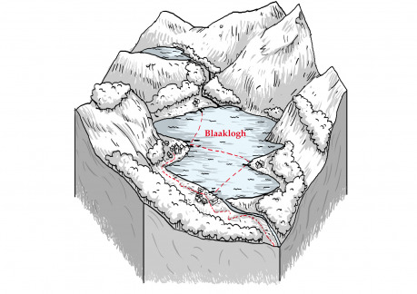

Všichni majetní usedlíci žijí pod ochranou jezerní hanzy, která přes svůj vznešený název není o moc více než rybářským cechem. Kromě ryb obchoduje hanza ještě s kamenem a dřevem vytěženým na úbočích hor. Většina těchto surovin putuje přímo do Ravnburghu. Předáci hanzy, až na výjimky muži velmi pokročilého věku, mají pevně v rukou veškeré dění v oblasti kolem Blaaklogh. Pravidelně se scházejí k poradám, jejichž výnosy obyvatelé musejí respektovat. Mimo to rozsuzují spory, schvalují sňatky i posuzují zájemce, kteří by se u Blaaklogh rádi usadili. Předáci se drží tradic, každou záležitost důsledně prohovoří a rozhodně při jednáních nikam nespěchají. Proto jim bývá vyčítána zastydlost a zkostnatělost, a zvláště mladí lidé dávají často najevo svou nespokojenost s jejich vládou.

Blaaklogh působí do značné míry jako uzavřená komunita stavící se vůči cizincům uzavřeně až nepřátelsky. Rozhodně není vysněným cílem přistěhovalců, a proto tam míří spíše lidé pochybné minulosti, nebo ti, kteří přišli o všechno a nebojí se tvrdé dřiny rybářského či těžařského řemesla. Kdyby však nebylo potřeba občas doplnit počty po těch, kdo se odstěhovali, předáci by nejraději nepřijímali nikoho. Neboť jak každý ví, přistěhovalci znamenají především problémy.

### Náměty na zápletky

- Hledaný zločinec, kterému jsou postavy na stopě, se ukryl mezi obyvateli Blaakloghu. Situace je o to zajímavější, že psanec je v tváři velmi podobný synovi jednoho z předáků. To ovšem postavy netuší.
- Ke šlechtici, u nějž postavy pobývají, přijede jedné noci těžce zraněný cizinec s neuvěřitelnou historkou. Den na to jsou postavy vyslány do Blaakloghu, aby zjistily, co je pravdy na jeho svědectví: Hluboko v jezeře prý žije jakési monstrum, jemuž obyvatelé během nocí přinášejí lidské oběti.
- Dcera prominentního občana Ravnburghu se zamilovala do blaakloghského kameníka a utekla za ním. Otec pro ni nejprve poslal dvojici svých tělesných strážců, ale ti k jeho hrůze zmizeli beze stopy. Obrátil se tedy na postavy, zda by se mohly do záležitosti vložit se vší opatrností a diskrétností.
