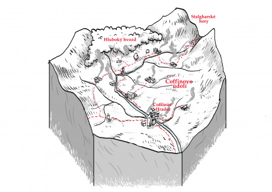

Rozlehlé údolí zvrásněné nespočetnými pahorky kdysi patřilo k nejúrodnějším místům v okolí Ravnburghu. Krajinou vmáčknutou mezi vysoké hory na severu a skalnaté kopce na jihu protéká dravá řeka, která se uklidňuje až na hraně údolí a líně odtéká na východ. Ta krom horských svahů sbírá vodu i z hlubokého hvozdu, ve který údolí přechází na západě. Na břehu této řeky kdysi založil první osadu zchudlý šlechtic Coffin. Mohlo jít o idylické místo uprostřed čarokrásné přírody, kdyby ovšem jednou místní hrobník nenarazil jen pár sáhů pod zemí na železnou rudu. Vidina snadných výdělků rychle přitáhla mnoho nenasytných podnikavců. Stačilo pár let a údolí už nikdo neřekne jinak než Popelákov.

Intenzivní povrchová těžba rudy dala popelákovské krajině svébytný ráz. Pahorky jsou rozkopané snad ze všech stran, většina svahů je vypálená, pokrytá jámami a improvizovanými příbytky horníků. Na březích každé říčky a potoka vyrostla hustá síť milířů, tavících pecí a hamrů. Dílny a továrničky jsou obklopené nesčetnými zanedbanými domky chudých horníků, dřevorubců, uhlířů, tavičů a kovářů. Nad tím vším se vznáší hustý štiplavý dým z milířů a kovářských pecí a osadami se dnem i nocí rozléhá neutuchající monotónní dunění desítek bucharů. V okolí osad se tyčí haldy přebytečné strusky, na kterých houfy nejchudších kašlajících dětí hledají špatně vytavené kousky se zbytky železa. Popílek a saze ze všudypřítomných komínů pokryly celé údolí vrstvou šedivého prachu a i v zimě má zdejší sníh ocelový nádech. Na zamořených políčcích pořádně nic neroste a všechny popelákovské potraviny chutnají jako dřevěné uhlí. Vrcholem místní zničené krajiny je východní část údolí, ze které obrovská poptávka po dřevě a nekontrolované kácení stromů udělaly během pár let rozlehlou holou pláň. Na prostoru několika kilometrů neroste nic než šedivá tráva a nejodolnější křoviska. Ptáci i zvěř utekli na západ do hvozdu, daří se tu jen broukům a ještěrkám. Přespolní se shodnou, že v okolí Ravnburghu široko daleko není hnusnější místo než Popelákov.

Centrem oblasti dodnes zůstává ospalá osada Coffinův Hradec, která si velkoryse říká město. Přes Hradec teče veškeré zboží do i z Popelákova. Hlavní slovo zde má Stephen Lumbard, zástupce ravnburghské rodiny vlastnící většinu železných dolů a tím pádem i místní chudinu. Hradec je jediným místem v údolí, které má něco jako organizovanou stráž. Ve skutečnosti jde ale o žoldáky Lumbardů, kteří nemají v popisu práce řešit jakékoliv problémy mimo město a rodinné doly. Alespoň nějakou mocenskou protiváhu představuje stařičký hornický předák Simon Nash, který díky svému vynálezu dřevěných kolejnic a vozíků dokázal rychle vydělat dost peněz na to, aby si ho Lumbardové nemohli jednoduše koupit.

Pokud život v zaostalém Coffinově Hradci není žádný med, těžko hodnotit živobytí v roztroušených hornických osadách. Všudypřítomná chudoba má jednu společnou příčinu: nedostatek všeho. V údolí už není skoro co kácet a tak se zoufalí dřevorubci hádají o každý lesík a pomalu své oči upínají k tajuplnému hvozdu. Značně rozkopané žíly železné rudy se čas od času kříží a jednotlivé hornické spolky vedou ostré spory o nároky na těžbu. Potůčky stékající z hor a kopců už dlouho nestačí na provoz všech dmychadel a hamrů a zároveň k zavlažování žíznivých políček, sousedské i rodinné hádky o „právo na proud“ jsou na denním pořádku. Odchod za lepším je ale pro živořící dělníky neúnosný risk a děti narozené v popelu ani nenapadá, že by to snad někde mohlo být lepší. Popelákov tak svým svérázným způsobem „prosperuje“ dál.

### Zápletky

- Stephen Lumbard chce na svého otce, člena ravnburghské hanzy, udělat dojem a začne řídit doly tvrdou rukou bez ohledu na rodinnou pověst. Zvládnou postavy najaté Lordem Lumbardem synkovi domluvit? Nebo si naopak v údolí rychle udělají mocného nepřítele?
- Lord Grofhurst, jehož rodina vlastní většinu stříbrných dolů v okolí Ravnburghu, hledá loajální dobrodruhy, kteří by prověřili zkazky o nalezeném stříbře v hlubších popelákovských dolech. Je ale bezpečné motat se rodině Lumbardů v rajónu? A jedná se skutečně o stříbro, nebo jde jen o další z mnoha vzájemných žertíků mezi znuděnými lordy?
- Kapitán ravnburghské stráže Beer je silně znepokojen mizernou kvalitou poslední várky zbraní, která dorazila z popelákovských kováren. Hledá proto spolehlivé zvědy, kteří by nenápadně dokázali zjistit příčinu. Jedná se o úmyslnou sabotáž, jak se Beer domnívá? Stojí za vším Červená perla? Nebo jen v dolech již delší dobu dochází kvalitní ruda a Lumbardové se snaží zatloukat?
- Ve hvozdu zmizelo několik Nashových dřevorubců a nikdo se nemá k pomoci, dokud se neztratí i pár Lumbardových horníků. Během vyšetřování se objeví stopy po dřevorubcích mezi Lumbardovými a stopy po hornících mezi Nashovými lidmi. Jedná se skutečně o vzájemné vyřizování účtů, nebo jsou některé důkazy nastrčené? Chce někdo rozpoutat lokální válku a bude někdo ochotný konflikt včas zastavit?
- Čím dál tím více vesničanů pracujících v Lumbardských dolech se kloní k názoru, že pod Nashem by se jim žilo mnohem lépe. Je ale možné nějak klidně vyjednat jejich přestoupení? Nebo se situace zvrhne a dojde k masivní stávce? Na čí stranu se postavy postaví?
- Na východních vykácených planinách se usídlili lupiči, kteří přepadávají obchodníky mířící do Coffinova Hradce. Proč jdou ale jen po zásobování údolí a ne po vyvážené rudě, nástrojích a zbraních? A proč to Stephena Lumbarda očividně vůbec netrápí? Budou se postavy angažovat, když se samy stanou oběťmi přepadení?
- Mnoho dětí rychle umírá na agresivní černý kašel. Místní léčitelé vidí jedinou naději v Ravnburghu u vzdělaných bratrů Leonardiánů. Kolik ale budou mniši za pomoc chtít a kdo to zaplatí, když chudí Popelákované mají sotva na jídlo? Budou postavy ochotné lék zaplatit ze svého, nebo na oplátku pomohou mnichům s něčím nebezpečným? A co když je nakonec klíčová část léku k nalezení pouze v tajemném hvozdu?
