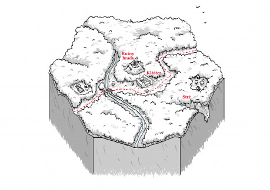

Klášter se nachází v lehce zvlněné a nepříliš osídlené pahorkatině, vzdálené nějaký ten den cesty od Ravnburghu. Jeho okolí je vyhlášené tím, jak je neskutečně fádní a nudné. Když někdo cestuje touto krajinou, zaujmou jej obvykle jen dvě věci. První je občasné zahlédnutí psa, ani se totiž nechce věřit, že tu nějací nechcíplí mohli ještě zůstat. Druhou je vrch s troskami hradu a klášterem umístěným na úpatí svahu. Klášter z dálky vypadá, jako by vypadl z pohádky o zakletém zámku. Jeho hrubé neomítnuté zdi jsou naprosto nesourodou směsicí obřích vápencových balvanů, pravidelných kamenných kvádrů a cihel. Skoro to vypadá, jakoby stavbu neuměle uplácalo nějaké bájné dítě obra a až o pár století později se lidé pokusili tyhle bábovičky dostavět v něco užitečného. Celé je to navíc zamotané v jakési změti pavučin, z níž vyčnívají jen střechy a věžička kostela. Kolem se poněkud nepatřičně rozprostírají pěstěné kvetoucí zahrady a úrodná obdělávaná pole.

## Klášter

Romantický a tajemný dojem se (snad neprávem) rozplyne, jakmile pocestný dojde trochu blíž. Nejsou tam žádné balvany naskládané obrem, jen chytře využitý stavební materiál z trosek hradu. Žádné pavučiny, pouze ke zdem kláštera připevněné husté sítě, natažené přes nejbližší části zahrady a různě podepřené sloupy. Vstup do vnitřních zahrad je hlídaný, takže tam neproklouzne ani myš. Vlastně myši asi ano, ale hladoví ptáci nebo lidé určitě ne.

### Zahrada

I přes sítě lze zahlédnout úhledné, cedulkami označené záhonky. Rostou tam exotické rostliny i všední plodiny, jako je žito, proso, ovocné stromky a všechny možné i nemožné druhy zeleniny – například takového hrachu tam roste hned několik druhů. Na značné části pěstovaných rostlin je na první pohled něco neobvyklého. Některé jsou celé zdeformované či zakrslé, jiné mají plody nezvyklých velikostí, barev či tvarů. Další rostliny jsou pozoruhodné prostě jen tím, jak zdravě a lákavě vypadají, až se při pohledu na ně sbíhají sliny. Na zahradách je po většinu dne rušno, mniši opravují sítě, zalévají, ohání se motykami, ostrými noži očkují stromky či zeleninu, další se sklání nad květy, vyzbrojení titěrnými kleštičkami, pinzetami či jemnými štětečky.

O produkty klášterních zahrad je obrovský zájem. Lidé věří, že plody z ní jsou požehnané a mají léčivou moc a zejména nemocní z vyšších vrstev jsou ochotni vynakládat nemalé prostředky, aby je získali. Obyčejní lidé si je ale nemohou vůbec dovolit. Klášter by měl teoreticky bohatnout z prodeje plodů a semen, ale moc to tak nevypadá.

### Sklepy

Klášter má rozsáhlá sklepení, kde jsou uchovávána semena a výpěstky ze zahrad. V podzemí se dále nachází velká nádoba, do které se sbírá voda, která vytéká z pramene vyvěrajícího kousek pod hradem. Mniši tuto vodu nikdy nepijí. Ví se, že lidem způsobuje bolesti hlavy a nevolnost, ale rostlinám naopak prospívá. Na jaře před setím v ní moří semena a po sklizni zase oplachují některé plody. Prodlužuje to prý jejich trvanlivost. Dva starší mniši, kteří tráví hodně času v laboratoři a zkoumají účinky této vody na jednotlivé odrůdy rostlin, mají na rukou nezdravě seschlou a zhrublou kůži a jednomu dokonce chybí několik článků na prstech.

### Laboratoř

Uprostřed laboratoře je stůl s nějakým zařízením, jehož hlavní součástí je tubus se zvětšovacími kameny, do něhož ve dne v noci zírá nějaký mnich. Police na stěnách jsou zaskládány miskami s klíčícími semeny, klecemi s pobíhajícími myškami a plátěnými voliérami s poletujícími včelami. Při bližším prozkoumání je patrné, že některá zvířata strádají, skoro to vypadá, jakoby je někdo cíleně a pomalu trávil. A vlastně venku v chlévech u hospodářských zvířat tomu není jinak. A vlastně v jídelně mezi mnichy tomu taky možná není jinak.

### Postavy

- __Julian Mauntell (opat)__ – O zahradu a její plody se stará s až fanatickým zápalem, ne že by ostatní záležitosti v klášteře vyloženě zanedbával, ale na zahradě pracuje za jakéhokoli počasí a v laboratoři a knihovně tráví celé noci. V klášteře si jej všichni váží nebo to alespoň tak vypadá. Zdá se, že není zcela zdráv, ale silou vůle se drží, nepřipustí, aby jej nějaká nemoc omezovala.
- __Simon Norwood (převor)__ – Vadí mu, jak klášter pomalu chátrá a jak se veškeré peníze a úsilí vkládá jen do zahrad, knihovny a laboratoří. Rád by jako opata viděl kohokoli jiného než Mauntella, jenže to má těžké, když opati jsou zvoleni na doživotí.
- __Bartholomew (starší mnich, kterému chybí některé prsty)__ – nosí všude s sebou čtecí kámen, protože mu už oči neslouží. Jeho přesvědčení, že ošetřování plodů vodou z hradu nemusí být pro jejich spotřebitele úplně nejzdravější, je čím dál silnější.
- __Špeh Rudé perly__ – vydává se za kupce jménem James Downer. Jezdí sem pravidelně a pokaždé si tu koupí hromadu zeleniny a ovoce a pak s naloženým povozem pokračuje dál. Někdo z kláštera ale dobře ví, že žádný opravdový kupec není a prodává mu jedy, halucinogeny a další svinstva. Při této návštěvě Downer očekává, že pro něj bude mít jeho tajný dodavatel konečně připraveno nakažené jedovaté obilí, které by po prodání vhodnému osobě a uskladnění otrávilo i ostatní zrna uložená v sýpce.
- __Peter Veldon – vůdce zlodějů__ – rolník, žijící v blízké vesnici, který si se svými kumpány občasně přilepšuje k živobytí krádežemi ze zahrady a následným přeprodáváním zcizených plodů.

### Bangy

- Nalezena mrtvola mnicha, má nůž v prsou a otevřená ústa plná námele. Mrtvola je ještě je teplá a nejeví známky otravy námelem.
- Požár na zahradě, síť vzplála jako papír a plameny se šíří dál.
- Zloději! Už zase! Ukradli nějaké ovoce, ale kolik toho zdupali a polámali. A cedulky s popisy u řádků jsou povyvracené a rozkopané. Aby ty vandaly vzal ďas!
- Jeden mnich po odchodu z jídelny vrávorá a nepříčetně křičí, že na sebe seslali boží hněv. Prozření? Halucinace?
- Zmizely opatovy zápisky z tohoto roku. Strašně ho to vzalo.

## Strž

V lesích poblíž kláštera je ukrytá obtížně přístupná rokle, její strmé zvětralé vápencové stěny se drolí při sebeopatrnějším doteku, nicméně existuje i skrytá poměrně schůdná cestička dolů. Dno rokle je zarostlé a je až podezřelé, kolik různých jedovatých rostlin tu roste na jednom místě. Zadní, stinná část je osázená malými ostrůvky obilí. Přitom horší místo na zahradničení aby jeden pohledal, je tu vlhko, šero, nehybný vzduch, rostliny tady musí trpět řadou chorob. A taky že ano. Ze země trčí nesklizené zčernalé proso. Jeden ostrůvek žita má klasy plné námele, další o kus dál je celý pokrytý růžovými vlákýnky plísně. Každá rostlina v těch místech je nějak napadená a nemocná. V malé jeskyňce je uloženo zahradnické náčiní, sklizené obilí a jedy.

### Bangy

- Roklí se blíží nějací muži a tlumeně se baví, sem tam vzrušeně zvýší hlas. První má kutnu, ostatní meče.
- V jeskyňce u truhlice s obilím se něco zavlnilo. Had! Ale to je v pohodě, tihle jsou neškodní, ti nemají dost jedu ani na zabití jehněte. A nebo ne? V téhle rokli je všechno možné.
- Ozvalo se seshora zapraskání, mihl se tam nějaký stín a křivý, přeschlý smrk, stojící s obnaženými kořeny na samém okraji rokle letí dolů. Rychle pryč! A kdo tam nahoře sakra je?

## Hrad

Hrad je už opuštěný celé věky, zůstaly z něj jen rozvaliny. Před nějakou tou desítkou let tam prý dorazil jistý učenec. Prohledával jej, překopával, odvaloval trosky, až našel cestu do podzemí. Tam se pustil do zkoumání s takovou vervou, že vůbec nevycházel ven. Jednou v noci ale mnichy probudil zvuk výbuchu a to bylo také naposled, co o učenci slyšeli. Od té doby nepijí vodu z pramene pod hradem a postupně s ní začali ošetřovat rostliny. Nyní, pokud by si někdo dal tu práci a odklidil trosky zakrývající studnu, mohl by prolézt trhlinou do místa, kde tenkrát došlo k výbuchu. Síla exploze a teplota při ní musela být neskutečná, strop je zborcený a i zbytky skleněného a kovového alchymistického vybavení jsou natavené. Půlka prostoru je zatopená vodou. Z cenností se tam dají najít maximálně nějaké spečené vzácné kovy. Určitě by ale šlo zastavit únik té divné vody, pokud dotyčnému nevadí, že si u toho zaplave.

### Bangy

- Při prohledávání podzemí se seshora ozvou hlasy a ošklivý smích.
- Někdo kontaminoval vodu z pramene – jako ještě něčím dalším navíc. Teď budou v ní umytá jablka opravdu zdraví nebezpečná.

{:.sidebar}
Všechny postavy v tomto hexu jsou fiktivní a jakákoli podobnost se skutečnými lidmi, žijícími či mrtvými, je čistě náhodná … no dobře, tak možná úplně není. Ale když on říkával „Můj čas přijde“, mohl tím myslet, že by se jednou, třeba k 195. výročí svých narozenin, chtěl stát předlohou pro nějakého fanatického vědce v rpgčku.

## Proč se do kláštera vůbec vydat?

- Kvůli podezření, že někdo z kláštera spolupracuje s agenty Rudé perly.
- Otrávený šlechtic jedl ten den mimo jiné i plody pocházející z kláštera. Pouhá náhoda?
- Zemědělská špionáž – někdo chce ukrást z kláštera vzácná semena nebo spisy.
- Opat neplatí daně, které byly zvýšeny před dvěma lety, tvrdohlavě platí stále původní částku, někdo by měl na něj zatlačit.
- Prostě to bylo po cestě a mnichové jsou prý dobrosrdeční a nechávají poutníky přespat.

## Hlavní zápletka

Někdo v klášteře – vybere si ho sám laskavý čtenář, nebo případný ještě laskavější game master – pěstuje nakažené a jedovaté rostliny na ukrytých políčcích v rokli. Stýká se s lidmi z Rudé perly (Z přesvědčení? Z donucení? Z finančních důvodů?). Má několik zasvěcených pomocníků, kteří mu pomáhají a zkoumají účinky jeho produktů na zvířatech a v případě nutnosti i na lidech.
