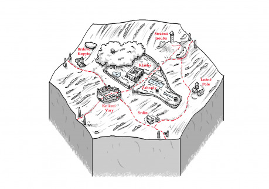

Celkem úrodná krajina s kouskem lesa, dnes již téměř vymýceným. Zbytky jsou součástí zahrad kláštera a je přísně zakázáno na svatém území kácet, lovit a sbírat houby či klestí. Trest za menší prohřešek je rok kláštera, za větší doživotí v něm. Celé území je darem od knížete Klitera před asi 150 až 200 lety. Podle různých kronik se to liší. Na hexu platí právo mnichů a světské se do něj nesmí míchat. Hlavním představitelem je opat Přebor.

## Klášter

Před stoletím, dvěma, třema, jak která legenda praví, se ze studánky napila kněžna znavena z lovu. Údajně potom po dlouhých letech soužení (a souložení) přivedla ve svých 40ti letech za devět měsíců knížeti syna. Ten dal prohlásit studánku za zázračnou. No možná to byla voda, možná hezký mladý lovčí. Od té doby se okolo studánky rozrostl dnes již rozsáhlý klášter o několika budovách a vysoké klenuté hlavní lodi kostela. Ze zázračné vody mniši vaří lektvary a mnohé paničky a urození pánové se sem sjíždí na tiché meditace a léčbu koupelemi v zázračné vodě. Méně oficiální verze je spíše taková, že mladí společníci a společnice dobrovolně za peníze, nuceně v případě vězňů na doživotí a podobně obšťastňují různou formu sexu hosty kláštera. Žádné přání není tabu. Tabu je jen prázdný měšec. Nad vším bedlivě dohlíží představitelé kláštera a jejich vojenská stráž.

## Městečko Knížecí Vary

Městečko vybudované sotva před sto lety na křižovatce cest kousek od kláštera. Stejně jako ostatní statky a polnosti i jej spravují mniši z řádu. Bují zde obchod, ubytování a léčitelské, alchymistické služby. Na své poměry vesnického rázu je zde divadlo a pravidelně se pro hosty lázní hraje. V zimních obdobích je každý týden pořádán honosný bál na různá témata a k různým svátkům a příležitostem. Vlastní jatky, pivovar, kasíno, kostel nabízí další potěšení pro tělo, duši i měšec.V čele stojí rada a purkrabí bratr Jacek.

## Hláska Strážná trouba

Kamenná hláska stojící na nevelkém kopci. U ní v několika domech žijí řádoví vojáci. Z vrcholu se pravidelně rozhlíží hlídka do všech stran a v případě ohrožení bije do zvonu a v noci zapaluje i oheň.

## Vesnice Srdín

Sýpky obilí, spižírny sýra, uzeného masa. Často se mu hanlivě mezi chudými přezdívá Prdín. Jinak se jedná o bohatou selskou ves, kde žijí privilegované sedlácké rody a dodávají na stůl lázeňských hostí a občanů Varů dobroty a kvalitní výrobky. Požívají nejen práva trhového, ale i várečného a tak dokážou zdatně konkurovat městskému pivovaru U Bažanta.

## Vesnice Brdovo kopyto

Cokoliv je třeba vyrobit, opravit tak je možno zde. Mnoho tovaryšů a mistrů z města začínalo zde u kováře Brona, tesaře a truhláře Gryda. I zde pečlivě promýšlený plán hospodářství udělal spíše škodu než užitek. Ono kdo by se taky chtěl se zlomeným kolem povozu táhnout třeba ze Srdína pět, sedm mil... a tak se načerno chodí za potřebným. Dokud vás voják či mnich nechytí, soused neudá.

## Vesnice Lněné pole

Malá vesnička určena hlavně na pěstování lnu na plátno, semen na olej do klášterních mastí. I zde centrálně plánovaná politika hospodaření spíše další rozvoj potlačuje a vše je účelně zařízeno k potřebě řádu. Vládne tu fojt Warecha, který se netají neláskou k řádu a při každé příležitosti podněcuje ke vzpouře. I přesto již je v čele správy vsi 12 let.

## Bratr Jacek

Ambiciózní čtyřicátník, který byl představitel reformního křídla. Za „odměnu“ a nesouhlas byl dosazen mimo hlavní mocenský vliv a to do čela vedení města Vary. Stále má snahu zasahovat do dění a mezi mnichy v klášteře své špehy a zdroje informací. Když to jde, rozhodne tak, aby se to nelíbilo Přeborovi.

## Bratr Přebor

Obtloustlý mnich kolem šedesátky. Už 40 let se pohybuje za zdmi kláštera a jeho vedení došlo k mnoha vylepšením služeb a zpoplatněním každé maličkosti. Ovšem výsledky nikdo neví jak dělá, ale jsou fantastické a tak milé šlechtičny rády zaplatí zlatem navíc za mužského dědice pro svého obstarožního manžela. Ze zlata platí mnoho církevních stráží, ale i špehů a vrahů v civilu. Posledním úlovkem byl únos odbojného fojta Warechy a jeho zakování do železné masky v temném sklepení pod klášterem.

## Fojt Warecha

Jako malý vyrůstal již v náladě svého otce, že vrchnost je špatná. Když se naskytla příležitost neúrody a vrchnost si vzala víc, než bylo potřeba k přežití začal intrikovat. Nakonec se stal ze syna chudého rolníka vlivný člověk a následně fojt vesnice, Za každou jeho akci následovala reakce kláštera a jeho vojáků. Toto napětí skončilo jeho zmizením a dosazením starého Vařečky. Ten chce mít klid, a tak neřeší nic.

## Zápletky

- Někdo pokácel několik stromů v zahradě kláštera.
- Ráno je na náměstí/návsi jednoho z okolních sídel nalezena neznámá mladá nahá dívka, jejíž tělo je zohaveno a očividně zneužito.
- Zázračná studánka vyschla.
- Někdo zapálil na plošině Strážné trouby záměrně varovný oheň.
- Opat Přebor je mrtev, kdo bude jeho nástupcem?
- Některá z postav je obviněna z krádeže církevního majetku a je odvedena do kláštera k výslechu.
- Vesnice Lněné pole bojkotovala dodávku, nebo se nákladní vůz se sudem nového oleje a plátna ztratil čistě náhodou po zatčení fojta Warechy, když byl obviněn ze zosnování vzpoury?
- Vysvobození zatčeného fojta Warechy.
- Místo piva od Bažanta někdo dodal soudky močůvky.
- Objevil se asi 20letý mladík ve městě. Všude tvrdí, že je syn Přebora.
- Z Ravensburgu přijíždí vrchní církvista na kontrolu nesouladu v hospodaření. Zjistil mnoho nedostatků a pekelná smilstva. Zpět návrat do úřadu poslat zprávu pro Hlavu církve již nestihl. Kde je?
