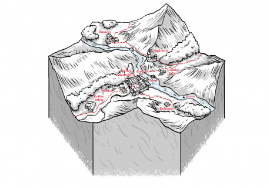

## 1. Starý brod

Řeka Bravá nezískala své jméno náhodou – pokud se jí neznalý kupec pokusil překročit někde v úzkém údolí, které si vykrojila v krajině, její dravý proud mu nezřídka odnesl náklad, tažné zvíře či dokonce člena družiny. Řeka si zkrátka bere kdy chce, co chce a proto jí lidé v místním kraji začali říkat Bravá. Jen v jednom místě, kde Bravá protíná údolí široké několik mil, rozkládající se mezi dvěma pásy hor, se proud zklidňuje a rozlévá se do šířky. A právě v tomto místě už odpradávna lidé zbudovali brod a právě proto se oním údolím již v dávných časech začala táhnout kupecká stezka vedoucí do Ravnburgu. I vody Bravé nakonec v Ravenburgu končí, to ale až dál po proudu, když už je vybouřená a její vlny se spojily s vlnami jiných řek v okolí.

## 2. Hrad pánů z Medvědína

Brod se stal nejen důležitým kupeckým, ale také strategickým místem a bylo potřeba jej chránit. Na východním břehu tak na skalním ostrohu, tyčícím se nad brodem, vyrostl nejprve hrádek a posléze hrad. Začalo se mu říkat Medvědín, podle medvědího brlohu, na kterém byl podle legendy hrad zbudován a Oroban z Medvědína, kterému hrad dnes patří, je přímým potomkem slavného medvědobijce Jerbana, který kdysi bestii z jejího brlohu vyhnal a základní kámen hradu položit nechal.

## 3. Město Velký Medvědín

S tím, jak rostl věhlas stezky, na západním břehu také vyrostla osada. V osadě hostinec, před hostincem plácek, kolem plácku domky, v domcích se usadili zemědělci i řemeslníci a každý kupec, který se vydával po staré cestě, rád zaplatil pár měděných mincí, aby měl kde hlavu složit. Vesničané zprvu byli rádi za ochranu, kterou poskytoval nedaleký hrádek, jak se ale měděné mince proměňovaly ve stříbrňáky a stříbro ve zlato, moc a věhlas obce natolik vyrostla, že časem – k nelibosti pána z Medvědína – zcela zastínila dřívější slávu hradu. Potupa byla o to větší, že jméno, pod kterým osada získala městská práva, bylo v kronikách i pozemkových knihách zapsáno jako Velký Medvědín. A majestátnímu hradu se mezi městským lidem posměšně říká Medvědín Malý.

Dnes je město obehnáno hradbami a jeho konšelé v čele s purkmistrem Kalmajem dávají okatě najevo, že měšťané jsou novými pány kraje. Téměř se vším se jim daří, krom práva hradebního, trhovního, soudního či dalších se podařilo získat i právo mílové – s jedinou výjimkou. Starý brod, ona tepna, která dává městu život, stále patří Orobanovi z Mědvědína a ten jediný má právo na něm vybírat mýto a zavírat či otevírat jej dle libosti. Tohoto práva navíc umně využívá, aby zatlačil jinak hrdé měšťany ke zdi, když se mu zdá, že jejich pýcha jim zvedla nosy příliš vysoko.

## 4. Rozestavěný most

Peníze již nějaký čas vyhrávají svůj zápas o vládu nad světem a poráží v něm modrou krev. Nemohli-li měšťané převzít brod samotný, rozhodli se, že ho vlastně nepotřebují. Přes prostředníka vykoupili od Orobana několik pozemků na východním břehu řeky a nyní budují kamenný most. V prvních dvou letech šla stavba jak od ruky a kamenné oblouky se nyní klenou až doprostřed Bravé. Letos ale od jara stavbu provázejí potíže. Na jaře se našel na stavbě rozsápaný kameník Rinzal a místní ranhojič Štelba prohlásil, že zranění zjevně odpovídají zraněním od medvěda. Mezi lidem prostým se okamžitě rozneslo, že most je prokletý, že prokletí na most seslal sám Oroban z Medvědína či že dokonce v noci stavbu v medvědí podobě obchází, aby dokončení mostu zabránil. Každé další drobné či větší neštěstí pak tyto povídačky přiživovalo. Když před dvěma měsíci pod zpěněnou hladinou Bravé zmizel mladý a mezi soukmenovci oblíbený podavač malty Jiřín, práce se úplně zastavila. Marně Kalmaj s konšely přesvědčovaly řemeslníky, zbytečně listovali kronikami a poukazovali na to, že v letošním roce je počet nehod nižší než za stejné období loni, nikdo z místních již nebyl ochotný mít něco společného s temnými silami, ohrožujícími stavbu.

## 5. Cizácký tábor

Jak konšelé a bohatí měšťané zjistili, že s místními nehnou, poohlédli se po pracovní síle jinde. Kupci rychle rozšířili krajem zprávu o tom, že se hledá námezdní síla na stavbu mostu a je to již týden, co na východním břehu říčky, přímo v místech budoucího posledního mostního pilíře, vyrostla malá stanová osada. Její obyvatelé vypadají a oblékají se cizokrajně, mluví jinou řečí než místní, z kotlíků mezi stany se linou neznámé vůně a večer, když se setmí, se nad řekou linou neznámé melodie.

Prokletí navíc zdá se s příchodem cizinců neztratilo na své síle. Předevčírem se v noci před dokončením nového mostního oblouku zřítila výdřeva a spolu s ní i velká část nedokončeného klenutí. Ač naštěstí nebyl nikdo zraněn, purkmistr Kalmaj by velmi rád přišel na to, zda v tom mají opravdu prsty kouzla a čáry, Oroban z Medvědína nebo zda se náhodou nejedná o dílo příliš horlivých měšťanů, kteří chtějí cizáky vystrašit a zahnat.

## 6. Předměstí

Chudina žijící za hradbami v chatrčích a domcích kolem jihozápadní cesty nese přítomnost cizáků s nelibostí a nevraživostí. „Sebrali nám práci,“ stěžují si projíždějícím kupcům a ukazují k mostu, ač sami ještě před pár týdny odmítali na mostě pracovat. „Jejich muži přináší nemoce, ženy zase nečistá kouzla a čáry,“ šeptají si pod fousy, když vidí někoho z cizáků, jak vstupuje branou do města či jak se s pomocí rukou a nohou snaží mezi místními nakoupit ovčí vnitřnosti nebo psí sádlo. „Včera večer mi zmizela slepice, město na noc zavírá brány, ale co my tady venku, my jsme jim vydáni na pospas,“ láteří večer v zahrádce zájezdního hostince u hradeb, třímaje džbánek zlatavého moku.

Nejhlasitější z nich je Kruliš, starý mrzout, který dřív sloužil na hradě, ale na stará kolena se přestěhoval do města. Místní ani neví, jak to dělává, ale kdykoliv se někde něco semele, Krulišova přihrblá postava se vynoří ze stínu a z jeho jedovatých poznámek je snadné si domyslet, kdo za neobvyklou událostí stojí a co tím sleduje. Možná až příliš snadné, protože se občas mýlí, ale občas naopak trefí hřebík na hlavičku. Zkrátka když místní dychtivě vyslechnou jeho zahořklým slovům, dohadují se o tom, čemu z jeho slov věřit a co zapomenout ještě dlouho poté, co stařec opět zmizí v některém ze stínů.

## 7. Hláska

Na svahu nad předměstím se tyčí trosky staré hlásky. V dobách, kdy veškerá moc v kraji ještě patřila pánům Medvědínského hradu, zde stávala třípatrová věž, ze které bylo možné vyhlížet do kraje. Dnes už stojí pouze přízemí, nad kterým se tyčí zbytky obvodových zdí vyšších pater. Na plácku před hláskou, kde se dříve cvičili vojáci v šermu a střelbě, dnes stojí konstrukce z rovných trámů – město zde zřídilo šibeční vršek.

V přízemí věže, které se jako jediné zachovalo, má svůj příbytek Markuš – ras a kat v jedné osobě. Místní se mu vyhýbají, pokud to jde, jen občas je na svahu vidět ranhojiče Štelbu a leckdo z města by odpřisáhl, že viděl do kopce šplhat i hostinského Francka s nůší či rancem.

Obě Markušova řemesla páchnou smrtí a ve městě i na předměstí o něm kolují nejrůznější zkazky. Nejvíce historek se týká jeho domácího mazlíčka – příbytek s ním totiž sdílí mladý medvěd. Starý Kruliš rád vypráví, že před osmi lety se na šibeniční vršek zatoulala mladá medvědice i s mládětem – nejspíš přilákaná pachem rasovy práce. Markuš se prý s ní utkal a holýma rukama ji zahnal na útěk. Opuštěného mláděte se ujal a vychoval z něj věrného ochránce svého příbytku a zvířecího přítele věrného jako pes. Kdykoliv dává Kruliš tuhle historku k dobru, nezapomene ovšem zmínit důležitý detail – nikdy prý nikdo neviděl kata a jeho medvěda vedle sebe současně. Kolem hlásky se prý vždy toulá buďto zvíře samotné nebo Markuš konající jedno ze svých pochmurných řemesel.

## 8. Králův mlýn

Na místě starého mlýna dnes stojí zájezdní hostinec i se stájemi a velkou noclehárnou. Je oblíbenou zastávkou těch kupců či dobrodruhů, pro které je Velký Medvědín příliš drahým místem pro přespání. Jen málokdo z nich ale zná pochmurnou historii místa a téměř nikdo netuší, že dnes hrdě znějící jméno hostinec získal díky událostem.

Před dlouhými lety, v době kdy Velký Medvědín nebyl ničím, než větší prosperující obcí dlouhou návsí a krajím kolem Ravenburgu vládli králové, zabloudil prý v údolí sám panovník. Zmoklý, v roztrhaném oblečení hledal vhodného přístřeší. Za bouře dorazil k mlýnu, který stál u potoka nedaleko kupecké stezky, ale starý mlynář Kubín, který nepoznal urozenou tvář, měl ho za otrhance a poštval na něj psi. Před roztrháním krále zachránili medvědínští – a právě jako odměnu za jejich pohostinnost udělil tehdy panovník osadě první městská práva. A jak štědrý byl král ke svým zachráncům, tak přísný byl k mlynáři Kubínovi. Necitu nechal popravit a starý mlýn spálit. Ohořelým troskám se pak mezi lidmi začalo říkat Králův mlýn.

Tahle doba je už dávno pryč a dnes už jsou stavby zrenovované a i když se mlýnské kolo netočí, díky výhodné poloze a příznivým cenám v hostinci se Franckovi - novému majiteli – celkem daří. Jeho úspěšný podnik je tak trnem v oku ostatním hostinským z města. A pokud by se na Králův mlýn snad nějaký kupec vyptával ve městě, nejspíš ho brzy někdo upozorní na to, že ceny masa i polévky v Králově mlýně jsou prostě příliš nízké a že zcela jistě není náhoda, že jak hostinec, tak rasovna a šibeniční vršek leží od města na stejnou stranu. Jiní zase vypráví zkazky o tom, že Francek prý uzavřel smlouvu se samotným duchem starého Kubína a nechává ho vysávat duše svých hostí výměnou za prosperitu hostince.

## 9. Horoves

Proti proudu řeky od Velkého Medvědína leží Horoves. Původně dřevorubecká osada s malým říčním přístavem, ze kterého horoveští plavili dřevo až do Ravenburgu. Se zahájením stavby mostu u Velkého Medvědína se však Dalen, jejich mladý předák, uvědomil, že na svých vorech mohou plavit víc než dřevo. Horovec totiž leží na úpatí velké pískovcové skály. Dalen neváhal, zajel za konšely do Velkého Medvědína a předložil jim svou nabídku. Cena i jednoduchost dopravy udělala své, slovo dalo slovo a horoveští odložili sekery a pily a začali lámat měkký kámen. Při přepravě těžkých žulových bloků divokou vodou zúročili své zkušenosti s plavením dřeva a jejich vesnice se stala hlavním dodavatelem kamene na stavbu medvědínského mostu.

## 10. Dolnobec

Jen malý kousek od města na opačné straně od brodu stojí víska jménem Dolnobec. Je pověstná kvalitním kamenem, který se láme ve skalách na západ od vsi. Dolnobecký kamenolom je téměř stejně velký jako samotná vesnice a dolnobečtí jsou na své řemeslo patřičně hrdí. Vždyť to byla právě jejich vesnice, která dodávala stavební materiál na stavbu medvědínského hradu. Z jejich kamene jsou postaveny hradby chránící Velký Medvědín, jejich ruce opracovávaly kamení tvořící stěny většiny městských domů, jejich majzlíky a sochory lámaly kámen na dlažbu velkého náměstí.

A tak se každé ráno tvář vesnického staršiny a nejzkušenějšího kameníka Postrama zachmuří, když se stařec podívá k severu. Ani jeho muži ale netuší, proč. Zda ho víc trápí to, že jeho vesnice přišla o práci a hrozí jí tak hlad a chudbova, či zda ho jako mistra řemesla kamenického tíží, že stavitelé mostu tak důležitý úkol, jako je odolání Bravé, svěřují obyčejnému pískovci z Horovsi a nikoliv kvalitní žule z Dolnobce.
