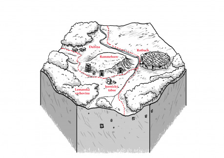

Pár mil od Ravnburghu, tam, kde se Jižní obchodní stezka ztrácí v kopcích Lemanské vrchoviny, se pod vrchem Rammehorn rozkládá městečko Rotbach. Upřímně, je to ospalá díra, kde na každém kroku člověk narazí na důkazy zašlé slávy tohoto dříve významného průmyslového centra. Kamenné hradby se dvěma branami poznamenal zub času, i v dláždění se množí vyviklané kameny, přesto v poslední době přibylo několik honosných domů kolem Trhového náměstí.

Rotbašské hutě dříve chrlily kvanta kvalitní oceli ze železné rudy těžené pod Rammehornem. Právě na obchodu s rotbašskou ocelí si ravnburghská Hanza udělala jméno. Jenže jak to tak bývá, žíly zeslábly a těžba se přestala vyplácet, Hanza si našla jiné artikly a Rotbach zůstal zapomenutý v neúrodném kraji.

Poslední dobou se ale situace změnila. Před sedmi lety do Weisbachu přišli trpaslíci. Kolona trpasličích osadníků, dohromady snad kolem stovky hranatých, bradatých vyhnanců z Chazmodanu, jemuž lidé říkají Skryté království, neboť kde leží, vědí jen nemnozí. Trpaslíci odkoupili za truhlici zlaťáků vytěžené doly a usídlili se na západ od hradeb v bývalých táborech těžařů. A ukázalo se, že pod zemí se lidé trpaslíkům nevyrovnají. Trpasličí těžaři „přečetli“ tajemství země a po několika zkušebních vrtech znovu přivedli k životu železnou řeku. Hutě opět začaly tavit železnou rudu a buchary v hamrech zase začaly tvarovat ocelové tyče. Jen tentokrát vše pod taktovkou nových majitelů dolů.

Život v Rotbachu se nadechl a o překot se zase rozběhl. Starý starosta John Derrington byl sesazen a na jeho místo nastoupil patriarcha rodiny Tobias Galey. Rodina Galeyů na nově rozběhnutém obchodu získala ze všech nejvíce a celé rozvětvené příbuzenstvo začalo určovat dění ve městě.

Lukas Galey, nejstarší ze synů starého Tobiase, statný pořízek se sympatickým úsměvem, se stal obchodní spojkou mezi lidmi z Rotbachu a trpaslíky pod Rammehornem, v jejichž čele stojí Grimbald Geldman.

Margery Galeyová, chladná a přísná kráska s pršinosem drží pevně otěže v osadě Dubina, kde lidští drvoštěpové dnem i nocí kácejí mohutná dubiska, aby je věčně kouřící milíře proměnily v dřevěné uhlí pro hutě.

Simon Galey, bratr starého Tobiase, sehnutý stařík s mohutným shněhobílým knírem, kraluje v hostinci U Železné podkovy, kde kvasí podloudný život hazardních her, kupčení se ženami a nepokrytě zde popíjejí rabiáti, co mají nože pohotově v hrsti.

Edward Rickworth, švagr starého Tobiase, pupkatý strejda s pleší, je kapitánem městské stráže. Stráž je plná dobře placených ctižádostivých pořezů, kteří nad rozkazy nepřemýšlejí, ať mají zbičovat zloděje nebo rozsekat krám řemeslníkovi, který nezaplatil výpalné.

Derrington, bývalý starosta, spolu s kovářem Walterem Ruggerem, stojí v čele chabé opozice hospodských reptalů, kterým není nový pořádek ve městě po chuti. Scházejí se v hostinci Pod Kartáčem, jejíž majitel Mark Medeley nesnáší trpaslíky a vůbec všechny cizáky.

Jsou trpaslíci v Rotbachu skutečně vyhnanci ze Skrytého království, jak se všeobecně věří? Nebo teď budují předpolí pro vojenskou invazi do Ravnburghu, jak si myslí purkrabí Daniel Blackwell? Zdá se, že přestože hutě jedou naplno a milíře přímo požírají dřevo Vysokého lesa, obchodní karavany vyvážející výrobky trpasličích kováren nejsou tak početné, jak by mohly.

„V Rotbachu v krčmě U Fortny každé první pondělí po úplňkové noci o polednách vyhledejte Petra Foxe, na pozdravení ‚hledáme páteho do hry‘, odpoví ‚v tolika se budeme u stolu mačkat‘, pak vás zavede k ostatním spiklencům.“ – Už druhý úplněk sedíte U Fortny a Fox nikde, měšec, který jste dostali od kancléře Comptona bude brzy prázdný. Pokusíte se zjistit, co se stalo s Foxem, nebo se úkol pokusíte splnit na vlastní pěst? Je to jenom náhoda, nebo někdo odhalil kancléřův plán a všichni spiklenci už jsou pod drnem?

Jako žoldnéři jste přijeli s karavanou obchodníka Michaela Cobba nakoupit železné trpasličí výrobky. Cobb chce jednat přímo s tr­paslíky, ale lidé Lukase Galeye to nedovolí. Drží obchodníky od trapslíků dál, aby si udržel monopol? Nebo drží trpaslíky pod krkem a nechce, aby se o tom dozvěděl někdo zvenčí? Pozor, nekdo zabušil na vrata – městská stráž, za ozbrojenými vojáky stojí Rickworth a v ruce má zatykač na Cobba, co teď?

Pod Kartáčem dnes panuje zuřivá nálada, Derrington leží doma zbitý do bezvědomí. Kovář Rugger má jasno a mezi ostatní štamgasty rozdává ostnaté obuchy a jdou vzít útokem Železnou podkovu. Hostinský Medeley vynesl ze sklepa bednu s lahvicemi naplněnými alkoholem, z nichž čouhají nasáklé knoty a doporučuje, aby popelem lehly i baráky trpaslíků pod hradbami. Do krčmy v tu chvíli vrazí ramenatý mladík Howard, který pracuje v dřevařském táboře v Dubině: „Z lesa vylézají strašidla, dva chlapy roztrhaly na kusy, pomozte!“
