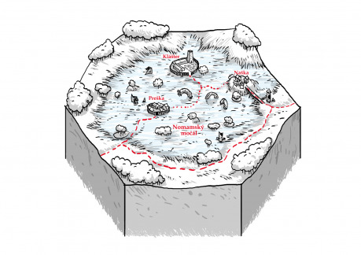

## História

Pred dávno zabudnutými časmi sa neďaleko od miesta, kde teraz stojí pevnosť Nomam, odohrala veľká bitka dvoch armád, ktorá mala rozhodnúť, ktorá z dvoch prastarých mocností bude mať prístup ku prístavu. Bitva trvala 27 hodín, kým sa stretli v priamom boji dvoja vodcovia so svojimi družinami. Obaja silný bojovníci, vybavený magickými zbraňami a ochranami spolu súperili 27 minúť bez toho, aby bolo poznať, ktorí z nich má navrch. Potom sa krvyprelievanie zmenilo na masaker a chaos. Mágia prastarých zbraní podivným spôsobom reagovala a vytvorila trhlinu medzi svetmi, cez ktorú vstúpil démonický zemný červ. Obrovský červí démon požieral protivníkov bez ohľadu na farby alebo príslušnosť, šíril paniku a chaos. Obaja vodcovia sa červovi postavili ako jeden. Ich armády ich však nepodporili a v strachu unikli. Kolosálny súboj netvora, ktorý z úkrytu pod zemou útočil, a dvojice vojvodcov skončil takmer smrteľnými zraneniami červa a smrťou dvojice vojvodcov. Tí, v poslednej kŕči prekliali svoje armády, aby nenašli odpočinku, pokiaľ sa červ nevráti odkiaľ prišiel.

## Prítomnosť

Na sever od pevnosti Nomam sa nachádza podivný močiar, ktorý je všeobecne považovaný za strašidelný. Mŕtve stromy, podivné jazerá plné rôznych tekutín, brnenia, meče, štíty a iné bojové haraburdie odkryté i voľne pohodené alebo ponorené. To všetko ukryté pod hmlou, v ktorej poriadne nevidno ani na 2,7 metra. V Nomamských močarinách, ako ich ľud začal volať, sú obývané dve prosperujúce dediny (Naška a Preška) a jeden kláštor. Dedinčania sú ponurí, mrzutý a nedôverčivý ľudia, ktorý zarábajú na zbieraní kovu a ropných tekutín v močiaroch a po menšom alebo väčšom spracovaní ich predávajú v pevnosti Nomam.

## Naška

Dedinka na východnom cípe Nomamského močariska. Je posadená na malom kopci obklopená zmokvalou neúrodnou krajinou. Aby bol k nej lepší prístup a kvôli chovu dobytka, obyvatelia postavili dlhý kladový most, ktorý smeruje od dediny približne 500 metrov mimo močiarov. V Naške je 17 domov. Jeden z nich funguje ako malý hostinec. Obsluhuje ho starý Tomágo, ktorý ťažko našľapuje na ľavú nohu. V minulosti ho prekvapil červ a svojim telom mu ju na niekoľkých miestach polámal. Nikdy sa mu to už poriadne nezrástlo. Okrem toho, že sa u neho dá ubytovať a najesť za rozumný peniaz, dôverne pozná močariny i obyvateľov, a vie odporučiť sprievodcu, ak by sa tam chceli dobrodruhovia vydať. V dedine je tiež bláznivá starena, ktorá sa vyzná v liečiteľstve (zahojila Tomágovi nohu). Obyvateľstvo Našky sa živý zberom predmetov v močarinách, zberom ropných škvŕn a chovom dobytka, ktorý vyháňajú cez most do úrodných pastvín mimo močiare. Najcennejším majetkom dediny je však studňa s čistou vodou. Voda v studni má jemnú príchuť a vôňu vajcovky, ktorá má liečivý vplyv na tlak, tráviace problémy a hojenie rán spôsobených ohňom a chladom.

## Preška

Na rozdiel od Našky je Preška na západnej strane Nomamských močarín a viac ako 2 kilometre v jej vnútri. Dakedy bolo podobným mestečkom ako Naška, ale močariny sa časom rozšírili a tak v dedinke ostali len skalný obyvatelia – 7 rodín, ktorý žijú za kolovou ohradou, na ktorej sú rozvešané rôzne amuletu, ktoré ich majú chrániť pred nemŕtvymi duchmi z močarín. Väčšina obyvateľov trávi čas v teréne zberom, hľadaním ropných škvŕn a výrobou veľmi kvalitného uhlia z odumretých kmeňov v močiaroch. Dedinčania sú nepriateľský a nedôverčivý ku cudzincom. Spôsobuje to hlavne ich bohatstvo, ktoré si za roky nahonobili a dedí sa z otcov na synov. V dedine nie je žiadna krčma ani miesto na ubytovanie. Najstarším a najbohatším v dedine je Krydroch a jeho rodina. Neoficiálne je tiež starostom a hovorcom dedinčanov. Bohatstvo Prešky je dedinským tajomstvom a preto sa Krydroch bude snažiť každého návštevníka odradiť od pobytu i potulovania sa okolo dediny. Ak by si hrdinovia nejakým spôsobom získali dôveru Krydrocha a dedinčanov, nájdu v nich najlepších sprievodcov po močarinách. Rovnako ako v Naške, najcennejším pokladom Prešky je studňa, ktorej voda je ľadovo studená a v malej miere lieči všetky typy zranení.

## Kláštor

Pôvodná kamenná strážna veža v srdci močariny bola mníšskym rádom obnovená pred mnohými rokmi. Mnísi tu po desaťročia, možno stáročia, vedú asketický život s dôležitým poslaním – nedovoliť netvorovi opustiť močarinu. Veža je kamenná, kruhová, v priemere široká 10 a vysoká 7 metrov. Jej okolie je jediným miestom v močarinách, kde je úrodná zem. Mnísi tu majú malé políčka, na ktorých pestujú zeleninu pre vlastné potreby. Vo veži žijú traja mnísi a jedno dieťa. Medzi mníchmi je stále rozdiel 17 rokov. Najmladší, Johan, má 5 rokov. Najoh má 23 rokov, Hojan 40 a najstarší Joanh 57. Mnísi majú orezané jazyky, aby nemohli hovoriť. Ku každému návštevníkovi sú úslužný, ponúknu veľmi skromné jedlo i prístrešok na jednu noc. V prípade potreby vedia i ošetriť rany. Ich deň pozostáva s modlitieb, starania sa o políčko, hľadania koreňov a pletenia hustého a veľkého koša s prútia. Práve do toho koša, raz za 27 dní, naskladajú špeciálnu zmes korienkov, byliniek, bahna a zuhoľnatelých polien močiarnych stromov. Kôš vynesú do močariska a zapália. Nehorí plameňom, len tlením vydáva teplo a mierne sa trasie. To priláka červa, ktorý ho prehltne a na čas ukojí jeho hlad i v prípade, že nepozrel žiadneho neopatrného pútnika.

## Nomamský močiar

Zradné miesto, v ktorom je možné nájsť bohatstvo i rýchlu alebo pomalú smrť. Je to temná krajina, kde i v najslnečnejší deň je len šero. Spôsobujú ho husté ťažké výpary tekutín, ktoré sa na povrch vynárajú pôsobením zemného červa. Krajina je jedným plytkým veľkým jazerom, z ktorého vytŕčajú neveľké kopčeky s mŕtvymi, zosušenými a zuhoľnatelými stromami a krami. Cesta skrz je nebezpečná z viacerých dôvodov. Nie len je potrebné postupovať pomaly a opatrne, aby pútnik nezapadol do občas zdanlivo bezodných zatopených jám, ale samotné výpary vo väčšine miest močiara spôsobujú mdloby alebo naopak extazické vnímanie (hlavne ak je hrdina zadýchaný). Tak bezhlavý únik pred nebezpečenstvom môže byť nebezpečnejšie, ako mu čeliť. Močiar je však i studňou bohatstva. Pohybom červa sa vynárajú dávno pochované artefakty, zbrane, brnenia, šperky, ktoré v pradávnom boji nosili bojovníci oboch strán. Stačí trochu hľadať, mať trochu šťastia a …

## Úvodný quest, zápletka, alebo prečo by tam dobrodruhovia vôbec mali liezť?

Hrdinovia stretnú osobu (napríklad atraktívnu ženu z vyššej spoločnosti), ktorá unika z pazúrov Červených Hviezd – predstieranou smrťou alebo fingovanou smrťou pomocou alchymistického nápoja, ktorý mala schovaný v prsteni. Hrdinovia ju napríklad môžu i zachrániť od utopenia. Táto osoba si nájme dobrodruhov, aby sa vrátili na miesto „zločinu“ Červených Hviezd a zobrali prsteň, ktorý mal jej druh (dedičstvo, doklad o príslušnosti k rodu a podobne …). Telá mŕtvol sa v močiaroch nafúknu a podivnými prúdmi sú odnesené na miesta, kde sa ponoria a viac nevynoria. Hrdinovia môžu hľadať náhodne, alebo poprosiť o pomoc obyvateľov Našky alebo Prešky.

## Bang!

### Prastaré pevnosti

Okrem strážnej veže, ktorú zabrali pre svoje potreby mnísi, v močiaroch sa nachádzajú i iné zrúcaniny, ukryté a stratené. Prastaré strážne veže i hraničné pevnosti sú bohaté na podzemné priestory, v ktorých je možné nájsť všakovaké artefakty, prastaré mince, šperky, poklady a magickké alebo alchymistické dielne, ktoré strážia pasce, hlavolamy, golemovia a bytosti spútané mágiu.

### Útok červa

Deväťkrát denne sa červ náhodne, alebo vedený zmyslami pre otrasy a vôňu, vynorí a zaútočí na neopatrné obete. Útočí stále maximálne 3krát. Ak červ stihne jedným, dvoma alebo troma útokmi usmrtiť postavu, prehltne ju! Červ je netvorom, démonom, ktorému dala priechod do reality mágia artefaktov a nenávisť. Útočí prekvapivým vynorením zo zeme a zas bleskovým zmiznutím. Naškania používajú na odpútanie pozornosti červa špeciálnu zmes bylín. Preškania zas deku namočenú vo vodách močiara. Nie však v hocijakej vode. Oni presne vedia ktorá pomáha, a ktorá zas nie, ba skôr naopak. Ak hrdinovia pocestujú pod dohľadom Preškana, tak ich bonus na vyhnutie sa červovi bude voči Naškanom dvojnásobný.

### Nemŕtvy

Duše vojakov dávnej vojny, prekliate za zbabelosť svojimi vodcami, blúdia močarinami v snahe dokázať svoju statočnosť a vernosť. Sú však zúfalý, nejednotný a bez vodcu. Združujú sa len do malých skupín, ktoré sa časom rozpadajú a tvoria sa zdanlivo náhodne nové. A tak je možné pri stretnutí poznať uniformy oboch bojujúcich strán, strelcov i pechotu, veliteľov i pešiakov, ktorí spolu pochodujú ako rovný s rovným. Boj s nimi je komplikovaný. Nie je ich totiž možné, vďaka kliatbe, zabiť. Len „rozptýliť“. A po krátkom čase sa znovu vrátia do svojej pôvodnej podoby. Ešte nebezpečnejšie však môže byť pred nimi unikať do zradných močarísk, po ktorých oni kráčajú ako po pevnej pôde (a tak idú stále najkratšou cestou za hrdinami). Najspoľahlivejší spôsob, ako im v bezpečí uniknúť, je poraziť ich v rovnakom čase, a uniknúť, pokiaľ sa znovu sformujú. Nemŕtvy Nomamských močiarov nájdu svoju smrť v okamihu smrti červa.

### Zabijáci Červenej Hviezdy

Okrem nemŕtvych, červa a hľadačov pokladov, môžu hrdinovia pri veľkej smole natrafiť na komando Červených Hviezd. Tí vstupujú do močarín s jediným cieľom – nechať zmiznúť telá nepohodlných osôb, ktoré sa nikdy nemajú nájsť.

## Na záver

Ako zabiť červa a následok tohto činu – Veľmi silní hrdinovia sa môžu pokúsiť zabiť červa počas troch kôl, keď zaútočí na družinu. Ak sa im to nepodarí, pri ďalšom stretnutí bude opäť nezranený. Červa je však možné opiť alebo otráviť. Do koša, v ktorom mnísi pletú pre netvora, alebo inej veľkej nádoby umiestnia prasa alebo iné zviera naplnené silným vínom alebo iným jedom. Netvora to znehybní a stane sa ľahkou korisťou. Jeho smrť okamžite oslobodí duše nemŕtvych v Nomamských močiaroch. Mnísi stratia dôvod svojej existencie a rád časom zanikne. Červ prestane svojim pohybom premiešavať zem a jazerá ropných splodín vyschnú alebo ostanú vyťažené. Večná hmla, ktorú sužuje močiare, prestane existovať. Artefakty sa prestanú vynárať z hlbín zeme. Bude ich potrebné doslova ťažiť. Krajina sa časom zmení a močiar zanikne …
