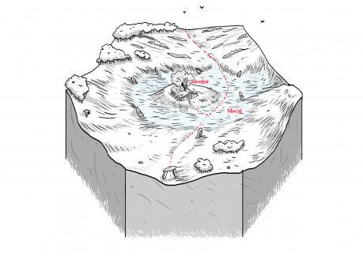

Hex leží na hranici mezi obdělávanou půdou a divočinou. Kvůli podmáčené půdě spíš pár kroků směrem do divočiny než do civilizace. Není ovšem úplně opuštěný. V jeho středu stojí osamělý menhir. Dávné centrum nejspíše druidského náboženství a rituálů. To vše vzalo za své, když před několika dekádami menhir praskl po celé délce od shora dolů. Druidové to vzali jako špatné znamení a odešli. S jejich odchodem získaly mokřady ještě větší vládu nad okolím. Přesto jedna rodina zůstala a žije v chatrči vystavěné kolem menhiru. Zvláštní je, že z rodiny nejsou na místě žádní muži, ale 3 generace žen, matka, dcera a babička. Zlí jazykové tvrdí, že jsou to zlé čarodějnice. Pletou se pouze částečně.

Ženy rády přiloží pomocnou ruku k dílu, léčí, pomáhají s komplikovaným porodem, ale též s potraty a dalšími zákroky, které ctihodné obyvatelstvo považuje za nečisté, až do chvíle, než je sami potřebují.

Když se k tomu přidají, zvěsti o druidských rituálech, které stále rodina provozuje, pověry o nepřirozeně dlouhém životě všech tří žen a o zlém osudu jakéhokoliv muže, co se v rodině narodí, či by tam jen přespal, tak je založeno v lepším případě na pohrdání v horším až na nenávist. Takzvaní civilizovaní lidé, by se jich rádi zbavili, ale brzdí je strach a paradoxně opět pověry o jejich moci a kletbách jejich sídla.

Za zmínku stojí ještě zlatý javor. Strom jako žádný jiný. Uchytil se v prasklině menhiru a tyčí se jako by z něj vyrůstal. Tím, že menhir obstavěla chatrč, vypadá to jako by vyrůstal z její střechy. Všude tam, kam dopadnou jeho listy, je půda úrodnější. Všude tam kde zakoření jeho semenáčky, mokřad ustoupí. Jeho sirup je prý základem mnoha léků a mastí a jeho dřevo má neuvěřitelné vlastnosti.

Právě dřevo je dalším problémem. Přestože se nikdo neodváží pokácet vzrostlý zlatý javor, tak mnoho lidí hledá v mokřadech semenáčky, které vyryje a odnese. Bohužel tím získá jen jeden strom. Jakékoliv pokusy o množení nebo šlechtění vždy selhaly. To přivádí do mokřadů nové hledače. Javor ovšem přitahuje i jiné tvory a tak často hledači sami zmizí, čím přidají další kapitolu k legendám o krvelačných čarodějnících jejich přisluhovačích a rituálech.

## Možné zápletky a dobrodružství:

- Zlatý javor v menhiru usychá, může za to zlá moc nebo naopak slábnoucí moc čarodějek z mokřadů? Pomůže družina najít lék? Nebo přijmou úkol přinést nový semenáček ze světa duší?
- Družina je najata, aby donesla z mokřadů semenáček. Co když narazí na čarodějky? Nebo snad na příšery z mokřadů?
- Čarodějky jsou známé svojí jasnovidnou mocí a ta by se družině hodila. Jenže jaká bude cena?
- Dcera čarodějek je těhotná, otec dítěte má strach, že se narodí syn a postihne ho zlý osud, a najme si družinu jako „porodní báby“.
- Dcera nechce žít dál životem svých předků, ale babička a matka o jejím odchodu nechtějí slyšet, pomůže jí družina s útěkem?
- Nedaleko se usadil mág a tvrdí, že je příbuzným a má nárok na menhir. Měšťané cítí šanci zbavit se čarodějek a muže podporují. Měšťansky nahlas nic neříkají, ale potichu stojí za čarodějkami. Na čí stranu se postaví družina?
