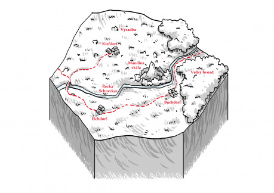

Dva dny cesty na jih od Malsterova pole protéká úrodným krajem řeka Schneckar, která je pravobřežním přítokem řeky Ravn, v jejímž ústí se nachází slavný Ravnburgh. Na jejím severním břehu se rozkládal Velký hvozd. V minulých dvou staletích však jeho mocné a nádherné kmeny podlehly sekerám a pilám nesčetných po půdě bažících lidí a hvozd tak ustoupil proti proudu Schneckaru o mnoho desítek mil, aby uvolnil místo polím tří velkých vesnic – Kiefdorfu, Buchdorfu a Eichdorfu a desítkám samostatných statků v jejich okolí. Zemědělství na velmi úrodné půdě prosperovalo a umožňovalo růst ravnburské populace.

Jenže dostatek potravin nebylo to jediné co po řece přicházelo, bývalá lesní půda zbavená své stromové ochrany podléhala dešťům a větru a zanášela pro Ravnburgh životně důležitý přístav. Henry Clopton, pán Doků zvaný Černá tvář, se rozhodl spojit dvě užitečné věci dohromady a začal skupovat pozemky na břehu Schneckaru, na nichž pak nechal sázet duby, borovice, buky, morušovníky a další stromy využitelné při stavbě lodí. Osázené pozemky nechával ponejprv svému osudu, ale když zjistil, že mnohdy jsou mladé rostliny vzápětí vytrhány a půda opět zabrána a rozorána – často dokonce původními majiteli, kteří jí Cloptonovi prodali! – začal postupovat systematicky. Skupoval a směňoval pozemky tak, aby získal větší souvislé území, která pak hlídaly oddíly heladérů.

První vesnicí, která se celá dostala do Cloptonových rukou, byl Kiefdorf na severním břehu Schneckaru. Obrovskou práci odvedla Rose Rous, Cloptonův hlavní akvizitor, která vykoupila spoustu pozemků přímo a co nešlo koupit, směnila za pozemky u Eichdorfu a Buchdorfu. Přesto zůstávalo několik sedláků imunních vůči jejímu šarmu a nemenším vyjednávacím schopnostem i vůči nepříliš zastřeným výhrůžkám velitele heladérů Askewa. Nakonec je k odchodu přimělo znovuobjevení Krvavé Maud, bájné loupežnice, která měla ve zdejších končinách sídlo ještě za času, kdy se zde rozprostíraly hluboké hvozdy.

Opuštěné domky a statky Kiefdorfu se staly základnou a cvičištěm heladérů. Odtud byly vysílány hlídky na ochranu rozsáhlých lesních školek a plantáží, pro něž se vžilo označení Cloptonův hvozd. Neméně přísně je však střežena samotná vesnice, za jejíž palisádu je nepovolaným vstup zapovězen. Kiefdorfské posádce velí důstojník Robert Savill, jež obdivuje kapitána Avery Askewa, velitele Kožených krků a snaží se být jako on. Veškerá podobnost však končí u toho, že oba jsou nadprůměrně vysocí. Zatímco Askew je šlachovitý, tvrdý až krutý, Savill byl obdařen medvědí postavou a vrozenou laskavostí, což mu však nebrání být svědomitým a předvídavým velitelem. Ve volných chvílích se sám chápe lopaty a pomáhá sázet stromy. Jedno ze stavení s velkým sklepem pak sloužilo potřebám otce Simeona, právě zde se konaly výslechy, které nebylo možné realizovat přímo v Docích. Samostatně stojící statky pak sloužily heladérům k jejich hlavní činnosti – nácviku hašení požárů.

K Savillovým mužům náležel mlčenlivý Edmund Basset, jehož neminoucí šípy chránily mladé lesy před druhým největším škůdcem – početnou vysokou zvěří. V tom mu pomáhala smečka loveckých psů nejrůznějších ras a plemen. Se svými psími společníky vycházel Edmund lépe, než s většinou lidí, přesto k jeho práci patřilo odprodávat kůže, parožinu a přebytky masa statkářům na druhé straně řeky. Obchodu pak využíval ke zjišťování nálad mezi vesničany – Černá tvář ani jeho důstojníci nebyli naivní, věděli, jaké mínění o nich rolníci mají. Edmund byl menšího vzrůstu a díky povadlým rysům ve tváři vypadal starší, než byl, byť nebyl žádný mladík, ale zkušený veterán. Plavil se pod Cloptonem a v jeho nové roli správce Doků mu sloužil od samého počátku.

Vesnice Buchdorf se nachází téměř ve stínu Velkého hvozdu a právě zde nalezla nový domov většina kiefdorfských vysídlenců, protože zde bylo k mání více volné půdy. Ves se pěkně rozrůstá a pole se rozpínají blíž a blíž mocným pňům a šeru mezi nimi. Zdá se, že to není bez následků – v poslední době se na hranici lesa začaly objevovat šelmy, smečky vlků, hnědí medvědi a dokonce vzácné lesní pumy. Zatím nemají na svědomí víc, než pár zatoulaných ovcí, ale sedláci se začínají bát o svá stáda. Leckteří z toho obviňují nově příchozí a jejich nenasytnost, starousedlíci respektovali hvozd a směrem k němu nikdy neorali dál, než hon od posledního stavení. Za původní sedláky mluví starosta John Cuddon, jehož protějškem za nově příchozí je Walter Loveney. Loveney však většinu energie věnuje nadávání na Cloptona a hledáním cesty, jak získat, samozřejmě bezplatně, zpět svou půdu v Kiefdorfu a ještě nějakou navíc.

Eichdorf je na rozdíl od Buchdorfu zaměřen téměř výhradně na rostlinnou výrobu, úhledné lány se táhnou do daleka, pravidelně přerušované remízky a stromovými rozhradami. Ačkoliv sem přišlo méně vysídlenců, ani tady není úplný klid, o což se stará Alice Makepeace, veselá upovídaná hostinská od Dvou volů - nejlepšího a největšího hostince v Schneckerlandu, pohledná žena v nejlepších letech. Buchdorfským starostou je Oswyn Goodrick, drobný starší pán a agronom k pohledání, právě jeho zásluhou eichdorfská pole plodí lépe než jakákoliv jiná. Snaží se Alici uklidňovat, ale jak sám říká – i s tou nejpaličatější kukuřicí si umí poradit lépe, než s držkatou ženskou, které, zdá se, vadí snad všechno. Není proto divu, že změnu poměrů vyvolanou zalesněním kiefdorfských polí si vzala za své hlavní téma. Svým prostořekým přístupem ale sjednocuje staro i novo eichdorfské obyvatelstvo, proto jí starosta leccos promine.

Na toulkách mezi oběma vesnicemi, ale i na řadě dalších míst lze potkat bylinkáře Francise Longreena. Vysoký štíhlý mládenec neodmítne pomoci komukoliv s léčením, ať již bolesti lidské nebo zvířecí. Nejedna děvečka po jeho hezké tváři a veselé povaze pokukuje, ale on se zdá k pohledům lásky slepý a čas tráví v přírodě, častokrát byl dokonce viděn, jak vstupuje do Velkého hvozdu. Nejednoho penězuchtivce pak zajímá jeho váček, za mastičky a bylinné extrakty musí mít našetřen pěkný poklad, protože zlaťáky získává pravidelně, ale utrácí málokdy. O sobě moc nemluví.

Neméně tajemná je pak Maudina skála, obklopená řekou, bažinou a hustým pralesem ční nad okolím jako věčná stráž. Z jejího vrcholku je prý vidět široko daleko, za dobré viditelnosti až k moři a Ravnburghu na severu. Někde v jejích útrobách se prý skrývá poklad Krvavé Maud, která sužovala kupce a statky v okolí Velkého hvozdu před třemi sty lety a nikdy nebyla dopadena. Báje dí, že na svém nashromážděném pokladu lpěla jako drak a odmítala jej opustit, až zahynula hlady, obklopená zlatem, za nějž by mohla jít nejvybranější pochoutky tisíc životů. Pravda je taková, že v jižní stěně Maudiny skály se skutečně skrývá jeskyně, již kdysi Maud obývala a poklad v hodnotě mnoha tisíc zlatých (ale ne víc) se tam osud nachází, stejně jako ostatky slavné loupežnice a jejich čtyř druhů.

## Skryvky

__Maudina jeskyně__ – představuje geniální přirozený úkryt s jedinou vadou, povodeň z doby před třemi sty lety pozměnila břehy Schneckaru a nyní je přístup k ústí jeskyně velmi obtížný a ještě víc nebezpečný, navíc není vidět a je otázkou, zda o něm vůbec někdo ví. Cesta zahrnuje tři zkoušky - překonání řeky, šplh po skále a průlez tunelem zaneseným naplavenými kmeny a z části zasypaným kameny. Jakákoliv jiná cesta je horší. V jeskyni lze najít pozůstatky pěti osob včetně Krvavé Maud. Maudinu družinu jednou na jaře uvěznili povodně na příliš dlouhou dobu a nedostatek čerstvé stravy se jim stal osudným. V jeskyni lze kromě pokladu (k10 × k10 × k6 × k12 zl.) najít nějaké lepší vybavení (2 různé meče, sekeru, kuši, plášť …)

__Současný objev Kravé Maud v Kiefdorfu__ – s maskou Krvavé Maud vystupuje Anne Rous, sestra hlavní akvizitorky a její lidé. Převleky za nemrtvou loupežnici původně vytvořili pro zastrašení dayhavenských dřevorubců na druhé straně Velké hvozdu, ale na neochotné kiefdorfské osadníky taky fungoval. Anne vede téměř nezávislou skupinu žodláků či dobrodruhů, která hlavně z důvodů rodinných vazeb spolupracuje s Cloptonem a jeho lidmi.

__Tajemství Francise Longreena__ – Frankie patří k Lesnímu lidu, jež má osadu na jižním břehu Schneckaru ve Velkém hvozdu. Jeho úkolem je varovat Lesní lid v případě, že by hrozila snaha o obnovu cesty zbytky hvozdu do Dayhavenu nebo pokračování kácení. Také se snaží zjistit, co je zač nová výsadba na severním břehu.

## Zápletky a úkoly

__Edmund Basset__ – Heladéři vědí o tom, že se v oblasti vyskytuje agent dayhavenských, ale nemohou si dovolit nikoho obvinit neprávem, proto nabídnou družině slušnou odměnu za zjištění, kdo jím je. Prvotní informaci mají ze zachycené šifrované zprávy – Edmund sestřelil poštovního holuba. Podezřelými jsou Francis L., Alice M., John Cuddon a Walter Loveney. Úkol může zadat i Robert Savill, ale s ním družina do styku přijde méně pravděpodobně, a Anne Rous, která na něm sama pracuje. Edmund by dále ocenil informace o jakékoliv mimořádné trofejní zvěři.

__John Cuddon__, starosta Buchdorfu – potřebuje zjistit, zda jsou šelmy na hranicích Velkého hvozdu opravdové nebezpečí pro vesnici a zda je rozumné vypsat odměnu nebo bude třeba pomoci profesionálů. Odměnu nabízí spíš skromnější, ale v potravinách nebo jiném dostupném materiálu velmi štědrou. Šelmy jsou pod kontrolou Lesního lidu, pokud se nebude ves víc rozpínat směrem ke hvozdu, budou neškodné, lov na ně by ale vyvolal odvetu.

__Walter Loveney__ – chce za každou cenu sehnat nějaké důkazy, klidně falešné, proti Robertu Savillovi, aby byly aktivity Cloptona a spol. zakázány. Loveneyho lze nalákat na jakoukoliv příležitost zbohatnout - má přehled o úkolech od obou starostů a Alice, za podíl na zisku nabízí družince (imaginární) pomoc se splněním těchto úkolů. Jediné zajímavé, co ví je, že Maudina jeskyně je na jižní straně skály.

__Alice Makepeace__ – chce zjistit informace o současném dění v Kiefdorfu a zejména o pohybech Rose Rous, nabízí za ně velmi vysokou odměnu ve zlatě. Odměnu však nehodlá vyplatit, i když má peníze k dispozici. V hostinci přebývají 3 žoldáci dayhavenských připravení Rose zajmout, jakmile budou získají informace. Než by zaplatila, pokusí se nechat družinu zabít onou trojicí. Alice je placená z Dayhavenu a je agentem hledaným Edmundem. Alice je tajně zamilovaná do Francise.

__Oswyn Goodrick__ – má jeden tajný sen, a sice pěstovat v Eichdorfu víno, ale žádné z dostupných odrůd se zde nedaří ani za mák. Možné řešení skýtá Robert Savill – heladéři mají vlastní odrůdu přivezenou z ciziny, a nebo Lesní lid, který zná místní lesní odrůdy, jež lze snadno naroubovat. Pan starosta by se rád zbavil Alice, ale momentálně nemůže zasáhnout, Alice je tak oblíbená,že hrozí, že vyhraje příští volby. Tuší,že za jejím vlivem jsou cizí peníze.

__Francis Longreen__ – rád by navázal kontakt s heladéry a zjistil, jaké jsou jejich plány. Pěstovat hvozd na dřevo Lesnímu lidu nevadí, pokud budou stromy obnoveny a část porostu zůstane. Lesní lid může hodně pomoci, požaduje ale více druhů stromů a pětinu jich nechat růst dále, i tak se jejich podpora vyplatí. Francis nabízí jako odměnu léčení a lektvary, peníze až v druhé řadě – nakupuje za ně věci, které potřebuje Lesní lid.

__Anne Rous__ a. k. a. Krvavá Maud – ocení jakoukoliv informaci, a zejména relikt, o původní Krvavé Maud. Ráda se s družinkou podělí o své dosavadní poznatky – Francis Longreen je podle ní divný, ale nejspíš neškodný, hlavními podezřelými jsou podle ní Alice a Walter, být to jen na ní, tak sejme oba – neb oba intrikují proti zájmům Černé tváře.
