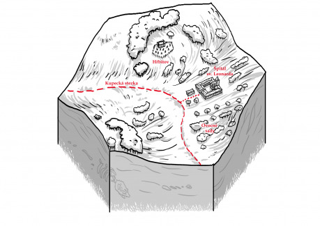

## Okolí

Špitál sv. Leonarda leží uprostřed sadů, které se rozléhají v mírně zvlněné krajině podél kupecké cesty do Ravnburghu. Sady jsou občas přerušeny tu hájem, tu mezí, tu potůčkem. Okolo cesty jsou roztroušeny malé sklady na ovoce.

## Špitál

Jedná se o strohou budovu z kamene, jíž dominuje věž, která ční nad koruny okolních stromů. Budova je čtvercová s atriem. Ke špitálu taktéž z vnějšku přiléhají malé stáje.

Dobře ubránitelnou bránou se vchází do centrální zahrady, ve které mnichové pěstují léčivé rostliny. Obvod atria je lemován podloubím. Naproti bráně se nachází hlavní kaple se zvonicí, nalevo špitální křídlo a napravo obytné křídlo. Ve sklepení vyvěrá pramen, jehož zázračné léčivé účinky byly objeveny teprve před necelými dvěma generacemi a motivovaly vznik špitálu právě na tomto místě. Výše ve svahu, za stromy, mimo zorný úhel špitálního křídla, se nachází nový hřbitov a márnice, patřící špitálu.

### Centrální kaple

Velká vysoká místnost s překvapivě krásnými výjevy na stropu, podepřeném množstvím úzkých sloupů. Středu místnosti vévodí oltář. Po stranách je místnost obehnaná kůrem, z nějž vedou schody nahoru do zvonice. Nachází se zde také vchod do sklepení.

### Obytné křídlo

Jedná se o množství cel pro mnichy a námezdní sílu, propojené chodbou ústící do jídelny a kuchyně. Zde přespává všechen personál špitálu a zdraví lidé se zde třikrát denně scházejí k jídlu. Denní program je mnichům přednesen vždy po snídani.

### Špitální křídlo

V tomto křídle odpočívají nemocní. Jedná se o několik velkých místností, které jsou po obvody lemovány lůžky. Úplně na konci se nachází malá alchymistická laboratoř a příruční sklad materiálu a malá knihovna. Vstup do špitálního křídla není povolen každému, dostanou se sem pouze členové řádu a nemocní. V tomto křídle se taktéž nachází další vchod do podzemí.

### Podzemí kláštera

Podzemí sestává ze tří částí – izolace, pramene a skladu potravin. Do izolačních cel jsou zpravidla umístěni pacienti, kteří by byli ostatním nebezpeční a nemohli by být ve společných pokojích. Pramen vyvěrá uprostřed malé a nádherně zdobené kaple. Ve skladu potravin se využívá chladu podzemí k uskladnění zásob, které by se v teple rychleji kazily.

### Stáje a sklad

Stáje se nacházejí v narychlo přistavěné budově ze dřeva, která se nachází vně špitálu. Ve stájích čekají koně poslů, mnichů a pacientů. Pro sklad je vyhrazena veliká místnost těsně u brány. Ve skladu se těsnají zásoby stavebního materiálu, oblečení, bylin, vody a alkoholu a trvanlivých potravin. Prostě většina toho, co takový špitál může běžně potřebovat.

### Hřbitov

Leží asi čtvrt hodiny prašnou cestou od špitálu, je oplocen a veprostřed stojí malá márnice. Pokud si rodina případného zesnulého pacienta nepřeje jinak, je tělo uloženo zde. Se všemi náležitostmi, samozřejmě.

## Organizace

Špitál patří Leonardianům a na jeho chod dohlíží bratr Norbert. Tomu se zodpovídají jak další bratři, a novicové, pečující o nemocné, tak najmutí pracovníci, kteří ve špitále také bydlí a vykonávají pomocné práce. Řád vybírá za své léčitelské služby peníze alespoň od těch, kteří mohou zaplatit. Část zisku plyne i ze sadů.

## Nápady na zápletky

- Dayhavenský šlechtic a kupec Jakob Durst onemocněl během své návštěvy Ravenburghu neznámou nemocí. Nyní bojuje o život ve špitále. Hanza se bojí, že jeho smrt by mohla být pro Dayhaven záminkou k otevřenému boji. Lochbearorové se snaží ututlat, že se jedná o otravu, v které má prsty. Rudá perla má rozkaz dostat Dursta zpět do Dayhavenu. Kolem číhají agenti obou stran.
- Bernardo, nejmladší Lochbearerův synovec, měl oči pro jinou a odmítal strategický sňatek a tím zkomplikoval své rodině její plány na posílené vlivu ve městě. Za trest má sloužit ve špitále coby Leonardiánský novic, dokud prý nedostane rozum. Rod vyhrožuje, že Bernardově milé ublíží, pokud opustí zdi špitálu. Bernardo touží utéct se svou milou a pryč z Ravenburghu, ale zatím stále hledá odvahu a pomoc. Pár se zatím schází tajně v sadech.
- V podzemí špitálu, na izolaci, vypukla epidemie vampyrismu. Bratrům se podařilo zabarikádovat vchody do sklepení, aby se nakažení nedostali ven. Unikl jen jeden nakažený a dva bratři, kteří ho měli vypátrat se ještě nevrátili. Další problém je, že kvůli barikádám a epidemii ve sklepení se bratři nedostanou podzemní kaple s léčivým pramenem a špitál se tak ocitá v nouzi. Vedoucí špitálu se celou epidemii snaží vyřešit, aniž by se něco doneslo přísnému kanovníku Urwickovi.
- Z márnice se ztratilo tělo náhle zesnulého člena Hanzy, které mělo být dalšího dne ohledáno. Stopy jsou čerstvé a vedou do nedalekého lesa. Může za to Rudá perla, nebo Lochbearerové, nebo mrchožrouti, kteří prý obchází okolím?
- Pokroková frakce Leonardiánů provádí ve špitále tajné pitvy, za účelem prohloubení medicínských znalostí. Hrobníci se občas děsí toho, co musí pohřbívat a dávají tak vznikat strašidelným povídačkám o příšerách, které žijí ve špitále a porcují pacienty na kousky. Urwick by rád za pomoci nestranných pozorovatelů přišel na kloub tomu, co za těmi povídačkama stojí, zatímco šéf špitálu Norbert by rád přesvědčil ostatní Leonardiány o přínosnosti pitev.

## Příklady postav:

- __Igor__ – Obyčejný rozložitý chlápek, který natrvalo žije ve špitále. Výměnou za stravu, byt a skromný plat vykonává veškeré zrovna potřebné práce, na které není potřeba velká odbornost. Mniši se s ním moc nebaví a tak je rád za každého cizince, se kterým si může popovídat. Pro svůj zápal pro historky a povídačky je studnicí místních pověstí a drbů.
- __Bratr Norbert__ – Zadumaný šéf špitálu. Má hlavní slovo, i když občas trvá pěknou chvíli než se rozmyslí a vymáčkne. Jeho srdce plane pro studium podstaty léčivého pramene a je ochoten sdílet svůj akademický zápal s každým, kdo projeví zájem.
- __Bratr Johan__ – Nevrlý alchymista. Z vhodného materiálu umí vyrobit různé léky, jedy či jiné substance. Potají destiluje vynikající alkohol z místního ovoce. Kromě toho, že pálenky rád vyrábí, tak je také rád pije. Bratru Norbertovi se to moc nelíbí, protože v poslední době se Johanovo pití začíná nebezpečně vymykat.
- __Novic Bernardo__ – Mladý šlechtic z rodu Lochbearerů, který ve špitále pracuje za trest a moc se mu tu nelíbí. Ještě stále se dobře se orientuje v komplikovaných Hanzovních a šlechtických vztazích. Po nocích rád opouští zdi špitálu, aby se procházel po okolních sadech. Hledá možnost, kterak opustit špitál jednou pro vždy.

## Role v příběhu

__Pomoc:__ léčení zranění a nemocí, pomoc při ohledání těla a určení příčiny smrti, útočiště v nouzi.

__Překážka:__ někdo důležitý může být raněn, ale bratři vás k němu nechtějí pustit; bratři uzdraví vašeho protivníka; věc, kterou hledáte mají bratři ve sklepě a jen tak se k tomu nedostanete.

__Hrozba:__ Z kláštera unikli lidé nakažení morem, šílený mnich vykopává hroby, aby měl co pitvat.
