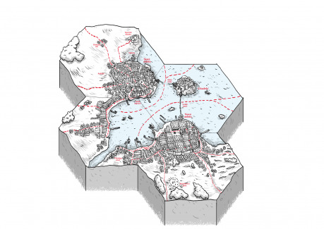

Článek je pokračování článku z Drakkaru č. 53 (strana 27) ve kterém se objevily první hexy. Kaž­dý takový hex měří napříč asi dvacet kilometrů vzdušnou čarou a je to vzdálenost, kterou člověk pěšky urazí při dobrém počasí za jeden den. Je to zároveň oblast, kterou člověk přehlédne, když vyleze na věž, kopec nebo vysoký strom (běžně člověk má horizont vzdálený asi pět kilometrů, z výšky 10 m pak dohlédne na deset kilometrů na každou stranu, takže ze středu hexu by ho z takové výšky viděl celý). Jeden hex je tak kompaktní a jasně uchopitelný malý kousek světa, který lze vytvořit, definovat a naplnit zajímavým obsahem a zápletkami.

První díl skončil velkým úspěchem a zajímavými hexy, rozhodli jsme se proto vytvořit další. Tentokrát jsme se ale rozhodli přesněji určit město a svět, ve kterém se hexy nacházejí – je jím okolí města Ravnburgh, které vzniklo také jako kolektivní článek a objevilo se v Drakkaru 60 (shodou okolností také strana 27).

Ravnburgh je fantasy město, odpovídající zhruba rané renesanci (po vynálezu knihtisku, ale před vynálezem muškety, takže z planých zbraní jsou k dispozici píšťaly a hákovnice). Město samo je důležitým obchodním přístavem, který ovládá kupecká Hanza, která se sváří o moc s rodem Lochbearerů. Jejich rod ve městě vládl, ale o moc přišel a nyní by ji rád získal zpět. Hlavním obchodním konkurentem Ravnburghu je město Dayhaven na východě, které proti němu intrikuje a snaží se jej srazit na kolena.

Hex se měl nacházet v bližším nebo vzdálenějším okolí města Ravnburgh. Nechtěli jsme ale vytvořit přesnou mapu okolí, ale jen vytvořit možnosti, které se dají v okolí využít a které mohou fungovat jako inspirace pro hraní nejen ve světě Ravnburghu.“
