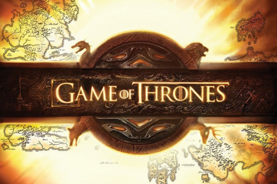
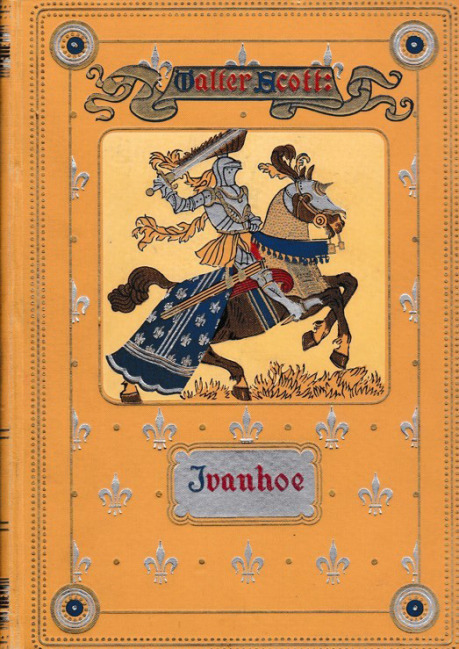
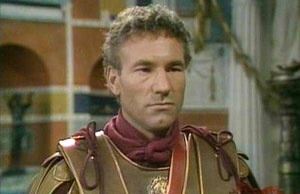
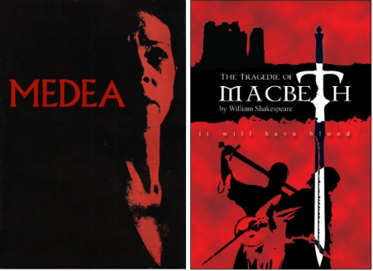
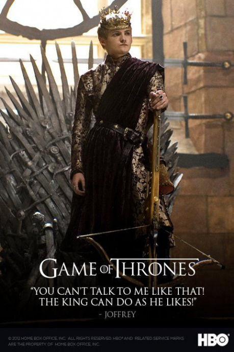
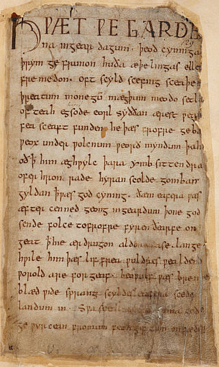
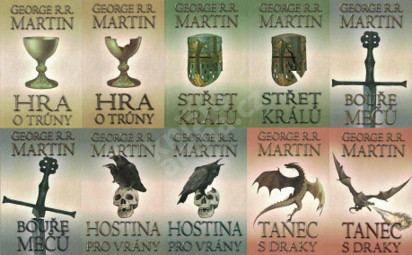

## I. Velká Zeď

Na samém začátku příběhu se dočteme o velikánské zdi, kterou postavili lidé v zapomenutém dávnověku na ochranu před nejasným nebezpečím ze severu.

A čtenář si řekne – aha, čínská zeď. Případně – aha, Hadriánův val.

Jenže, je třeba vzít velkou čínskou zeď, už beztak kolosální, a poněkud ji zvětšit. Délka zůstane podobná, odděluje celý kontinent … a výška dosahuje asi 200 metrů.

Pitomost, řekne si čtenář. Takovou zeď nikdy nikdo nepostavil a postavit nemůže.

No, jenže v literatuře lze stavět i nesmyslně velké zdi. Tato je obrovská. Je daleko větší, než cokoli, co přesahuje běžnou zkušenost.

A tato podivnost se vztahuje na celou Hru o trůny. Je také nesmyslně veliká. Několikanásobně větší, než Tolkienův Pán prstenů. Mnohem větší, než Tři mušketýři včetně všech pokračování, větší než Vojna a mír, případně než Jiráskovo Bratrstvo.

Podobně jako ta zeď je Hra tak obrovská, že ji nelze dobře zkoumat z jediného místa; prostě se vám nikde nevejde do pohledu celá. Je z ní vidět vždycky jen určitý úsek. Není to příběh pro netrpělivé jedince. Nepomůže, ani když znáte celou první knihu o tisíci stranách. Nelze říci, že „dál je to stejné.“

Dojem, že takovou věc nedokáže žádný člověk vytvořit, také není úplně mylný.

Ani G. R. R. Martin to vlastně nedokázal. Protože to není dopsané, ani po více než dvaceti letech. Panu Martinovi je v tuto chvíli 68 let a je docela důvodná obava, že to ani dopsat nestačí. Seriál je v tuto chvíli podstatně dál, chybí poslední série, nicméně je to dílo dotvořené pány Benioffem a Weissem, kterým do toho Martin zasahuje jen zdálky.

Další důsledek té kolosálnosti je, že v díle jsou chyby. Na některé postavy se v ději zapomnělo a ztratily se. Některé úseky děje a postavy jsou věrnými kopiemi jiných částí. Některé postavy se zjeví jen proto, aby byly vzápětí zabity. Největší problém je obrovitá trhlina mezi třetí a čtvrtou knihou, kde děj pokračuje na jiném místě a s jinými postavami. Zde mnoho čtenářů odpadlo. Slyšel jsem dokonce téměř cimrmanovskou radu, že nejlepší je čtvrtou knihu vynechat a číst rovnou pátou.

Je tu zkrátka beznadějně vidět, že se plánuje během psaní. Takový Pán prstenů byl nejprve dopsán od začátku až do konce, pak několikrát opraven, a pak teprve vydán. To je obvyklý a doporučený postup. Zde se autor vyřítil vpřed, aniž by byl konec dopředu úplně jasný; a to vede ke spoustě nedůsledností a improvizací.

Seriál je v tomto směru nejen pokus celou věc dokončit, ale i opravit nejvýraznější podivnosti. Ale při tom vznikaly zase další chyby. V prvních částech vyprávění je plno sexuálních scén, které vlastně ani nesouvisí s dějem a působí velmi hloupě. Je to zaviněno řemeslnou rutinou produkce HBO; v knižním originále totiž nic takového nebylo. Později naštěstí autoři tento nápad víceméně opustili, a pokud tam něco podobného je, pak to zjevně souvisí s dějem.

Perfektní příběh nám zkrátka nebude souzen. Je to prostě moc veliké.

## II. Martin versus Tolkien

Snad u všech velkých fantazy děl se zjevila snaha srovnávat nové dílo s Pánem prstenů. Stalo se to i zde. A někteří tvrdí, že Martin je povrchní a plytký, zamazal svůj příběh spoustou nahoty a krve, aby odvedl pozornost od toho, že jde jen o pranici o moc.

Jiní zase oponují, že naopak Tolkien je naivní idealista, který nechápe lidskou osobnost komplexně a paušalizuje postavy do umělých kategorií dobra a zla.

Antagonismus těchto srovnání je z větší části omyl. Martin vícekrát otevřeně přiznal, že Tolkiena bere jako svůj vzor. Mezi jejich příběhy je ve skutečnosti mnohem víc podobností, než rozdílů; místy je to dokonce úmyslná postmoderní hra.

Místo Černých jezdců jsou tu Bílí chodci. A mají v příběhu úlohu ani ne tak podobnou, jako vlastně naprosto stejnou; jejich každé zjevení vyvolává lavinu mrazivé hrůzy. Martin při tom není horší stylista, než Tolkien; není třeba jakkoli slevovat. U obou lze tvrdit, že jejich nejslavnější místa v ději jsou čistokrevný horor.

Jiný případ je pozdrav _Valar morghulis_. Nemusíte být znalci Tolkiena, abyste si uvědomili, že obě ta slova jste už slyšeli.

A jsou tu ještě důležitější věci. Svět Pána prstenů je postaven na manichejské jednoduché polaritě Světla Tmy, Dobra a Zla. Všechny postavy se k tomuto dělení vymezují a bojují za jednu nebo druhou stranu. Ti zlí jsou pak vnímáni často jako umělé stvůry, podobní středověkým ďáblům.

Druhý pohled ovšem ukáže, že ani u Tol­kiena to tak jednoduché není; u řady postav prochází hranice dobra a zla přímo postavou, která hledá ten správný směr, a také ho může ztratit. Saruman Bílý. Správce Denethor a jeho syn Boromir. Postava, zrozená jako anděl, se může stát ďáblem, jako Sauron. A naopak, postava zkažená svými činy, nakonec může přesto udělat něco dobrého, jako Glum.

U Martina tomu není jinak. Rozhodně není pravda, že by o dobro a zlo nejevil zájem, nebo že by ho nějak zrelativizoval. Odlišuje ho jen zvýšený důraz na postavy, které balancují na té nejisté linii mezi dobrem a zlem. Dalo by se říci, že Hra o trůny je prostě plná samých Denethorů, Boromirů, Glumů a Sarumanů. Pokud Tolkiena nadchla myšlenka, že zlo může vykonat neúmyslně něco dobrého, pak je to ve světě Hry o trůny na denním pořádku; a k vidění je i opačná varianta; zlo, páchané z nejlepších úmyslů.

Příběh začíná u Eddarda Starka, připomínajícího na první letmý pohled Aragorna. Je velmi snadné si ho zařadit mezi ty „dobré.“ A tady nás Martin docela drasticky vyškolí a ukáže, že hrdinova snaha dělat ty „správné věci“ v reálném životě nemusí fungovat. Přes dobrou snahu spáchá Stark řadu chyb, které nakonec pomohou zlu. Příkladem opačného vývoje je třeba povrchní a bezohledný Jaime Lannister, který je na konci jednou z nejudatnějších postav.

Ale pokud bychom tvrdili, že postavy u Martina jsou všechny takto „nečernobílé,“ pak ani to není pravda. Existují tu i postavy nekomplikovaně dobré, velmi podobné hobitům – Sam­well Tarly a jeho partnerka Gilly, což je další celkem úmyslná a přiznaná Tolkienovská licence. O dobru a zlu mají představu dost jasnou a od začátku ví, kde chtějí stát. A naopak tu najdeme postavy beznadějně zkažené od první chvíle, kterým není pomoci. Některé z nich jsou zjevně psychicky nemocné – například Ramsay Bolton nebo král Joffrey.

No, a konečně je tu i to neosobní zlo, ti Bílí chodci. Jen tu je místo temnoty zima; a místo skřetů jsou tu mrtví; ale podstata je úplně stejná. Martin má takovou sílu i na opačném pólu svého světa; oheň, spojený s draky, šílenstvím a také upalováním. Tato síla je komplikovanější a vzbuzuje různé falešné naděje; ale i zde je to síla nebezpečná a není radno jí věřit. Není těžké si vzpomenout na balrogy nebo Saurona, podobně propojené s ohněm.

A kdo by si myslel, že tohle všechno je jen taková nepodstatná ozdoba a klidně by to mohlo fungovat bez draků a zombií, měl by si vzpomenout, že původně se to celé jmenovalo _Píseň ledu a ohně_; na _Hru o trůny_ to přejmenoval až seriál, když využil název první knihy.

Shrnuto, sečteno – rozdíly Martinova a Tol­kienova vyprávění jsou jemná hra důrazů; není tu žádná jasná absolutní hranice, a daleko spíše jde o rozvíjení Tolkienova modelu určitým konkrétním směrem, než jeho negace a vyvrácení. Martin je podle mne k Tolkienovi blíž, než armáda daleko povrchnějších epigonů s elfy, hobity a trpaslíky.

## III. Martin versus Walter Scott

Když jsem četl první knihu celého příběhu, zaujal mne těžký, starodávný jazyk, a velmi pomalý rozjezd děje, připomínající 19. století. A potom jsem narazil na turnaj, doprovázený spoustou podrobností, co měl kdo ve znaku a kdo koho porazil. Celé to přineslo – kromě úlevy, že se na straně tři sta konečně něco děje – i docela účelné představení řady postav, přehledně porovnaných v té důležité schopnosti, jak je kdo silný bojovník. Bylo jasné, že o všech čtyřech semifinalistech ještě uslyšíme.

Nemohla mi uniknout podobnost s románem Ivanhoe, kde rovněž po stovce stran nudných podrobností propukne efektní turnaj, a zde pak vyniknou hlavní hrdinové, kterými se děj nadále zabývá. Později dojde k velikému obléhání pevnosti a skončí to božím soudem.

Podobností je daleko víc. Tradiční téma rytířských románů, urozenost, rytířské přísahy, dodržování slova, to bylo předmětem úvah i pro skotského romanopisce v roce 1814. Urozenost sama o sobě neznamená nic; důležité jsou činy. I zde máme hrdiny bez bázně a hany, jako je sám Ivanhoe, a proti nim padouchy, jako proradný Brian de Bois Guilbert a chamtivý Front de Boeuf. Vlastně se jejich kopie ve Hře o trůny vyskytují mnohokrát. Kromě Eddarda Starka tu máme třeba Brienne z Tarthu. A na té špatné straně zjevy jako Meryn Trant, Walder Frey a Roose Bolton, všichni dokonale zkažení na různé způsoby.

A na opačné straně feudálního světa mezi poddanými může naopak kvést zcela rytířská statečnost a ušlechtilost. U Waltera Scotta je to třeba Gurth, pasák sviní, který paralelně k turnaji rytířů svádí zápas někde v lese. Nebo loupežník a lukostřelec Locksley, čili vlastně prapůvodní Robin Hood. Když přejdeme zpět do Hry o trůny, narazíme tu dokonce i na ty loupežníky se zázračným lukostřelcem. Věrných sluhů, co oddaně provázejí pány krajinou, jako Podrick, je Hra o trůny také plná.

I když Martin snaživě demytizuje vše, co s romantismem souvisí, přesto nakonec jeho hrdinové míří naprosto tradičním a neoriginálním směrem. Nenapravitelně zlé postavy, jako Joffrey nebo Ramsay Bolton, nečeká nic dobrého. Mohou se snažit, jak chtějí, mohou mnohokrát vyhrát a přelstít svoje soupeře, ale nakonec skončí neodvratně špatně.

Naopak hrdina, který poctivě prošel svoji soukromou křížovou cestu, plnou protivenství a utrpení, má naději dojít k velkým věcem. Trpaslík Tyrion, vychovaný rodinou k naprostému cynismu, většinou jedná tak, že by proti němu nemohl mít námitky ani sir Galahad. Je dvorný k dámám, i když jsou to náhodou prostitutky; udatně hájí město, i když ho král nenávidí; dodržuje sliby, i když jsou dané ve vězení svému vězniteli; cítí s nepřáteli, které porazil; zkrátka, je nesnadné na něm najít nějaký kaz. A k tomu všemu je ještě chytrý a sebeironický, což drtivá většina rytířů nedokáže.

Máloco je v údajně cynické Hře o trůny tak živé téma, jako starodávné hledání těch pravých rytířů. Ideál byl zbaven romantické naivity, byl oprášen od povrchního moralizování a přestal být výsadou urozených, ale tím spíše na něm vynikne to, co je podstatné.

## IV. Martin versus Robert Graves

Dobře, řeknete; ale Hra o trůny, už podle názvu, není jen romantická mlátička rytířů; jsou to hlavně důmyslné šachové partie lstivých intrikánů. Něco jako dvůr římských císařů, jak nám ho popsal Robert Graves v díle Já, Claudius. A byl to, mimochodem, také slavný televizní seriál. Samý atentát a palácový převrat, sexuální orgie a jed ve víně.

Postavy římských císařů se opět až pozoruhodně podobají. Zhýralý, líný a neschopný Tíberius připomíná Roberta Baratheona. Sadistický a rozmazlený Caligula je dost dokonalý vzor Joffreyho – dokonce i podobně vypadají. Lstivá intrikánka Livia, která vraždí jednu postavu za druhou – nejraději jedem – hodně připomíná královnu Cersei, ale ještě daleko přesněji je to lady Olenna.

Kopie římského dvora ožívá hned v zákulisí toho turnaje. Zde se nám představují nikoli mistři meče, ale mistři intrik a dvorských machinací. Hlavní špion lord Varys, majitel nevěstince Petyr Baeliš, královna Cersei a její otec, lord Tywin Lannister, vrchol potravního řetězce a skutečný vládce v pozadí řady králů. Proti mistrům takového kalibru si ostatní Hru o trůny moc dlouho neužijí a mohou být rádi, že setkání s podobnými postavami vůbec přežijí.

I paranoidní nálada, že i když jdete na nevinnou večeři, nemůžete si být jisti, že se vůbec vrátíte, pochází z Gravesova vyprávění. Počet šílenců na kilometr čtvereční ve světě Hry o trůny vysoce přesahuje normální stav a zejména u dvora v Králově přístavišti je obtížné najít někoho příčetného. A pokud nikdo uvnitř nechystá atentát, hrozí pro změnu nebezpečí zvenku a celé Královo přístaviště je obléháno. Je s podivem, že je za takových podmínek někdo ochoten v Rudé baště vařit, uklízet a udržovat to všechno v chodu. Nejrozumnější by bylo prchat co nejdál, do míst, kde nic důležitého není.

Potíž je, že ani na venkově si moc nepomůžete. Zdá se, že ve Hře o trůny připadají na jednoho sedláka při náhodném setkání asi tak tři ozbrojení válečníci. Když si Arya stěžuje Ohařovi, že těžko mohla potkat někoho horšího, Ohař ji zcela správně ujišťuje, že určitě mohla, například jeho bratra. Osobně mám dojem, že asi úplně nejhorší ze všeho je potkat Brana Starka čili Tříokou vránu, ježto v jeho blízkosti je úmrtnost přímo děsivá. To i v trůním sále vedle královny Cersei je bezpečněji.

Pokud je často tvrzeno, že Martinův středověký svět je „realistický“, pak jeho vzorem není středověk, známý z historických monografií, ale středověk z literatury. Je to velmi podobná situace jako u Quentina Tarantina; není to reálný svět, ale svět z nějakého jiného filmu. Je to „realistické“ proto, že to diváci nebo čtenáři poznávají; utvrzuje je to v některých zažitých představách o středověku, totiž, že to byla samá řež a vražda, a že sejít ze světa přirozenou smrtí byla spíše kuriozita.

## V. Martin versus William Shakespeare

Po stránce jazyka a technikou psaní je Martin odlišný od předchozích zmíněných vypravěčů tím, že docela výraznou část děje vypráví v dialogu. Bohatá psychologie postav je rozvíjena formou nejklasičtějšího dramatu. Není složité provozovat něco podobného na chodbách a v sálech královského hlavního města. Ale ono to podobně funguje i na cestách, kde putují různé postavy s oblibou ve dvojicích, právě proto, aby mohli vést rozmluvy.

Lze říci, že právě v tomto umění Martin Tolkiena jasně zastiňuje a toto je podstatná kvalita, kterou do vývoje fantazy přinesl. Vedle vrcholných mýtických, osudových a hororových scén, založených na střetnutích postav, tu máme stejně skvostné dramatické dialogy. A jedno souvisí s druhým; právě v rozmluvách jsou podstatné informace o tom, kam se linie děje bude ubírat. Je proto dobré být ostražitý, co postavy říkají.

Leckdo tvrdí, že ve Hře o trůny „se může stát cokoli“ a „může zemřít kdokoli.“

Kdyby to byla pravda, došlo by tu k největšímu možnému kacířství v dějinách literatury; popření toho, že ve světě existuje kauzalita, a že naše pozemské plahočení dává nějaký smysl. Že dobrý čin přinese odměnu a zlý čin přinese trest; že chyba přinese následek; že, zkrátka, události nejsou řízeny generátorem náhodných čísel. V takovém případě by ani nemělo smysl cokoli vyprávět. Bylo by jedno, že Eddard Stark je hloupý a lord Varys chytrý; prostě by si G. R. R. Martin občas hodil kostkou a podle toho řídil další děj.

Podle mne je to celé nepochopení zákonitostí, kterými se Hra o trůny řídí. Není to tak prosté, jako v computerové střílečce; že zlí zabíjejí ty dobré a obráceně. Funguje to na principech tradičního dramatu.

Někdo si všiml, že královna Cersei, to je vlastně Médea. A šlo by dodat, že Tyrion, to je nová verze Oidipa. Jaime, který má zabít krále z morálních důvodů, to je přece Hamlet. A lady Olenna, která tlačí kupředu svoje potomky k moci a slávě, to je lady Macbeth.

Ve všech těchto slavných dramatech se umírá. Hodně se tam umírá. A často zemřou i ti hodní, co za to zdánlivě nijak nemohli. Přesto jejich úmrtí jasně vyplývá z děje.

Hned v první knize nás autor vyškolí na případu Eddarda Starka. Ten může působit překvapivě prostě tím, že je z podobných postav první.

Už bylo řečeno, že Stark dělá chyby. Čtenáři je to jasné i proto, že má po celou dobu podstatně víc informací, než postava. Vidí, na rozdíl od Starka, že se popravený muž Noční hlídky skutečně setkal s Bílými chodci a měl důležité zprávy. Stejně jasný je případ zabití řezníkova syna na Královské cestě. Čtenář byl u toho a viděl, jak to bylo, Eddard Stark nikoli, a tak se nechá přemluvit k zabití zlovlka, který je očividně zcela nevinný.

O kousek dál je Eddard Stark zoufale osamělý, a to na dvoře plném vražedných šílenců. Král, na kterého spoléhá, se ho nikdy pořádně nezastane. Skupina neprůhledných intrikánů kolem dvora rovněž nemá jasný důvod Starka podporovat. Přesto Stark pátrá po tajemství, které jeho předchůdce zjevně zabilo, a neváhá o tom kdekoho informovat. A když to odhalí, výsledek obratem prozradí největšímu nepříteli ze všech. Nejeden čtenář Agathy Christie cítil, že je velmi zle. Není překvapením, že Stark skončí ve vězení. A tady mu o něco chytřejší postavy nabízejí spiknutí. Věci spějí zjevně ke katastrofě, pro jednu nebo pro druhou stranu. Ať zahyne Stark, nebo někdo z jeho protivníků, nemělo by to být žádné překvapení.

Podobný případ často propírané pohromy souvisí s rodem Freyů. Mnoho diváků a čtenářů protestovalo, že k tomu došlo náhle a bez varování. Opět to naprosto není pravda. I zde proběhla expoziční scéna, dlouhatánské a nudné vyjednávání o přechodu vojska přes most. Byla tu k vidění hromada zakyslé zloby a závisti. Rod Freyů připomíná zapomenutou bombu, která nevybuchla v minulé válce, ale klidně by se to ještě mohlo stát. V dalším průběhu událostí je slib, který byl výsledkem vyjednávání, porušen. Čtenář byl už několikrát vyškolen, že podobné události mívají ve světě Hry o trůny následky. Dokonce to někdo přímo řekne, že se to asi Freyům nebude líbit. Jenže naši hrdinové s pečlivostí Eddarda Starka zamíří ke Freyům na návštěvu, do jejich hradu. K čemu jinému tam může dojít, než k násilí?

Asi nejjasnější ukázka tohoto postupu je Tyrion a jeho otec Tywin. Tywin nesnáší svého syna, protože je trpaslík. Připojil si k tomu ještě důvod, že při porodu zemřela jeho žena, a Tyrion je za to odpovědný. Oba důvody jsou iracionální, ale tím hůře vyvratitelné. Tywin proto synovi vytrvale křivdí. Odmítá jeho dědictví, odmítá ho jako syna. Opravdu kruté je popření zjevné skutečnosti, že Tyrion zachránil město a tím i vládu celého rodu. Stejně drastické je, co se stane s jeho soukromím. A ani to všechno nestačí, když se zjevně náhodné obvinění hodí k tomu, aby byl Tyrion svým otcem nakonec odsouzen k smrti. Kdyby Tyrion zemřel, nikdo by nemohl tvrdit, že to byla náhoda a že se to nedalo čekat. Katastrofa se k němu valí stovky stran. Hůl má ale dva konce a každá nová rána ničí nejen Tyriona, ale i jeho loajalitu k rodině. To, co se stane, se předvídat dalo a věci k tomu mířily.

Mohli bychom tedy shrnout, že chytré postavy prostě přemohou ty hloupé, a že za chyby lze zaplatit i vlastním životem. Ale to není jediný klíč k výsledkům událostí. Navzdory údajné Martinově relativizaci dobra a zla se při delším sledování příběhu ukazuje, že ani to nejchytřejší zlo nemá žádný důvod ke klidu. Je docela přesvědčivě demonstrováno to, že zlo se nakonec ničí samo, protože je svojí metafyzickou podstatou destruktivní. Nebuduje trvalá spojenectví, naopak je časem zrazuje a tím eroduje svoji vlastní moc.

Nejnázornější ukázkou je Ramsay Bolton. Jakkoli je lstivý, jemu nakloněných postav beznadějně ubývá. Povraždí kdejakého příbuzného, žena mu uteče a milenka zemře; namísto toho si vytvoří armádu nepřátel. I kdyby se nějakým zázrakem dožil vysokého věku, nakonec po něm nezbude nic a jeho jméno bude zapomenuto, jak mu v jednom místě slibuje Sansa Stark.

A lépe na tom není ani hloupé zlo, tedy král Joffrey nebo Gregor Cleggane. Zde asi nikdo nebude tvrdit, že případné újmy těmto postavám někoho překvapí. Ublížit by jim chtěl kdekdo, včetně čtenářů. Varování u nich nabylo přímo úřední podobu díky Aryině seznamu. Nikdo, kdo na něm je, by neměl mít klidné spaní. A nikdo nemůže tvrdit, že se tam dostal nedopatřením – každá z postav si své jméno na něm zasloužila.

Dodávám, že velmi nápovědné je, pokud postava začne ubližovat dětem. Na tento zločin neexistuje ve Hře o trůny omluva a každý, kdo se ho dopustí, vykročil na trasu svojí zkázy. Lze to výjimečně i přežít, ale rozhodně nelze uniknout bez trestu.

Je možný i optimističtější vývoj postav a nemusí to končit pohromou. Jsou tu hned dvě pyšné a hloupé princezny, které zmoudří. Je tu urozený povrchní hejsek, který dospěje v udatného rytíře. Je tu dokonce mýtický Jidáš, který dojde přes velmi svízelnou křížovou cestu k jistému vyrovnání s osudem.

Zkrátka, postavy jsou nejenom nečernobílé, ale vyvíjejí se nejrůznějšími směry. Logika dramatu je většinou jasná a překvapení se tu ve skutečnosti konají jen výjimečně. Těch několik málo sporných případů nechci uvádět, abych nekazil překvapení těm, co to celé ještě neznají, případně nejsou tak daleko.

## VI. Martin versus Beowulf

Takto popsaná Hra o trůny tvoří složitou mozaiku vztahů, kde si postavy odehrávají svoji soukromou dramatickou trasu. Občas se někdo z vedlejší role prodere do první řady. Nebo naopak, zdánlivý ústřední protagonista zemře během prvního jednání.

Návod na přežití a úspěchy ve Hře o trůny nakonec není tak složitý, jak se zdá.

Neměli byste dělat zjevné hlouposti, i když vám to poradil kamarád, nadřízený nebo maminka. Rozhodně byste neměli jen tak ubližovat lidem okolo. Není chytré se moc tlačit dopředu a snažit se tím někoho mocného naštvat. Vlastně není dobré na sebe zbytečně upozornit. Takto dokážete uspět i s docela strašlivou výchozí situací, jako třeba Samova přítelkyně Gilly.

Takový návod zlověstně připomíná švejkovské návody na přežití totalitního systému; nehas, co tě nepálí, kdo nic nedělá, nic nezkazí; iniciativní blbec horší, než třídní nepřítel. Zdá se, že v takovém světě vlastně není přáno velkým činům a tím ani opravdovým hrdinům. Protože hrdina na sebe rozhodně upozorní a svým činem získá nějaké nepřátele. Zachrání strom a zabije bobra, nebo obráceně. Za jeho čin ho čeká trest od jedné nebo od druhé strany. Tím méně se tu zdá být místo pro nějakého monomýtického velikána, určeného osudem od začátku. Jako třeba Beowulf, který pobije všechny nestvůry a stane se králem.

No, a ukazuje se, že ani tohle není pravda, i když tomu kdekdo věří.

Hra o trůny je díky různosti původních vzorů ještě složitější. Martin na jedné straně nechce žádné privilegované hrdiny, určené osudem; právě podobné postavy s oblibou ponižuje.

Na druhou stranu tu ale přesto existují Tolkienovské osudné síly a situace; jsou tu Bílí chodci, jsou tu draci, svět se řítí do zkázy. Kdo jiný to má zachránit, než nějaký hrdina? Obyvatelé Westerosu jsou k těm velkým činům prostě nuceni; pokud je nevykonají, nepřežijí.

A tak se dostáváme k největšímu paradoxu Hry o trůny. Pravidla sice vedou postavy k opatrnosti a postávání za větrem, ale ve skutečnosti těch, co takto opravdu žijí, není mnoho. Hrdinů je tu celá řada, i když je to hodně sebevražedná profese. Brienne z Tarthu stále někoho zachraňuje a někomu něco přísahá, Jaime Lannister stále někam putuje a něco dobývá.

No, a s tou rovností hrdinů a jejich šancí to také není úplně jednoduché. Lze tvrdit, že každý z těch, kdo ve Hře nějak vynikli a v poslední sérii stále ještě žijí, si svoje postavení docela draze vykoupil. Všichni prošli nějakým soukromým peklem a protivenstvími; zpočátku to rozhodně nevypadalo, že by mohli dokázat něco skvělého. Jenomže … plno čtenářů nějakým šestým smyslem od začátku tuší, že někteří z rovných jsou si zkrátka o kus rovnější.

Naprosto jasný případ je Daenerys. Co se týče privilegií, má pro sebe rovnou celý kontinent. Její utrpení proběhlo už v první knize, ale potom se jí už další nehody zázračně vyhýbají. Je krásná a příjemná a zábavná a milá a sexy a má draky. Na mne tato postava působí od začátku jako špatný vtip. Do údajně drsné a realistické Hry o trůny si zaskočila osobně Mary Sue. Připouštím, že mám smůlu a nic s tím nenadělám, protože Daenerys milují nejen davy diváků a čtenářů, ale zjevně i sám autor. A myslím, že se mnozí diváci a čtenáři dychtivě chytili tohoto podivného vybočení z pravidel, protože vede děj do předvídatelnějších vod. Lze zcela v bezpečí sledovat udatnou hrdinku, která zaručeně neumře, nic zlého se jí nestane a její nepřátelé budou padat jak klasy pod sovětským kombajnem Kolos. Cestu k trůnu má přímo vydlážděnou.

Druhý, daleko zajímavější případ je Jon Snow. Určitý náznak sudby, že to není jen tak někdo, se skrýval již v jeho pečlivém oddělování od ostatních sourozenců a neustálém zdůrazňování, že je bastard. G. R. R. Martin favorizuje podobné postavy stejně tvrdohlavě, jako J. K. Rowlingová a jeho logika má v tomhle k nějakému realismu obzvláště daleko. Teprve, když vás vyženou z rodinného hradu, upřou vám dědictví a jméno, nebo alespoň useknou ruku či zpřerážejí kosti, máte naději na úspěch. Jon je kromě této vstupní výhody od počátku na Zdi, na místě, kde se dějí ty opravdu důležité věci, a kde lze vršit hrdinské činy na sebe stejně snadno, jako mrtvoly okolo Železného trůnu. Vývoj Jona je bezpečně nejsložitější, je to přímo vypiplané Martinovo dítě. Prošel nejvíce zvraty a změnami stran ze všech. Náznaků kolem něj je také víc, než kdekoli jinde; už hodně brzy vypracovali fanoušci takzvanou R + L = J teorii, o tom, že Jon možná není dítětem Eddarda Starka vůbec, a je to nejspíš další zapomenutý Targaryen.

A čím déle to někdo sledoval, tím zřejmější byl pocit, že na konci Hry o trůny se Jon setká s Daenerys jako ta vojska na Labi, a nějak to celé vyřeší. A že nejspíš spolu odejdou do západu slunce a draci ugrilují Bílé chodce, konec.

No, ale tím jsme najednou někde úplně jinde, než kde začal první odstavec této kapitoly. Žádná důmyslná dospělácká Hra o trůny, kde vše vyplývá ze železné logiky krvavého dramatu, ale naopak; teenagerský příběh o tom, jak se stane přesně to, co jste si od začátku přáli, na způsob Stmívání.

Ve skutečnosti se tu dostáváme zpátky na začátek úvahy.

Hra o trůny je tak obrovská, že je obětí vlastního úspěchu. Od počáteční nedůvěry přešli čtenáři, diváci i produkce HBO v kolektivní nadšení. Hrdiny, které napřed opatrně pozorovali, si postupně zamilovali. Cesta hrdinů byla tak dlouhá a složitá, že se jich už nikdo nechce vzdát. HBO i Martin jsou rukojmími svých diváků a bojí se je naštvat. Obraty, které si fanoušci vymysleli, se začínají skutečně odehrávat. Postavy, které se lidem líbily, byly zázračně zachráněny a vráceny do děje. Celé se to řítí do stále předvídatelnějších konců, je to stále méně zajímavé a porušuje to vlastní pravidla.

Věřím, že v poslední chvíli se scénáristi rozpomenou na svoje lepší nápady a přijde návrat k Tolkienovi, Beowulfovi a dalším klasikům. Postupy, jak zabránit tomu, aby mýtický hrdina dostal všechno, co si vzpomene, jsou dávno známé a vyzkoušené. Frodo nakonec nedošel k Hoře osudu, zásluhy na posledních metrech jeho úkolu měli jiní. Beowulf nezabil poslední nestvůru. Sarah Connorová neodjíždí do dáli se svým milencem.

Začínám věřit, že to nejvíce očekávané nakonec přece jenom nenastane a v ději se trochu uhne. Nejméně jeden z těch dvou krásných mladých lidí zemře. Ani jeden z nich neusedne na železný trůn. A ten pravý hrdina, který přemůže Nočního krále a tím zachrání svět, je celou dobu někde kus vedle.
