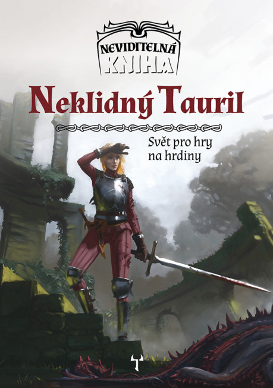

## Co je Neviditelná kniha?

Letos na Vánoce vyjde v nakladatelství Mytago první příručka k novému oficiálnímu světu pro Dračí doupě II a jiné RPG hry. Svět se jmenuje Neviditelná kniha a příručka bude zaměřená na výseč světa, jižní část kontinentu Tauril. Součástí knihy budou nejen obecné informace o Taurilu, ale také zápletky, cizí postavy, mapy, náhodné tabulky a další pomůcky určené Pánům jeskyně (nebo Průvodcům hrou či jak si je nazvete).

Cílem projektu je představit svět, který je přátelský příběhovému hraní, podporuje roleplaying, hraje na vážnější notu a klade otázky k zamyšlení. Ze známých fantasy světů by se Neviditelná kniha dala asi nejvíce připodobnit k Dragon Age, je nicméně možná ještě více než fantastikou inspirována skutečnými historickými událostmi a naším světem, jehož problémy a výzvy jsou převedené do kulis pseudostředověkého fantasy. Jinak řečeno, snažili jsme se vytvořit svět, ve kterém se budete poznávat.

## Jak a proč to vzniklo

Neviditelná kniha vznika původně někdy kolem roku 2012 jako moje domácí kampaň. Hlavním impulsem pro její tvorbu bylo – kromě chuti mých hráčů něco hrát – to, že jsem se nedlouho předtím potkala s několika hráči RPG, kteří mi nezávisle na sobě řekli něco ve smyslu: „Fantasy? To už nehraju. Z toho už jsem vyrostl. Já teď hraju ty věci, které jsou o roleplayingu, o příběhu a tak.“

Tahle prohlášení mi byla silně proti srsti, protože sakra, proč by se středověké fantasy mělo vylučovat s příběhovým hraním? Kde je problém? A tak jsem se rozhodla, že zkusím vzít schválně to nejvíc „banální“ fantasy prostředí, které dokážu vymyslet, a vytvořím v něm pro své hráče kampaň, která bude hodně o silném příběhu, zvratech a vztazích. A vznikla první taurilská kampaň. Tehdy ještě Thurenské království nemělo svoji kouzelnou mlhu ani krevní pečetě, Agol Zar neměl draky a Kalus inteligentní kočky. Byly to veskrze obyčejné, generické fantasy země. A víte co? Mně to vůbec nevadilo. To, co pro mě bylo důležité, bylo, aby v tom byly kvalitní cizí postavy se zajímavými tajemstvími a zapeklitými problémy, a aby interakcí hráčských postav s nimi vzniklo něco emočně silného. A to se, aspoň soudě podle reakcí mých hráčů, dařilo.

A když jsme zhruba o dva roky později tu kampaň dohráli, přišlo mi to líto, protože jsem si s tím dala ohromnou práci, a měla jsem pocit, že to fungovalo, že to bylo dobré, že to hráče bavilo a i mě. Tak jsem sepsala několik dobrodružství z této kampaně a hodila je na RPG fórum. K mému překvapení se zalíbily a po nějaké době jsem byla oslovena autorským týmem Dračího doupěte II, zdali bych nechtěla Tauril sepsat ja­ko oficiální svět pro Dračí doupě II.

A tak se Tauril postupně rozrostl o další tři členy autorského týmu a vyvinul se ve svět s názvem Neviditelná kniha, jehož je kontinent Tauril součástí. A visel na nás úkol přetavit ona dobrodružství do ucelené příručky, která bude využitelná širším okruhem družin, a obohatí českou RPG scénu. Tato příručka je nyní, tři roky poté, co jsme odkývali její vydání, připravená k vypuštění do světa.

## Jakým jsme čelili výzvám

Cesta ke knžnímu vydání nebyla jednoduchá. Hned zkraje jsme museli činit velmi podstatná designová rozhodnutí, například to, zdali příručka bude čistě „spoilerová“, obsahující akorát dobrodružství a cizí postavy, nebo jestli tam budou i obecné informace o prostředí. S příručkou skládající se čistě z kompletních dobrodružství je totiž ten problém, že má velmi nízkou znovuhratelnost. Odehrajete ta dobrodružství, a už tam nemáte moc nic dalšího. To jsme úplně nechtěli. Na druhou stranu, kniha plná obecných informací, které si mohou přečíst jak PJ, tak hráči, to mě taky nelákalo. Když už jsme to původně vymýšleli jako kampaň, a celé to stálo a padalo na kvalitních zápletkách, tak ty se tam prostě objevit musí.

Druhý problém s příručkou plnou jen dobrodružství bylo to, že pokud ta dobrodružství měla být aspoň trochu zapeklitá, hrát na vážnější notu a mít určitý přesah, pak je potřeba je zasadit do kontextu. Už u těch starých dobrodružství, která jsme měli připnutá na [RPG fóru](http://rpgforum.cz/forum/index.php), nám čtenáři psali, že by potřebovali nějaké ucelené informace o státě, ve kterém se to nachází, protože spousta věcí se jim těžko představovala. Přece jen, pokud například prezentujete politické dobrodružství, ve kterém se řeší i možné svržení královny, tak by bylo dobré uvést aspoň třeba to, jestli v daném státě je panovník absolutistický, nebo jestli je omezen zákony / šlechtickým sněmem / církví a podobně, aby si hráči udělali představu, co se stane, pokud zvolí určité řešení. Tyto „nespoilerové“ informace se ukázaly být jakýmsi „nutným zlem“, bez kterého některá dobrodružství a postavy nefungovaly tak, jak by měly.

Takže nakonec jsme se rozhodli pro kompromisní řešení, a to, že v knize budou spoilerové i nespoilerové segmenty. V nespoilerových najdete informace o prostředí, ve kterém se příběhy budou odehrávat – historii, geografii, politickou situaci, důležité zájmové skupiny, hrozby … ve spoilerových pak cizí postavy, vhled do vnitřního života některých frakcí, nápady na dobrodružství, příběhové střípky a další.

Jak jste možná už vyrozuměli z předchozích odstavců, tím hlavním a nejdůležitějším jsou pro nás ony spoilerové oddíly. Ty jsou tím, o co chceme českou RPG scénu obohatit: dodat PJům hromady materiálů, které nejsou lehké na vymyšlení – především cizí postavy, se kterými by hráče bavilo interagovat, a zápletky s potenciálem pro silné zvraty. Není to o tom, že bychom očekávali, že to všichni budou hrát přesně tak, jak jsme to napsali. Spíš nám jde o to inspirovat. Ukázat vzory. _„Takhle stavíme prostředí my.“_ I kdyby to někoho nakoplo třeba jen ve feelingu, který ta naše dobrodružství a postavy mají, pak kniha splnila svůj účel.

Nespoilerové oddíly – když už jsme zjistili, že se bez nich neobejdem – jsme se snažili napsat aspoň tak, aby inspirovaly k dalším zápletkám, a zároveň aby byly jednotlivé části Taurilu lehce vsaditelné do jiného světa. Proto jsme například hlavní lokality popsané v knize – Thuren, Kalus a Agol Zar – neposadili na mapě vedle sebe, a jejich vztahy se zahraničím popisujeme jen velice vágně. Podobně jsme se rozhodli přistoupit k magii a rasám: jsou napsané hodně „neutrálně“, aby příliš nebránily tomu, kdyby se někdo rozhodl jednotlivou zem vybrat z Taurilu a vsadit si ji například do Asterionu, Forgotten Realms nebo vlastního světa.

Bohužel v tuto chvíli nedokážeme odhadnout, jací lidé si budou příručku Neviditelná kniha kupovat – jestli většina budou ti, kdo budou chtít rozjet kampaň přímo v Taurilu, jak je v knize napsaný, nebo to budou spíš lidé, kteří si z příručky „vyzobou“ konkrétní zemičku nebo jen frakci či postavu. Právě proto, abychom neudělali příručku nepoužitelnou pro jednu z těchto dvou skupin lidí, jsme základní reálie Taurilu udělali hodně kompromisně, nerušivě, genericky. Časem můžeme toto přehodnotit, až budeme vidět, jak lidé Neviditelnou knihu používají, v tuto chvíli jsme se ale rozhodli takto, a snad nám tedy ty některé generické pasáže v nespoilerové části odpustíte – spoilerová vám to snad vynahradí.

## Na co se můžete těšit

Je na čase poodhalit konkrétněji, co dostanete, pokud si pořídíte příručku Neviditelná kniha: Neklidný Tauril …

- Obecný úvod do světa, smrsknutý na málo stránek, stále však dostatečně ozřejmující prostředí, abyste měli dostatek podkladů, pokud byste se rozhodli hrát přímo ve světě Neviditelné knihy. Najdete v něm mimo jiné časovou osu novodobých dějin Taurilu a popis fantasy ras.
- Podrobný popis tří zemí: Thurenského krá­lovství, města Kalus a divočiny Agol Zar. Každá z těchto zemí je jiná a ponouká k trochu jinému typu kampaní. Thuren je hodně o politikaření, Kalus o akci a Agol Zar o průzkumu, ale není to absolutní, ty země jsme se snažili psát tak, aby se ve všech daly hrát všechny tři výše uvedené typy dobrodružství.
- Nejkratší, závěrečnou část knihy, kde najdete například vzorové začínající dobrodruhy nebo rady pro vlastní úpravy světa.

Ve spoilerových oddílech výše uvedených kapitol potkáte:

- 63 cizích postav, popsaných podrobněji než na jeden odstavec,
- 54 stručných cizích postav popsaných jedním odstavcem,
- přes 50 nápadů na zápletky ve službách určitých osob či frakcí,
- přes 50 kratších „univerzálních“ zápletek a příběhových háčků pro určitou lokalitu,
- 21 náhodných tabulek, každá s 12 položkami. Ty se týkají například svátků, tajemství cizích postav, kouzelných bytostí, podivuhodných budov a podobně,
- 14 plánků pro „dungeon“ nebo venkovní akční sekvenci.

Není toho málo, že? :) Však je kniha výsledkem dlouhého snažení. Chtěli jsme dosáhnout toho, aby si v ní každý PJ našel to své – někomu se zalíbí to, jak jsme vykreslili orky, jiný si vypůjčí celé Thurenské království, někdo městskou gardu z Kalusu, kterou si vsadí do svého města a využije její postavy, potíže a zápletky, jiný PJ upotřebí hlavně mapky a náhodné tabulky. A někdo si třeba knihu pořídí, i když neplánuje vést hru, protože jej baví číst si o postavách a příbězích, a třeba o některé z nich napíše povídku. Pro nás je úspěchem cokoli, co si z Neviditelné knihy odnesete.

## A co pravidla pro Dračí doupě?

Implementace pravidel Dračího doupěte II mě­la být původně součástí příručky, ale nakonec jsme se rozhodli, že vzhledem k tomu, že pravidla procházejí revizí a aktualizacemi, bude lepší vydat pravidlový dodatek pro Drd II zvlášť, zdarma na webu ke stažení. Měl by se objevit souběžně s vydáním knihy na webu:

- [http://neviditelnakniha.cz](http://neviditelnakniha.cz)

Budeme se snažit, aby postupně přibyly na webu i implementace dalších pravidel. Zatím nechceme nic slibovat najisto, ale v jednání jsou Jeskyně a draci, Fate a Dračí doupě 1.6.

## Kam dál?

Chtěli byste se o projektu dozvědět ještě víc? Pak už vám nezbyde než začít sledovat oficiální diskusní vlákno o Neviditelné knize na rpg fóru, nebo se připojit k [facebookové skupině](https://www.facebook.com/neviditelnakniha/), kde uveřejňujeme aktuality o projektu. Brzy bude také spuštěn web neviditelnakniha.cz. Další možností je potkat se s autory knihy na některé akci. Nebo nám přímo napište vaše názory a podněty mailem na _tresserhorn (at) post.cz_.

Neviditelná kniha: Neklidný Tauril vyjde v roce 2017 v nakladatelství _Mytago_, tam také najdete odkazy, jak knihu pořídit.

Tímto za autorský tým Neviditelné knihy děkuji redakci Drakkaru, že nám umožnila zde představit náš projekt, a doufáme, že to není poslední článek, který tu o něm najdete ;)

[https://www.facebook.com/neviditelnakniha/](https://www.facebook.com/neviditelnakniha/)

[http://www.mytago.cz/book/neviditelna-kniha-neklidny-tauril/](http://www.mytago.cz/book/neviditelna-kniha-neklidny-tauril/&#xd;)
