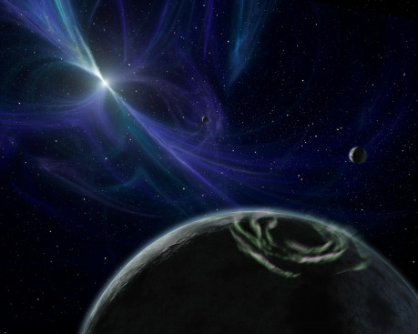

Píše se rok 1991 a probíhá rutinní údržba obřího radioteleskopu Arecibo. Během ní se nedá cíleně hýbat s anténou a vědci si nemohou vybrat, na jaký kus oblohy se zaměří. Polskému radioastronomovi Alexi Wolszczanovi to nevadilo. Rozhodl se využít to, co je, a studoval tehdy naměřená data. Společně s kolegou Davem Frailem v nich objevili cosi zvláštního, co stálo za bližší prozkoumání. Rok nato vydali vědecký článek s šokujícím titulem „A Planetary System Around the Millisecond Pulsar PSR1257“. Oznamovali v něm objev hned dvou extrasolárních planet kroužících kolem objektu, jaký stěží připomíná hvězdu, jak si ji většina z nás představí – pulsaru. Pulsary jsou rapidně rotující neutronové hvězdy vysílající silné rádiové pulsy – odsud jejich název a také jejich oblíbenost mezi radioastronomy. Jde o pozůstatky exploze supernovy, která po sobě zanechala objekt o poloměru kolem deseti kilometrů, ale o hmotnosti vyšší než Slunce. Jen si zkuste představit tolik hmoty napěchované do objemu koule menší než řada pozemských měst! Elektrony byly ze svých obvykle velikých vzdáleností od jádra vtěsnány do jader atomů, načež došlo k přeměně protonů na neutrony – proto neutronové hvězdy. Pro představu se často uvádí, že krabička od sirek plná hmoty z neutronové hvězdy by vážila zhruba tři miliardy tun.

Hvězda, na kterou se zaměřili Wolszczan s Frailem, nese katalogový název PSR B1257-12 a jde o milisekundový pulsar – rotuje neuvěřitelně rychle, v řádu milisekund. Za vteřinu se kolem své osy otočí více než sto šedesátkrát. Během krátkého času tak můžeme zachytit mnoho jejích rádiových pulsů. Tehdy v létě 1991 si ale oba vědci povšimli něčeho podivného. Pulsy k nám nepřicházely s takovou pravidelností, s jakou by měly. Co to znamenalo? Nejpravděpodobněji to, že jiný objekt gravitačně svázaný s pulsarem za něj „tahal“ svou hmotností a drobně vychyloval jeho pozici vůči Zemi, a tím i příchod rádiových pulsů. Z analýzy pulsů se ukázalo, že objekty jsou hned dva, oběh kolem pulsaru jim trvá 25, resp. 67 dní, a mají hmotnost terestrických planet – jedna je jen o málo hmotnější než náš Měsíc, druhá několikrát hmotnější než Země. Záhy byla objevena i třetí.

Mnoha lidem bylo zatěžko uvěřit, že by planety mohly existovat u tak extrémní hvězdy. Přežily snad explozi supernovy? Zformovaly se z pozůstatků materiálu vyvrženého při výbuchu? Vznikly z hmoty jiné hvězdy, kterou pulsar pozřel a díky tomu se tak rychle roztočil? Z nabaleného mezihvězdného média? Byly pulsarem jen zachyceny, zatímco vznikly někde úplně jinde? Možností existovalo mnoho, ale odpovědí pramálo; jen zlomek teorií šlo vyloučit na základě přibližné hmotnosti a dráhy planet, a nic víc než to se zjistit nedalo …

Pulsarové planety po objevu prvních planet u hvězd podobných Slunci upadly poněkud v zapomnění navzdory tomu, že postupně byly objeveny i dvě další stejně podivné soustavy, opět u milisekundových pulsarů. Letos na konci září byl dokonce ohlášen pravděpodobný objev čtvrté! Každá je ale diametrálně jiná. PSR B1257-12 má tři relativně blízké „terestrické“ planety. PSR B1257+12 je dvojhvězda – daleko kolem pulsaru a bílého trpaslíka tam obíhá planeta o hmotnosti plynného obra, která pravděpodobně vznikla právě kolem onoho bílého trpaslíka, zatímco byl ještě „klasickou“ hvězdou hlavní posloupnosti. PSR J1719-1438 má planetu také o poměrně vysoké hmotnosti, ale obíhající těsně u hvězdy. Aby se vyhnula roztrhání gravitačními silami, musí být velmi malá – a tedy velmi hustá. Zřejmě se jedná o pozůstatek jádra bílého trpaslíka, jehož vnější vrstvy na sebe pozřel pulsar! Nakonec PSR B0329+54 má patrně terestrickou planetu obíhající v podobné vzdálenosti jako Saturn od Slunce.

Známe tedy čtyři planetární soustavy pulsarů (a každá je úplně jiná!). Není to ale pořád málo mezi těmi tisíci známých exoplanet? To víte, že je. Ale nevíme proč. Pulsarů známe pár tisíc, milisekundových pulsarů něco přes 250. K většině máme dostatek dat, aby se dala spolehlivě vyloučit přítomnost blízkých či velmi hmotných planet. Mají snad planety opravdu jen čtyři z nich? Jak je to možné?

Jedním vysvětlením je, že planety v extrémním prostředí okolí pulsaru – který vysílá proud extrémně urychlených energetických částic a má také velmi silné magnetické pole – nepřežijí dlouho. Může je třeba indukční ohřev zahřát natolik, aby se během milionů či pouhých tisíců let vypařily? Vyloučit to zatím nemůžeme. Další možnost je, že mechanismus jejich zformování je prostě příliš vzácný. Jak často se stane, že materiál dopravený k pulsaru – ať už je jeho zdrojem supernova, blízká hvězda či mezihvězdný plyn a prach – vytvoří dostatečně dlouhotrvající a hmotný disk s dost velkým momentem hybnosti, aby tam opravdu vznikly planety? Jsou dokonce známy dva disky kolem pulsarů, takže přinejmenším nějaké disky tam existovat mohou. Jenže jak dlouho a za jakých podmínek?

Abychom mohli zjistit, jak planety vznikly a fungují, potřebovali bychom je pozorovat – ne zprostředkovaně pomocí časování rádiových pulsů, ale přímo. Kdybychom zachytili jimi odražené světlo, vydávané teplo nebo třeba polární záře (které by mohly být extrémně silné, _pokud_ planety mají atmosféru a silné vlastní nebo indukované magnetické pole), mohli bychom alespoň rámcově určit jejich složení. To by nám napovědělo, z jakého materiálu vznikly. Jenže všechny známé pulsarové planetární soustavy jsou více než dva tisíce světelných let daleko a je jich pouhá hrstka, což činí případné pozorování značně nevýhodným … Jsme tedy v situaci slepice nebo vejce. Co potřebujeme dřív? Najít více pulsarových soustav, aby bylo oprávněné věnovat drahocenný pozorovací čas něčemu s tak nejistým a nejspíše předem k neúspěchu odsouzeným výsledkem? Nebo strašně riskovat drahým pozorováním, abychom zjistili, _proč_ je pulsarových planet tak málo?

Zatím se žádná nová pozorovací kampaň nechystá a nejspíše potrvá velmi dlouho, než o planetách v soustavách pulsarů zjistíme cokoli bližšího. Ještě nejspíš velmi dlouho se v tomto případě budeme pohybovat v říši science fiction… Naštěstí se ale SF autoři pulsarům nevyhýbají. Právě naopak – Robert L. Forward ve svém _Dračím vejci_ představil fascinující život přímo na povrchu neutronové hvězdy, obří počítač z tohoto tělesa ve své sérii _Odhalený vesmír_ vyrobil pro změnu Alastair Reynolds. Dalo by se pokračovat dál a dál. Autoři rádi využívají pulsary – ale co jejich planety? Věnoval se jim v science fiction vůbec někdo? V novele „Galactic North“ se vyskytla pulsarová planeta právě u Reynoldse a podařilo se mi dohledat zmínky, že podobné výskyty se našly i u _Newton’s Wake_ od Kena MacLeoda a _Starfarers_ od slavného Poula Ander­sona. Jsou však podobně vzácné jako samotné pulsarové planety … Na rozdíl od nedostatku pozorování ale _tohle_ můžeme poměrně snadno změnit. Tak schválně – kdo se téhle výzvy chytí první? Pulsarové planety za to určitě stojí.

***

Pro zájemce zařazuji i odkaz na rozepsaný článek o možnostech pozorování pulsarových pla­net. V něm najdete i rozsáhlý seznam odborných zdrojů, kdybyste se chtěli do fascinujícího světa pulsarových planet ponořit hlouběji:

[www.julienovakova.com/pulsar_planet_spectroscopy_k-tisku](www.julienovakova.com/pulsar_planet_spectroscopy_k-tisku)
