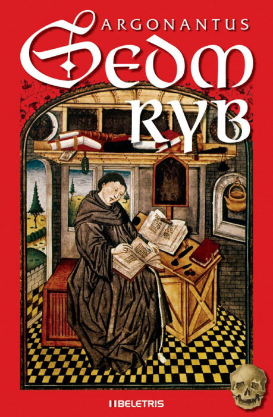
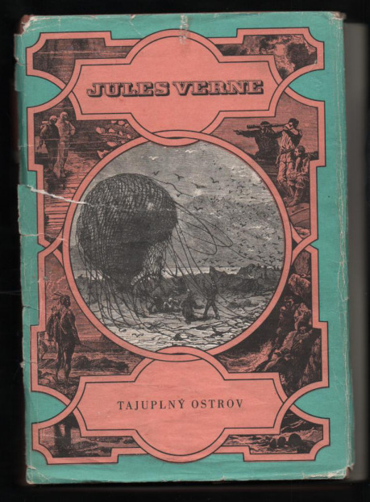
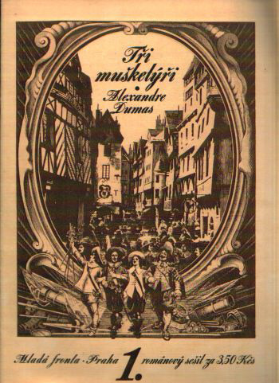
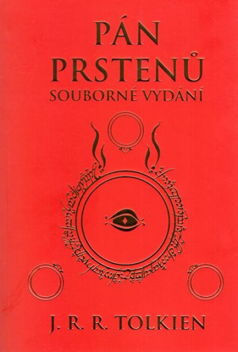
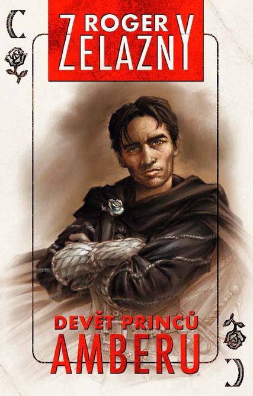
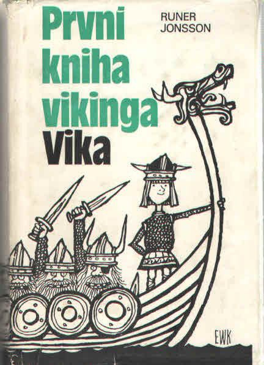

## I.

Problém první věty za mne vyřešil až počítač. Pochopil jsem, že prostě začnu něco psát, a první větu potom klidně škrtnu, pokud bude vypadat i nadále nesmyslně. Ray Bradbury by se mnou zřejmě souhlasil. Pokud si vzpomínáte na pojednání o [intuici](http://drakkar.sk/36/intuice.html), tvrdil, že:

> Co se my, spisovatelé, můžeme naučit od ještěrek a co můžeme opsat od ptáků? V rychlosti je pravda. Čím rychleji něco plácnete, čím rychleji píšete, tím jste poctivější. V zaváhání už je myšlenka. S odkládáním přichází snaha o styl, místo aby se skočilo po pravdě, což je jediný styl, který stojí za kladení pastí či léček na divoké šelmy.

Tedy – nějak to na ten papír naházejte lopatou, moc nad tím nedumejte, a teprve až toho budete mít víc, má smysl nad tím přemýšlet. Pokud jde o krátký text, třeba povídku, pak to není ke škodě takto vychrlit úplně celé. Vůbec nepřemý­šlejte o tom, která věta je první a jestli vypadá blbě – ono se to poddá.

Přiznám se, že to dodnes neumím lépe. A moje první věty jsou dodnes neurčitě nanicovaté. Třeba:

> Od okamžiku, kdy Zvěstovi z Netluk zahynuli v dětství oba rodiče, i jeho neméně slavný strýc, začala se mu smůla vyhýbat.

Nebo:

> Čtrnáctého října léta páně 1142 po narození našeho Pána Ježíše Krista procházela sestra Emilie kapitulní síní kláštera svatého Jiří na hradě Pražském.

V obou případech jsem prostě začal vyprávět, bez nějakých efektů okolo. A tak už to zůstalo. Zřejmě se nikdy nestanu mistrem prvních vět ja­ko tihle výtečníci, co si to vysloveně užívají:

> Bratr se zeptal svého vraha, jak zamýšlí pro­vést vraždu.

Nebo jiná, stylově podobná, leckdo asi znáte:

> Nemohu popřít, že jsem prohnal svému nej­lepšímu příteli hlavou šest kulek, ale přes­to doufám, že touto výpovědí dokážu, že nejsem vrah.

Předpokládám, že to nějak souvisí s jejich metodou psaní. Že tihle dva, totiž Johannes Mario Simmel a Howard Phillips Lovecraft, přemýšlejí o něco déle, než si sednou k papíru. Mají zřejmě nějaký plán, možná i synopsi děje; mají to vymy­šlené dřív, než to napíšou. Věta prozrazuje, že když ji psali, museli znát děj neméně k místu, kde se ty jejich první věty odehrají, což je v obou případech zatraceně daleko.

Možná ji dokonce dolepili na začátek dodatečně.

To jiný velmi slavný kolega na to šel po Bradburyovsku; vymýšlel to při psaní, a dokud nesedl ke stroji, prostě neměl tušení, jak to bude dál. Děj ho samotného překvapoval; objevoval, co se to vlastně dělo. Takže napsal první větu:

> V jisté noře bydlel jeden hobit.

A jeho vyprávění zpočátku řešilo, co to je vlastně hobit a proč bydlel v noře.

Nicméně, s lítostí musím uznat, že i když tento pán píše technicky podobně jako já, že dopředu neví, jak to bude dál, přesto jeho první věta má přesně ty kvality, které moje začátky všeobecně postrádají. Je v ní skrytá záhada, která nutí čtenáře číst dál, aby pochopil, co se vlastně děje. Je neobvyklá a zajímavá.

Nezbylo mi, než se smířit s tímto stavem věcí; neumím první věty a jaktěživ je umět nebudu. Naštěstí lze ale vytvořit ucházející expozici i bez skvělé první věty. Protože tu jde o složitější problém, než o jedinou větu.

## II.

Když se podíváme racionálně na to, c__o je úkolem__ __expozice__, zjistíme, že je toho zatraceně hodně. Kurt Vonnegut pravil obecně, že _každá věta má posunout děj nebo rozvinout postavu_. Já bych k tomu ještě dodal, že ještě může rozkreslit _náladu a prostředí_. Jinak je v příběhu vlastně k ničemu a neměla by tam být.

Věty na začátku příběhu mají úlohu ještě ztíženou.

Čtenář totiž na počátku neví vůbec nic.

Neví nic o ani jedné z postav.

Nezná situaci, která děj vyvolá.

Nemá tušení, kdy a kde se to děje; jestli jsme v New Yorku dnešních dnů, na palubě kosmické lodi, nebo ve Středozemi.

__Nemáme jinou možnost, než do něho tuh____le horu informací nějakým úsporným způsobem__ __nacpat.__

To je racionální jádro všech expozic. Ať vyprávíme cokoli a v jakémkoli žánru, hrajeme hru, píšeme román, točíme film, tomuto problému se nelze vyhnout, vězí v samotných [základech příběhové konstrukce](http://drakkar.sk/59/zakladni-rovnice-pribehu.html). Je to bod A našeho vyprávění, první pilíř mostu. Rybář musí napřed nahodit vlasec a lovec nabít pušku, jinak z lovu nic nebude.

Klasická literatura 19. století to prostě řešila přesně tak, jak bylo naznačeno třeba u [historické fikce](http://drakkar.sk/44/promeny-historicke-fikce.html). Tedy úvodním velmi podrobným popisem postavy, jejího vzhledu, jejího oblečení, pokoje, kde se nacházela, případně výhledu z okna a dálných vrcholků, na které zářilo slunce, a tak dále. Ale bez viny nebyla ani literatura považovaná za zábavnou a dnes bychom řekli jaksi béčkovou. Verne sice odpálí _Tajuplný ostrov_ přímo legendární vstupní pasáží:

> Klesáme?
>
> Stoupáme?
>
> Nikoli tak, nýbrž hůře! Řítíme se!

Nicméně ihned po té nás zavalí zdlouhavou informací o všech přeživších trosečnících, jak byli staří, co měli na sobě a co dělali, než se zřítili tím balonem. Zabere se tím dost místa a je to strašná otrava, protože k postavám zatím nemáme vztah a není důvod, aby nás zajímaly. A všechno vlastně úplně zbytečné; pro charakteristiku pana Gedeona Spilletta by docela stačila dvě slova „mladý novinář,“ pro pana Pencroffa „obyčejný námořník“ – víc pro další děj netřeba. A co dělali všichni před tím pádem balonu a jak se dostali na tichomořský ostrov, to nám je také úplně jedno. Jak uvidíme dále, v případě trosečníků na ostrově je situace pro expozici zvláště výhodná – je jen málo věcí z minulého života, které jsou pro postavu v této situaci podstatné.

Kardinální otázkou každé expozice tedy je, __co přesně potřebuje čtenář vědět právě teď__. Nemusíte čtenáři říci, co všechno vás napadlo o panu Spilettovi. Kdyby se to odehrávalo někde v ulicích New Yorku, možná by bylo podstatné, že Spillet je svalnatý opálený krasavec, který umí navíc tančit a každá žena s ním ráda ztratí víc času, než by bylo třeba. Na pustém ostrově mezi samými chlapy je to naprosto jedno. Tedy pokud to nechcete zatočit do gay romance.

Je vůbec dobré si uvědomit, kolik místa chceme expozici věnovat. Pokud byla v [Kompozici](http://drakkar.sk/35/co-je-kompozice-a-prace-s-casem.html) vysvětlena přirozená délka příběhu, pak je zřejmé, že délka expozice je úměrná této celkové délce a měla by zabírat zejména první část děje, kdy situaci otevíráme a představujeme postavy i kulisy. Střední část pak díky navozené a známé situaci postupuje vpřed už samostatně, finále situaci řeší a příběh se uzavírá. Můžeme nějakou část zvýraznit a věnovat ji víc místa – nejtypičtěji zřejmě střední část, která může být úplně obrovitá – nicméně ty tři části obvykle identifikujeme snadno. Pokud je vyprávění krátké - short story a méně - pak je to obvykle na úkor střední části, která může prakticky úplně zmizet. Minimální příběh má jen expozici a finále, jako anekdota.

Nejjednodušší metoda expozice je ten Bradbury – prostě začít něco vyprávět. Logika příběhu a vyjadřování vás sama automaticky navede k tomu, že začnete popisovat scénu, postavy a situaci, ať chcete, nebo ne. S tímto zjištěním by článek mohl skončit a byl by vlastně úplně zbytečný. Já to připomínám jen proto, že když utonete ve variantách, nápadech a rafinovanostech, pak je dobré se pokorně vrátit k úplně nejpřirozenějšímu a nejjednoduššímu vyprávění; uvědomit si, co musíte čtenáři prozradit, protože to neví a potřebuje to ke srozumitelnosti děje.

## III.

Na tomto místě je třeba připomenout radu, kterou jste už určitě někde slyšeli, ale patří sem; __předveď, nikoli popisuj__.

Klasikou jsou _Tři mušketýři_. Zde mohl Dumas postupovat stejně úmorně jako ten Verne a zdlouhavě nám vysvětlovat, že Athos je hloubavý melancholik, Aramis je elegantní donchuán a Porthos trochu směšný a marnivý fanfarón. Jenže on na to šel daleko elegantněji. Spěchající D’Artagnan na schodech postupně vrazí do každého z mušketýrů, každý z nich nějak zareaguje a jeho pravá podstata se tím bleskově odhalí, v pouhých pár větách. Představení je náramně rychlé, funkční a zábavné k tomu. Dokazuje, že údajně ukecaný Dumas uměl být až neuvěřitelně rychlý, když na to přišlo. Pro velkých úspěch je tato kultovní scéna skoro povinně i ve všech nesčíslných filmových zpracování, jakkoli se ty verze ve výsledku značně liší.

Jiný, daleko zdlouhavější a komplikovanější, ale přece stále funkční a zábavný je případ turnaje ve _Hře o trůny_, kde se nám takto představují prakticky všichni největší drsňáci z dalšího děje. Je zbytečno vysvětlovat, jak je kdo dobrý bojovník; tady to vidíme naprosto názorně. A ještě se dozvíme, že ser Lorras je naparáděný hejsek, ser Gregor Cleggane zlý cholerik, ser Bar­ristan Selmy už postarší pán, a tak dále. Další text k tomu už není třeba.

Přesně stejně můžete naložit s popisem krajiny nebo nálady. Je sice malebné obdivovat panorama Minas Tirith, ale daleko víc zábavy se užije, když se v té krajině odehraje kolosální bitva. Když to autor od počátku ví, popisuje úsporněji a zejména to, co je s ohledem na bitvu důležité. Plno věcí také může na začátku vynechat a doplnit až v rámci bitvy samotné.

Čím těsněji je expozice propojena s dějem, tím lépe. Ideální je, když čtenář ani nepostřehne, že mu vlastně něco vysvětlujete.

Lze přirozeně předpokládat, že na počátku děje toho postavy ví daleko víc, než čtenář. Stephen King si všiml, že ať začneme, kde chceme, vždycky to bude svého druhu in medias res, uprostřed nějakého již rozběhlého děje. Málokterého hrdinu sledujeme od narození. A to také není začátek; každý má nějaké rodiče, že. Stejně tak je rozumné předpokládat, že postava rozumí svojí profesi, kterou léta vykonává.

Není proto moc přirozené, když Harpagonovi příbuzní žasnou nad tím, že je opravdu lakomý; už si toho za ta léta mohli všimnout. Nebo když nějaký bojovník, třeba sir Galahad, vysvětluje siru Lancelotovi, jak se šermuje mečem a jak probíhá obřad pasování na rytíře. A když dva policisté v seriálu CSI říkají jeden druhému, jak se ohledává místo činu a jak funguje tento mikroskop.

Je to masová nectnost, začali s tím zřejmě kdysi dávno autoři v 19. století, ale i dnes si toho lze často všimnout; _to sakra musí ten druhý vědět, ne?_

Autor se tu zjevně pokouší nacpat informaci čtenářovi či divákovi jaksi přes hlavy postav a velmi neuměle to vložil do dialogu, ač to moc nedává smysl. Vyvolá to spolehlivě dojem, že jsou hrdinové lehce debilní. Pokud svoje postavy přistihnete při něčem podobném, přemýšlejte znovu.

Mimochodem, důvod Watsonovy trochu snížené inteligence byl přesně tento; byl rázem důvod mu kdeco vysvětlovat, a tím to podsunout čtenářovi. Kdyby byl Watson chytrý jako sám Holmes, jen by na sebe mohli lehce mrknout a chudák čtenář by se nic nedozvěděl.

Máte ale ještě mnohem lepší techniky, jak získat záminku k nějakému vysvětlování. Nejelegantnější je __zařídit, aby ani postavy na počátku děje plno věcí přirozeně nevěděly.__ Hobiti sice žijí ve Středozemi celé generace, nicméně zásadně neopouštějí svůj Kraj. Následkem toho mohou žasnout nad každou novou krajinou a novým neobvyklým národem. Stejně tak, pokud chceme, aby členové téže družiny žasli nad schopnostmi těch druhých, třebas hobiti nad Gandalfovými kouzly, je vhodné je navzájem seznámit až v ději.

Odhaluje se také, proč je užitečné, aby nové dobrodružství prožíval začátečník Frodo Pytlík, nikoli dokonale informovaný veterán Bilbo. Frodovi má cenu něco vysvětlovat; Bilbo už všechno dávno ví.

## IV.

S expozicí se ale dají dělat daleko větší kouzla. Někdy je dokonce většina efektu příběhu způsobena jen pořadím informací. V zásadě je to zdokonalená metoda klasické detektivky.

V povídce _Mrzák_ sám Sherlock Holmes najednou překvapivě řekne toto:

> Totéž se dá říct, milý příteli, o efektnosti některých těch vašich drobných črt, které jsou de facto lacině bombastické, neboť těží z toho, že si určité faktory problému ponecháváte sám pro sebe a čtenáři je nikdy nesdělíte.

Holmesův duchovní otec Conan Doyle si tady přesně uvědomoval, co dělá; _laciné bombastičnosti_ dosahoval tím, že některé věci prostě čtenářovi neřekl, zatajoval je. Pokud by v úvodu prozradil záhadu povídky, _kdo je vrah_, pak by se vyprávění úplně rozsypalo a nebylo na něm nic zajímavého. Tato __zadržovaná expozice__ dokáže tedy vytvořit zajímavý příběh prakticky z ničeho, z policejní zprávy, která vlastně moc zajímavá není – _včera zahynul na útěku před policií v Dartmoorském močálu jistý Dr. Stapleton, který vyvolal několika obětem šok tím, že na ně poštval velikého psa, natřeného fosforem._ Když tyto informace seřadíte úplně jiným způsobem a obalíte dalším materiálem, vznikne vám úplně nejslavnější Holmesovo dobrodružství, které vydá na román. A přesně tomuto jádru věci se expozice pečlivě vyhne – zbude jen záhadné líčení, jak starý Baskerville záhadně zemřel, zřejmě hrůzou, a kolem _byly stopy ohromného psa, pane Holmesi._

Umění utajování dotáhl místy k dokonalosti – a možná ad absurdum – jen o málo později H. P. Lovecraft.

_Výpověď Randolpha Cartera_ je krátká povídka, kterou se mistr po mnoha časných pokusech dokonale trefil, všechny jeho schopnosti zazářily v nečekaném lesku a podařilo se mu něco o třídu lepšího, než do té doby a dokonce i mnohokrát potom.

A při tom, řeklo by se, téměř není co exponovat. Je to ďábelsky jednoduché – dva maníci se rozhodli prozkoumat svět mrtvých na hřbitově. Máme dvě postavy, o kterých nepotřebujeme nutně vědět prakticky nic; prostě dva chlápci jménem Randolph Carter a Harley War­ren. Máme hřbitov. Co k němu dodat – každý ví, jak vypadá hřbitov. No, a situace – mlhavě se naznačuje, že mrtví zřejmě tak docela mrtví nejsou. Ale ani to nám nikdo neřekne celou dobu; vyplyne to až z děje. A nic dalšího se vlastně v celém příběhu nedozvíme.

Lovecraft z tohoto nápadu – pokud je to vůbec nápad – vyrobil pozoruhodný výtvor čistě expozicí. Ta zabírá hodně, skoro polovinu povídky; z osmi stran asi tři a půl, pokud vezmeme jako začátek střední části vyprávění místo, kde Warren poprvé promluví a leze do toho hrobu.

Vtip je v tom, že je to _výpověď_; hlavní hrdina je podezřelý z přítelovy smrti, jak záhy pochopíme, a moc si nepamatuje, co se dělo. Rozpomíná se. A taky se mu o tom mluvit moc nechce. Každou větu obrátíme několikrát, než nás konečně posune někam dál. Právě jako při detektivním vyšetřování. Samo získání informace je docela zajímavé dobrodružství; divák odhaluje základní expozici, jako by to bylo tajemství.

Výsledkem jsou neúplné až zamlžené popisy sotva naznačených obrazů. Celé to vypráví Randolph Carter v ich formě; nemáme možnost vidět jinak, než jeho očima. To je velmi podstatná část efektu; v druhé polovině příběhu je hrdina sám dokonce odkázán na přítelovy telefonické zprávy, takže to vidíme ještě z druhé ruky a komplikovaněji, než na začátku vyprávění. Lovecraftův přímo trademarkový manévr; do věci nahlížíme jen jakousi pomyslnou klíčovou dírkou, ze zpráv někoho jiného, z nalezeného dopisu, z letmého náznaku.

Celá povídka je vlastně vytvořena tím, co všechno je v obraze zakryto, nevyřčeno a utajeno. Co exponováno není. A funguje to skvěle. Ukazuje se, že i u takto jednoduché věci stojí zato zejména přemýšlet o pořadí informací, o tom, kdy a jak něco čtenáři prozradíme.

## V.

K trochu jinému způsobu expozice došel, paradoxně, autor _Pána prstenů_. I když z naprosto jiných důvodů.

Je to případ zvláště složitého děje, v úplně nově vynalezeném světě o velikosti kontinentu, o kterém čtenáři mnoho nevěděli – pokud třeba náhodou nečetli předchozího Hobita. I kdyby ho četli, stejně je tu plno nových krajin a celých národů, o kterých do té doby nebyla řeč. Postavy jsou rovněž všechny dost zvláštní a některé dokonce nejsou ani lidé. Situace je úměrně složitá, zahrnuje dlouhatánské historické rekapitulace; jak to bylo s Jedním prstenem, kdy vznikl, jak funguje a co se s ním všechno dělo po staletí od jeho vzniku.

Už bylo řečeno [jinde](http://drakkar.sk/36/intuice.html), že na výslednou expozici mělo nakonec vliv i to, že autor sám moc nevěděl, jak to bude pokračovat a co všechno se stane.

Takže výsledek je takový, že se vše rozbíhá velmi zvolna a důstojně. První kapitola dokonce pojednává o postavě, která v ději vůbec nevystupuje. Vonnegut by to mohl označit za jasnou chybu. Pokud jsem u některých svých věcí škrtal první větu, tady by šlo bez újmy škrtnout celou kapitolu, aniž by to mělo nějak moc vážné následky. Aby se autor vůbec dostal k jádru věci, musel klíčovou expoziční kapitolu _Stíny minulosti_ dodatečně vepsat do děje; jinak by byla kniha úplně nesnesitelná.

Nicméně, taková __postupná expozice__ tu vůbec není ke škodě a brání zavalení čtenáře přívalem informací, kterými by se dokonale zadusil. Postav je spousta, a je jenom rozumné, že plno z nich je představeno až cestou, až k nim hlavní hrdinové dorazí. Třeba Faramir nebo Eowyn jsou hodně důležité postavy, nicméně si všimněte, kde až dostanou nějaký prostor. To už jsme skoro v polovině románu.

Stejně postupně se odvíjí krajina, prostě tím, jak skrz ni hrdinové putují. Národy je třeba představit až v místě, kde k nim někdo dorazí. I členy Společenstva, což je rovnou devět postav, poznáváme postupně, jak se připojují ke skupině. Rozhodně je to lepší metoda, než úvodní lavina trpaslíků v předchozím Hobitovi, kde mám dodnes problém si je všechny zapamatovat.

V takovém monstrózním díle musíme expozici rozfázovat, ať chceme, nebo ne. A vyplatí se hodně přemýšlet nad tím, čím začneme, co potřebuje čtenář znát nejraději velmi brzy, a s čím můžeme klidně počkat.

A také asi odhalíme plno věcí, které nemusí čtenář znát vlastně vůbec. Postava, která nic neudělá, krajina, kam nikdo nedojde, historická událost, která nemá žádný následek. Tolkien dobře věděl, proč plno těchto věcí nechal v dodatcích, jakýchsi bonusových materiálech, jak by se řeklo dnes.

## VI.

Extrémním případem expozice je __tabula rasa__ neboli __rekonstrukční scéna__. Hrdina je v takovém případě na tom na začátku příběhu stejně jako čtenář – z nějakého důvodu neví o ději a světě vůbec nic a všechno postupně zjišťuje. Například – trpí amnézií po nějaké události. Probudí se z bezvědomí, jako hrdina _Tajemného Amberu_, případně _Jason Bourne_. Někdy ani neví, kdo vlastně je. Jak to zjišťuje, tak se nám tím vlastně zároveň představuje. Máme zajištěn přirozený a zvládnutelný příliv informací. Plno jinak nesmyslných otázek – _co jsem dělal včera? _– najednou začne dávat smysl.

Jiná oblíbená alternativa – hrdina do dějiště příběhu teprve _dorazil_. A jeho vlastní historie do té doby nestojí za řeč; byl student, drobný zloděj, něco, co každý zná a nestojí moc za složité popisování. Jako třeba propuštěný či uprchlý vězeň ve většině příběhů _Elder Scrolls_. Nebo jako _Harry Potter_, který o světě kouzelníků předtím nikdy neslyšel. Rekonstrukční scény mám ve veliké oblibě, už jsem je použil ve třech románech ze čtyř a najdete je v celé řadě mých povídek.

Potíž je jediná – dnes se může leckomu jevit tento manévr jako poněkud ohraný. Není proto špatné užít pár triků, abyste dělali dojem, že to _není_ klasická rekonstrukční scéna. Což dosáhneme třeba tak, že hrdina prožívá všední den, chodí normálně po ulici, aby pak následně zjistil, že to celé není pravda, je to nějak jinak. Pravdu o světě nám prozradí až rekonstrukční scéna, kterou děj kupodivu nezačal, ale vynoří se až v tomto bodě. _Matrix_, třeba. Na něm je úplně nejzdařilejší a nejsilnější část příběhu expozice, umístěná jinde, než bychom čekali.

Jiný trik je trochu hnout časem – vyprávět příběh od jiného místa, než od počátku. I to nám umožní použít rekonstrukční scénu dál v ději, kde nepůsobí tak ohraně.

## VI.

__Expozice ujížděním reality.__

Tuto metodu proslavil zejména Alfred Hitchcock.

Postavy mají svoje vlastní starosti, prožívají běžný nám známý život, když tu se plíživě a postupně do děje vetře něco naprosto cizího a překvapivého. Třeba _Ptáci_. Přiletí jeden pták, pak jich vidíme stále víc, pak se o nich začne mluvit … a postupně vytlačí původní realistický příběh někam úplně mimo scénu. V sedmdesátých letech byla tato metoda málem povinná – zjistíme, že tak fungují prakticky všechna katastrofická vyprávění nebo i detektivky. Než mrakodrap začne hořet, vyslechneme hromadu společenského tlachání a vypijeme litry kafe nebo šampaňského. Ještě dnes je to k vidění třeba u _Iron mana_. Tony Stark je na začátku nudný milionář a není na něm moc zajímavého; je spíš nesympatický. Iron manem se postupně stane, vypracuje se na něj; donutí ho k tomu situace.

Zdá se tedy, že autor v takovém modelu příběhu může jen tak neurčitě tlachat o čemkoli. Ve skutečnosti to tak snadné není. I do toho tlachání v úvodu lze propašovat hodně důležité informace. A vyplatí se i přemýšlet, jak přesně dávkovat ty vrány, kolik jich pustit na scénu a jak daleko od sebe v ději mají být. Protože o to jde. Děj zaručeně nebude o balení svačin dětem do školy (velmi oblíbené), případně o romantickém soužití dvou milenců. Je dost pravděpodobné, že hrdina vidí manželku nebo děti nadlouho naposledy a setká se s nimi až na konci, jako třeba ve _Válce světů_. A možná mu nebude dopřáno ani to, pokud jde o model _zrada & pomsta_ a hrdina se jmenuje nějak jako Edmond Dantes nebo Eric Draven. Pokud je na počátku nějaká idylka, pak je tam jen proto, že ji vzápětí autor rozmlátí kladivem na nepatrné střepy.

## VII.

Opačný extrém, který jde vstříc dnešnímu netrpělivému čtenáři, vede k velmi atraktivní scénce hned na počátku, i když třeba ještě neznáme vůbec žádné souvislosti. __Expozice skokem.__

Je to při tom prastarý vynález. Takto na to jde odjakživa Bond, James Bond. Napřed někdo někoho zastřelí, něco exploduje, někdo někoho honí. Je celkem jedno kdo, koho a proč – a často to ani nesouvisí s dějem – ale teprve po tomto trajleru začne normální vyprávění.

Dnes už umí být autoři daleko obratnější a po úvodním šoku nemusíte žádné výrazné zpomalení zaznamenat a děj se nezastaví vůbec. Všechno vám prozradí autor tak nějak cestou a v letu. Světový rekord je zřejmě první scéna _Hellraisera_, kde na deseti stranách stihne autor vybudovat situaci, představit hlavní postavu, úplně ji zničit a ještě zcela rozvrátit pravidla fyziky a známého světa.

Podobný skvost je začátek prvního _Indiana Jonese_, kde je až neuvěřitelné, co všechno se stane v pouhých několika minutách. A ještě se dozvíme, kdo je Jones, čím se zabývá, jaký je styl vyprávění.

Nebo, do třetice, Jacksonův úvod filmu _Dvě věže_. Vlastně to není expozice v pravém slova smyslu; jde o jakési vrácení diváka do světa Středozemě, který opustil přibližně před rokem, kdy se odehrála premiéra první části, _Společenstva prstenu_. A jde jen o zopakování nejdůležitější scény, lehce dovyprávěné o pár okamžiků dál. Tedy nic doopravdy nového. Ale funguje to senzačně; dvě minuty po tomto otevíráku seděli diváci tiše jako pěny a fascinovaně sledovali příběh, jako by z něho na rok neodešli.

Pokud vás takový úvodní trajler napadne, pak rozhodně neváhejte. Jak objevil už praotec Poe, úplně na začátku je třeba získat čtenářovu pozornost, který si sedl na židli, otevřel vaší knihu a má v hlavě setrvačností ještě něco úplně jiného. Taková vstupní exploze se velmi hodí.

## VIII.

Expozice ujížděním reality může být také poněkud lstivá, někdy až přímo podlá, protože dává vlastně čtenáři záměrně falešnou informaci. O tom, čím se začalo, tak o tom … to vůbec nebude. __Falešný začátek__ čili __spin off__.

Spin off bývá označení pro příběhy s ved­lejší postavou či dějovou linií, které tak nějak vyhřeznou do strany z něčeho předchozího. _Princezna Xena_ byla původně vedlejší postavou _Herkula_, nicméně se osamostatnila a časem originál úplně zastínila.

Kupodivu, mnoho slavných věcí umí být svým vlastním spin offem. _Predátor_, třeba. Začne jako špionská střílečka v džungli, ale najednou se to zvrtne v něco úplně jiného, v souboj s mimozemšťanem. Expozice nám představí řadu postav, nicméně nám neprozradí, že většina z nich poměrně brzy zemře a nejsou moc důležité. Stejně tak děj vlastně není moc důležitý, protože brzy to bude o něčem úplně jiném.

Tuhle metodu jsem si rovněž zamiloval a mnohokrát mi přirozeně naskočí. Můj titulní hrdina Argonantus se do celé řady příběhů prolámal tak nějak bokem, jako vedlejší postava, o které tak do poloviny děje vůbec nebyla řeč.

Výhody tohoto postupu vězí především v nečitelnosti vyprávění. Jedním z nepříjemných efektů nekonečných iterací žánrového psaní je, že v plno případech stačí expozice, dokonce už jen počátek expozice, a čtenář okamžitě ví, jak to bude dál.

Zkuste si děj domyslet po trojslovné expozici: _Vstoupí Hercule Poirot._

Víme skoro vše. Dojde k vraždě, Poirot to vyřeší, a proběhne to při závěrečné scéně, kde všechny sezve do jedné místnosti. Vpustit Poirota na scénu o něco později proto není úplně ke škodě.

Jiná výhoda expozice spin offem je _přirozená gradace_. Perfektně to popsala jedna postava ve _Vikingovi Vikovi_ – _vezmi nějakého hrdinu, popiš, jaký je to úžasný chlapík, a na konci nenápadně poznamenej, že já jsem ještě lepší než on._

Přesně tohle se stalo v tom _Predátorovi_. Dozvíme se, že parta vojáků jsou drsňáci, jakým rovno není, a s početnou bandou pašeráků drog zatočí snadno, jako kdyby to byly děti ve školce. Ovšem nový nepřítel je úplně jiný kalibr; vlastně se ho delší dobu nedaří ani spatřit. Poměr sil se dokonale obrací. Ukazuje se, že to nebude o tom, jak Arnold Schwarzenegger všechny zmlátí na hromadu, ale celé to bude ještě malinko komplikovanější. Což je příjemné zjištění.

V [Howardových strašidlech](http://drakkar.sk/50/howardova-strasidla.html) bylo ostatně naznačeno, že tímto způsobem funguje odedávna drtivá většina Conanovek; napřed je na scéně obyčejný realistický protivník, pak následuje daleko drsnější nadpřirozený, který dá Conanovi mnohem víc zabrat.

## IX.

Pravděpodobně by šlo popisovat další mazané metody expozic, ale prostor Drakkaru je omezený a zbývá čas na jedinou kardinální otázku – __jak se to všechno dá použít při hraních RPG?__

Odpověď bude v mém psacím seriálu naprosto netypická.

__Použít se to dá úplně všechno a prakticky beze změn.__

Pokud jsem mnohokrát tvrdil, že mezi literárním epickým příběhem a RPG hrou jsou vážné a velmi jedovaté rozdíly – vědou nepříliš prozkoumané – pak se nevztahují na expozici, ale hlavně na závěry a na střední část vyprávění, tělo příběhu čili peripetie. Začátek může být lautr stejný, pak se to teprve rozeběhne jinak a jinam.

Dokonce bych řekl, že Mistr vypravěč, GM neboli Pán jeskyně by měl být především mistrem expozic. Nadhazuje situace, věší Čechovovy pušky po stěnách. Klade otázky, i když třeba nemusí znát všechny odpovědi. Řekne, že Gandalf zmizel, i když v tu chvíli třeba ještě nemá tušení, kde je a co se s ním stalo. A na rozdíl od literárního vypravěče Tolkiena dokonce ani není povinen to zjistit, než předá rozdělanou situaci hráčům. Protože __hra je příběh, který se teprve odehraje a průběžně vzniká samotným hraním.__ Je tedy nehotový z podstaty věci,

A pokud se náhodou vyprávění zasekne, uvízne na mělčině, neb najednou nevíme, co dál, pak Mistr vypravěč odpálí nějaký bang, čili vlastně exponuje situaci další.

Vlastně vám tedy stačí jen umět různé triky, jak příběhy rozebíhat. Nic dalšího už netřeba.
