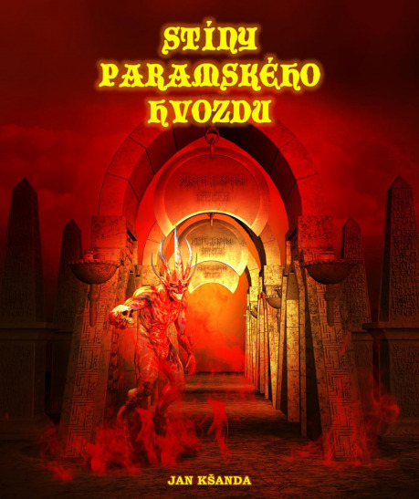
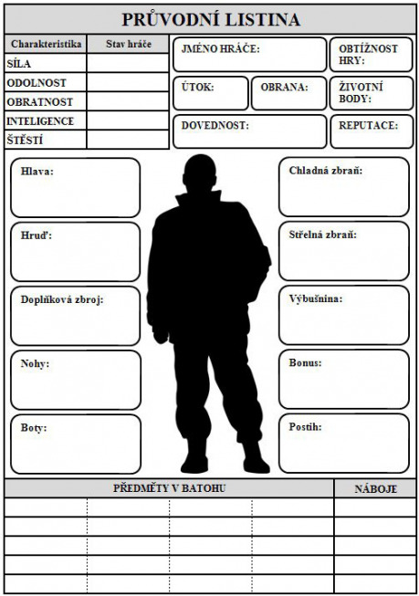

## Stíny paramského hvozdu

Ani takové mytické území, jakým je paramský hvozd, se nevyhne pokroku. Lidské nástroje se nemilosrdně zakusují do kmenů letitých stromů a les trpí. Ty, královský vyšetřovatel, musíš vypátrat, co stojí za přerušenými dodávkami cenného dřeva do hlavního města. Avšak rutinní pátrání po zmizelé skupině dřevorubců se brzy změní v boj s prastarým zlem. A v sázce není nic menšího než záchrana světa.

## Zrada ve Faranoru

Právě ses vrátil domů z úspěšné výpravy, ale namísto vděku se dočkáš obvinění z vraždy korunního prince. Tví nepřátelé chystají svržení současného krále. K tomu potřebují pomoc několika vlivných lidí hlavního města, proto jim rozešlou spiklenecké dopisy s žádostí o podporu. Jen nalezení těchto dopisů tě může zachránit před katovou oprátkou. V tvých stopách jdou nejen najatí zabijáci, ale nakonec se staneš trnem v oku i samotného hadího boha Setha.

## Nářek mrtvého světa

Přepadení nelítostnými nájezdníky a pátrání po unesené sestře tě nedobrovolně zavede do Pustiny – drsného světa, o kterém jsi doposud jen slýchával od potulných poutníků v pohodlí rodinného ranče. Zde teprve poznáváš, co se vlastně stalo se Severní Amerikou po dávné nukleární válce. A že dřívější hodnoty jako lidskost, slitování a čest jsou už jen prázdná, mrtvá slova. Stejně mrtvá jako svět kolem tebe, jehož nářek ti zní v uších.

## Ukázka z novinky Nářek mrtvého světa:

## Odkaz č. 341

Vzpomeneš si na svatou knihu, kterou jsi obdržel v Aftonu od jisté ženy jako vděk za opravu rozbitého vodovodního čerpadla.

„Tady je,“ řekneš triumfálně a vytáhneš Bibli z batohu.

„V pořádku, bratře, můžeš vstoupit. Vidím, že máš výtisk Písma, který nepochází z Jacksonu. Jsem rád, že slova našeho Pána doléhají k uším věřících i v jiných částech Pustiny,“ řekne kněz a stopy prvotního rozladění v jeho tváři nahradí vlídný výraz.

Vnitřek kostela působí prostým dojmem, hlavní ulička je potažena sešlapaným modrým kobercem, po jejích stranách stojí dřevěné lavice pro věřící posluchačstvo. Usadíš se na volné místo vedle početné rodiny. Postarší žena ti věnuje zkoumavý pohled, poté na tebe přátelsky pokývne. Oltář, který zároveň slouží i jako řečnický pult, je osazen stojánkem s mikrofonem. Ze zákristie vyjde několik kněží, ty pevnou a sebevědomou chůzí následuje vysoký statný černoch, sám reverend Abraham King. Přelétne pichlavýma očima své stádo oveček. Následně přistoupí k mikrofonu, poklepe na něj prstem, aby se ujistil, zda je spojení funkční a spustí připravenou řeč. Z reproduktorů zavěšených na stěnách se ozve silný hlas.

„Synové a dcery, děti Boží. Rád vás vidím v tak hojném počtu, je to balzám pro mou duši. A právě o duši, její čistotě a spáse chci dneska hovořit. Vím, že moje slova dnes neuslyšíte poprvé. _Repetita iuvat._ Opakování prospívá. Satan žije uvnitř našeho krásného města, jistě víte, o kom mluvím. Ano, Nathaniel Hawthorne a jeho nohsledi otravují jedovatými slovy a nemravnými činy naše zbožné duše a mysl. Dávají drogy našim dětem, ponoukají k hazardu, páchají nechutné smilstvo a plivou na zástupce církve v ulicích. Ale věřte, moji drazí, že Pán vidí tyto páchané hanebnosti a jistě zakročí každým okamžikem. Jeho hněv dopadne na hlavy všech bezbožníků, semele jejich prohnilé maso, kosti rozmetá na prach. Jen čisté duše budou ušetřeny a po smrti poputují k Pánu, do království nebeského. _Beatus vir qui timet Dominum._ Blaze člověku, který se bojí Hospodina. Takže vás vyzývám, moji drazí synové a dcery, žijte čistým, mravným životem. Modlete se každý den k Pánu, dodržujte Jeho desatero přikázání. _A fonte puro pura defluit aqua._ Z čistého pramene plyne čistá voda. A já vám slibuji, že brzy celým naším městem poteče pouze čistá voda. Amen.“ Reverend King dokončil svoji působivou řeč. Lidé sedí bez hnutí v lavicích, nervózně žmoulají hřbety Biblí, nikdo téměř ani nedýchá.

„_Plaudite! Plaudite!_ Tleskejte! Tleskejte!“ vybízí věřící okolostojící kněží. Brzy celý sál propukne v bouřlivý aplaus.

Musíš si přiznat, že kázání reverenda Kinga zapůsobilo i na tebe. Když se zvedneš z lavice a pomalu odcházíš, povšimneš si, že reverendův pronikavý pohled ulpěl na tvé maličkosti. Není to zrovna příjemný pocit, ale nedáš na sobě znát rozrušení a postupně s ostatními lidmi opustíš vnitřní prostor kostela.

Pokračuj na __268__.
