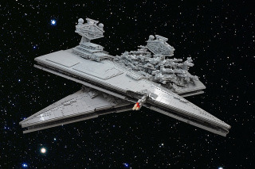

Nedávno jsme začali hrát play-by-post kampaň ve světě Hvězdných válek, kde piloti X-Wingů bojují proti císařským stíhačkám TIE a která využívá pravidla naší hry Hrstka (pravidla si můžete stáhnout za [tímto odkazem](https://www.dropbox.com/s/4isdaiq9o3am8k3/hrstka_2_1.pdf?dl=0)). Ta původně pokrývá hraní pilotů druhé světové války, museli jsme tak trochu upravit pravidla, aby seděla novému prostředí. Protože nás nová úprava baví, napadlo nás, že pokud byste stejné hraní vyzkoušet také, dáme dohromady naše úpravy a dáme vám je k dispozici. Na prvním místě je potřeba říci, že si v žádném případě nenárokujeme jakákoli práva na použití reálií a názvů, ty patří jejich vlastníkům. Jde o amatérský a nadšenecký projekt, který nemá nic společného s oficiálními produkty Hvězdných válek a byl zamýšlen jen pro vlastní pobavení.

## Změny pravidel hry Hrstka:

- Akce „Získání výšky“ se nyní jmenuje „Získání výhody“.
- Pravidlo „Fotografie dívky“ je nahrazeno za pravidlo „Použij Sílu“ (viz rámeček).
- Pravidlo „Zavěšení za protivníka“ je rozšířeno (viz rámeček).
- Aliance (za kterou létají piloti hráčů) má mnohem volnější strukturu hodností než RAF. Při hraní mají všichni piloti hodnost poručíka, velitelé rojů jsou kapitáni a velitelé letky jsou komandéři. V důsledku toho nejsou zlepšení postav navázané na hodnosti (protože ty se moc nemění), ale jen na sestřely nepřátelských strojů.
- Díky tomu, že na rozdíl od druhé světové války mají piloti větší šanci na přežití (a více postav bude přežívat mise), je doporučeno zlepšovat pilotům vlastnosti nikoli jednou za 2 sestřely, ale jednou za 3 sestřely.
- Při útoku na velké cíle (bitevní lodě a velké kosmické stanice) mají piloti k dispozici (kromě přímého náletu a kličkování) také nový způsob náletu:

### Použij Sílu

Síla je energetické pole, které spojuje všechny živoucí bytosti v galaxii a propojuje ji celou dohromady. Někteří jedinci dokážou toto pole nevědomky využít k dočasnému zlepšení vlastních schopností a umožnění věcí, které by jinak byly zdánlivě nemožné.

Sílu lze použít jen jednou za misi a je třeba je ohlásit před hodem. Umožní pilotovi na následující hod házet 4 kostkami a vybrat tři lepší hody (nebo odstranit jeden nejhorší), aby výsledkem byla opět trojice kostek. Pokud se používá Dluh na hod, při kterém hráč použil Sílu, přehodí pouze tři kostky (výsledek hodu). Čtvrtá kostka z předchozího hodu už v dalším nefiguruje.

Sílu lze po použití obnovit vítězstvím v hodu, který v nějakém smyslu obnovuje pilotovu víru v život, přidává mu naději a důvěru v sebe sama.

## Astromechanický droid (astromech, astrodroid)

Většina rebelských stíhaček (viz níže) měla na palubě astrodroida. Je to typs droida, který sloužil jako automatický mechanik, který vykonával řadu údržbových a opravárenských úkolů a pro menší lodě sloužil jako náhrada navigačního počítače. Astromechové monitorovali výkon letounu, vyhledávali a odstraňovali technické problémy a přesměrovávali zdroje energie do potřebných subsystémů, čímž optimalizovali výkon lodě. Droid mohl v paměti udržet až deset hyperprostorových vektorových koordinátů a mnozí měli dostatek inteligence a zkušeností, aby prováděli předletovou přípravu a pojíždění na dráze. Mnohé rebelské stíhačky na astomechanické kopiloty spoléhaly.

Většina atromechů dokázala komunikovat pouze skrze psaný výstup, přeložený skrze jiný počítač, nebo skrze kód sestávající z klikání, pípání a podobných zvuků. Některé lodě měly automatické astomechanické překladače, aby ulehčily komunikaci.

Astromechanického kopilota ovládá hráč pilota, který vybírá, co bude dělat. Astromech má v paměti uložený určitý počet akcí, které může každé kolo na pilotův příkaz provádět (záleží na typu droida – série R5 udrží v paměti tři činnosti, zatímco R2 celkem čtyři). Tyto akce lze mezi misemi měnit a tím se připravit na následující nasazení. Akce, ze kterých si může hráč před letem vybrat, jsou následující:

### Zavěšení za protivníka – rozšíření

Pokud je pilot zavěšen za nepřátelským letounem a jiný nepřátelský stroj se za něj pokouší zavěsit, pak má na výběr, jak zareaguje – může se rozhodnout zachovat své vlastní zavěšení a v tom případě se protivník za něj zavěsí bez hodu; případně se může rozhodnout zrušit své vlastní zavěšení a v tom případě může reagovat na pokus o zavěšení a hází se jako obvykle.

- přesměrování energie do zbraní (přidává bonus +2 ke Střelbě),
- přesměrování energie do deflektorových štítů (protivník, který na stíhačku střílí, má postih −2 na zásah),
- přesměrování energie do motorů (přidává bonus +2 na Pilotáž),
- znovu nahodit vyřazené štíty (tato akce trvá dvě kola – tzn. astromech musí dvě kola vykonávat tuto akci bez přerušení, štíty jsou pak obnoveny),
- propočítávat hyperprostorový skok (lze pouze ve vesmíru; v zásadě vykonává za pilota akci Únik – za tuto akci dostane loď únikový žeton, a zatímco astromech se soustředí na propočítávání, může pilot s lodí manévrovat a provádět akce i s únikovými žetony; v případě, že je loď během propočítávání skoku zasažena (vyřazeny štíty, poškozena), přijde o jeden únikový žeton, které v současné chvíli má).

### Příkopový nálet

_Piloti útočící na velké lodě se pokoušeli letět co nejblíže jejich povrchu („nalepit se na ně“), aby se vyhnuli nepřátelské palbě. Stíhačky a stíhací bombardéry tak mohly doručit svůj smrtelný náklad torpéd a bomb na kritická místa, zatímco byly chráněny proti většině obranných zbraní, za předpokladu, že měly dostatečnou ochranu před nepřátelskými stíhači. Piloti X-wingů a Y-wingů byli především úspěšní proti Star Destroyerům třídy Imperial a dalším bitevním lodím, jejichž výzbroj byla určena proti dalším velkým lodím a proti tak malým a hbitým cílům jako byly jejich stroje, byly jen málo účinné._

_Útok prováděla typicky trojice strojů v trojúhelníkové formaci, kdy oba zadní stroje chránily vedoucí letoun svými štíty. Stroj na špici pak většinou nesl ničivé zbraně, které mohl vážně poškodit cíl._

- Vyžaduje tým tří lodí a trvá 2 kola jako ostatní nálety. Všechny lodě využívají blízkost povrchu lodě a příkopy na jeho trupu k tomu, aby se vyhnuly palbě (protiletadlové zbraně odstávají postih ‒2 k hodu).
- Pouze vedoucí stroj provádí útok (získává +4 k ho­du; tedy +2 za každý ze strojů, které jej chrání).
- Oba zadní stroje kryjí vedoucí stroj vlastními štíty a trupy. Nepřátelské stíhače střílející na stroje ve formaci mají +4 k hodu (tedy +2 za každý letounů, které kryjí vedoucí stroj). Každý zásah jde nejprve do obou chránících strojů. Teprve když jsou zničeny, mohou nepřátelé zasáhnout i vedoucí stroj.

#### Poznámka:

Protiletadlové zbraně na velkých lodích většinou střílí se základní vlastností 4 (tedy 4 + hod) díky množství hlavní, které pálí po útočnících a jejich překrývajících se polích palby.

### Série R5

Představuje levnou verzi astromechanických droidů vyráběných společností Industrial Automaton. Je založena na úspěchu dřívějších astromechanických droidů, především populární řady R2, ale je ořezaná o některé jeho funkce s cílem co nejvíce snížit cenu droida. Kvůli sníženým nákladům byli droidi této série zamořeni řadou designových chyb – z nichž nejvýraznějším bylo mrzuté chování a drzý přístup, který byl výsledkem nedostatečné osobnostní matrice.

Mezi rebelskými piloty nebyli příliš oblíbeni, protože jejich vysoký profil z nich činil na hřbetě X-Wingu snadnější cíl pro nepřátelské lasery, ale Alliance potřebovala zoufale jakékoli funkční droidy a jejich nízká cena byla výhodou.

Udrží v paměti __tři příkazy __(mezi misemi lze měnit, které bude mít nahrané v paměti).

### Série R2

Kombinace elegantního designu, výrazného marketingu a dobrého načasování z ní učinila jednu z nejúspěšnějších sérii astromechů vůbec. Na rozdíl od svých předchůdců, jako série R1, byli droidi R2 navrženi specificky do slotů vojenských stíhaček a byli jim přizpůsobeni. Byli velice populární již mezi piloty staré Republiky a později mezi rebely, přičemž někteří droidi byli v provozu ještě několika desetiletí od své výroby.

Udrží v paměti __čtyři příkazy __(mezi misemi lze měnit, které bude mít nahrané v paměti).

## Letouny rebelské Aliance

### T-65 X-Wing starfighter (X-Wing)

Stíhačky firmy Incom, známé převážně jen jako X-Wing (pro svá charakteristická křížová křídla), byly víceúčelovými bitevními stroji, které ve velkých počtech využívali Rebelové během Galaktické občanské války. Díky deflektorovým štítům, hyperpohonu na palubě lodi, astromechovi (jež se staral o opravy a navigaci) a protonovým torpédům mohli Rebelové s pomocí těchto stíhaček podnikat úspěšné nájezdy ve stylu udeř-a-zmiz na základny, konvoje a lodě Impéria.

- Kromě __pilota__ je běžně osazen také __astromechanickým droidem__ (viz sekce Astromechanický droid); pilot může letět i bez něj, ale stroj pak nebude schopen skoků hyperprostorem (které může propočítat jen astromech).
- Letoun má 2 body poškození trupu a 1 bod poškození štítů (poškození jde přednostně do štítů, teprve když jsou vyřazeny, utrpí poškození – další zásahy jdou do trupu lodě; astromech dokáže štíty znovu nahodit během bitvy).
- Má laserové kanony s neomezenou municí (způsobují 1 poškození při zásahu) a dvojici odpalovačů protonových torpéd (které je možné použít při zavěšení nebo náletu a způsobují dvě poškození); letoun nese 3 torpéda na každý odpalovač (3 výstřely).

## RZ-1 A-Wing interceptor (A-Wing)

Byl to rychlý a obratný malý stroj, tvarovaný do podoby šípu. Navrhla jej společnost Kuat Systems Engineering, která se inspirovala u starších republikových stíhaček. A-Wing vsadil všechno na ohromnou rychlost na úkor brnění a těžších zbraní. Na rozdíl od konkurenčního TIE Interceptoru, další podobně ovladatelné stíhačky, měl ale štíty a hyperpohon, takže mohl operovat nezávisle na větších lodích.

- Řídí jej __pilot__, není možné jej osadit astromechem, ale má hyperskokový motor.
- A-Wing má deflektorové štíty, ale jen 1 bod poškození trupu (po přímém zásahu do trupu je zničen).
- Je to jedna z nejrychlejších stíhaček v celé Galaxii; pilot má bonus +3 na Pilotáž.
- Má dvojici laserových kanonů s neomezenou municí (způsobují 1 poškození při zásahu) a dvojici odpalovačů raket (které je možné použít při zavěšení nebo náletu a způsobují dvě poškození); letoun nese 6 raket na každý odpalovač (6 výstřelů)

## BTL-S3 Y-Wing (Y-Wing)

Byl to stíhací bombardér vytvořený firmou Koen­sayr Manufacturing a navržený tak, aby si dokázal probojovat cestu k cíli, doručil tam svůj smrtící náklad výbušnin a opět se dostal pryč. Byl to odolný stroj s dobrými štíty, ale ve srovnání s ostatními letouny Aliance byl pomalý a nemotorný. Nevýhody byly částečně kompenzovány množstvím protonových torpéd, které dokázal unést. BTl-S3 byla nejčastější konfigurace stroje, se kterou se bylo možné setkat. V jejím rámci pilot vedl letoun a druhý člen posádky byl střelec, který ovládal otočný iontový kanon, který se nacházel nad kokpitem.

- Má dvoučlennou posádku (__pilot__ a __střelec__) a je osazen také __astromechanickým droidem__ (viz sekce Astromechanický droid); stroj může letět i bez droida, ale stroj pak nebude schopen skoků hyperprostorem (které může propočítat jen astromech) nebo bez střelce (pak je nemožné používat iontový kanon).
- Letoun má 2 body poškození trupu a 1 bod poškození štítů (poškození jde přednostně do štítů, teprve když jsou vyřazeny, utrpí poškození – další zásahy jdou do trupu lodě; astromech dokáže štíty znovu nahodit během bitvy).
- Je pomalejší a hůře manévrovatelný; pilot má postih −2 na Pilotáž – má dva přední laserové kanony s neomezenou municí (způsobují 1 poškození při zásahu; −1 na Střelbu při palbě s nimi).
- Má iontový kanon (který ovládá střelec, hází svou Střelbou na zásah a nepřidává jinak další bonusy), který může pálit na kterýkoli stroj, který cílí na Y-wing vlastní akci (pokud zasáhne nepřátelskou stíhačku, pak jí vyřadí štíty a má šanci 50 % na znehybnění cíle; pokud zasáhne cíl bez štítů, pak jej automaticky znehybní).
- Má dvojici odpalovačů protonových torpéd (které je možné použít při zavěšení nebo náletu a způsobují dvě poškození); letoun nese 5 torpéd na každý odpalovač (5 výstřelů) a 20 protonových bomb (využitelných jen proti velkým lodím nebo statickým cílům).

## Letouny Galaktického impéria

### TIE/LN starfighter (TIE Fighter)

Byl to standardní stíhač Impéria, používaný v ohromných počtech během celé Galaktické občanské války. Mnohými byl považován za symbol ozbrojené moci císaře. Byly navrženy tak, aby útočily ve velkých počtech a prostou přesilou převálcovaly nepřátelský letoun. Stroje byly levné na výrobu a byly považovány za nahraditelné. V rámci snahy co nejvíce snížit náklady byly ořezané o vše, co nebylo přímo potřeba k tomuto druhu boje – neměly deflektorové štíty (mohly tak spoléhat pouze na svou manévrovatelnost jako obranu), chyběly jim systémy podpory života (piloti tak museli být celou dobu letu ve skafandrech), neměly hypermotory (pro přesun mezi systémy tak byly zcela závislé na větších lodích, které by je přepravily) a v rámci úspor jim chybělo i přistávací vybavení (musely přistávat na speciálních přistávacích systémech na palubách lodí nebo pozemních základen). Kromě počtů vynikaly stíhačky TIE i velkou manévrovatelností.

- Řídí jej __pilot__, není možné jej osadit astromechem a nemá hyperskokový motor.
- Stroj je velmi křehký, nemá štíty a má jen 1 bod poškození trupu (po zásahu je zničen).
- Je velice obratný, pilot má bonus +2 k hodu na Pilotáž.
- Má laserové kanony s neomezenou municí (způsobují 1 poškození při zásahu).

### TIE/IN Interceptor (TIE Interceptor)

Nový design solárních panelů dal Interceptoru její nezaměnitelný vzhled ostnu, přičemž poskytovaly pilotům lepší výhled a zmenšení profilu, který mohli nepřátelé zaměřovat. Byla to nejrychlejší stíhačka v císařském arzenálu a byla velice obávaná mezi nepřáteli.

- Řídí jej __pilot__, není možné jej osadit astromechem a nemá hyperskokový motor.
- Stroj je velice křehký a ve standardní konfiguraci nemá štíty a jen 1 bod poškození trupu (po zásahu je zničen).
- Je to jedna z nejrychlejších stíhaček v celé Galaxii; pilot má bonus +3 na Pilotáž – má čtyři laserové kanony s neomezenou municí na špicích křídel (způsobují 1 poškození při zásahu) a má také nový zaměřovací software, díky kterému zaměřovací počítač dokáže nabídnout lepší přesnost i při složitých manévrech; bonus +1 na Střelbu.

### TIE/sa Bomber (TIE Bomber)

Bombardéry TIE byly hlavními útočnými bombardéry Impéria. Byly větší a méně obratné, než stíhačky TIE, ale stejně jako ony postrádaly štíty. Byly určené k přesnému bombardování pozemních cílů a ničení větších vesmírných lodí. Měly velice přesné zaměřovací počítače a dokázaly unést smrtící výzbroj raket nebo bomb, které dokázaly zničit prakticky každý cíl. Impérium je využívalo k bombardování povstaleckých planet a vesmírných lodí, kde dokázaly tyto bombardéry udělovat devastující údery s až děsivou přesností.

- Řídí jej __pilot__, není možné jej osadit astromechem a nemá hyperskokový motor.
- Stroj je masivněji stavěný než stíhačky TIE, ale nemá štíty – má 2 body poškození trupu.
- Je díky navýšení pancéřování pomalejší a velice neobratný, pilot má postih −4 na Pilotáž.
- Má dvojici pevných laserových kanonů s neomezenou municí (způsobují 1 poškození při zásahu).
- Veze na palubě rakety nebo těžké bomby z následujícího výběru – 16 otřesových raket, 12 protonových torpéd, 6 vesmírných min, 4 protonové bomby nebo tisíce propagandistických letáků.

## Velké lodě (poškození)

Alianční stíhačky mají většinou možnosti jak napadnout i větší lodě (nejčastěji doprovodné lodě jako korvety a fregaty, občas i velké křižníky a bitevní lodě). V případě, že jsou štíty takové lodě vyřazeny a útočící letoun zasáhne loď přímým zásahem, pak se hodí hodem dvojicí šestistěnných kostek, aby se zjistilo, jak moc je zasažená loď poškozena:

> __1–2 / Loď je otřesena!__ (Zásah v blízkosti lodi. Ta není vážněji poškozena, ale její posádka je otřesena, musí restartovat některé systémy a po krátkou dobu není schopna palby, než se opět vrátí do boje.)
>
> __3–7 / Loď je poškozena!__ (Loď byla poškozena a její funkčnost byla nějak omezena: Některé zbraňové systémy byly zničeny, maximální rychlost je omezena, některé senzory byly zničeny a tím pádem je omezeno její zaměřování zbraní; nicméně je stále schopná bojovat.)
>
> __8–9 / Loď je znehybněna!__ (Motory byly zničeny, a přestože loď je jinak schopna palby a pokračuje v boji, nemůže se pohnout ani skočit ze systému pryč.)
>
> __10–11 / Loď zničena!__ (Loď byla zničena, byl vydán rozkaz opustit ji, a zatímco část posádky byla zabita, zbytek se snaží doběhnout k únikovým modulům a dostat se pryč.)
>
> __12 / Loď rozmetána!__ (Energetické jádro lodi se přetížilo a exploze ji rozmetala na kusy. Z posádky nikdo nepřežil.)

Pomocí těchto kategorií a změn rozsahů výsledků na kostce (v případě velkých bitevních lodí bude mnohem větší pravděpodobnost, že v případě zásahu bude loď jen otřesena a nikoli poškozena nebo zničena) je možné simulovat útoky na většinu větších lodí v rámci systému.

## Závěr

S těmito pravidly by mělo být možné pokrýt většinu situací galaktické občanské války. Je samozřejmě možné na tohle jádro přidávat další stroje, další pravidla a další možnosti. V současnosti chceme použít ty samá pravidla a piloty i pro souboje na zemi s blastery v rukách, zkoušeli jsme to v jiných prostředích a fungovalo to velice dobře, pokud se osvědčí tady, možná najdete zpřesněná pravidla v některém z dalších Drakkarů. Doufáme, že se vám tahle fanouškovská úprava pravidel bude líbit a dejte nám vědět, kdybyste se rozhodli ji vyzkoušet!

Nechť vás Síla provází!
