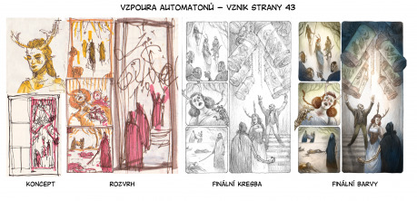

## Úvod

Projekt Příběhů Impéria nedávno oslavil 8 let od vydání první knihy. Od té doby jsme pro ně připravili řadu rozšiřujících příruček a doplňkových projektů. V průměru je to vlastně jeden produkt ročně. Loni na Vánoce vyšla krabicová, startovací verze Příběhů Impéria. Letos pak vyšel komiksový příběh ze světa Příběhů Impéria. Pokaždé když dokončíme a vydáme nějaký RPG produkt, snažím se vždy sepsat vzpomínky a zkušenosti z vývoje do _„post mortem“_ článku. Jednak proto, abychom si sami utřídili myšlenky a shrnuli to, co fungovalo, co ne a co musíme pro příště vylepšit … hlavně pak ale proto, abychom se právě o tyto informace podělili, v bláhové naději, že právě tyto informace budou dalším tvůrcům k něčemu užitečné.

Takže tentokrát čtete další z této série. Oproti předchozím se tento _post mortem_ netýká tvorby žádného RPG či herního produktu, ale tvorby komiksové knížky. Přestože je s RPG světem velmi provázána, jedná se o něco jiného a svým zaměřením se článek bude obvyklému zájmu Drakkaru poněkud vymykat. Přesto si dovolím zde text publikovat. Myslím si, že i přes poněkud jiné zaměření může být pro tvůrce mezi čtenáři zajímavý.

Tak jako tak, vítejte u příběhu zrodu _Vzpoury automatonů_.

## Začátky projektu

Příběhy Impéria byly vždy o vyprávění a k vyprávění skrze obrázky s bublinami měly vždy velmi blízko. Když jsem před více než 14 lety nakreslil do svého skicáku skřeta Neda Lock­wooda (což je pro mě úplný začátek), tak to byl vlastně komiksový charakter. A dokonce jsem ten komiks i nakreslil. Dílo to bylo rozsahem možná podobné dnešní Vzpouře automatonů s mnohem volnější strukturou. I když to bylo dílo v mnoha ohledech dost nedospělé, na jeho základech jsme postavili hlavní příručku Příběhů Impéria.

A podobně je se _Vzpourou Automatonů_ provázaná krabicová verze PI, která vyšla loni. Na rozdíl od základní knihy jsme již nerecyklovali ilustrace (ty jsou pro krabici všechny původní), ale oba produkty spolu sdílí stejný příběh a mnoho hlavních postav. Ostatně o krabicové verzi vyšel článek loni.

Tím se dostáváme k tomu, jak začala vznikat _Vzpoura automatonů_. Historie tohoto komiksu je dlouhá a spletitá. Cesta od konceptu k tištěné verzi trvala asi 4 a půl roku. Několikrát jsme práce upozadili, když jsme dokončovali jiné projekty. Největší pauza v tvorbě komiksu byla na dokončování krabicové verze. Tento projekt je s komiksem vůbec úzce provázán, a když jsem kvůli psaní tohoto článku procházel své staré bloky, abych zrekonstruoval časovou osu, tyto dva projekty jsem měl často problém rozlišit. Každopádně k tomuto jsem se dopracoval:

První skici k novému komiksu vznikly v létě 2013. Tehdy jsem si na dovolené v alpském Garmish-Partenkirchenu naskicoval do bloku koncepty prvních pěti postav. Prvních pár stránek popisující jejich dobrodružství vzniklo v tužce velmi záhy. Zbytek podzimu jsem pomalu dokresloval další (mimo jiné i na chorvatské pláži, která byla ve velkém kontrastu s atmosférou vznikajících stránek). O vánoční pauze 2013 jsem většinu těch pár stránek okoloroval ve Phostoshopu. Zárodek, kolem kterého se celý komiks nabalil, tedy vznikl. Tehdy jsem ještě nevěděl, že se k těm pár stránkám ještě několikrát vrátím a stránky takřka kompletně přemaluji. Celá kapitola se co do rozsahu navíc asi ztrojnásobila. Ve vydaném komiksu jsou tyto stránky jako druhá kapitola pojmenovaná „Podzemí“.

Práce pokračovaly na jaře 2014. Další kapitola, která vznikla, je „Férie“. Paralelně s dokončováním Férie vzniklo prvních pár stránek „Nad Londýnem“. V tomto bodě se příběh zadrhl a my se zasekli.

Pak se půl roku na komiksu nic nedělo. Intenzivně jsem pracoval na ilustracích pro jinou _příběhovou_ knížku, která nikdy nevznikla. S komiksem jsme pak zůstali viset až do září 2014. Tehdy jsme to, opět na chorvatské pláži, zkusili z jiné strany. Vymysleli jsme novou postavu lovkyně nestvůr Liz, která se v budoucnosti se zbytkem komiksu protne. Vznikla „Šrucha“, která se stala prologem k celé _Vzpouře_. Tohle byl také první kus komiksu, který jsme dokončili se vším všudy a ke kterému jsme napsali texty a vysázeli jsme je.

Jiný úhel pohledu nám pomohl vymyslet, co s hlavním příběhem dál. Ale i tak se pak se až do léta 2015 nic na komiksu nedělo. Intenzivně jsme pracovali na krabici. V létě, v rakouském Zillertalu, pak došlo na tři stránky „Čepele“, než jsme komiks od té chvíle na rok odložili.

Bylo na čase vydat krabici.

V září 2016, po tom, co jsme se vzpamatovali z vydání krabice, se práce na komiksu opět obnovily s velkou intenzitou. Prostě jsme si řekli, že je čas to dotáhnout. Už jsme měli většinu dílů skládačky a věděli jsme, jak pasují dohromady. Tak jsme se vrhli od práce. V rychlém sledu za sebou jsem dokončil rozpracovanou „Čepel“ a dokreslil jsem druhou polovinu „Nad Londýnem“. Jednotlivé střípky začaly pomalu zapadat do sebe. Z hromady roztříštěných dílků, u kterých nebyla jasná představa, jak dopadnou, už byl jednoznačně jasný tvar. Bylo na čase začít dokončovat. Před koncem roku tak konečně vznikla poslední kapitola „Zúčtování“. Nejvíc času jsem strávil na poslední dvoustránce.

Na přelomu roku 2016/17 a na jaře jsme se zabývali zaplňováním prázdných míst a přemalováváním nejstarších stránek. Komiks se rozrostl o spoustu stránek všude tam, kde rytmus příběhu drhnul. Jako poslední uzavřený celek, který chyběl, jsem nakreslil „Dílnu“.

Do léta jsme pak měli napsané a zalámané texty. V létě jsme oslovili nakladatele, v září byla namalována obálka. Na podzim jsme animovali trailer a na Vánoce roku 2017 kniha konečně vyšla.

## Kreslení stránek

Normální komiks obvykle vzniká tak, že se nejdřív sepíše scénář, který obsahuje popisy jednotlivých stránek, panelů a hlavně texty všech boxů a bublin. Teprve potom získá příběh svou grafickou podobu, když je rozkreslen na jednotlivé stránky. Bubliny a boxy se kreslí rovnou do stránek, nebo je již ze scénáře jasné, kolik textu je potřeba. Celkově je tvorba komiksu obvykle velmi o plánování a organizaci.

Asi začínáte tušit, že u nás moc organizace nevládla. _Vzpoura automatonů_ vznikala mnohem živelněji. Texty vznikly až na pár drobných výjimek prakticky až ve chvíli, kdy byly všechny stránky nakresleny. Dopředu byla známá jen jakási hrubá premisa. A dopředu jsem se vždy zabýval jen kapitolkami, na kterých jsem zrovna pracoval. Rozdělení celého díla na kousky, které člověk dokázal udržet v hlavě a byl schopen ukončit v rozumném čase, docela fungovalo. Asi jenom díky tomuto přístupu jsme se kdy dopracovali k nějakému výsledku.

Opravdu plánovat v rámci celého příběhu a všech stránek jsme začali až někdy od půlky knížky, kdy jsme měli dost kusů na hromadě a získali jsme jistotu, že jsme schopni to dotáhnout do konce. Tehdy nabraly práce velké obrátky. Za asi rok vzniklo tolik stránek, co za tři roky před tím.

### Vznik stránky

Přiložená série obrázků zachycuje vznik stránky. Zde jsou popsány jednotlivé fáze práce na stránce:

_Koncept a hrubý rozvrh_ – Každá stránka vznikala čmáráním do skicáku. Primitivní kresbičky s rozvržením stránek a hrubými symboly toho co se na jednotlivých panelech děje. Kromě skic stránek jsem měl obvykle hrubé rozvrhy kapitolek.

_Přípravná skica_ – Jakmile jsem si ujasnil, co se na jednotlivých stránkách děje, byla na řadě detailní skica, která obsahovala víceméně vyřešené kompozice k jednotlivým panelům. Někdy jsem je dělal i ve verzi 1 : 1, jindy jen v asi poloviční velikosti vůči originálu. Někdy jsem je neudělal kompletní a pak ještě při kreslení finální stránky dělal hodně změn.

V téhle a předchozí fázi jsem si i na okraje stránky psal poznámky o textech k bublinám, které se pak staly podkladem k psaní textů. Ale nijak moc jsem to nepřeháněl a u mnoha stránek chyběly poznámky úplně.

_Výsledná kresba tužkou_ – Klíčová část práce. Kreslení stránek v tužce spolu s Photosho­pem (následující krok) zabralo nejvíc času. Stránky jsem kreslil v A4ce, což je asi o 20 % větší formát, než jak je komiks ve finále vytištěn. Tohle o něco zjednodušuje kreslení; o něco zmenšený výsledek vypadá detailněji.

_Malba a barvy ve Phosotshopu_ – Po naskenování už nastoupilo přemalování a kolorování ve Photoshopu. Na mnoha místech jsem jen stínoval, doplňoval hrany a nechal původní kresbu a její texturu vystupovat. Jinde jsem přemalovával hodně.

_Sazba a bubliny_ – Všechno letterování a slepování komiksu jsem dělal v InDesignu. Bubliny a rámečky jsem nekreslil dopředu (protože jsem neměl zdání, jaký text a kde budu potřebovat), tak to až do konce byla trochu alchymie.

Typicky trvala tvorba takto popsaná jedné stránky asi něco přes čtrnáct dnů – týden podklad tužkou, druhý týden pak malovaní a kolorování ve Photoshopu. Ale tohle je minimální údaj. S většinou jsem si hrál mnohem víc. K jiným jsem se musel několikrát vracet a přemalovávat je. U posledních stránek se mi to podařilo drasticky zkomprimovat. Ale o tom ještě později.

## Psaní textů a korektury

Jakmile byla větší část komiksu nakreslena, nastala chvíle udělat, co jsme dlouho odkládali – reálně napsat texty. Celkem jsme se, na rozdíl od kreslení stránek, rozhodli postupovat systematicky. Každé stránce a každému panelu jsem přiřadil číselný kód, takže jsme mohli paralelně, ve Wordovém dokumentu založit dlouhou tabulku s kódy a mohli jsme začít sepisovat texty.

Vlastností komiksu je to, že obsahuje relativně málo textu, v krátkých a jen několikavětých odstavcích. To má hlavně ten efekt, že kostra textu se dá naťukat velmi rychle, ale zároveň musí být věty celkem efektní a zároveň efektivní. Což vlastně znamená, že s jednou větou si člověk může hrát do nekonečna, než je spokojený.

Jak jsme se finálního psaní textů báli a odkládali ho, tak ve finále to nakonec klaplo bez větších problémů a u drtivé většiny narace text přirozeně sedl a nemuseli jsme překreslovat či přesouvat panely. V jednom případě jsme tuším přehodili dvě celé stránky. Ale tam bylo spíš na pováženou, co jsme si sakra mysleli, když jsme je chtěli obráceně.

Přenášení textů z Wordu do konkrétních bublin na stránce si pak také vyžádalo nějaké přepisování – zkracování či prodlužování, aby se nám to vešlo do bublin a panelů. Ale i tohle si nakonec sedlo vážně hezky a toho přepisování bylo docela málo.

Takže se nakonec ukázalo, že dělat komiks obráceně a začít obrázky před texty nebyl tak strašný nápad.

Korektury také probíhaly dost živelně a v několika různých vlnách. I s Jiřím „Skavenem“ Reiterem se na textu vystřídali tři jazykoví redaktoři (ještě Tereza „Raven“ Tomášková a Jakub „Boubaque“ Maruš) a všem patří velké díky. Všichni měli nevděčnou práci komentování pouze do PDFka a chyby a opravy jsem musel pak zanášet ručně sám. Taky jsme pak komiks několikrát předělali na základě zpětné vazby.

Co jsem zjistil, u komiksu existuje i něco jako obsahové korektury ilustrací, takže nám pokusné osoby psaly, kde všude si postavy nejsou podobné, kde se v příběhu praváci mění v leváky a kde se v průběhu příběhu postavám mění účesy. A tak jsme kromě přepisování i přemalovávali. Těmto věcem se asi těžko vyhýbá. Správně by si autor měl nakreslit desítky přípravných skic, aby se postavy naučil kreslit a pak kreslil na první dobrou. Ale i ostřílení kreslíři se přiznají, že jim postava „sedne“ pod rukama až někde v polovině komiksu. Já jsem to měl asi podobně. I když jsem naskicoval postavy dopředu, stejně se během tvorby vyvíjely (k lepšímu) a já se musel pořád vracet a dolaďovat. Ale spousty věcí jsme si sami prostě sami nevšimli a potřebovali jsme někoho, kdo to prošel a na tyhle věci nás upozornil.

## Oslovení vydavatele

Když bylo všechno na hromadě, uvědomili jsme si, že už bychom s tím měli něco udělat. Tak jsme celkem nesměle napsali Jiřímu Reiterovi (ten je v komunitě známější pod svou přezdívkou Skaven, tak ji i já v textu budu dále používat) z Mytaga, našeho kmenového nakladatelství, který vydal všechny ostatní _příběhové_ příručky, jestli by náhodou neměl zájem. K našemu překvapení se mu to líbilo a hned začal organizovat, jak to vydáme. Což se nám dost zjednodušilo, ulehčili jsme si hledání jiného vydavatele a za ta léta se Skavenem známe a práce nám jde celkem od ruky.

Ve chvíli kdy jsme si se Skavenem takříkajíc plácli (digitálně a po mailu), bylo potřeba dát se zase intenzivně do práce a hlavně vyřešit dvě věci, které komiksu doteď chyběly. A to byla obálka komiksu a jméno titulu. Každý, kdo na něčem pracoval, ví, že pojmenovávání titulu je až magická, klíčová záležitost. Během většiny projektů se vykrystalizoval název tak nějak sám od sebe. Prostě jsme projektu začali nějak pracovně říkat a ten název se pak nějak ujal. Možná trochu doladil, ale tak nějak se našel sám. Pro _Vzpouru automatonů_ nápad ne a ne přijít. Většinu času jsme tomu prostě říkali „Komiks“. A na nic lepšího jsme prostě nepřišli. Takže když jsme dostali nůž na krk, tak jsme sepsali asi deset různých jmen na hromadu a z nich společně se Skavenem vybrali to, které se nám líbilo nejvíce. A i když jsme z něho ze začátku nebyli úplně nadšení, nakonec nám přirostl k srdci. _Vzpoura automatonů_ úplně přesně nesedí s dějem komiksu (samotní automatoni se nebouří), ale zase dobře vystihuje atmosféru. A trochu evokuje prastarý český komiks _Vzpoura andoidů_, který jsem hltal jako dítě. Takže to je taky bonus.

Obálka také vznikala docela dlouho, motiv a koncept jsme zvažovali dost poctivě. Z asi desíti thumbnailů které jsem vymyslel a rozkreslil i do propracovanějších kreseb, jsme nakonec vycizelovali dva koncepty, ze kterých jsme neuměli vybrat. Statická, ale atmosférická maska automatona (která byla realizována) a poněkud akčnější verze, na které je Coelwulf v akční póze obklopen svými automatony. Nakonec jsem skočil tak, že jsem vlastně namaloval oba a rozeslal jsem je lidem k posouzení. Všichni se téměř jednoznačně shodli na dynamickém Coel­wulfovi. A já jsem i navzdory všem nakonec zvolil automatona. Přišlo mi, že je to mnohem charakterističtější vizuál a i přestože je ta ilustrace málo dynamická, má silnou atmosféru. Nevím, jak moc je to rozhodnutí šťastné, to se ještě ukáže. Nakonec jsme vybírali citem. Ostatně můžete to posoudit sami – ta druhá varianta obálky se do komiksu také dostala, je to poslední obrázek v galerii na konci sešitu. Zde i velké díky Skavenovi, že nakonec ten náš názor přijal.

Když jsme u té komunikaci s vydavatelem, tak i když do projektu vstoupil v relativně pozdní fázi, i tak jsme si spolu jen kvůli komiksu vyměnili kolem 80 mailů. A vždycky to byly dost podnětné maily. Nakonec se diskuze se Skavenem na výsledku dost promítly a dle mého pohledu jedině k lepšímu. Ostatně se k tomu ještě dostaneme.

## Animovaná upoutávka

K téměř každému produktu, který dokončíme, se snažím dělat animovanou upoutávku. Pokud mě paměť nešálí, tak kromě internetových rozšíření jsem nedělal trailer pouze ke karetní hře. I když většina z nich má jen něco kolem dvou minut, je jejich příprava docela náročná. Je to spíš další projekt sám o sobě. Nemáme změřeno, jaký má trailer dopad na prodejnost, ale je celkem sranda je tvořit. Navíc se zatím daří každý další trailer udělat lepší než ten předchozí, takže dokud se máme čemu učit, má pro nás smysl je dělat dál.

Na rozdíl od komiksu samotného jsem se rozhodl k traileru přistupovat vědecky a organizovaně od začátku. Takže v létě jsem vybral, které scény z komiksu budu animovat a naskicoval Storyboard, abych věděl co je potřeba udělat. Tím se práce na traileru dost zrychlila a zjednodušila; věděl jsem co je potřeba připravit. Asi tři týdny jsem strávil přípravou všech grafik a podkladů ve Photoshopu. Trochu potíž nastala se softwarem. Zatím každý trailer jsem dělal v jiném programu, podle toho, k čemu jsem měl (nebo neměl) zrovna licenci. Nakonec jsem se rozhodl, že chci animovat v Adobe Effects, což je asi nejlepší řešení, se kterým jsem kdy pracoval (naposledy jsem v něm ale dělal trailer k Rukověti mága). Problém byl ale s licencí, nakonec jsem se rozhodl, že to zkusím ve dvoutýdenní trial verzi. To si vyžádalo další vlnu detailního plánování, abych si zvládl nachystat všechny možné věci dopředu a později se už nezdržoval. Nakonec se to vyplatilo a samotné slepení a rozanimování (a učení se softwaru) se nakonec opravdu vešlo do těch plánovaných 14 dní.

Jakmile jsem měl hotový trailer, přeposlal jsem ho uživateli eerieebaatezu, který k němu udělal hudbu. Spolupráce s ním proběhla velmi příjemně a absolutně bez problémů. Na tomhle místě mu patří velký dík. Tvorba traileru trvala celkem asi dva měsíce; spolu s tvorbou hudby tři měsíce.

## Deadline a hektický finish

Přiblížil se podzim 2017 a už jsme postupně dokončovali poslední věci, které se musely dodělat. Poslední drobné korektury, grafické práce, tiráže, obsahy, texty na zadní stránku a podobně. Prostě ta spousta drobných úkolů, které se musí nachystat před tím, než to jde do tisku. Takové ty věci, které když člověk dělá do šuplíku nebo pro internet, nemusí vůbec řešit, a které žerou hrozně času. Když jsme vyprodukovali Release Candidate verzi, tak jsme začali řešit už jen úplné mouchy, byli jsme spokojení a Skaven už domluvil termín v tiskárně.

Jen mezitím nám jen tak mimochodem přeposlal jeden z posudků a komentářů, který stihl paralelně na komiks posbírat od svých testovacích subjektů. Autor komentáře nebyl nijak nadšený, zejména si stěžoval, že mu místy nesedí časování. Skaven to přeposílal kvůli nějakému detailu v grafice, který se dal celkem jednoduše opravit a ten zbytek tam byl jen pro informaci. Bohužel jsem ten e-mail dostal někde za Brnem v rychlíku do Regensburgu. Takže jsem měl bohužel dost času nad tím přemýšlet. A po prvním nasrání jsem musel uznat, že na tom něco je. A identifikoval jsem pár míst, kde jsme s tím přepracováváním nebyli dost důslední. V klíčové kapitole Podzemí, což byla kapitola, kterou jsme dělali jako první, ještě pořád něco drhnulo.

A jakmile mě něco kolem projektu napadne, už to z hlavy nedostanu. Takže jsem s tím ještě pár dní bastlil a naskicoval jsem další čtyři stránky, o které by to potřebovalo rozšířit. V tu chvíli jsme měli do deadlinu asi týden. S tou rychlostí, jakou jsem to doteď dělal, by to byla utopie stihnout. Když jsem psal Skavenovi, asi za čtyři dny jsem nasmažil tužky nových stránek, abych mu poslal přepracovaný prototyp. Hodně jsem najel na vlnu, že ty stránky ten komiks potřebuje, i když bylo dost utopické, že se to stihne. Doteď jsem neudělal stránku rychleji než za týden. A to v tom nebyly texty, co se musely napsat, zasázet a zkorigovat. Nakonec jsem Skavena přesvědčil a termín v tiskárně se podařilo posunout asi o tři týdny. Napnuli jsme síly a nakonec jsme to do tisku dostali bez velkého stresu. Hlavně proto, že si tam ty nové stránky hodně sedly a dělaly se skoro samy. Ze zpětného pohledu jsem dost rád, že jsme se na to nevykašlali a dotáhli to. Výsledku to podle mě hodně pomohlo.

## Závěr

Poučení z tohoto projektu? Kromě spousty věcí, které jsme se naučili kolem dělání komiksu, z toho vychází potvrzení toho, co jsme už věděli. Dobré plánování a příprava je základ. Kromě toho, že to strašně zjednodušuje a zrychluje práci, pozitivně se to promítne i na výsledku – „trefit“ kompozici i rychlost (zoom) vyprávění je pak snazší. Člověk se nemusí příliš vracet a přepracovávat to, co už jednou dělal.

Na druhou stranu. U projektů, které nejsou zrovna filmem či počítačovou hrou, kde se musí koordinovat práce velkých teamů, je možná lepši vrhnout se do věci po hlavě. Ukrojit si malý kousek a ten dokončit. Pak zase zkusit nějaký jiný, protože se pro něj člověk zrovna nadchne. Prostě postupovat po kousíčkách, které jsou zrovna zábavné a nenechat se odrazovat a odstrašovat seznamem nerealizovaných stránek a to-do listem plným nehotových položek. Dělat, na co je zrovna chuť a nálada. Alespoň vzniká nějaký obsah. Na konci pak lze jednotlivé dílky poslepovat. Nevýhodou je, že ve finále to asi sežere víc práce a člověk musí být připraven přemalovávat a přepracovávat a v krajním případě i škrtat. Ten druhý přístup je určitě vidět i na výsledné _Vzpouře automatonů_, ale ta epizodičnost a určitá fragmentovitost, či kolážovitost není pouze nějakým vedlejším produktem tvůrčího procesu, jako spíš vědomý a nejupřímnější výsledek, jakého jsme byli schopni.

Takže zde končí příběh tvorby _Vzpoury automatonů_. Snad to pro někoho bude zajímavé a něco si z našich zkušeností odnese. Ať již tomu tak je, či není, děkuji vám za pozornost. Pokud k článku máte jakékoliv dotazy, neváhejte je položit. Nejlépe na RPGfóru ve vláknu o tomto čísle Drakkaru, nebo přímo ve vláknu o Příbězích Impéria.
