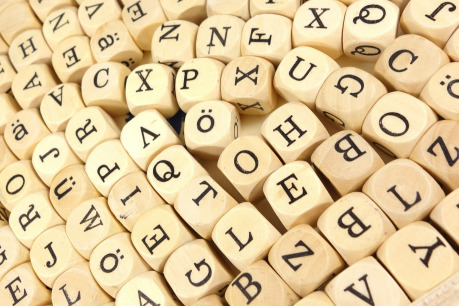

### 11) Aukce

V domě probíhá aukce. Není striktně ilegální, ale rozhodně neohlášená. Hosté, pořadatelé i pár obrněných stráží nejsou z vašeho příchodu nadšeni. Zachovejte se ovšem slušně a možná vás nechají na poslední položky přisednout; stříbrné vrhací nože, portrét ztracené princezny, mapa básníkova pokladu a prsten svůdnosti.

### 12) Bonsaje

V domě žije mladý zahradník se svou milou, která je němá, ale naučila se od tajemného cestovatele šeptat stromům. Rostou, jak jim poradí. Mají zahradu, skleník a zavlažování v celém domě. Všechen nábytek jsou živě rostlé stromy a vyrábí i předměty na zakázku. On nic netuší, ale ona si myslí, že lze šeptat k čemukoli, co roste.

### 13) Cizinka

Muž ve skromné domácnosti hledá ženu, dívá se pod stůl, do skříně, na půdu. Vzal si domů divošku, kterou našli schovanou v zaoceánské lodi. Navzdory jazykové bariéře se s ní snažil spřátelit a svést ji. Tvrdí, že utekla a musí být v ulicích zoufale ztracená. Ve skutečnosti běžela zachránit své zotročené sestry, prodané jinde po městě.

### 14) Čarodějka

Nespokojená manželka v sobě odhalila magický talent. Po návštěvě knihovny se dala do vlastního magického výzkumu. Muži nechala z útrob vyrůst houbovou kolonii, na schodišti rozpustila tisíc svící, psa nechala vykrvácet do květin, všechno pokryla moukou a studovala červí cestičky, nakonec při jednom z experimentů přišla o páteř, vyrvala se jí a odešla. Dvě kouzla z mezer mezi dimenzemi vylákala, jsou uzamčené v pergamenech na jídelním stole.

### 15) Galerie

Uzavřená komunita obdivovatelů sochařského umění v residenci pořádá výstavu. Nečekají externí návštěvníky, ale rádi vás zasvětí do vysokého umění, i když možná s trochou posměšného humoru. Nejdetailnější trojice soch vypadá až příliš dokonale, čaroděj by dokázal odhalit, že jsou to skuteční magicky zkamenělí lidé.

### 16) Gnómové

Každé patro je rozdělené na dvě a bydlí tu několik „malých“ rodin. Na první pohled to vypadá jako spletité gnómské ghetto, ale ve skutečnosti je to sídlo zámečnického cechu. Prvně si na družinu jen nadšeně ukazují a pokřikují vtipy, pak ale někdo navrhne, že by si ji mohli najmout na zastrašení konkurenčního cechu.

### 21) Herci

Doupě divadelní kumpanie. Namísto nábytku jen polštáře, nízké stoly, bedny vína a nekonečné stojany kostýmů. Namyšlený bankéř řve na herce, že pokud další vystoupení nevydělá, tak ve městě končí a mohou se vrátit k cestování s maringotkami.

### 22) Hnízdečko

Dům je zaprášený a neobydlený. Jen jedna místnost, ložnice, je bohatě, téměř vulgárně, vybavená. Rudé závěsy, vysoké svíce, vodní dýmka, sexuální pomůcky, roztodivná vína, masti, lubrikanty a široké vysoké lože s nebesy. Několikrát do týdne se tu schází jedna z vážených šlechtičen se svým milencem.

### 23) Horor

V jídelně sedí žena v noční košili a opakovaně s agresivním rozmachem buší vlastním obličejem do desky stolu. Její propadlá zkrvavená tvář vás nezaujatým hlasem vítá k začátku konce. Pokud jste dokonale bez viny, můžete jednoduše odejít. Pokud máte v minulosti hřích, bude vás jeho odraz, duch, démon nebo noční můra pronásledovat, dokud se s ním nevypořádáte.

### 24) Hospic

Dům poskytující přístřeší a přátelství starým a umírajícím, teplé jídlo, pohodlné pokoje a společenské aktivity jako hudba či pečení sušenek. Sponzoruje ho, a residenty na základě životních příběhů vybírá, charismatický a tajnůstkářský lord. Osobně sedá u smrtelných postelí a v noci pomáhá s odchodem. Lord je upír.

### 25) Chudina

Početná rodina žije naskládaná ve stísněné domácnosti s nízkými stropy. Ať už je konverzace o čemkoli, otec se ji bude snažit stočit k tomu, jak špatně na tom jsou. Matka nebude s žebráním tak taktní. Pokud jim postavy nepomohou, do roka bude žena s dětmi po smrti a z otce se stane vůdce rebelie.

### 26) Kanibalové

Spořádaný právník a jeho dokonalá rodina. Zákony pohostinnosti a stolní etiketu berou velmi vážně, jejich největším koníčkem je gastronomie a gurmánské požitky. Mají neprůstřelný imunitní systém, necítí bolest a jsou dvakrát silnější než by měli být. Ve sklepě mají uvězněného slavného barda, jeho nohy naložené opodál.

### 31) Laboratoř

Aparatura při výrobě lektvaru prochází porodními bolestmi. Bublání, fialový plamen, třes, rachot, cinkot a panikařící alchymista. Největšími problémy se zdá být únik horké páry a kyselina valící se po skleněném demižonu, který se brzy převrhne. Vyřešte oba problémy a získáte spojence a některý z lektvarů jako odměnu.

### 32) Loutkář

Temné místnosti plné zneklidňujících dřevěných figur. Některé z nich se tiše pohybují, kdykoli se na ně nikdo nedívá. Loutkář je starý pán truchlící smrt svých šesti dětí. Vraždí děti z ulice a zaklíná jejich duše do svých výtvorů. Loutky se ho bojí a pokusí se vás varovat a zachránit tak sebe i budoucí oběti.

### 33) Malířka

Dům vlastní bohatá rodina, ale mladá umělkyně v něm žije sama. Pracuje na svém prvním komerčním portrétu a vkládá do něj velké naděje, pokud se neprosadí v umění, otec ji výhodně provdá. Postavy v rozpracovaném obraze poznávají svého úhlavního nepřítele, ztracenou lásku, zrádce, jednoduše někoho, o kom nevěděli, kde se nachází. Teď ví, že zítra v poledne bude zde.

### 34) Matrace

Zdejší gangsteři zde zalehli na matrace a chystají se na otevřenou válku s nepřátelskou kriminální organizací. Ve skromně vybaveném domě je tucet hrdlořezů, včetně zásob alkoholu, zlodějského i válečného vybavení. Budou vyžadovat záruku, že jejich skrýš neprozradíte.

### 35) Model

Světnice není příliš prostorná, přesto většinu zabírá detailní model města. Autistická modelářka je na svůj malý velký svět hrdá a obsesivně ho aktualizuje. Ihned se z něj dá vyčíst, že lze ze zadního vchodu tohoto domu dojít zkratkou na hlavní třídu i do chudinské čtvrti. Podrobnějším zkoumáním lze odhalit tajný bleší trh na střechách, ilegální arénu v přístavu nebo masový hrob v sadu za městem.

### 36) Myši

Roztomilá stařenka tu žije v zastaralém ohlodaném nábytku s mírně plísňovitým zápachem a armádou myší, potkanů a krys. Mluví s nimi, mazlí se s nimi, venčí je na malých vodítkách, trénuje, staví jim prolézačky a skrýše. A hlavně - používá je jako špehy a obchoduje s informacemi. Několik svých špehů se pokusí postavám prodat jako trénované mazlíčky.

### 41) Panoptikum

Domov křivých, jiných a ošklivých. Starají se o sebe navzájem a nikdy nikoho bezdůvodně neodsuzují. Proslýchá se, že mají mnoho zvláštních schopností. Dvojhlavá paní může údajně dotekem dítě v lůně usmrtit, hrbáč má sílu sedmi mužů, kráska má skrytý ocas, muž s ústy na hrudi předpovídá temnou budoucnost.

### 42) Pašeráci

Obyčejný rodinný dům. Na stole vedle napěchovaného měšce stojí zamčená drobná truhlice s ilegální alchymistickou rtutí. On má u pasu obušek, ona stiletto. Chovají se přehnaně přátelsky a snaží se vám rychle vyhovět, ať už jste přišli, kvůli čemukoliv. Čím dříve se vás zbaví, tím lépe. Pod podlahou je tajný pašerácký tunel. V tunelu se skrývá pašerák s šavlí, druhý je ve skříni.

### 43) Pavouk

Vdova v černém žije se svými zakrnělými dcerami v domě protkaném pavučinami. Sítě jsou všude a děvčata je celé dny zpracovávají u kolovratu zatímco jejich matka šije ty nejkrásnější prokleté šaty z vláken obřího pavouka. Čas od času je třeba bestii nakrmit.

### 44) Písař

Útulný domov pracovitého písaře a kronikáře, kterého si pod záminkou sourozenecké povinnosti zotročil zraněný bratr. Ve skutečnosti je už dávno zdráv, falešné kulhání, hrané sténání a starou dlahu využívá jen k tyranizování mladšího bratra. Pokud písaře osvobodíte, může pro vás zařizovat písemnosti nebo i falšovat dokumenty.

### 45) Práh

V útulném domě žijí čtyři generace jedné rodiny. Každý coul zabydlený vzpomínkami a chodby zaneprázdněné křikem dětí. Na večer se schází u krbu a nechají si od prababičky číst příběhy starých bardů. Čaroděj by ihned vycítil, že tu desetiletí lásky a radosti kolem domu vytvořili mocný Práh, kterým neprojde žádná magie nebo temná bytost.

### 46) Ruina

Opuštěná budova vypadá zevnitř hůř než zvenku. Prach, popel, pavučiny, ztrouchnivělý nábytek. Použití prakticky čehokoli je riskantní, podlaha a schody se mohou propadnout, zábradlí a židle prolomit, skříně a strop zbortit.

### 51) Rukojmí

Dům rodiny obchodníka s perspektivně se rozjíždějícím obchodem. Právě zde probíhá loupež, žena i děti jsou rukojmí a pán domu se marně snaží zatloukat lokaci skrytého trezoru. Krom peněz jsou v něm i údaje o obchodu s otroky. Zloději se při vašem příchodu snaží rodinu umlčet a situaci ututlat, aby se postav zbavili bez zbytečného násilí.

### 52) Řemeslo

Dílna mistrného výrobce luků. Nemá výlohu do ulice, protože k němu chodí objednávky z širokého kraje. První podlaží je plné náčiní, stojanů, luků, kuší, chráničů, toulců i všelijak upravených šípů. Druhé podlaží je obytné, kde přebývá zbytek rodiny. Mistr si zoufá, že k výrobě tětivy luku pro místního šlechtice bude potřebovat prameny elfích vlasů.

### 53) Sebevrah

V prostorné hale nad honosným schodištěm stojí muž s oprátkou kolem krku uvázanou ke křišťálovému lustru. Ztratil všechny přátele a samota ho dohání ke skoku. Nechte jej skočit a můžete vykrást jeho dům. Zachraňte jej a získáte věrného, otravného, žárlivého, vlezlého, obsesivního přítele.

### 54) Skladiště

Místnosti plné trubel, beden a pytlů. Čokoláda, tabák, látky, koření, parfémy a další. Skladiště patří k významné obchodní společnosti a dnem i nocí jej stráží dva hlídači. Nejsou ovšem sebevražední a při pohledu na dostatečně děsivou družinu prakticky okamžitě navrhnou krádež, pokud se s nimi podělíte o zisk.

### 55) Soud

Za vstupní halou je soudní síň s mnoha nápadnými i tajnými vchody a východy. V druhém patře žije svraštělá elfí stařena. Slézá dolů jen, aby vyřkla rozsudek nad dvěma zloději nebo kriminálními organizacemi. Ona sama je zákonem podsvětí a její slovo je svatější než vyhlášky králů.

### 56) Spiknutí

Zevnitř zatlučená okna, všude svíce a lampy, stěny pokryté tabulemi, pergameny, portréty, svědectvími, seznamy a poznámkami. Všechno pospojované spletí barevně odlišených provázků. Za každou noc zde strávenou rozšifrováváním, zjistíte jednu náhodnou informaci o někom z města, potenciálně včetně toho, kdo chystá atentát vládce.

### 61) Svatyně

Stovka vysokých svící a tucet polonahých vyznavačů Cantona, patrona radosti, jara a svobody. V centru místnosti stojí vysoká vyřezávaná socha satyra zdobená květinami a sušenými plody. Jsou to mladí lidé a chystají se opustit město pro svobodnější život v divočině. Pokud jim v tom nezabráníte nebo jim nepomůžete skončí jako oběti skřetů či otrokářů.

### 62) Úl

Dav dětí tlačících se kolem mrtvoly předchozího majitele domu. Rozervali ho a vyjedli, olizují si prsty od krve jako od medu. Všechno jsou to místní děti, ale prvních třicet vteřin se tváří a chovají jako jedno vědomí. Zírají, usmívají se, staví se na špičky v perfektní souhře. Pak se zdánlivě vrátí k normálu. Jsou spojené vědomím bytosti, která se v nich usídlila, a čeká je zářná budoucnost, dvacítka agentů s propojenou myslí dokáže, cokoli si zamane.

### 63) Ubytovna

Dům je plný dočasných nájemníků. V každé místnosti bydlí alespoň čtyři lidé. Jsou více či méně chudí a pracují ve městě. Přeplněná budova se zdá být hygienickým a požárním rizikem, ale prozatím je úřadu nikdo nenahlásil. Pokouší se tvářit přátelsky a zvou vás ke kartám.

### 64) Výročí

Dům je plný hostů a bez zaváhání si vás spletli s dobrodruhy, kteří kdysi zachránili otce na cestě s karavanou. Otec už je dávno opilý a nemůže je vyvést z omylu. Užijte si přehnanou pohostinnost a oplzlé návrhy vnadných tetiček. Skandály v předpokládaném pořadí odhalení: zapšklý dědek potají nachcal do punče, paní domu má transsexuálního milence, rozmazlená dcera má doposud potlačované telepatické schopnosti, otec se vzbudil.

### 65) Vypravěč

Za vstupními dveřmi je jen bílá, oslňující a nekonečná nicota. V dáli je křeslo s Vypravěčem, tvůrcem a hybatelem vašeho vesmíru. Může vám odpovědět na mnoho věcí o minulosti a budoucnosti, dát nový smysl vašim životům, ale také prozradit podstatu věcí vedoucí k šílenství, bezvýznamnosti a zoufalství.

### 66) Zombie

Poslední zoufalá záchrana pomocí zakázané alchymie se nezdařila a pacient se na smrtelné posteli změnil v hladového umrlce. Doktor pochopil, co se děje, dříve než ostatní, rychle utekl a zamkl svědky za sebou. V opuštěné vstupní hale se ozývá jen tiché škrábání, kdokoli otevře dveře do levého křídla, vypustí sedmero nakažlivých zombií a potenciálně uvrhne město v nemrtvou katastrofu.

Tabulka patří k blogu [2k6goblinu.blogspot.cz](http://2k6goblinu.blogspot.cz).
