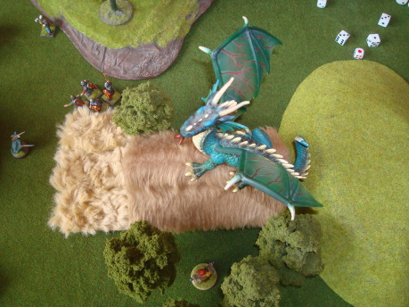
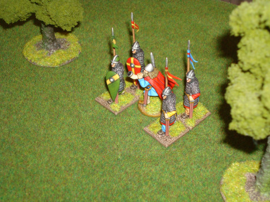
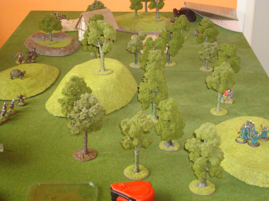
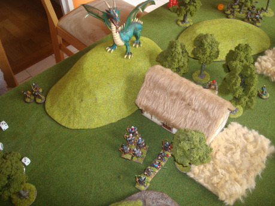

## Stavba armády

Vaše armáda se musí vlézt do určeného limitu bodů, za které nakupujete jednotky a vybavení. Většinou se jedná o 24 bodů na hráče, ale není nutné tento limit dodržet. Můžete hrát i s více či méně bodovou armádou na obou stranách, záleží na dohodě protihráčů.

Armáda, ve hře zvaná Warband, se dělí na jednotky. Každá z dvanácti typů jednotek má své Strength Points (dále jen SP). SP udávají, kolik toho jednotka vydrží, než nadobro opustí herní stůl jako oběť na oltáři vítězství. Jednotky se dělí na dva typy. Ty, které mají 12 SP (většinou pěchota) a ty, které mají 6 SP (jízda a nestvůry vycvičené k válce).

SP jsou také vodítkem k počtu figurek v dané jednotce. Elitní pěchota s 6 SP může být reprezentována 6 rytíři ve zbroji, nebo také jedním trollem, aniž by to mělo nějaký vliv na statistiky. Troll bude ze stolu odebrán po šesti zásazích. U šestice elitních pěšáků bude ztráta jednoho SP znamenat odebrání jedné figurky.

Každá armáda má svého Velitele (Leader). Ten může být součástí některé vámi zvolené jednotky, ale lépe vypadá, když se jedná o samostatnou figurku. Na rozdíl od jiných her, kde veliteli má více mocných schopností, velitel v DR má pouze jednu náhodně losovanou schopnost a bonus pro okolostojící spolubojovníky v testech odvahy. Nic jiného totiž váš Leader není. Je to jen další jednotka, či někdy jen _člen_ další jednotky, a vše, co z něj udělá hrdinu Rolandova formátu, mu musíte dokoupit za body určené na stavbu armády. Velitel je součástí jednotky, ale umírá až jako poslední. Jeho schopnost tedy platí až do naprostého vymření jednotky.

Bonusovými schopnosti můžete obdařit takřka jakékoli jednotky své armády. Patří sem třeba i dovednost sesílat 10 kouzel. Vše je ale velice vyrovnané. Magie je tedy jen další cestou k vítězství, ne něco, co nutně potřebujete a i když stojíte proti armádě s čarodějem, stále máte šanci vyhrát. Některé jednotky však mají zakázánu konkrétní schopnost, například Menší zvířata se nemůžou stát kleriky. Nezapomeňte však, že každá schopnost stojí určitý počet bodů a počet bodů na stavbu armády je pevně dohodnutý.

## Tah

Stejně jako u jiných her se i v DR hráči střídají po jednom tahu. Podle hraného scénáře se určí začínající hráč a hra může začít. Jakmile se dostanete na tah, můžete začít aktivovat své jednotky. Každá aktivace začíná vybráním jedné ze tří proveditelných akcí – Pohyb, Střelba a Boj. Aktivace jednotky je hodem dvou šestistěnných kostek (2k6) proti vlastnosti, která má stejné jméno, jako vykonávaná akce. Pokud je výsledek vyšší, než vlastnost, byla jednotka úspěšně aktivována a může vykonat zvolenou akci. Pokud ne, musí stát na místě a čekat, než ji budete moci znovu v příštím kole aktivovat.

__Pohyb__ je základní akcí. Každá jednotka má svou maximální vzdálenost, kterou může za jedno kolo urazit. Lehká jízda se může posunout až o 12 palců za kolo, kdežto plně opancéřovaná Těžká pěchota pak pouze o šest palců. Komplikacemi pro pohyb jsou nástrahy bojiště jako takového – krajina. Těžký terén (pahorky, skaliska nebo třeba hustý porost) pohyb půlí, překážky nutí hráče zastavit a počkat na další aktivaci. V těžkém terénu jednotky bez schopnosti _Ranger_ bojují s jinými čísly pro Útok, Obranu a broj. I Lehká pěchota se tak může vyrovnat té Elitní.

__Střelba__ slouží k oslabení nepřítele dříve, než se k vám stihne dostat na dosah svých zbraní. K tomu, aby jednotka vůbec mohla vystřelit, potřebuje mít patřičné vybavení. A tím je vše od luků, přes oštěpy s kratším dosahem, až po kuše či muškety se zdrcujícím účinkem, které ale dovolují střílet jen jednou za dvě kola. K tomu draci chrlící oheň a kouzelníci s kyselinovými koulemi. Opravdu je z čeho vybírat. Před střelbou je také potřeba zkontrolovat vzdálenost, a jestli střílející jednotka vidí na svůj cíl. Do dvanácti palců se střílí bez penalizace, maximální dostřel je pak osmnáct palců. Poté na řadu přijde samotná střelba, tedy hod na úspěšnost. Pokud má střílející jednotka více, než je nadpoloviční počet SP (tedy 3, nebo 6 SP), hází dvanácti kostkami. Pokud méně, než polovinu, hází jen šesti kostkami. Každá z kostek se vyhodnotí zvlášť a každá, která přesáhne hodnotu Shoot Value se počítá jako zásah. Celkový počet zásahů se pak vydělí hodnotou Zbroje. Výsledek je počet SP ubraných cílové jednotce.

__Útok__ je pohyb s bojem na konci. Po úspěšné aktivaci na Útok se jednotka pohne o své momentální maximum k protivníkovi, který se v tomto okruhu nachází a začne boj. Boj probíhá podobně jako střelba, jen s těmi rozdíly, že si házejí obě jednotky a hází na jinou vlastnost. Opět platí, že jednotky s nadpolovičním počtem SP hází dvanácti kostkami a ty, které mají méně, než polovinu SP, pak pouze šesti kostkami. U útočníka se jako zásah počítá každá kostka, která je vyšší než jeho Attack value, u obránce pak vyšší než jeho Defence value. Všechny zásahy se pak vydělí hodnotou Zbroje. To je počet SP odebraných protivníkovi. Jednotka, která utrpěla větší zranění (tj. bylo jí odebráno více SP) se pak musí stáhnout o své aktuální maximum pohybu a musí stát tak, aby od jakékoli nepřátelské jednotky stála dále, než tři palce.

## Bitvy

Na konci knihy se nacházejí pravidla, jak hru připravit. Ta obsahují sedm scénářů pro bitvu a takzvané Questy. Scénáře jsou různorodé, vyniká mezi nimi sběr krystalů, nebo transport svatého krtka do bezpečí. Hry pro více hráčů však podporuje snad jen jeden, kdy každý hráč odevzdá dvanáct žetonů své barvy přestavující zajatce hráči po levici a snaží se k nim v průběhu hry dostat. Navíc počínaje třetím kolem je na začátku každého dalšího jeden zajatec obětován a sněden …

K hlavnímu úkolu scénáře, za který je možné dostat body, se ve hře objevuje i jiný způsob, jak bod získat. Jsou jimi Questy, či jinak Úkoly. Je jich celkem 21 a jsou rozděleny do tří kategorií po sedmi, podle bodové hodnoty. Jsou zde jednoduché úkoly, jako třeba vystřílení jedné poloviny SP libovolné nepřátelské jednotky, nebo ubrání tří SP v jednom kole. Mezi úkoly za dva body patří třeba zničení jedné skrytě vybrané jednotky a mezi úkoly za tři body se nacházejí takové libůstky, jako je zákaz kouzlení pro vašeho mága, nebo zákaz pohybu Velitelem armády. Nutno ještě podotknout, že každý nesplněný úkol je jeden bod dolů na konci hry.

## Armády podruhé

Dragon Rampant je hra ve fantasy v duchu staré školy se vším, co k tomu patří. Tedy i naprostou volností při tvorbě armády. V podobném duchu se nesla i vůbec první edice Warhammeru. Jak se tato volnost ale projeví v praxi? Jednoduše. Nikdo vám nezakáže dát do jedné „Mord­gruppy“ trpaslíky společně se skřety a kentaury. I přesto však na konci knihy bylo otištěno několik Armylistů s klasickými fantasy armádami. Jak ale autor sám píše, jsou zde jen pro inspiraci, a když jsem se pokoušel jednou sestavit armádu z jednoho seznamu, vyneslo mi to spíš komplikace.

## Zhodnocení

Když jsem s Dragon Rampant začínal, měl jsem určité pochyby kvůli jeho hlavním rysům, kterými jsou jednoduchost na naučení a hraní, obecnost a zejména pak určitá laxnost vůči čemukoli, co se jen trochu blíží jakési oficiální podpoře. Jednoduchost se ukázala jako velké plus, vzhledem k tomu, že jsem hru musel mnoha lidem vysvětlovat. Obecnost je zase dobrá pro výpočty a vyhodnocení, tedy celkově zrychluje hru. A co se týče oficiální podpory ze strany vydavatele … ta mi ani moc nechybí. Pravidla jsou psaná tak, že nepotřebují rozšíření a na autorově blogu se dá najít spousta inspirace.

Pokud s fantasy wargmingem máte v plánu začít, tahle hra je pro vás dobrá volba. Náklady se dají minimalizovat a nepotřebujete mít nějak moc extra dobrou znalost angličtiny. Pokud fantasy wargaming už nějakou dobu hrajete, DR se vám možná bude zdát jako krok zpátky od pravidel velikosti a formátu Age of Sigmar. Podle mě ale stojí za to.
