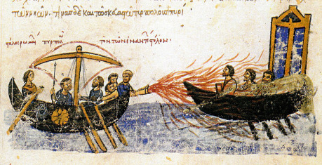
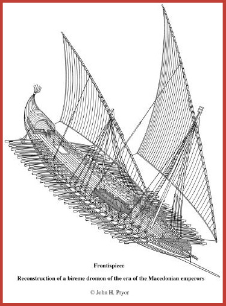
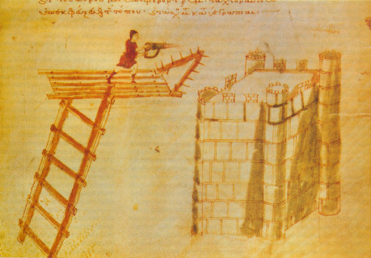

## Úvod

Byzantský (i když oni by řekli Římský) kronikář roku 816 k objevu řeckého ohně napsal:

> Září 673 až srpen 674
>
> Arabové se uchýlili na Kyzikos, který dobyli, aby tam zazimovali. Na jaře vyrazili zpět utkat se s křesťany v námořní bitvě. To opakovali po sedm let, ale s pomocí Boha a Matky Boží byli potupeni a přišli o nespočet bojechtivých mužů. Utíkali v ne­změrné hrůze, s hrozivými ranami, které utrpěli.
>
> Když zbytky jejich flotily odplouvaly pryč poté, co je Bůh zničil, byli poblíž Syllainu zasaženi prudkou bouří. Lodě byly rozdrceny na atomy a zcela zničeny. Poté (se do bitvy připojili další hrdinové) a 30 000 Arabů bylo pobito.
>
> V té době totiž k Římanům __utekl Kallinikos, vynálezce z Heliopolisu__. Vytvořil __mořský oheň__, který zapálil arabské lodě a sežehl je i se všemi námořníky. Tak se Římané vítězně navrátili a objevili mořský oheň.

Heliopolí se zde vzhledem k vývoji války s Araby myslí Baalbek v dnešním Libanonu.

> Září 716 až srpen 717
>
> Císař Leo se od Egypťanů dozvěděl o dvou flotilách skrytě kotvících v zátoce. Připravil __ohňonosné sifony__ a umístil je na palubu válečných lodí a dvojpalubových lodí, pak je vyslal proti oběma flotilám. Díky pomoci Boží skrze přímluvu jeho Neposkvrněné Matky byly nepřátelské lodě na místě potopeny. Poté, co naši muži získali kořist a arabské zásoby, vrátili se radostně a vítězně.

_– Theofanova kronika_

Řecký oheň byla strašlivá zbraň, která na několik staletí zajistila Byzanci naprostou námořní převahu. Řecký oheň jej nazývali křižáci, Byzantinci, kteří jej vyvinuli, jej nazývali římský, Médein, médijský, umělý, mořský, připravený, lepivý či tekutý oheň. V tomto díle Drakkaru probereme, co o řeckém ohni víme z dobových zdrojů, doklady o jeho složení a způsobu vrhání ovšem necháme do příštího dílu.

## Co je řecký oheň?

Roku 941 proběhla bitva mezi knížetem Igorem z Ruska a Romanem I. v týmu Byzanc. Tato bitva je zajímavá tím, že máme záznam od obou stran, který popisuje většinu vlastností řeckého ohně. Nechť nejdřív promluví Liutprand z domácího týmu, jehož nevlastní otec byl v té době v Byzanci diplomat (ten jim říká ne zrovna taktně „Řekové“), poté dostane slovo Pověst dávných let neboli Nestorův letopis:

> Roman strávil řadu bezesných nocí v úvahách, zatímco Igor pustošil pobřeží, ale nakonec mu bylo řečeno, že v loděnici je patnáct starých, otlučených galér, které byly vyřazeny. Tak k sobě zavolal lodníky a přikázal jim: „Pospěšte a připravte bez prodlení staré galéry do bitvy. __Navíc umístěte vrhače ohně nejen na příď, ale i na záď a také po obou stranách lodi.__ (…) Milosrdný a shovívavý Bůh nejenže ochránil své věřící, kteří se k němu modlili a prosili jej o pomoc, ale také je poctil vítězstvím. __Kvůli tomu utišil vítr a uklidnil vlny, protože Řekové by jinak jen obtížně chrlili svůj oheň.__ Když se Řekové rozestavili, obklopeni nepřítelem, začali kol dokola chrlit své plameny a Rusové, když plameny spatřili, seskakovali ze svých lodí, aby byli raději utopeni vodou než spáleni zaživa v ohni. Někteří klesli na dno pod vahou svého brnění a helmy a nikdo už je nikdy nespatřil; __někteří byli zapáleni, zatímco plavali ve vlnách__; žádný z nich neunikl živý, kromě těch, kteří se dokázali doplavit ke břehu, protože ruské lodě díky své malé velikosti mohly proniknout i do mělké vody, kam řecké galéry s hlubším ponorem nemohly.

_– Liutprandova Antapodosis_

Ruský kronikář Nestor zase popisuje, s jakou se potázali hosté a deset tisíc jejich lodí:

> I uradili se Rusové a vytáhli zbrojně na Hřeky, a bitva mezi nimi byla zlá, ledva odolali Hřekové; Rusové pak vrátili se pod večer k družině své, a na noc vlezše do lodí ujeli. A Theofan potkal je v korábích s ohněm, i počal trubami oheň pouštěti na lodi ruské, a bylo viděti věc divnou a strašlivou. I vidouce Rusové plamen, uvrhli se do vody mořské, chtíce ubřesti; a tak ostatní vrátili se domů. Když pak tito přišli do země své, vypravovali každý svým o tom, co se stalo, i o korábovém ohni: „Tak jako blesky,“ prý, „které jsou na nebesích, mají Hřekové u sebe, a ty pouštějíce pálili nás; a proto jsme jim neodolali.“

_– Nestorův letopis (překlad K. J. Erben)_

Tím si pomalu skládáme obraz, co taková zbraň zvládla. Ale máme i obraz dochovaný, a obraz vydá za tisíc slov. ↓

Jedná se o jediný dochovaný ilustrovaný rukopis Řecké kroniky. Pokud jde o ilustrace, není jasné, jestli jsou to kopie původních, nebo nově vyvedené. Základ nicméně máme – dvě lodě, galéry a ti veselejší z námořníků chrlí z trubky na přídi oheň. Obrázek také ilustruje další vlastnost – řecký oheň je tekutý a široce se rozptyluje a jde jím zasáhnout celou nepřátelskou loď. A při troše fantazie ještě jednu – hořel na vodě.

Chybí nám nicméně poslední zcela klíčová vlastnost, kterou nám zdokumentovali křižáci, již proti řeckému ohni s jistým úspěchem bojovali. Očitý svědek obléhání Acre roku 1191 popsal:

> Zápalný oheň, běžně nazývaný řecký oheň, __příšerně zapáchal a hořel zuřivým plamenem__. Dokázal strávit i kámen či kov a __nemohl být uhašen vodou, ale jenom pískem__, i když mohl být potlačen politím octem.

_– Itinerarium Regis Ricardi_, podlePartingtona (1960)

Schopnost „strávit kámen či kov“ je jistě nadnesené, protože právě kov byl proti řeckému ohni dobrou obranou; není jasné, proč by měl zabírat ocet, i když tato reference se v literatuře velmi často opakuje, ovšem písek bezpochyby účinkoval. Na tomto citátu je ovšem divné něco jiného: kde se vzali v Acre roku 1191 v bitvě křižáků s Araby Byzantinci? Odpověď je, že nikde. Arabové totiž používali svou verzi „řeckého ohně“, která byla stejná nebo velmi podobná tomu byzantinskému, byla však jiným způsobem vrhána proti nepříteli. A barbaři, kteří na své křížové výpravě přitáhli kdesi z Evropy, si nedělali práci s rozlišováním jednotlivých verzí tekutého ohně.

Křižáci měli tu smůlu, že se potkali s řeckým ohněm hned několikrát, a v tomto případě to zase nebyli Řekové, ale opět Arabové. Zde zachytil své dojmy účastník sedmé křížové výpravy:

> Řecký oheň vypadal následovně: letěl přímo proti vám, velký jako sud na ocet, s ohnivým ocasem velkým jako dlouhé kopí. Vydával takový hluk, že to připomínalo hrom z nebes; vypadal jako drak letící oblohou. Vydával takový jas, že jste v táboře viděli tak jasně jako ve dne, a jeho ohromný plamen ozařoval úplně všechno. Třikrát nás té noci bombardovali řeckým ohněm a čtyřikrát jej vystřelili z __arbalestu__.

_– Jean de Joinville (1248)_, podlePartingtona (1960)

Je jasné, že Arabové měli zcela jiný způsob dopravování řeckého ohně k cíli. Byzantinci různé variace na katapulty znali také, u nich je ale toto použití zcela zastíněno plamenomety, které v té době neměl nikdo široko daleko. Také se nám dochovalo, co se stane s takovým rytířem zasaženým řeckým ohněm. De Joinville totiž bitvu přežil a popisuje, jak se bránit proti vrhanému řeckému ohni. Při ostřelování z dálky pomohlo padnout na kolena a modlit se, při útoku z blízka zase odrazit řecký oheň (v podobě granátu) štítem. Pokud se ale rytíři dostane řecký oheň až na kůži, bude spálen za živa. Citováno podle Partingtona (1960).

Byzantský řecký oheň, jeho složení a princip plamenometu bylo státní tajemství, jehož vyzrazení bylo trestáno nejtěžšími tresty a božím bleskem, který měl zrádce zasáhnout v momentě, kdy se pokusí tajemství vyslovit. To ale neznamená, že by nám upovídanější členové královské rodiny něco neprozradili. Jeden z nich byl Leon VI. (vládl 886 až 912), řečený Moudrý či Filosof, což je eufemismus pro to, že byl především teoretik. Byzanc je známa svými paradoxy, řadou propadů a opětovných vítězství. Během vlády tohoto panovníka zažívala Byzanc spíše horší období a prohrávala v několika válkách zároveň. Král je sledoval z bezpečné vzdálenosti a pravděpodobně nikdy v žádné bitvě nebojoval. Přesto se proslavil známým teoretickým vojenským spisem, Taktikou.

> (Bojová loď) by každopádně měla mít bronzový sifon upevněný na přídi, jak je zvykem, tak aby mohl chrlit připravený oheň na nepřátele. Nad takovým sifonem by měla být zhotovena plošina ze dřeva … Zde umísti bojovníky, aby odráželi útoky nepřátelských lodí či vrhali jakékoli zbraně se jim zlíbí proti nepřátelské lodi.

_– Leon VI., Moudrý: Taktika_

Plošina ze dřeva podle novodobých komentátorů zřejmě sloužila jednak k ochraně sifonu, jednak snad umožňovala chrlit oheň z větší výšky, což zaručovalo větší dostřel.

Řecký oheň ale nebyl jediný trik, který měli Byzantinci v rukávu. Leon popisuje rafinované způsoby, jak vrhat zapálené sítě, zápalné granáty či jiné předměty a keramické granáty naplněné hady či škorpiony, případně velmi jemným hašeným vápnem, které se rozprskne po lodi protivníka a začne leptat oči nepřátel. Neserte Byzantince.

Ve stejné části Leon potvrzuje, jak vypadal útok řeckým ohněm:

> Starověcí stejně jako modernější autoři vymysleli řadu zbraní použitelných proti nepřátelským lodím a proti mužům na nich nesených, jako je __připravený oheň doprovázený hromem a planoucím kouřem vycházejícím ze sifonů, začerňující nepřátele kouřem.__

_– Leon VI., Moudrý: Taktika_

Leon každopádně věnuje ve své práci řeckému ohni naprostý zlomek celkového objemu knihy a většinu zabírá konvenční taktika, zdá se totiž, že řecký oheň byl použitelný jenom za specifických okolností, a i když se o tom otevřeně dobové zdroje nezmiňují, byl jistě nebezpečný i pro operátory a v řadě nezávislých zdrojů je zmíněno, že jej bylo možno použít jenom na klidné vodě. To snad aby se vyhnuli osudu, který potkal čínskou flotilu, která také používala variaci na řecký oheň.

Existují dva obskurní zdroje, které dokládají skutečnost, že řecký oheň musel být před použitím zahřátý. Jeden prozatím zatajím, protože obsahuje i složení, druhý je ale o to výživnější: Sága o Yngvaru Cestovateli, napsaná někdy ve dvanáctém století, popisující vikinskou výpravu z roku 1041:

> Když ale piráti zjistili, proti komu bojují, __začali pumpovat kovářskými měchy do pece, kde byl oheň__, a zvedl se __strašlivý hlomoz__. Také tam byla __bronzová trubka__, ze které vyletěl __ohromný proud ohně__, zasáhl jednu z lodí a během chvíle ji sežehl v prach. Když to Yngvar spatřil, zarmoutil se pro tuto ztrátu a rozkázal, aby mu donesli troud s posvěceným ohněm. Pak napnul svůj luk, zasadil šíp a rozkázal, aby dali troud s posvěceným ohněm na jeho hrot. A šíp letěl s ohněm z luku do trubky vycházející z pece a oheň se obrátil proti pohanům.

_– Sága o Yngvaru cestovateli_ (podlepřekladu Petera Tunstalla, 2005)

Řecký oheň a mechanismus jeho vrhání bezpochyby doznal od svého vynálezu vylepšení, ovšem mnoho dokladů nemáme. Anna Komnenovna, byzantská princezna, ve svých pamětech na svého otce Alexia I. popsala, jak navštívil loděnice, aby konstruktérům řekl, jak ještě víc vyděsit barbary tím, že hlavice sifonu vytvoří v podobě:

> „(…) __hlavy lva nebo jiného zemětvora__ vyrobeného z pozlacené mosazi nebo železa s otevřenou tlamou, aby už jejich samotné vzezření bylo děsivé. A oheň, který bude __skrze trubky__ směřován proti nepřátelům, ať prochází tlamou netvorů, aby to vypadalo, jako by lev chrlil plameny.“

_– Anna Komnenovna, Alexais_ (životopisAlexia I., vládnoucího mezi 1081 a 1118).

I když už za vlády Komnenovců nedosáhli Byzantinci větších námořních vítězství, přesto vyhráli řadu bitev. Jednu takovou (časově odpovídá Pisanskému plenění v letech 1098–9) opět dokládá Anna Komnenovna:

> (…) římská flotila se však nepustila do běžné námořní bitvy s Pisany, ale podnikla proti nim sérii rychlých, nestandardních útoků. Nejdřív ze všech se k Pisanům přiblížil samotný Landulph a vrhl proti nim oheň, ale mířil špatně, takže nedosáhl ničeho, kromě plýtvání svým ohněm. Po něm směle zaútočil hrabě zvaný Eleemon na záď největší lodi, ale zachytil se do jejích kormidel, a protože se nemohl vyprostit, snadno mohl být sám obsazen, kdyby se díky své ohromné duchapřítomnosti neuchýlil ke svému stroji a s velkým úspěchem nechrlil oheň na nepřítele. Pak rychle otočil svou loď kolem dokola a na místě zapálil tři z největších barbarských lodí. V ten samý moment zasáhl moře náhlý poryv větru, zpěnil jej, vrhl lodi proti sobě a bezmála je hrozil potopit (protože vlny burácely, ráhna vrzala a plachty se trhaly). Barbaři teď byli zcela vystrašeni, zaprvé kvůli ohni namířeném na ně (protože nebyli zvyklí na takový stroj ani na takový oheň, který přirozeně míří vzhůru, ale v tomto případě __mohl být nasměrován kamkoli si jeho vrhač přál, často dolů či do strany__), zadruhé proto, že byli značně vystrašení bouří, a proto tedy uprchli.

## Byzantské námořnictvo

Historie řeckého ohně v mnohém kopíruje historii rychlé byzantinské galéry zvané dromón, „běžec“. Spíš než o jeden konkrétní typ lodi se jedná spíše o „filosofický koncept“, pojmenování rychlých galér s dobrou schopností manévrovat, které navazují na tradici římských lodí (těch skutečných Římanů z Itálie). V průběhu jejich evoluce došlo k výměně taranu pod úrovní ponoru za klouny nad ní, které nesnižují manévrovatelnost, dále také ke změně obdélníkové plachty na trojúhelníkovou a řadě změn ve stavbě trupu. Začátek proměn na dromón můžeme datovat asi do 4. století našeho letopočtu, tento trend má kořeny ještě mimo Byzanc. Původně měly jednu řadu vesel a nesly jich celkem padesát, přičemž každé obsluhovali dva muži, v šestém až desátém století pak došlo k přeměně na dvouřadé o stu až sto osmi veslech, nakonec byly používány i trirémy o třech řadách vesel. Původní dromóny měly jeden stěžeň, pozdější typicky dva a největší dromóny mohly mít stěžně i tři (Pryor a Jeffreysová, 2006).

Pryor a Jeffreysová (2006) analýzou dochovaných spisů o byzantské taktice dokládají, že pro použití řeckého ohně nebyla vypracována oficiální, veřejně známá taktika, na kterou se spoléhalo při ničení lodí. Mimo jiné také proto, že jeho použití vyžadovalo klidné moře a bezvětří nebo vítr v zádech. Vytlačení taranu, umístěného pod hladinou ponoru, klounem umístěným nad vodou, jež doprovázelo nástup řeckého ohně, také doprovází odklon od kontaktní taktiky: fáze ostřelování z dálky sloužící k povraždění co největšího množství nepřátelské posádky se prodlužovala. Také se rozrostlo množství instrukcí pro udržování formací, systém signalizace vlajkami pro změny formací i jiné účely. Teprve po vyvraždění dostatečné části nepřátelské posádky došlo k zachycení nepřátelských lodí pomocí háků a útok vojáků na nepřátelskou loď.

Pryor a Jeffreysová rozdělují historii by­zantského námořnictva na pět epoch: První trvala do šestého století a zahrnuje pro naše potřeby jednu nezajímavou prohru a jednu nezajímavou výhru. Druhá začala řadou proher Byzantinců s Araby, které ukončily dvě série dramatických bitev v letech 672–8 a 717–8, kdy Byzantinci drtivě vítězili nově objeveným řeckým ohněm. Mezi lety 750–875 se Byzantinci se střídavými úspěchy a neúspěchy navzájem vraždili s řadou nepřátel, až ztratili Krétu a Sicílii. Ve čtvrté epoše Byzantinci zažili řadu drtivých proher i vítězství a nakonec získali zpátky Krétu a vytlačili Araby z Itálie. Pátá epocha v jedenáctém století však znamená vrchol dekadence a při nástupu Alexia I. Komnena roku 1081 Byzanc prakticky neměla námořní síly, i když se jemu a nově vzniklé dynastii Komnenovců podařilo loďstvo částečně a dočasně obnovit. Během jedenáctého a dvanáctého století Byzantinci bez pomoci spojenců zřejmě nedosáhli žádného námořního vítězství, které by stálo za řeč. Při útoku na Konstantinopol v letech 1203 a 1204 se křižáci prakticky nesetkali s námořním odporem. Byzantinci byli v té době závislí na námořní síle Benátčanů. Můžete hádat, čí lodě proti Konstantinopoli připluly.

Po několika letech exilové vlády byla roku 1261 Konstantinopol dobyta zpět, ale původní velikost Byzantské říše se nepodařilo obnovit. Pokud jde o námořní síly, došlo k několika pokusům o obnovu, ale byzantské námořnictvo od té doby v lepších obdobích čítalo nanejvýš několik málo desítek lodí, což je zlomek v porovnání se stovkami lodí v době největšího rozmachu. O vývoji byzantinského námořnictva po roku 1204 víme poměrně málo, v designu lodí se ovšem přešlo od původních dromónů k efektivnějším galérám typu galea s dvěma řadami vesel, jež byly převzaty pravděpodobně z Itálie, kde pro svou úspěšnost vytlačily jiné typy lodí.

## Použití na souši

Řecký oheň byl především námořní zbraň, ale máme doklady o tom, že byl používán i na souši. Zatímco u námořního použití řeckého ohně je poměrně jisté, že jde o jednu a tu samou formuli – nikdo jiný široko daleko nic takového v té době neuměl (s menším zpožděním plamenomety ovládli Číňani) a byzantinští kronikáři tyto dva druhy nerozlišují, u suchozemského použití není vždy jisté, jestli jde o byzantskou větev, paralelně objevenou zápalnou zbraň pracující na stejném principu, či jde o jinou zbraň, proto se zde omezím pouze na Byzanc. Tam máme dokonce zdokumentované, kdo si tento objev přisvojil:

> Použij také jinou metodu (chrlení řeckého ohně), s využitím malých sifonů, kterými se vrhá oheň zpoza železných štítů držených vojáky. Říká se jim „ruční sifony“ a byly nedávno vymyšlené Jeho Veličenstvem. Tyto jsou také schopné vrhat připravený oheň do obličejů nepřátel.

_– („Jeho Veličenstvo“) Leon VI., Taktika_

Jedná se pravděpodobně o malé pumpy zřejmě jednodušší stavby než ty lodní. Princezna Anna Komnenovna ale popisuje i jiné metody. Nejdříve (zcela bez obav z blesků) popisuje (zjevně neúplný) recept na řecký oheň, později dodává, co s ním dělat:

> (…) je vložen do stonku rákosu a vyfoukáván muži se silným a vytrvalým dechem. Tak se setká s ohněm na špičce (rákosu), kde je zapálen, rozhoří se plamenem a dopadne jako úder blesku do tváří mužů na druhé straně. Tento oheň mužové dyrrachiští používali (takto přímo) tehdy, když čelili nepřáteli tváří v tvář a spalovali vousy a tváře. A nepřátele pak bylo vidět utíkat – jako hejno vykouřených včel – ve zmatku pryč z místa, kam spořádaně vkročili.

_– Anna Komnenovna, Alexais_(napsáno kolem roku 1148)

Pokud nás s tím foukáním netahá za nohu, zřejmě je takto možné používat řecký oheň poměrně zblízka, jak se stalo, když obránci zjistili, že se nepřátelé se snaží prokopat pod hradbami. Obránci si také trochu zakopali a pak:

> (…) otevřeli malý průzor, kterým spatřili značné množství kopáčů, a spálili jim ohněm tváře na popel.

Dále popisuje, jak se barbaři snaží dobývat civilizované město schopné bránit se řeckým ohněm, což však nestačí, protože dobývací věž nepřátel je nedostatečně hořlavá. Proto obránci naházeli všechno hořlavé mezi postupující nepřátele a obránce a pak všechno zapálili. Ten řev hořících barbarů!

Také máme dochováno, jak v šarvátce zahynulo několik Byzantinců a vyslal do bitvy svého zkušeného generála, kterému dal ohromnou armádu a „mnoho rad a strategických plánů“. Proti tomu neměli barbaři šanci:

> (Generál dorazil k malé pevnosti), okamžitě dal připravit obléhací stroje a oblehl ji. Římané přitom postupovali vpřed bez obav, někteří vrhali oheň na brány a spálili je, zatímco ostatní přelézali hradby.

## Poslední použití řeckého ohně Byzantinci

Ani superzbraň, jako je řecký oheň, nezajistila Byzantincům naprostou převahu, jak ilustrují už střídavé úspěchy a neúspěchy námořnictva. I když se řecký oheň přestal v Byzanci používat, nestalo se tak najednou, což by vypovídalo o ztrátě znalosti, ale postupně se od něj ustupovalo, jak Byzanc postupně ztrácela nadvládu nad mořem. Na začátku vlády Alexia I. Komnena (1081 až 1118) sice došlo k dočasnému vylepšení stavu byzantského loďstva, a dokonce i k vylepšení sifonu. I jeho synovi se ještě dařilo, ale ke konci vlády jeho vnuka Manuela (vládl 1143 až 1180) už se říše začala znovu rozpadat a jeden neúspěšný císař rychle střídal druhého. Přesto i z této doby máme doklady o používání řeckého ohně.

Roku 1162 byl na diplomatické návštěvě představen řecký oheň sultánu Kiliji Arslanovi II. (ten samý, co později v bitvě u Myriokefala drtivě porazil Byzanc, a Turci tak nadobro zastavili rozpínání Byzance do Asie) a roku 1171 byl řecký oheň použit při byzantinské šarvátce s Benátčany.

> (Sultána) doprovodili do paláce na jih od města, kde jej císař přijal úchvatnou hostinou a poctil v nejhlubším přátelství. Pak jej okouzlil koňskými závody a podle obyčeje zapálil několik lodí a bárek tekutým ohněm a naprosto uchvátil sultána podívanou v hipodromu, kde má velkolepost měst zejména šanci vyniknout.
>
> (Benátčané se svou výmluvností dostali z vězení, ukradli loď a pokusili se na ní odplout pryč …) Když se o tom Římané dozvěděli, pronásledovali je, a když se k nim přiblížili, zatímco proplouvali Abydským průplavem (Dardanely), rozhodli se je spálit médejským ohněm. Ale Benátští, protože byli seznámeni se zvyky Římanů, se směle připravili, namočili plátno do octa a celou loď jím zabalili. Protože Římané nebyli schopní uspět – vrhali oheň proti lodi buď dál, než bylo nezbytné, nebo před ni, nebo i když ji zasáhli, oheň byl neškodně odpuzen plátnem a uhašen vodou, když odpadl – vrátili se bez úspěchu.

_– John Kinnamos, Deeds of Johnand Manuel Komnenus_

Další zdroj popisuje, jak sicilští „piráti“ ukradli cennou ikonu a opevnili se na řeckém ostrově Kerkyra (Korfu). Byzantinci rozhodli připravit lodě ozbrojené řeckým ohněm a vypluli proti nim. Byzantské námořnictvo bylo nejdřív z většiny rozstříleno katapulty a velitel námořnictva byl zabit. Přítomný císař byl nějakou dobu nerozhodný, ale nakonec vydal rozkaz dobýt pevnost přímo pomocí žebříku. Nechal jej vytvořit a zvolal: „Ten, kdo miluje císaře a je dychtivý se vyznamenat tváří v tvář nebezpečí, ať začne šplhat.“ Nikdo nezačal, dokud se po chvíli ticha nevzmužilo několik Normanů, které nakonec následovali další vojáci, kterým císař nasliboval hory doly. Bezpochyby by Byzantinci v této bitvě zvítězili, ale hned poté, co první člověk dosáhl vrcholu hradeb (byl to Poupakes, člen osobní stráže, který Normany nakonec předběhl), se žebřík zlomil a všichni lezoucí popadali a trudně zhynuli. Poupakes byl paradoxně jeden z mála, kdo tuto zteč přežil.

Další příklad vyzbrojení řeckým ohněm máme v boji proti vzbouřenci, Alexiu Branasovi roku 1187. Rebelové přestavili rybářské bárky na ozbrojené lodě a vyrazili proti císařovu loďstvu. Císařovo loďstvo „by jistě tyto bárky rychle zničilo tekutým ohněm, kdyby Branasovi těžkooděnci nesestoupili z hřebenu hory na pobřeží a nepomohli jim.“ Další zmínku máme z doby krátce poté, kdy byl řecký oheň použit na souši v granátové podobě:

> Večer toho dne, kdy byl Branas poražen, byl tekutý oheň vrhán na domy nešťastných obyvatel Propontu; tato směs, pevně uzavřená v nádobách, se náhle vznítí a jako údery blesku, zasahující tady a tam, sežehne cokoli, na co dopadne. Žhnoucí oheň spálil a zničil každou budovu, ať už to byl svatý chrám, svatý klášter, nebo světská budova.

_– Niketas Choniates, O city of Byzantium_

Tento kronikář dále popisuje, jak se John z Poutze v době tohoto rozkladu zasadil o získání více peněz do rozpočtu:

> Stát a veřejnost nemá potřebu trimér neustále, výdaje na ně jsou každoroční velkou zátěží rozpočtu, a tyto zdroje by tedy měly být uloženy do státní pokladny. Zásoby a peníze by měly být námořnictvu poskytnuty státní pokladnou pouze v časech potřeby …

… a následně státní pokladnu vytuneloval. Když se o něco později Byzantinci snažili narychlo připravit lodě před příchodem křižáků, kronikář popisuje, jak císař Alexios III. nebyl schopný zajistit postavení bojových lodí a naopak hrozil smrtí každému, kdo se pokusí pokácet stromy v lesích, protože v nich rád lovil, a nakonec museli proti křižákům poslat „narychlo opravené tlející bárky sesbírané po celé Konstantinopoli“.

Kvalitu vůdce Byzantinců v posledních chvílích před dobytím Konstantipole ilustrují slova Niketa Choniata o Alexiu III.: „Jeho nezměrná lenost se vyrovnala jeho hlouposti.“

## Konec řeckého ohně

Roku 1203 došlo k obléhání a dobytí Konstantinopole křižáky, byl svrhnut císař Alexios III. a dosazen jiný, prokřižácký vůdce. Zajímavé je, že není doloženo použití řeckého ohně, a i když byly použity zápalné lodě, nešlo v tomto případě o řecký oheň, ale o loď naloženou hořlavinami a poslanou proti nepříteli. Benátčané tyto lodě zachytili a bezpečně odvlekli mimo svou flotilu, kde neškodně dohořely, jediná uvedená ztráta je jedna obchodní benátská loď.

Každopádně se zdá, že zde řecký oheň na moři nasazen nebyl a Konstantinopol padla do rukou křižáků.

Dosazený prokřižácký Alexios IV. byl Byzantinci obratem svržen a roku 1204 začalo druhé dobývání Konstantinopole křižáky, které skončilo jejím vypálením. Ani zde zdá se nehrál řecký oheň významnou roli a maršál Geoffrey de Villehardouin si na něj například ve svých pamětech ani nevzpomněl, mimo jiné proto se řada autorů domnívá, že tajemství jeho výroby bylo ztraceno. Ve skutečnosti mohl být použít, ale jeho použití bylo neúčinné.

Řadový voják Robert de Clari totiž takové štěstí neměl:

> (…) seshora vrhali z kotlů hořící smůlu, řecký oheň a obrovské kameny, takže byl zázrak seslaný bohem, že nebyli zcela zničeni – tolik utrpení tam můj pán, lord Peter, a jeho muži zažili, tolik nepočetného a bolestivého nebezpečenství. Přesto se probili až k boční bráně …

_– The Conquest of Constantinople, Robertde Clari_ (někdy po roce 1205)

Důvod, proč ostatní řecký oheň nezmiňovali, mohl být čistě ten, že s ním počítali a nijak je nepřekvapil. Bradford (2014) ve své knize o pádu Konstantinopole z řady různých zdrojů dokládá, že Benátčané – bývalí spojenci Byzantinců – byli dobře připravení na obranu proti řeckému ohni, mimo jiné své lodě pokryli sešitými, namokřenými kůžemi a pro vylodění použili kryté můstky.

Konstantinopol padla, velká část města byla vypálena, a i když byla znovu dobyta, Byzantinci už nikdy nedokázali dosáhnout původní velikosti.

Definitivní konec nastal roku 1453, kdy byla Konstantinopol dobyta Turky. Pokud jde o použití řeckého ohně, máme málo informací a doklady o použití jsou buď nepřímé, nebo si vzájemně protiřečí. Těžko dokládat námořní použití řeckého ohně, když Byzantinci prakticky neměli námořnictvo a spoléhali v tomto ohledu na své italské spojence.

Doukas popisuje, jak se Benátští pokusili v noci spálit turecké lodě, Longo Giustiniani vymyslel plán a naložil na triméru 150 nejzkušenějších Italů a „rozličné bojové stroje“. Janovští jejich plán ale prý vyzradili Turkům, kteří následně noční útok čekali a potopili loď jediným výstřelem z děla. Není výslovně zmíněno, že nesli řecký oheň, ovšem pro zápalné lodi nebývalo potřeba nejlepších námořníků ani bojových strojů.

Kritovoulos (píšící pro Turky) nejdříve popisuje, jak sultán Mehmet objevil metodu nepřímé střelby z děla a s pomocí strašlivého umění matematických propočtů je schopen ničit i lodě, které jsou kryté překážkou. Hned vzápětí popisuje, jak se tureckou blokádu pokusily prorazit tři velké lodě přivážející zásoby. Ty sultán přikázat zajmout, případně potopit, což se bezmála povedlo. Díky bezvětří turečtí veslaři lodě dohnali a po několikahodinovém boji se jim je málem podařilo obsadit. Pak se ale zvedl vítr a italské lodě byly schopny odplout do bezpečí přístavu. Nicolo Barbaro (Benátčan) událost popisuje podobně, píše ale, že lodě byly tři janovské a mezi nimi byla i loď patřící konstantinopolskému císaři. V těchto dvou zdrojích není ani slovo o řeckém ohni, ale Runciman (1965) z dalších zdrojů vyvozuje, že císařova loď byla vybavena řeckým ohněm, který byl použit.

Další zdroj je hojně citovaná Sphranthzeho kronika, ta má ale dvě verze – kratší a delší. Kratší je zdá se autentická, ale o pádu Konstantinopole uvádí pouze to, že kronikář měl provést inventuru zbraní, což udělal, ale zjištění prozradil jenom císaři, a dobývání je odbyto dvěma větami; větší prostor autor věnuje svému revmatu. Delší verze byla napsána asi o sto let později a už obsahuje zmínky o řeckém ohni: jednak měl být vrhán proti obléhacím strojům, jednak měl být použít k likvidaci tunelů, které nepřátelé prokopávali.

Tunely nicméně popisuje i očitý svědek, už zmiňovaný Nicolo Barbaro. Obránci zjistili, že Turci podkopali základy hradeb a jsou připraveni nečekaně zaútočit: „(…) když naši muži objevili tento tunel, __vrhli do něj oheň__ a Turci na druhé straně pochopili, že jej c__hceme zapálit__, a zapálili jej na druhé straně, takže hořel z obou stran.“ Autor píše, že dovnitř „vrhli oheň“, ale ten nebyl zapálený, což je jedna z možností, jak použít řecký oheň. Popisuje pět dalších pokusů prokopat tunel, z nichž jeden se propadl sám, zbytek opět podpálili tak, že do něj „vrhli oheň“. Jedná se pouze o nepřímý doklad, ale Anna Komnenovna v dřívějších dobách popsala podobný postup likvidace nepřátelských sapérů s pomocí řeckého ohně.

Doklady o použití řeckého ohně při pádu Konstantinopole roku 1453 doposud nejsou spolehlivě zpracovány, přeloženy do moderního jazyka a volně dostupné, například ty citované Runcimanem, a proto otázku jeho použití v této bitvě nechávám otevřenou.

## Shrnutí

Literární doklady je bezpochyby nutné číst kriticky, ale řada informací se v nich opakuje, obzvláště cenné jsou ty, ze kterých máme doklad z obou stran. Řecký oheň …

- v užším slova smyslu byla především námořní zápalná zbraň, která měla podobu kapaliny vrhané ze specializovaných trubek, „sifonů“;
- řada zdrojů popisuje jako tekutý či lepivý, je obtížné jej hasit a plave na vodě. Sifony vrhající oheň jsou umístěny typicky na přídi lodí zvaných dromóny;
- je výraz, který pro svou zbraň Byzantinci nikdy nepoužívali, jedná se o pojmenování zavedené křižáky, kteří tak označovali i jiné zápalné zbraně, což přispívá ke zmatkům, které máme v představách o této zbrani;
- mohl být použít jenom na klidné vodě a byl efektivní pouze na relativně krátkou vzdálenost. I v době největšího rozmachu byzantské říše Byzantici prohráli řadu bitev navzdory tomu, že vládli touto zbraní.

## Závěr

Existují zřejmě tři hlavní důvody, proč se řecký oheň přestal používat, a není to tím, že by Byzantinci zapomněli, jak jej vyrobit.

Zaprvé, státní tajemství přestalo být tajemství a Benátčané vrhali řecký oheň roku 1081, Anjouovci na Sicílii roku 1270, Arabové jím trápili křižáky o poznání častěji než Byzantinci a vydrželo jim to déle, Arabové předali tajemství tekutého ohně Číňanům a máme dokonce zajímavý doklad použití zbraně odpovídající řeckému ohni z Malty roku 1565.

Druhým důvodem je jednak vývoj dalekonosných zbraní (katapulty), jednak pozdější objev střelného prachu, který se v Evropě začal objevovat od třináctého století a který byl ve výsledku mnohem účinnější než řecký oheň. Byzantská říše byla ke konci své existence na mizině a nebyla schopná využít tuto nově se objevující superzbraň.

Třetí důvod je zrušení byzantinské flotily a předání námořní kontroly spojencům. Řecký oheň byl vždy především námořní zbraň.

Snad je tady ještě důvod čtvrtý: Byzantinci postupně ztratili kontrolu nad zdroji, ze kterých se řecký oheň vyráběl.

A z čehože se ten řecký oheň vyráběl? To zůstane záhadou přinejmenším do příštího Drakkaru.

## Zdroje

Pro zájemce o problematiku řeckého ohně doporučuji především dvě níže uvedené knihy, mimo jiné proto, že jsem překládal původní doklady přinejlepším z druhé ruky, častěji aspoň třetí, proto nemá smysl odkazovat na konkrétní vydání jednotlivých překladů starých rukopisů. Následující dvě knihy jsou jednak výborné, jednak se zabývají problematikou překladu z původních zdrojů, jednak z nich je tento článek možno z velké části poskládat:

- Partington, James R. (1999), _A History of Greek Fire and Gunpowder_, Johns Hopkins University Press.
- Pryor, John H.; Jeffreys, Elizabeth M. (2006), _The Age of the ΔΡΟΜΩΝ: The Byzantine Navy ca. 500–1204_, Brill Academic Publishers.

Z nedostatku jiných možností jsem musel vycházet z dnes klasické (a řekl bych špatně ozdrojované) knihy o pádu Konstantinopole, která je dodnes nekriticky kopírována.

- Runciman, Steven (1965), _The Fall of Constantinople, 1453_ (Canto ed.), Cambridge University Press.
