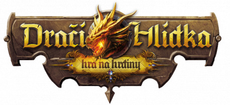
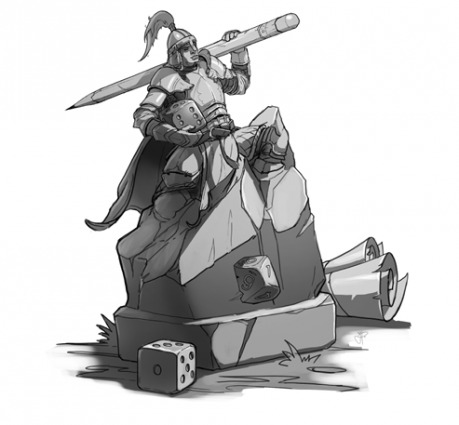
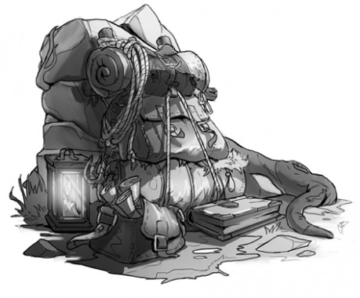
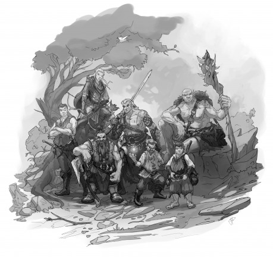

„Dračák“ tak dal lidem možnost prožít neuvěřitelná dobrodružství a šanci poznat nové přátele, na které by třeba nikdy nenarazili. Letos je to téměř čtvrt století, co bylo Dračí doupě poprvé uvedeno na veřejnost. Velmi záhy sklidilo obrovský úspěch, a není proto divu, že ho v dalších letech následovali „mladší sourozenci“ – DrD+ a DrD2. Ani jeden z nich však už nedosáhl takového věhlasu a prodejů, jako originál. Bohužel, i dny původní legendy byly nakonec jednou pro vždy sečteny. Stalo se tak v roce 2012, kdy dorazily poslední výtisky na pulty obchodů. Příběh se (aspoň zdánlivě) uzavřel a zůstaly jen vzpomínky těch, kteří na tomto systému vyrostli …

## Zrození Hlídky

Jak ale napsal Andrzej Sapkowski: „Něco končí, něco začíná“. Konec původního dračáku s sebou přinesl i velmi zajímavý efekt. Už dříve vznikalo mnoho doplňků a dodatků k původní hře. Možná si někdo pamatuje na časopisy _Šavlozubá veverka_ či _Dech draka_, nebo na stovky webů, kde si lidé sdíleli vlastní kouzla, rady a rozšíření (nejznámější z nich bude asi [Dracidoupe.cz](http://www.dracidoupe.cz)), případně na weby, kam chodili fandové hrát a o DrD diskutovat (_DarkAge_, _Abarin_, _Immortal_ _Fighters_, _TORCH_ a spousta dalších). S tak mohutnou základnou fanoušků bylo jen otázkou času, kdy se šikovní autoři dají dohromady a spojí síly na něčem větším. Nějakou chvíli to trvalo, ale nakonec k tomu přece jen došlo. Vzniklo tak hned několik skupin a projektů, které se rozhodly legendu resuscitovat. Jednou z nich jsme se stali také my. A tak se začala psát historie Dračí Hlídky.

V něčem se však náš příběh od ostatních projektů trochu lišil. Nezačali jsme totiž rovnou tvorbou vlastní hry. Naopak, chtěli jsme za kaž­dou cenu dosáhnout reedice původního DrD. V roce 2015 jsme proto kontaktovali vedení _Altaru_. Chtěli jsme vědět, zda ještě existuje naděje, že se hra dostane znovu do tisku. Dověděli jsme se však, že ne. Zkusili jsme proto ještě dotaz, zda by nebylo možné koupit licenci. V takovém případě jsme byli odhodláni vydat hru svépomocí. Bohužel, ani tato možnost neprošla. A tak bylo definitivně rozhodnuto o tom, že se musíme vydat jinou cestou. Několik týdnů nám však ještě trvalo, než jsme se zbavili pocitu zklamání a našli náš cíl.

## Co vlastně je Dračí Hlídka?

Když pominulo zklamání, přišel čas si v klidu sednout a promyslet, o co nám vlastně celou dobu šlo. Začali jsme rozebírat detaily toho, jaký dračák vlastně byl a proč se nám tak líbil. Co nám dával a co budeme muset udělat, abychom získali to samé, nebo něco ještě lepšího. K čemu jsme tedy nakonec dospěli? Dračí Hlídka je hra, která plynule navazuje na původní Dračí doupě. Prošli jsme stejnými cestami, kterými bloudili původní autoři. Následovali jsme je i hluboko ke kořenům D&D, ze kterého čerpali. Na naší cestě k cíli jsme však na mnoha „křižovatkách“ odbočili jinam. Šli jsme stezkami, které se nám zdály zajímavější a zábavnější. Pořád jsme ale mířili ke stejnému cíli jako náš vzor, a proto jsou si obě hry relativně velmi podobné. Ne tolik, aby kopírovaly původní mechaniky a narušovaly autorská práva. Avšak dost na to, aby vyvolávaly zvláštní pocit „tohle je mi povědomé“ (a umožnily hrát intuitivně něco, co už vlastně umím). Co konkrétně je podobné, a co je naopak jiné, se pokusím ukázat za chvíli pod „drobnohledem“. Předtím mi však dovolte představit celý projekt trochu víc „z ptačí perspektivy“.

## V čem je tato hra jiná?

Dračí Hlídka není jen další příručka. Od prvního okamžiku, kdy jsme na ní začali dělat, jsme o ní uvažovali v mnohem širších souvislostech. Nechtěli jsme jen další knihu s tabulkami a vzorečky. Pravidla jsou samozřejmě nesmírně důležitá a pro úspěch projektu naprosto klíčová. Hra má ale cenu jen tehdy, pokud ji lidé hrají. A proto jsme se od začátku začali věnovat i budování komunity. Takové, která zajistí, že nebude problém najít kamarády a spoluhráče. Oslovujeme domy dětí a mládeže, skautské a pionýrské základny, střediska volného času a další místa, kde je dost potenciálních hráčů. To se začalo dít letos v lednu a celá akce stále probíhá. Irča rozesílá a sbírá odpovědi na stovky individuálních emailů. Snažíme se tak dát dohromady seznam míst, kde by byli lidé ochotni hru zkusit a kde by mělo její hraní smysl (především na místech, kde se kdysi hrával dračák a kde by se k fantasy RPG rádi vrátili). Na pět set těchto vybraných míst tak půjdou pravidla hned po vytištění zdarma. Myslíme, že je to dobrý startovací bod pro vytvoření nové generace fantasáků sdružené kolem jedné hry.

Sami jsme ale z pohledu dnešních náctiletých „veteráni“. •‿• A tak pokud bychom chtěli hrát s našimi vrstevníky, museli bychom připravit něco jiného. Spustili jsme proto webové stránky [www.DraciHlidka.cz](http://www.dracihlidka.cz). V sekci Komunita sdílíme informace o tom, kde je možné se přijít na Hlídku podívat nebo si ji zahrát (určitě to bude i letošní [GameCon](http://www.gamecon.cz), ať už oficiálně nebo neoficiálně). Na webu je také připravena „Seznamka hráčů“. Díky ní lze na mapě republiky snadno a rychle najít družinu, která hledá dalšího hráče nebo vypravěče. Opravdové využití však tato funkce dostane až poté, co se dostane Hlídka do obchodů. K tomu se ostatně ještě vrátíme.

V neposlední řadě věnujeme velkou pozornost podpoře hraní samotného. Získali jsme svolení desítek PJů k přepracování víc než 64 dobrodružství, která se za dvě desítky let objevila na internetu. Stejně tak vytváříme vlastní dobrodružství. Všechna nabízíme zdarma ke stažení na webu. Jsme si jistí, že mohou být velmi zajímavá jak pro začínající vypravěče, tak pro ty, kteří potřebují novou inspiraci. Navíc je lze použít i pro jiné herní systémy. Takže jsou tu i pro hráče D&D, DrD2 nebo jiných fantasáren. Třeba se k Hlídce časem přidá i někdo z nich.

To všechno jsou hlavní pilíře, které stojí za to zmínit. Je to proto, že mají velkou přidanou hodnotu a jsou svým způsobem (aspoň u nás) jedinečné.

## Něco o herních mechanikách

Teď, když jsem měl možnost naznačit, jak komplexní Hlídka je, bych se rád znovu vrátil k pravidlům samotným. Jak Hlídka vypadá a v čem se od DrD liší? Začněme možná tvorbou postavy. Krolla nahradil obr, kudúka zase gnóm a ve výběru povolání se nám objevil kněz. Hlavní je ale samotné nahazování atributů. Je velmi rychlé a jednoduché. Na Hlídce se neprovádí úpravy různých atributů podle rasy a povolání. Hráč si výsledky hodů rozdělí podle svého uvážení a pouze je přičte k základní hodnotě v tabulce. Výsledkem je, že i nováček dokáže vytvořit postavu během pěti minut a bez chyb. Pokud některý atribut není úplně ideální, není to důvod k pláči. I ony se totiž s růstem úrovní mohou mírně zlepšovat. Postava je dynamická a mění se.

Stejně tak i zvláštní schopnosti, které postava má, procházejí neustálým růstem. Na začátku je jich pouze několik a není kvůli nim potřeba číst obsáhlé texty. Teprve když si hráč zvykne na hraní samotné a nasbírá nějaké zkušenosti, přijde růst úrovně a s ní i čas objevit další možnosti postavy. Nové schopnosti si kaž­dý hráč volí podle svého uvážení. Nestane se tedy, že vedle sebe budou na páté úrovni stát dva stejní hraničáři. Velmi pravděpodobně se každý z nich rozhodne pro trošku jiný směr své profese.

Ve hře je menší počet úrovní, než byl v původním DrD. Nyní jich je 24, oproti 36 v původním DrD. V praxi se však považují úrovně od 18 za strop. Je velmi neobvyklé, když se postavy na vyšší úrovni vydávají za dobrodružstvím. I dosažení tohoto stupně může trvat několik let. Samozřejmě je možné pokračovat v příbězích i s těmito postavami. Dobrodružství pro ně však už mají většinou úplně jiný obsah. Vládci provincií a představení magických cechů se nevydávají na cesty jen tak. Opouští své záležitosti jen v případě, že není opravdu nikdo jiný, kdo by ho dokázal zvládnout, nebo kdy je cena rovna královské koruně.

Boj je na Hlídce podobný klasickému DrD. Zohledňuje se zde hod na obranu, jsou zde útoky, útočnosti zbraní a podobně. Do hry však zasahují speciální schopnosti jednotlivých povolání. Hraničář se stává elitním střelcem, válečník dokáže používat speciální útoky založené buďto na koncentraci, nebo pusté a bezbřehé zuřivosti.

Pokud bych měl pravidla a mechaniky obecně nějak shrnout, pak asi následovně: Chtěli jsme hru výrazně zjednodušit. Menší počet tabulek a různých vzorců pro různé situace. Rozhodli jsme se pravidla postavit tak, aby vyžadovala jen minimum studia před začátkem hry. Navíc se pokročilá, tím pádem i složitější, pravidla hráč učí průběžně během hry.

## Jak to s Hlídkou vypadá?

Není lepší otázky na závěr. Když jsme s tímto projektem v roce 2015 začínali, byli jsme si jistí, že podzim roku 2017 bude v pohodě zvládnutelný. Všechny odhady vypadaly skvěle a měli jsme i nějakou časovou rezervu. S odstupem času mi došlo, jak jsem podcenil studium klasiky. Jistý muž totiž „věděl“. Jmenoval se Johann Wolfgang von Goethe a pravil: „Šedivé, drahý příteli, jsou všechny teorie, a zeleň života je zlatý strom.“ Kvůli nedostatku zkušeností (protože tak velký a naprosto specifický projekt dělám poprvé) nám datum vydání uteklo. Dokonce i to vánoční, ve které jsem moc doufal. Další „přesný odhad“ proto neexistuje. Jednak proto, že už vím, kolik proměnných je ve hře, a také proto, že nechci nikoho z našich fanoušků znovu zklamat. Mohu jen obecně říct, že je Dračí Hlídka ve svém finále. Posledních pět procent dokončování a ladění je však jednoznačně nejtěžších. Co však slíbit mohu, je to, že tento projekt dokončíme a bude úspěšný. Jsou to roky života, spousta peněz a nezměrné množství práce mojí i mých vzácných přátel. Pokud vás tento článek zaujal, budu moc rád, pokud budete osudy Dračí Hlídky nadále sledovat. Můžete k tomu využít náš [web](http://www.dracihlidka.cz/), anebo třeba [Facebook](https://www.facebook.com/dracihlidka/), či [Google+](https://plus.google.com/u/2/106061707229418975488).
