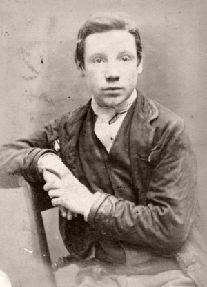
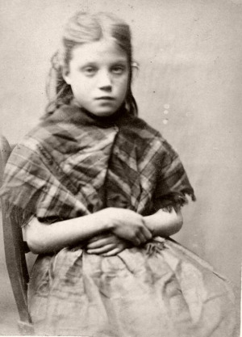
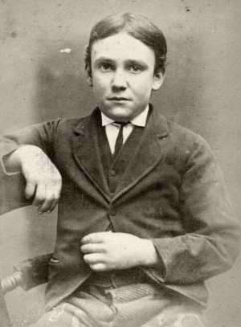
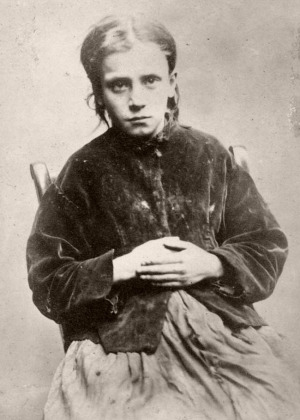
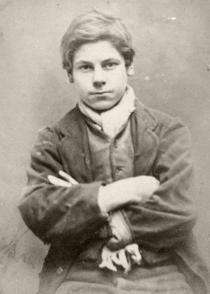
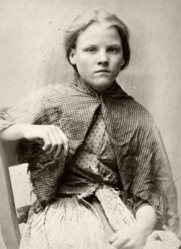
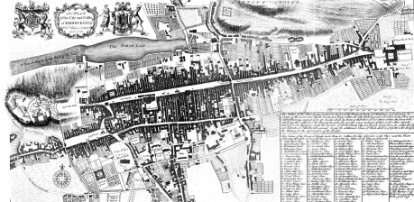

## Edinburgh, 1867

V dvadsiatych rokoch 19. storočia Glasgow zosadil Edinburg z pozície najväčšieho škótskeho mesta, a aj napriek rastu tlačiarenského, pivár­skeho a liehovarníckeho odvetvia ostatné mestá v Británii Edinburgu veľmi rýchlo utekali rýchlym tempom industrializácie. Z centra Edinburgu sa stala obchodná zóna, podporená v štyridsiatych rokoch dotiahnutím železnice do mesta z východu aj západu. Zo starého mesta sa postupom času stal ten najhorší slum s vysokou kriminalitou, chorobnosťou aj úmrtnosťou.

V roku pána 1867 vyšlo nariadenie o revitalizácii starého mesta, robotníci a automatoni začali slum postupne búrať. Tradičné hranice území detských gangov sa narušili, a v Starom Meste vypukol neľútostný boj o územie.

Predstavujete členov gangu Hajzlíkov, ktorí sa spolu spoznali v chudobinci.

## Hajzlíci

Tento doplnok obsahuje šesť vzorových detských kriminálnikov. Nižšie sa dozviete, ako si môžete vytvoriť vlastné postavy, členov gangu Hajzlíkov.

### Koncept

Vymyslite si koncept pre svojho hajzlíka, alebo si vyberte niektorý z nižšie popísaných konceptov.

- __Informátor__ – všade bol, všetko vie, zdrojom jeho obživy je obchodovanie s informáciami. Je na vás, či informácie predáva strážnikom, zločincom, alebo obom.
- __Bitkár__ – typický násilník, problémy rieši skôr päsťami ako rozumom, často býva surový až krutý.
- __Zlodej__ – premiestňuje drahé drobnosti z cudzích vreciek do svojich, v prípade prichytenia sa vie bleskovo stratiť v dave alebo tmavých uličkách.
- __Podvodník__ – ako sa hovorí, nekupujte mačku vo vreci, a určite nie od podvodníka. Môže sa stať, že tam budete mať tygra, alebo malého škreta. Falošné karty, cinknuté kocky, eso v rukáve – nikdy neviete, prečo ste s podvodníkom prehrali aj gate.
- __Vlamač__ – žiadne dver, zámok či vysoký plot nie sú pre vlamača problémom, len výzvou, za ktorou sa schováva rozprávková odmena. Alebo aj nie.
- __Lupič__ – vyhliadne si vás podľa výzoru boháča, počká si na vás v temnej uličke, a s krutým úsmevom a kudlou v ruke vás poprosí o peňaženku a iné cennosti. Násiliu sa skôr vyhýba, snaží sa v obetiach vyvolať strach. V prípade potreby sa však vie brutálne brániť.

### Meno

Vyberte svojmu hajzlíkovi meno, a nejakú prezývku, čo ho charakterizuje. Môžete sa inšpirovať [viktoriánskymi menami pre dievčatá a chlapcov](http://www.britishbabynames.com/blog/2015/04/top-200-most-popular-names-in-england-and-wales-in-1860.html), alebo [populárnymi priezviskami](https://www.geriwalton.com/surnames/).

### Aspekty

Aspekty charakterizujú vašeho hajzlíka, a zároveň určujú, ako „silný“ je v zmysle herných mechaník, keďže od počtu aspektov sa odvíja počet bodov, ktoré môžete rozdeliť medzi hajzlíkove schopnosti. Jednoduchým vodítkom pre určenie počiatočnéh počtu aspektov vašeho hajzlíka môže byť napríklad vek.

- __15+:__ 4 Aspekty, 24 bodov
- __11–15:__ 3 Aspekty, 18 bodov
- __do 10:__ 2 Aspekty, 12 bodov

Aspekty môžu vyjadrovať nasledovné veci, ale berte to len ako vodítko.

- __Zločin__ – aspekt viažúci sa na koncept, vyjadrujúci najvýraznejšiu zločineckú stránku vašeho hajzlíka
- __Úkryt__ – miesto, kde si hajzlík ukrýva svoje najcennejšie poklady, alebo kde sa v prípade núdze môže urkyť.
- __Nepriateľ__ – kto je hajzlíkov nepriateľ, a prečo?
- __Artefakt__ – predmet, ku ktorému má hajzlík výrazný osobný vzťah

### Schopnosti

Schopnosti, ktoré vaši hajzlíci môžu ovládať, sú rozdelené do štyroch skupín. Ak sa vám niektoré nehodia do vašej hry, kľudne ich nahraďte niečím iným z pravidiel, alebo si sami vymyslite.

- __Fyzické:__ Bitka, Nože, Beh, Šplhanie
- __Zločin:__ Vlámanie, Lúpež, Krádeže, Podvody
- __Prežitie:__ Výrečnosť, Nenápadnost, Podsvetie, Ulica
- __Vzdelanie:__ Čítanie a písanie, Počty, Reme­slo, Mágia

### Ciele

Krátkodobý cieľ by sa mal viazať priamo na herný príbeh, dlhodobý by malo byť niečo osobné pre vašeho hajzlíka.

## John Duffy

Prchký John (16) nemá ďaleko po úder päsťou alebo bodnutie nožom, keď ho niekto nahnevá, alebo ohrozí jeho kumpánov. Vo väzení si na neho málo kto dovolil vyskakovať, alebo to hneď trpko oľutoval. Napriek svojej útlej postave je mimoriadne húževnatý. Ellen berie ako svoju malú sestru, urobil by pre ňu takmer všetko.

### Aspekty

- Chceš do tlamy?
- V ruinách MacAndrewsovho skladu sú moje veci v bezpečí
- Húževnatý ako podošva
- Za bonzovanie Ewanovi MacOwensovi vyrežem jazyk

### Schopnosti Ciele

Bitka [ ][ ][ ][ ] Krátkodobý:

Nože [ ][ ][ ]

Krádeže [ ][ ]

Ulica [ ][ ] Dlhodobý:

Podsvetie [ ]

## Ellen Woodman

Myška Ellen (11) využíva svoj bežný zjav, šikovné ruky a rýchle nohy na okrádanie nepozorných ľudí v dave, najčastejšie na trhu alebo pri ne­ja­­kom zhromažde­nív uliciach. Ak ju niekto prichytí, brit­­­ký jazyk ju väč­ši­nou za­chráni od výprasku. Užíva si Johnovu ochranu, niekedy až na hranu únosnosti.

### Aspekty

- To vám určite z vrecka vypadlo!
- Teta Mabel ma vždy prichýli
- Strážnik Morris ma bezdôvodne šikanuje

### Schopnosti Ciele

Krádeže [ ][ ][ ] Krátkodobý:

Nenápadnosť [ ][ ][ ]

Výrečnosť [ ][ ]

Ulica [ ] Dlhodobý:

Nože [ ]

Beh [ ]

## Michael Fisher

Kominár Mike (13), ktorý sa v službe u starého Morga­na okrem vymetania ko­mínov naučil aj to, že ľudia si veľmi ľahkovážne ukrýva­jú ­svoje cennosti, a okrem dverí si svoje domy veľmi nezabezpečujú. Mike s Robertom obaja súperia o pozor­nosť Jane Farrelovej.

### Aspekty

- Strechy Starého mesta poznám ako svoju dlaň
- Som ako námorník, na každej povali mám skrýšu
- Potkan Lee chce zo mňa vytĺcť šperky Lady Wrightovej

### Schopnosti Ciele

Vlámanie [ ][ ][ ] Krátkodobý:

Šplhanie [ ][ ]

Beh [ ][ ]

Bitka [ ][ ] Dlhodobý:

Ulica [ ]

Podsvetie [ ]

Nože [ ]

## Jane Farrel

Hlavička Jane (12) ako jediná z Hajzlíkov vie čítať a písať, čo sa naučila v kláštornej škole pre siroty predtým, ako odtiaľ ušla. Zarába si ako po­slík, doručuje rôzne malé veci a odkazy a pri tom započuje rôzne informácie, ktoré za odmenu predáva tomu, kto dobre zaplatí. Všetko si zapisuje do dvoch denníkov schovaných na dvoch rôznych miestach. S Rosannou Watsonovou sú najlepšie kamarátky.

### Aspekty

- Tisíc malých tajomstiev
- Za uvoľneným kameňom pri pekárni moje veci nik nenájde
- Lord Cooper tuší, že viem o jeho nerestiach

### Schopnosti Ciele

Ulica [ ][ ][ ] Krátkodobý:

Výrečnosť [ ][ ]

Nenápadnosť [ ][ ]

Šifry a počty [ ][ ] Dlhodobý:

Čítanie a písanie [ ]

Beh [ ]

Podsvetie [ ]

## Robert Charleton

Fešák Robbie (16) je hlavou gangu Hajzlíkov. Charizmatický, statný, s bystrou mysľou vie vždy vymyslieť dobrý plán a je väčšinou o krok pred ostanými detskými gangami v Starom Meste. Od otca sa mu dostalo trochu vzdelania a výcvik v šerme a streľbe.

### Aspekty

- Môj otec bol dôstojník britskej armády
- V stokách pod Starým Mestom sa nik tak dobre nevyzná
- Smradľavého Clifforda Taylora na moje územie nepustím
- Otcove pištole

### Schopnosti Ciele

Výrečnosť [ ][ ][ ] Krátkodobý:

Ulica [ ][ ][ ]

Bitka [ ][ ]

Šerm [ ][ ] Dlhodobý:

Lúpeže [ ][ ]

Beh [ ]

Šplhanie [ ]

Vzdelanie [ ]

## Rosanna Watson

Drzá Róza (13) sa pozná takmer s každým priekupníkom, šmelinárom a pašerákom v Edinburghu a zabezpečuje výmenu nadobudnutých vecí za hotovosť. Najlepšie vzťahy má so židovským starožitníkom Abrahamom.

### Aspekty

- Viem, kto kúpi, viem, kto predá
- Komôrka u starého Abrahama Goldberga
- Ryšavý Harry ma nesmie chytiť

### Schopnosti

Podsvetie [ ][ ][ ][ ]

Výrečnosť [ ][ ]

Ulica [ ][ ]

Podvody [ ]

Krádeže [ ]

### Ciele

Krátkodobý:

Dlhodobý:

## Nápady na príbehy

### Krvavý dych

Starým mestom sa začala šíriť neznáma nákaza. Nakazení ľudia trpia horúčkami a vykašliavajú krv, odtiaľ prezývka Krvavý dych. Starosta vyhlásil karatnénu Starého mesta, strážnici Mestskej stráže nepustia nikoho ani von, ani dnu. Povráva sa, že jeden alchymista z Nového mesta má liek. Dostať sa k nemu by predstavovalo super príležitosť zarobiť si, teda ak vyriešite problém, ako dovtedy neumrieť od hladu.

### Podpaľač

V priebehu týždňa zhorelo niekoľko výčapov, dva nevestince, jedáleň a sklad sušených rýb. Niekto cielene zakladá požiare, ktoré sa len tak tak darí zvládať. Strážnici ako osy prehľadávajú Staré mesto, vyhlásili stanné právo, no aj tak sa nedarí zastaviť vlnu požiarov. Blízko úkrytu jedného z hajzlíkov sa na stene objavil piktogram znázorňujúci postavu v plameňoch. Čo sa stane dnešnú noc?

### Vojna gangov

V ďalšej fáze revitalizácie automatoni zrútili dve ulice na západe Starého mesta, a Červení potkani, poväčšine deti tlačiarov, ktorí prišli o svoje teritérium sa pchajú na vaše územie. Je ich viac, a sú agresívni. Ako ich zastavíte?

### Automaton na úteku

Povráva sa, že do Starého mesta ušiel prototyp nového automatona. Archmajster mechanik Lord Evans vypísal vysokú odmenu za dolapenie a vrátenie automatona. Prešiel týždeň, každý deň sa objavia správy, že niekto zazrel automatona, ale nikomu sa ho ešte nepodarilo objaviť. Presakujú zvesti, že sa jedná o nový typ vyvíjaný na zákazku pre armádu. V stokách sa objavilo niekoľko mŕtvol. Súvisia vraždy s automatonom na úteku? Je naozaj nebezpečný? Alebo sa len niekto snaží zahmlievať a odviesť pozornosť od niečoho iného?

### Zrada

Šušlavý Owen, jeden z vašich kontaktov, vás poveril doručením malej drevenej schránky na určitú adresu. Prízvukoval vám, aby ste išli všetci, aby jedného poslíka náhodou niekto neokradol. Na danej adrese ste našli len stopy po zápase, krvavé fľaky, a dve mŕtvoly s potkanmi v ústach. Zrazu sa dvere zabuchli, a niekto ich zabarikádoval zvonku. Na strechu dopadlo niekoľko fakieľ a dom začína horieť. Čo sa to do čerta deje, a ako ujsť z horiaceho domu?

### Duel

Po niekoľkých stretoch so Žolíkmi, gangom zo susednej ulice, z ktorých ste si odniesli nie len modriny, ale aj krvavé šrámy, vyzýva Zúrivec Jimmy Roberta na súboj. Víťaz berie všetko, v tomto prípade územie a dievčatá z gangu. Ako sa k výzve postaví Robert? Budú Ellen, Jane a Rosanna súhlasiť, aby o ich ďalšom osude rozhodol duel s povestným bitkárom, ktorého zatiaľ nikto v priamom dueli neporazil?

### Horúci kontraband

Ryšavec Llewelyn prišiel za vami celý dobitý a skrvavený, a poprosil vás o ukrytie malej kovovej krabičky. Veľa nevysvetľoval, len rýchlo upaľoval kade ľahšie. Na druhý deň sa našla jeho hlava na námestí, a zvyšok tela po kusoch v okolitých uličkách. Kto ho takto kruto zniesol zo sveta, čo je v zamknutej krabičke, a čo s ňou urobíte?

### Protislužba

Jednouchá Molly zo spriateleného gangu Lasičiek vás prišla poprosiť o pomoc. Na ich územie sa tlačia Korzári, deti námorníkov, a Lasičkám začína horieť pod nohami. Postavíte sa proti Korzárom, s ktorými ste zatiaľ nemali žiadny spor, a budete riskovať krvavé stretnutie? Alebo odmietnete priateľku, ktorá vám už neraz zachránila kožu?

### Stratený v stokách

Jeden z vašich kamarátov sa stratil v stokách pod starým mestom, kam sa vybral ako sprievodca niekoho z Nového mesta, čo sa chcel nepozorovane dostať von z Edinburghu. Už niekoľko dní sa neukázal, a povráva sa čosi o svorke túlavých psov a viacerých nezvestných ľuďoch. Pôjdete ho hľadať?

### Poľovačka na Líšku

Celé Staré mesto prehľadávajú strážnici, čo sa sem za normálnych okolností boja strčiť nos. Prehľadávajú dom za domom, ulicu za ulicou, pivnicu za pivnicou, na križovatkách zanechávajú ozbrojené hliadky. Koho hľadajú a prečo? Takúto rozsiahlu agresívnu akciu strážnikov si nik v Starom Meste nepamätá.

### Stratené šperky

Fúzatý Willy vás vydiera, žiada vás o nájdenie a získanie špekov, o ktoré prišiel v kartách na východnom konci Starého mesta. Je to územie Divokých chlapcov, na ktoré sa nik cudzí neodváži vstúpiť. Ako šperky nájdete? A splní zúfalý Willy hrozbu, že prezradí vašu skrýšu a zločiny strážnikom, ak mu šperky nedonesiete do nedele?

### Falošné peniaze

Priekupník, ktorý vám zaplatil za ukradnuté zdobené duelové pištole a dýky, ktoré ste s nasadením života získali na riskantnej výprave do Nového mesta, s vami vybabral. Keď ste zo získaných peňazí chceli zaplatiť “poplatok za ochranu” seržantovi Millerovi strážiacemu bránu do Nového mesta, aby si vás nevšimol, keď tam idete, Miller vám ich hodil k nohám, a navrieskal na vás, že ste obyčajní podvodníci. Ak mu do zajtra nedonesiete jeho podiel, pri najbližšej príležitosti vás dá zavrieť naspäť do väzenia.

## Mapa Starého mesta

Originál obrázku nájdete na adrese:

- [https://ewh.org.uk/maps/](https://ewh.org.uk/maps/)
