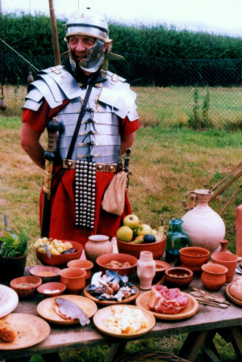
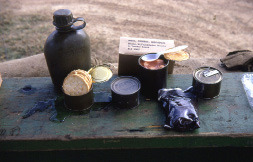
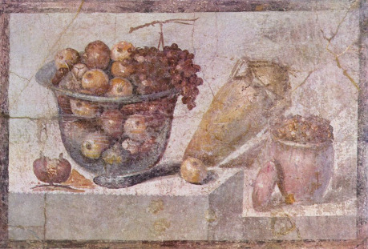

Nedávno se mi dostala do ruky kniha historika Ivana Šedivého _Češi, české země a Velká válka_. Kromě politiky, národnostních a společenských otázek, samotného průběhu války a dalších bodů se výrazně věnuje i otázce zásobování armády i civilního obyvatelstva, a to zejména – ale nejenom – potravinami. V kapitole Život v zázemí se například dočteme, že v roce 1914 spotřebovala Plzeň (tehdy osmdesátitisícové město) týdně neuvěřitelných 1227 vepřů – ale koncem roku 1917, kdy se maso pro většinu lidí stalo vzdáleným pojmem a příděly byly směšně nízké, to bylo pouze 15 vepřů týdně. Mléko většina dospělých lidí mimo rodiček ani neviděla. Cukru bylo pomálu a káva prakticky úplně zmizela v roce 1915. Relativní náklady na domácnost rostly. Jak vojáci, tak civilní obyvatelé stále silněji trpěli podvýživou.

Takové věci ve fantasy až tak často nepotkáváme, že? Vzpomněla jsem si při tom ovšem na fantasy román, ve kterém se podobné záležitosti také řešily do oněch klíčových detailů. Jde o _Noční hlídku_, dvacátou sedmou část série _Zeměplocha_ Terryho Pratchetta. Hned na úvod musím upozornit, že existuje řada dalších fantasy, které se rolí zásobování zabývají. Jen se zdá, že jsou zatím v menšině, a málokde se tato otázka projeví tak výrazně jako právě v Pratchettově _Noční hlídce_.

Ostatně posuďte sami v příslušné ukázce (autorem překladu je Jan Kantůrek), kdy kapitán Elánius uprostřed povstání za barikádami uvažuje: „Město jako Ankh-Morpork dělí od chaosu v nejlepším případě jen dvě jídla. Denně pokládaly za Ankh-Morpork život stovky krav. Dál to bylo stádo ovcí, stádo prasat a jen bohové vědí, kolik kuřat, slepic, kachen a hus. Mouka? Slyšel, že je to asi osmdesát tun, zhruba stejné množství brambor a dvacet tun slanečků. On vlastně ani nechtěl znát takové věci, ale jakmile člověk jednou začal řešit ten věčný dopravní problém, byly to údaje, jimž jste se nevyhnuli. Každý den snesly slepice pro město čtyřicet tisíc vajec, stovky, tisíce vozů, člunů a bárek přijíždělo do města s nákladem ryb, medu, ústřic, oliv, úhořů a humrů. Pomyslete na všechny ty koně, kteří táhli vozy a větrné mlýny … a na vlnu, která byla také denně dovážena do města, plátno, tabák, koření, rudu, dřevo, sýry, uhlí, tuk, maziva, seno, a to každý zatracený den …“

Každá armáda v historii – a každé civilní obyvatelstvo po jejím boku – potřebovala jíst. Potřebovala i oděv a zbraně. A čím byla modernější, tím více věcí se pro ni stalo nepostradatelnými: uhlí, nafta, jaderné reaktory, počítače, internetové připojení … Odřízněte infrastrukturu a dosáhnete chaosu. Ostatně svět jako takový je stále závislejší na poměrně křehké infrastruktuře. Vojenské či hackerské útoky mohou napáchat dalekosáhlé škody, ale přece jen těžko uvrhnou svět do globální apokalypsy. Ovšem přírodní katastrofy jako delší doba velmi intenzivní sluneční aktivity, která by usmažila satelity i řadu povrchové infrastruktury, nebo extrémní sopečný výbuch ústící v desetiletí zimy, výkyvů srážek, kyselých dešťů a ztrátu úrody na mnoho let – na takové věci je dnes civilizace (pozor, nikoliv člověk jako jednotlivec) citlivější než kdy předtím.

To mě přivádí k další zajímavé a u nás zatím prakticky neznámé fantasy. Nebyla totiž ještě přeložena do češtiny. Jde o trilogii _The Broken Earth_ (doslovně _Rozbitá Země_) od americké autorky N. K. Jemisinové. Romány se odehrávají na Zemi vzdálené budoucnosti a jsou lákavou směsí fantasy a science fiction. Zásadní roli v tomto světě hrají sezóny neboli období zimy a hladu po silných vulkanických explozích, na něž je tamní civilizace zvyklá a snaží se být připravená – ale co zmůže snaha proti události, která roztrhla kontinent vejpůl? Série je vynikající a snad se časem dočká i českého překladu. Skutečnost, že byla oceněna hned dvěma prestižními cenami Hugo (první i druhý díl se dočkaly ocenění za nejlepší román daného roku), tomu snad napomůže.

I v této trilogii je patrné, že civilizace je na zásobování a obecně infrastruktuře životně závislá. Právě to může vytvářet nové výzvy a překážky, nové palčivé problémy, které musí hrdinové řešit a se kterými těžko pomůže nějaký kouzelný meč nebo čestné slovo – což si velmi dobře uvědomuje i již zmiňovaný kapitán Elánius v _Noční hlídce_. Spousta různých faktorů může vyhrát válku, obzvlášť v rozmanitých fantasy světech, kde hraje roli i magie. Pokud vám však schází něco tak „triviálního“ jako zásoby, jste pravděpodobně na nejlepší cestě ji prohrát.
