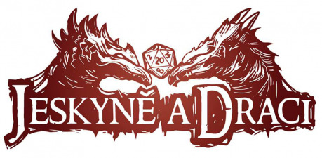
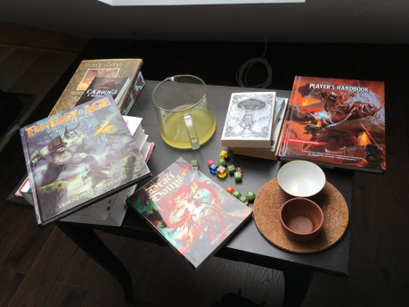

Jeskyně a draci vychází:

- ve zbrusu novém grafickém kabátě,
- kompletně česky,
- plně kompatibilní s D&D páté edice.

Mohl bys nám na začátku říct něco o projektu „Jeskyně a draci“ (zkráceně „JaD“) a trochu nám ho představit?

Díky tomu, že _Wizards of the Coast_ zveřejnili SRD k páté edici Dungeons and Dragons, naskytla se jedinečná možnost přenést pravidla Dungeons and Dragons do českého prostředí. Tak se zrodil projekt __Jeskyně a draci__.

Je to zároveň jedinečná příležitost pro hráče, autory i teoretiky rolových her zapojit se do projektu, který v ČR nemá obdoby (čímž bych rád vyzval každého, kdo by měl chuť se na Jeskyních podílet, aby mě bez váhání kontaktoval).

Našim cílem je přinést českému hráči plnohodnotně lokalizovaná pravidla D&D v tištěné i elektronické formě a využít potenciál této světově nejhranější hry na hrdiny k zapojení celé komunity hráčů a tvůrců.

Tím se dostáváme k tobě. Zkus se čtenářům trochu představit – kdo jsi, co děláš, jak ses dostal k hrám na hrdiny a tomu, že je vydáváš?

Někdy v roce 1993 se mi do rukou dostalo Jarikovo dobrodružství, tím to celé začalo. Svoje první RPG jsem vytvořil ještě týž rok – pravidla byla tehdy raritní, a když jsem chtěl kamarádům ukázat, jak se taková hra hraje, sepsal jsem takový remake z toho, co jsem si ze hry pamatoval.

Hraní her na hrdiny byla už od mých dvanácti let v mém okolí docela vděčná zábava, měl jsem štěstí na lidi, takže jsme hrávali často a postupně to přerostlo v navrhování vlastních pravidel. Z toho období mám v šuplíku několik zajímavých nedokončených projektů, ke kterým se třeba na stará kolena vrátím.

Někdy ve čtrnácti letech jsme se s kamarády, s nimiž jsme hrávali Dračí doupě, vydali na první dřevárnu (byla to Bitva pěti armád v Krnově), pak jsme začali dřevárny pořádat a z toho podhoubí pak vznikl v roce 2005 Fantasyobchod, který mě živí dodnes.

O nějakých pět let později se odněkud vzala myšlenka založit vlastní vydavatelskou značku. V té době jsem měl odstudovány čtyři roky Filologie na FF Ostravské univerzity a byl jsem do knížek celkem blázen a náhoda tomu chtěla, že jsem na RPGForu narazil na v podstatě hotovou příručku Příběhů Impéria která mě nadchla. A tak vzniklo _Mytago_ a jeho první publikace.

Aktuálně mám na kontě více než 50 publikací a vydavatelský plán je nacpaný k prasknutí. Naše tituly se už od počátku točily kolem her na hrdiny – ať už to byly pravidla, rozšíření, asterionské moduly nebo třeba knižní řada _Hry s příběhem_ nebo asterionská knižní řada. Záhy jsme se vrhli také na gamebooky, vydáváme _Lone Wolfa_, dělali jsme i Fighting Fantasy a čeká nás zářná budoucnost. :)

Zpátky k Jeskyním a drakům … jak ses vlastně k překladu DnD dostal? Proč DnD 5? Jak se stalo, že se ten projekt rozjel, a kdo se na něm podílí, případně podílel?

Narazil jsem na RPGforu na zprávu od Radima Havlíčka (Shadowww), že na Dungeon Masters Guild začal nabízet Základní pravidla pro hráče D&D páté edice. Zavětřil jsem příležitost, slovo dalo slovo a vznikl první nástřel spolupráce.

Já často jednám hodně kompulzivně, takže jsem se do toho vrhl celkem po hlavě a celé noci jsem seděl v Shadowwwových překladech, uspořádával texty a korigoval to s SRD. V počáteční fázi jsme se na práci podíleli jen já, Shadoww a Jiří Hanslian (Gurney), Gurney nakonec z časových důvodů od spolupráce ustoupil a nyní nám autorsky pomáhá Sirien. Snažím se projekt udržovat co nejotevřenější, aby se kdokoli z komunity mohl zapojit – tak rozsáhlou práci v českých podmínkách není možné jinak zvládnout. Hodně nám díky tomu pomáhá třeba Jiří „Mirkul“ Vykoukal, který upravuje a formátuje některé z textů nebo Matěj „WlkeR“ Bína, který organizuje práci na textech pro bestiář. Oslovili jsme také české autory fantasy literatury, kteří píší některé fluffové texty, výtvarníky, programátory …

Jak se vlastně bude JaD lišit od originálu? Bude mít něco navíc? Rozšiřujete původní texty nějak? Vyplatí se pořídit si JaD, i když znám originál?

Odlišnost zde bude, ale nikterak zásadní. Mým cílem bylo přenést Dungeons and Dragons mezi česky mluvící hráče. Pokud by zde byla možnost pouhého překladu, šel bych tou cestou. Ale protože musíme vycházet jen z toho, co nabízí SRD, nemalá část věcí se musí psát autorsky. Klade to na nás velké nároky, protože už samotné korektury a redakce překladových textů jsou časově velice náročné. Shánění nového obsahu je tak spousta práce navíc.

Jeskyně a draci budou plně kompatibilní s D&D páté edice, budou mít ale původní český fluff, malinko jiné řazení některých informací a některá pravidla jsme si dovolili přeformulovat tak, aby působila srozumitelněji + přidali jsme nové příklady. Budeme mít taky vlastní ilustrace (o které se stará autorský tým kolem Petera Scholtze). Velké množství autorských textů pak přinese příručka Pána jeskyně, tam osobně vidím velký potenciál.

Pro hráče, co už nyní hrají dle pravidel D&D 5e, představují Jeskyně a draci hlavně podporu komunity hráčů a lokálních autorů. Jeskyně mají potenciál zpopularizovat stolní RPG mezi širokou veřejností a zvětšit tak komunitu hráčů her na hrdiny – díky tomu se budou snáze shánět spoluhráči, více lidí bude psát dobrodružství a doplňky pro JaD/D&D, bude snazší získat radu ohledně pravidel, může být více otevřených hraní, více článků a třeba se dočkáme i několika vydaných dobrodružství nebo webu s původními českými doplňky.

Oproti neoficiálnímu překladu D&D páté edice (z něhož Jeskyně vychází) budou hlavní devizou JaD redakční a korektorské práce – stávající překlad je výborný (tímto smekám před neutuchajícím překladatelským entuziasmem Shadowwwa), ale přece jen je na něm znát, že se jedná o one man show. Já teď hodně textů přepisuju, piluju některé překlady a fráze a myslím, že výsledný text, který ještě projde řádnou korekturou a proofreadingem bude opravdu pěkný a čtivý.

Kolik na tom bude pracovat ilustrátorů? Jak se ten tým dával dohromady?

To vše je v režii Petera Scholtze, nicméně já komunikuju pouze s Peterem, který práci na ilustracích sám řídí a deleguje. V týmu by měli být autoři, kteří se podíleli na ilustracích pro jeho hru Sorcerer, a také Rimbo. Některé ukázky ilustrací jsme již vypustili na sociální sítě a já jsem zatím nadmíru spokojen.

Jak probíhají práce na JaD? Pracujete na tom po večerech nebo jako full-time job? Jak se koordinujete?

Předně bych rád řekl, že veškerou práci na JaD dělají všichni autoři bez nároku na honorář ve svém volném čase. Já si často ukrajuju ze svých pracovních povinností – jak obchodních, tak nakladatelských – a mnohdy celou pracovní dobu prosedím nad stránkami D&D, přepisuju texty a pátrám po alternativních překladech nebo řeším propagaci projektu. Na druhou stranu, třeba přes vánoční sezonu, kdy se obchodu musím věnovat téměř 24 hodin denně, musel projekt stranou a tři měsíce odpočíval, abych se k němu zase v lednu vrátil.

Musím říci, že je to hodně návyková práce, je to zatím největší projekt, který jsem dělal, a předpokládám, že nic takhle monstrózního už nikdy dělat nebudu. Beru to jako takový vrchol mé nakladatelské kariéry.

Co se týče koordinace práce, rozhodl jsem se celý text zpracovávat v markdownu, aby byl zdroj co nejjednodušší a aby se s ním bez problému dalo dále pracovat. Momentálně používáme Stackedit.io, kde kolaborativně pracujeme na příručce pro PJ.

Napadá tě nějaká zajímavost o vývoji (o kterou by ses rád podělil)?

Zajímavost ve vývoji asi jen to, že je to v mnoha ohledech velice punkové. Standardně by celá věc měla proběhnout tak, že se ustálí překladový klíč, udělá se překlad, redakce, korektury, proofreading. Já mám ale na stole přeložený text a překladový klíč, v něm se snažím dělat změny, protože ne vše je přeložené dle mých představ, vše konzultuju s Radimem Havlíčkem a následně s komunitou a pak zapracovávám do svých draftů. Do toho se paralelně pracuje na nových textech a zároveň má text k dispozici několik nedočkavých proofreaderů, kteří třeba připravují aplikace pro Asterion nebo Neviditelnou knihu – takže chodí zpětná vazba od nich.

Ale kupodivu to vše funguje a cvrkot kolem JaD je čím dál hlasitější. Takže v pořádku.

Z čeho máš ty osobně na JaD největší radost?

Asi z toho, že je to vskutku mamutí projekt, který má i přes svou rozsáhlost šanci na zdárné dokončení. Obecně mě kompilační práce s textem hodně baví, takže práce na Jeskyních jako taková je pro mě většinou skutečně zábavná.

Mají možnost se do projektu nějak zapojit další autoři?

Doufám, že se mi alespoň trochu podaří nakopnout komunitu, aby si hráči a tvůrci uvědomili, že větší projekt, do kterého by se mohli zapojit, tady třeba už nikdy nebude (ať už proto, že se neobjeví další otevřená licence na tak kvalitní produkt nebo proto, že se nenajde druhý blbec, který do toho investuje kopec času a hromadu peněz z čiré lásky k RPG). Takže každý, kdo má něco v šuplíku, umí psát, kreslit, konstruktivně kritizovat, by prostě měl přiložit ruku k dílu, protože tohle bude NĚCO!

Kdy se můžeme na JaD těšit?

Rád bych vše dokončil ještě letos. Myslím, že je to reálný odhad, vydrží-li mé nadšení a nadšení všech přispěvatelů. Klíčové pro mě ale bude, aby ten produkt byl dobře odladěný.

Plánujete pro dokončení projektu nějakou další podporu pro hráče? Webové stránky, fórum, dodatečné příručky?

Pracujeme na mobilní aplikaci, určitě se budeme snažit živit web (tady mimochodem přidám další inzerát – sháním člověka, který by mi pomohl s modulem pro Wordpress …). Máme rozjetou spolupráci s autory Asterionu, Neviditelné knihy a Končiny, takže k těmto světům budou aplikační moduly a další spolupráce se rýsují – rádi bychom kupříkladu s Jeskyněmi pronikli na Youtube a další video kanály.

My moc děkujeme za rozhovor a držíme palce při dokončení projektu!
