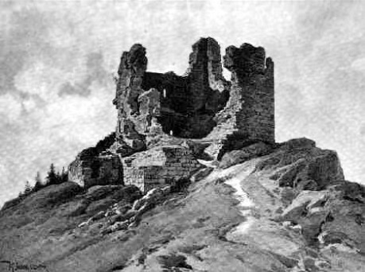

## I.

Tato událost je elegantním důkazem, že hory a kopce zřejmě fascinovaly lidi odedávna. Pohled z výraznějšího kopce, který má alespoň sto metrů výšky proti okolí, je něco, co se nedá úplně zprostředkovat popisem; je nutné to zažít. Obvyklá perspektiva krajiny se mění, svět se naklání do neobvyklých úhlů. Na rovině – třeba na klidném moři nebo na poušti – lze vidět jenom asi do pěti kilometrů; dál tomu brání kulatost Země. Už běžná středověká věž – třeba desetimetrová – tento poměr výrazně zlepšuje, teoreticky se dostanete někam ke 30 kilometrům. Pokud vám ovšem ve výhledu nebrání další kopec, strom nebo něco jiného, což v našich podmínkách většinou ano. Kopec tento poměr ještě [zlepšuje](https://www.placata-zeme.cz/zakriveni-zeme/). Opět s tím omezením, že pohled se obvykle zarazí o jiný kopec. V údolí Rýna, které je široké asi padesát kilometrů, celkem pohodlně vidíte z jedné strany na druhou, protože na obou jsou tisícimetrové hory. V Alpách, nejvelkolepějších evropských horách, to dopadá podobně; krajina se zvláštním způsobem uzavírá ve třetí dimenzi; výška kopce je často důležitější než to, jak je kopec daleko.

Takže první věc, kterou kopce přinášejí odedávna, je __výhled__.

Někdy stačí v dávných dobách i ten výhled samotný. Vidíte nepřítele na mnoho kilometrů, jak se k vám blíží, a máte možnost se na něho připravit. Nápad s [Gondorskými majáky](https://www.youtube.com/watch?v=i6LGJ7evrAg) není nějaký Tolkienův fantazy výmysl, přesně tohle se na vhodných místech v Evropě dělalo, u nás například ve Středohoří a v Lužici, kdy si města a panství takto jednoduše předávala varování o tom, že na ně táhnou husiti.

Výhled neznamená jednoduše totéž, co výška kopce. Vzpomínám si, jak jsem byl jako dítě na výletu na nějakou šumavskou horu – už nevím přesně kterou – a řekli mi, že jsem na nejvyšším místě, kde jsem kdy v životě stál. Nicméně můj pocit tehdy bylo obrovské zklamání. Kopec rozhodně nevypadal nijak impozantně, cesta v lese se mírně zvedala až k tomu místu, kde jsme stáli, a to bylo celé. A nebylo tu naprosto nic vidět! Všude kolem úplně stejný les, jako kdekoli jinde.

Přesně tohle se vám může stát ve střední Evropě hodně často. Mnoho míst se zdánlivě impozantní nadmořskou výškou přes 1000 metrů z krajiny nijak výrazně nevyčnívá. A ještě více vrcholů je porostlých lesem, často jehličnatým, takže se výhled nezlepší ani uprostřed zimy. Zrovna Šumava je z hlediska velkolepých výhledů celkem propadák.

Naopak ale můžeme najít místa, která nijak moc přesvědčivě vysoko nejsou, ale výhled je tu přímo kolosální, jako například kopec s divným – zřejmě keltským - jménem [Ers](https://cs.wikipedia.org/wiki/Ers). Nepřítele jdoucího od severu zdálky výtečně vidíte, musí jít proti vám do táhlého kopce a ještě mu bude svítit slunce do očí. Buď to opravdu dobře vymyslel dávný vojevůdce Čechů, nebo alespoň Kosmas, který o tom vyprávěl a který měl zřejmě o vojenské taktice slušnou představu.

Výhledu lze využívat trvale, pokud na kopci vybudujeme __výšinnou pevnost__. Obráncům tu prostě pomáhá gravitace. Útočník vybíhá do kopce, obránce na něho shora pohodlně střílí. A i boj na blízko je s jasnou výhodou pro obranu; útočník se musí drápat na nějakou stěnu, nejspíše po žebříku, obránce stojí nahoře a má volné obě ruce. Pokud dojde na jakoukoli obléhací techniku, počínaje jednoduchým beranidlem, pak to je všechno nutno dostat do prudkého svahu, což může být často nemožné. A pokud zkusíme pevnost na kopci něčím ostřelovat, pak se ve směru do kopce dostřel i účinnost střelby povážlivě snižuje.

__Střelba z hradeb__ tedy zřejmě patří k výšinné pevnosti už od pravěku. Jak byl vynalezen luk a hradba, na které se dalo stát – třeba jen dřevěná nebo hliněný val – tak to nejspíš někoho muselo napadnout. Obránce se při tom může krýt za hradby, útočník nikoli. Stavitelé pevností proto velmi rychle odhalili, že kopec kolem výšinného hradiště nebo pozdějšího hradu je třeba kompletně vykácet a udržovat bez vyššího porostu, nejméně na vzdálenost dostřelu. A čím dále, tím lépe. Romantické představy hradu v lese je proto třeba se úplně vzdát – je to nedopatření, způsobené tím, že se o hrad nikdo náležitě nestará.

Pro ideální výšinnou pevnost potřebujeme kromě výhledu ještě druhou vlastnost, a to je __špatný přístup__. Pokud je přístup ideálně jen z jediné strany, pak stačí vlastně důrazně bránit jen toto kritické místo a máme problém obrany vyřešen. Tohle stojí za kolosální oblibou [berg­fritové dispozice](https://cs.wikipedia.org/wiki/Hrad_bergfritového_typu) u nás v době __nástupu kamenných hradů__ v polovině 13. století. Stačilo prostě „ustřihnout“ nějaký výběžek hory suchým příkopem, za příkop na nejohroženější místo postavit ten bergfrit a bylo vše vyřešeno.

V druhé etapě středověku, po zdokonalení střelby na dálku, zejména za těch husitů, to už tak jednoduše nefungovalo. Problémem se staly všechny sousední výšiny kolem pevnosti, zhruba do několika set metrů daleko. Ze všech těchto míst uměli tehdejší dobyvatelé hrad účinně ostřelovat katapulty nebo dokonce děly. Řešením bylo opevňování i těchto podezřelých míst oddělenými malými pevnůstkami, případně zvýšená obliba __osamělých kopců__, jako je třeba [Ronov](http://www.hrady.cz/?OID=266). S poměrně malými náklady tu vznikla pevnost, tehdejšími prostředky 15. století prakticky nedobytná. Střelba do relativní výšky několika set metrů byla prakticky neúčinná. A pokud uvažujete o obléhání, potom je takové kruhové obležení osamělého kopce akce neúměrně nákladná výsledku – potřebujete několikanásobně velké vojsko proti tomu, jaké má obránce, a je veliká šance, že vám dojdou zásoby dříve, než obránci, který se na to mohl v klidu připravit.

Představa hradu na co nejvyšším kopci není při tom pro středověk správná. Inventurou našich hradů zjistíte, že Přimda s 800 metry výšky je prakticky rekordní, daná jen velmi zvláštními okolnostmi; i 600 metrů, jako třeba [Bezděz](https://cs.wikipedia.org/wiki/Bezděz_(hrad)) nebo [Ralsko](https://cs.wikipedia.org/wiki/Ralsko_(hrad)), jsou pro hrad docela vysoké kopce.

## II.

Odvrácená strana pohledu z vrchu je pohled opačný, z údolí nahoru. Hory potom tvoří přirozený rám pohledu, omezení, kde krajina prostě a logicky končí, asi jako ve starých počítačových hrách. Dál nelze jít a nic tam není. Možná spadnete přes okraj světa. __Hranice.__ Sem můžeš, ale dál už ne.

Kromě údolí v Alpách, kde hory přirozeně rozdělily zemi na mnoho samostatných částí, jsou asi nejvzornějším příkladem Čechy. Největší hory jsou na okraji a celé to ohraničují; země je tak jasná a logická, jako kdyby ji vymyslelo dítě. Naše hranice také patří mezi nejstarší doložené; Kosmas ji popsal už v 11. století.

Středověkou hranici si při tom nelze představovat jako tu dnešní – sloupy s cedulemi a závoru s celníkem, jak je k vidění v některých pohádkách. Hranice probíhala s nonšalantní neurčitostí někde uvnitř hraničního hvozdu, který u nás ty hory přirozeně porůstal. Nebylo třeba vědět, kde přesně hranice leží; les byl obrovský a k ničemu neužitečný. Celý patřil knížeti, později povýšenému na krále.

Samozřejmě, že nejasností o přesné rozloze hraničních lesů občas zkoušeli různí podnikavci využít. V Kosmově kronice se dočteme o hradu [Přimda](https://cs.wikipedia.org/wiki/Přimda_(hrad)), který postavili roku 1121 „nějací Němci“ již zjevně na naší, české straně a bez dovolení knížete. Český kníže Přimdu zabral a tím jsme získali vlastně úplně první prokázaný středověký kamenný hrad, popsaný v předchozí části. Víme také od té doby, že u Přimdy začínají Čechy. Velmi podobný příběh se potom odehrál ještě ve 12. století s Chebem, i zde postavili hrad vlastně Němci a Češi ho potom získali, tentokrát mírovou cestou.

Podobné výspy civilizace v horách jsou ve středověku ještě výjimečné. Dokládají spíše to, že do vyšších hor chodil člověk od pravěku hlavně proto, že se potřeboval dostat z jedné strany hor na druhou. Přimda je tedy u __průsmyku__, kterým byly hory odedávna překonávány. Vedla tudy zemská stezka, která nás spojovala se západní Evropou. Význam místa je vlastně tisíc let stále stejný. Jakmile se prořítíte po dálnici D5 z Německa a vidíte Přimdu, je mimo pochybnost, že už jste doma.

Zcela podobné to je na spoustě jiných míst. Kdysi tu někdo postavil hrad na ochranu cesty v průsmyku. Třeba ve Strážném za Vimperkem. Ona již taková jména jako Strážnice nebo Uherský Brod leccos napovídají. Přechod k Trenčínu používali zřejmě již Římané. Přes Jeseníky se chodilo někde u Hanušovic, klasické přechody do Polska jsou u Králíků, Náchoda nebo Žacléře. V případě cesty na sever do Lužice bylo nejdůležitějším bodem Jablonné, do Saska se dostal člověk zejména Nakléřovským průsmykem, kde vede starodávná zemská stezka, opět přeměněná v současnosti na dálnici. Čím výraznější je snížení hor, tím je průsmyk oblíbenější a významnější.

Kromě strážních hradů, typicky vznikajících ve 13. století nebo ještě později, muselo poblíž těchto míst vznikat zákonitě nějaké podhradí k jejich obsluze. Stejně přirozené jsou nějaké krčmy k přespání.

Když si všimneme podobné situace ve větších horách, například v Alpách, i zde vznikala podobná místa ve významných průsmycích, obvykle pojmenovaných po nějakém svatém. Bylo to nepohodlně vysoko, ale lidé tam museli, a to už od dob antiky. Brennerský průsmyk, například, který vede jižně od Innsbrucku do Itálie a procházela tudy zřejmě většina našich poutníků k jihu, od vojáků krále Vladislava ve 12. století až po Karla Hynka Máchu. Cesta vás vyžene do 1300 metrů vysoko, tedy zhruba na úroveň vyšších hor na Šumavě. Najdeme tam dnes obvykle městečko s kostelem a jmenuje se to po nějakém svatém.

Stáří těchto kostelů napoví, kdy byly vystavěny; dost často středověké nejsou a bývají novější. Pokud bychom si představili krčmu na takovém místě již ve středověku, je třeba si uvědomit, že to znamená stejně obtížný provoz, jako dnešní horská bouda. Všechny zásoby musíte vynést nahoru po obtížné cestě. Po řadu týdnů v zimě se do místa možná nedostanete vůbec. V takové době zřejmě i prudce opadne počet vašich hostů, protože kdo nahoru opravdu nemusí, rád si počká do jara. Pokud vám cestu strhne lavina, pokud vás postihne nemoc, pokud vám dobytek sežerou vlci, nikdo vám nepomůže, protože nejbližší sousedi jsou mnoho mil za hromadami sněhu. Není divu, že se i v hodně navštěvovaných průsmycích život rozvíjel velmi pozvolna a opatrně.

U nás vlastně nevím o žádném časnějším dokladu života v horách, než je ta Přimda. Leží v osmi stech metrech výšky, což je docela dost, jak uvidíme dále.

## III.

Zkusme si představit, jaký vliv mají horské podmínky na možnosti __zemědělství__. Po dvou souvislých letech života v Českém středohoří, ve výši zhruba vrcholu hory Říp, mohu říci, že ten vliv je obrovský a člověk žijící ve městě si to vůbec nemusí uvědomit. Vesnice, která má horní konec o padesát metrů výše, než dolní, ukazuje, že i tento zdánlivě malý rozdíl je poznat na počasí. Na tom dolním konci ve 400 metrech končí úplně nejvyšší cíp obdělávaných polí, výš už pokračují jenom louky. Někdo se o této výšce rozhodl zřejmě už v tom středověku a věděl přesně, co dělá. Zjistíte, že v podobné výšce končí u nás pole v naprosté většině případů. Výš by čekalo rolníka mnohem víc kamení, mnohem větší sklon terénu a s tím spojená těžší práce, pokud máte orat brázdu do kopce. Vegetační doba se viditelně zkracuje; máte méně času na to, aby vám uzrálo cokoli, co zkoušíte pěstovat. Zima je studenější, sníh později sleze a častěji napadne. Výš také fouká silnější vítr.

A to ještě popisuji jižní svah, kde je to s vegetační dobou podstatně lepší. Kdybyste se zeptali středověkého zemědělce na pole na severním svahu kopce, asi vám doporučí, ať se na to úplně vykašlete. Ať v zimě nebo v létě, slunečního svitu je tu beznadějně méně než na jižním svahu. Ani dnes tu není snadné najít vůbec nějaký pokus o obdělávané pole. Pokud jen trochu můžete, udělejte pole alespoň v širším údolí, kde už nezasahuje stín hor, nebo naopak na samém vrcholu, pokud kopec nepřesáhne těch 400 metrů. Přesně taková pole najdeme třeba na pražské Bílé hoře. Středověký rolník, který si ještě mohl z toho moře lesů snadno vybírat, zjevně v nepříznivějších podmínkách nic pěstovat nezkoušel. Lesů, které mohl vysekávat, bylo všude dost, a nebyl důvod se drát na bezútěšný severní svah.

Když prostudujete České středohoří zblízka a podrobněji, zjistíte, že přesně stejným způsobem – tedy od jihu a z dolních poloh stále výš – postupovala i celková kolonizace hor. Na jižní straně směrem do Čech to zkoušeli se zemědělstvím a s vesnicemi už nejméně v 11. století. Díky zakládací listině Litoměřické kapituly – úplně nejstarší české dochované – máme takto také doloženy vůbec první vesnice, které mají jméno dodnes.

A některé z nich stále najdeme na svém místě, skoro po tisíci letech. Třeba takový [Starý Týn](http://www.lidova-architektura.cz/ochrana-pamatky/rezervace/stary-tyn-stredohori.htm). To je vlastně dokonalý splněný sen rolníka. Malý pahorek na nakloněné rovině jižního svahu, tři sta metrů nad mořem, vesnice je na tom pahorku uprostřed a pole jsou ještě níže, prakticky do všech stran. Půda je úrodná, kolem tečou potoky a vyroste vám tu prakticky cokoli. Je to místo, kde vypěstujete stejně dobře obilí, víno nebo chmel. Vesnice je památkově chráněná, protože dodržuje stále původní středověký tvar české vesnice, kde jsou chalupy zhruba do kruhu kolem návsi. Prostor mezi nimi vyplňovaly zřejmě palisády nebo ploty, takže si to zasluhovalo hrdý název „týn“, čili opevněné místo. Na románské poměry to byla vesnice atypicky veliká, zřejmě nejdůležitější sídlo celého údolí, původně starší a důležitější, než nedaleké město Úštěk.

Když se vrátíme zpět na severní svah, je tu všechno jinak. Údolí jsou úzká, sevřená a nepříjemně zaříznutá. Třeba stejně vzorové a také dnes památkově chráněné [Merboltice](http://www.merboltice.cz/informace-o-obci/merboltice/). Podstáv­kové roubené chalupy vypadají stejně jako v Tý­ně – a proti středověkým jsou o dost větší a složitější – nicméně celkový tvar vesnice je úplně jiný. Je mnohem větší než Týn a táhnou se několik kilometrů podél potoku. Jde o typickou německou kolonizační vesnici ze 13. století, tedy z dob, kdy byla půda na opačné straně hor už dávno rozebraná a novým příchozím nezbylo, než se pustit do osídlení mnohem nepříjemnějšího svahu na opačné straně. Stačí nahlédnout do mapy a vidíme, že na jižní straně jsou vesnice dokulata, je jich víc a všechny mají česká jména. Kdežto na severu jsou dlouhé nudle a všechny s německými jmény.

Zkusme vylézt úplně k vrcholu. České středohoří dosahuje na hřebenech okolo 600 metrů a jen několik výjimečných kopců tuto výšku přesahuje. Pokud předpokládáte, že se nahoře začal šířit nějaký život ještě později, než v těch údolích na severní straně hor, tak se nemýlíte. Kostel ve [Verneřicích](https://cs.wikipedia.org/wiki/Verneřice) prozrazuje svým mnohobokým gotickým závěrem, že to bylo zase o sto let později, v polovině 14. století. Na nějakou ornou půdu tu už úplně zapomeňte; neobjevila se tu dodnes. Nikdo tu nikdy nezkoušel provozovat nic složitějšího než louky a pastviny. Tedy vyklučit kus nekonečného lesa a pak tam nechat po celý rok stádo, aby spásalo trávu. Dodnes tu nedošlo k žádnému zvláštnímu pokroku; na velikánských loukách tu jsou hlavně stáda a v městečku je hlavně znamenitý řezník. Za studené války se tu přechodně mihla armáda, ale ta zase odešla a zanechala krajinu zhruba v tom stavu, jak vypadala někdy za Rakouska.

Posunout zdejší vzhled krajiny do středověkého stavu je snadné. Všechny stavby dřevěné, nižší, často zahloubené v zemi, aby se usnadnilo vytápění v zimě. A hlavně, bude jich daleko méně. Louky byly méně rozlehlé, často jen les místo těch luk, protože skot si přirozeně poradí i v lese. Málokdo si uvědomuje, že původní evropský zubr je vlastně lesní zvíře. Pokud se někde udržuje louka, pak je to jedině tím, že ji nějaké zvíře pravidelně spásá, nebo ji někdo seká; pokud to tak není, pak se louka do několika let změní nejprve v hustý křovinatý porost a potom zpátky v listnatý les.

Kráva potřebuje pro život zhruba hektar louky. Pokud je v lese, pak musí být jeho rozloha ještě o něco větší. Koz nebo ovcí se uživí na hektaru 5–7, takže byl jejich provoz značně lacinější a ve středověku bychom je našli daleko častěji než krávy. Na vrcholcích hor přitom nehledejte žádná obří stáda, ono by nebylo snadné je na velké ploše uhlídat. Je třeba si také připomenout, že v takovém pustém kraji se tehdy ještě běžně vyskytovali vlci nebo i medvědi.

Další důvod, proč tu nehledat nějaké bohaté sedláky a šlechtice s obřími stády, je ten samý jako u výběru polí; bohatý člověk si prostě mohl vybrat úrodnější a lepší půdu, kde se snažil něco pěstovat. Když kácel les k založení pole, vybral si místo, kde to mělo nejlepší vyhlídky; neměl důvod se trápit na vrcholcích hor. Hrdý majitel lánu půdy – přibližně dnešních 20 hektarů – se daleko spíš nacházel někde u Starého Týna než ve Verneřicích nebo Merbolticích. Dost jasně nám to ukazují i dochovaná šlechtická sídla. Bedřichův Světec, Vlastislav, Býčkovice, Třebušín, Býčkovice, Konojedy – všechno je to na jižním svahu, na nejpříznivějším místě, kde sídlo velkolepě ovládá příslušné údolí. Pokud panství zasahovalo na hřeben hor, pak šlo opět o hraniční hvozd, mnohem méně zajímavý a důležitý než ta pole s vesnicemi na jižním svahu. A pokud k panství patřil severní svah – třeba s těmi Merbolticemi – pak se mu typicky vládlo ze svahu protějších Lužických hor, opět jižního. Zde je na výběžku skály nad řekou Ploučnicí hrad Ostrý, učebnicový bergfritový hrad, kterým kolonizace oblasti začala.

A samozřejmě, najdeme tu na mapě dodnes velikánské zelené skvrny, kde nestálo nikdy nic důležitého, kopec byl sice odlesněn těžbou dřeva v průmyslové revoluci, ale od té doby zase pěkně zarostl přirozeným listnatým habro­-dubovým lesem, takže může vypadat prakticky stejně, jako za praotce Čecha. Kdybyste o nějakém skalnatějším koutě tvrdili, že se něho lidská ruka nezasáhla vlastně vůbec nikdy, tak možná budete mít pravdu.

Toto platí už úplně bez výhrad o vyšších horách nad 1000 metrů, tedy Šumavu, Jeseníky, Krkonoše, kde končí listnaté lesy a patří sem přirozeně ten smrkový les, který plno lidí považuje za „normální.“ V nižších polohách ho učinila normálním až průmyslová revoluce, která potřebovala laciné a rychle rostoucí dřevo. Ve středověku je třeba představu smrkového lesa v horách doplnit jen v tom směru, že šlo o les zcela neudržovaný, stromy různě staré, plno padlých kmenů a nejrůznějšího křoví, jako je to dnes k vidění třeba v [Boubínském pralese](https://cs.wikipedia.org/wiki/Boubínský_prales) nebo na Žákově hoře.

Pro úplnost dodejme další přirozené vegetační stupně, které byly samozřejmě stejné i ve středověku. Tam, kde je i na smrky už moc vysoko, kde se postupně snižují a mizí, nastupují vrchoviště a kosodřevina, což je situace známá hlavně z Krkonoš, ale mihne se i na Šumavě, v Jizerských nebo Krušných horách.

Ještě výš je [alpínský stupeň](http://www.krnap.cz/svrchni-alpinsky-stupen/) okolo 1500 metrů, kde roste jen tráva. U nás tento stav známe jen z Krkonoš, jiné naše hory tento stupeň úplně postrádají, protože nejsou dost vysoké. Pro změnu je tu výtečný rozhled. Ale stavitelům hradů to bohužel nebylo nic platné, protože podmínky pro život tu nebyly ve středověku udržitelné vůbec. V některých extrémních případech do takových výšek zasahují již zmíněné horské průsmyky, používané i ve středověku, ale obvykle jen v létě.

No a v Alpách pak máme ještě hranici věčného sněhu, okolo 2800 metrů, což je zřejmě i hranice, kam se lidé vydávali jen výjimečně a jednorázově a je to nejvyšší rozumná hranice výšky, o jaké lidé ve středověku uvažovali. Dál už v tom totiž není vůbec žádný rozdíl. Takto vysoké hory byly vnímány jako „nepřekročitelné“ a moc nebyl důvod tam lézt. Na [Grossglockner](https://cs.wikipedia.org/wiki/Grossglockner) vylezli lidé až roku 1800, dřív není doloženo, že by to někdo vůbec zkoušel. Nevěřím, že vymyslíte využití pro ještě vyšší kopec.

Někoho napadne právem, že v teplejších oblastech, třeba ve Středomoří, nebude na horách tak beznadějná zima. Ukazuje se ale, že to s obýváním vysokých hor také není moc slavné. Pravidelně tu narážíme na zoufalý nedostatek vody. Hory nejsou studené, ale jsou ještě daleko méně úrodné, než ty naše. Holá skála, v drtivé většině případů.

## IV.

Takto se vlastně zdá, že se lidé ve středověku vůbec nechtěli moc vydávat do vyšších poloh. Už v 600 metrech lidské činnosti výrazně ubývá, někde najdeme s velkým štěstím do 1000 metrů nějaké zapomenuté pastviny, nejspíš ne středověké, a pokud se v té výšce zdržoval vůbec nějaký život, pak v těch průsmycích. Jako okolo té Přimdy v 800 metrech, což je nejvýše položený hrad a dlouho u nás vlastně i jakákoli stavba.

Na Šumavě, v Jizerských nebo Krušných horách, v Krkonoších, v Jeseníkách a Beskydech se ve středověku nic zvláštního nedělo, nikdo tam nechodil a nic úžasného tam nepodnikal. Možná tam zabloudil nějaký šlechtic při lovu laní jako v pohádce. Možná se tam vyskytl uhlíř, zbojník nebo poustevník. Ale i pro ně platilo, že pokud mohli provozovat svoje řemeslo, ať poctivé nebo ne, někde blíž a v příjemnějších podmínkách, určitě to udělali. Na horách víc pršelo, byla tam větší zima, méně jídla, zkrátka, nebylo tam vůbec nic lákavého, proč se tam trvale zdržovat. I té lovné zvěře je v nížině podstatně víc.

Pokud někoho napadl jako důvod výprav do hor těžba dřeva, pak to vidí očima průmyslové revoluce. Připomeňme: ještě na začátku 12. století je 80 % plochy celé země les. Pokud chcete ve středověku těžit dřevo, nejužitečnější možnou surovinu, pak stačí obvykle vyjít pár kroků za chalupu. Dřeva je po celý středověk nekonečné množství, a ještě v 18. století byla dřevěná prakticky každá chalupa. Stačí pozorovat výskyt roubených chalup, ve vyšších polohách u nás téměř „povinné“ stavby. Dřevo bylo lacinější, rychleji se z něho stavělo a v kopcích dokonce lépe izolovalo a příjemněji se v něm bydlelo. Je zcela jisté, že ten Starý Týn, Merboltice i Verneřice byly ve středověku výhradně dřevěné. A kdyby nebyla církev a její požadavky na věčnou výdrž kostelů, případně hrady a válečná technika, hrozící spálením stavby, pak by se v horách nejspíš nemusela zjevit vůbec žádná kamenná stavba po celý středověk.

Povšimněme si ještě hornictví a těžby. I tady se všeobecně předpokládá, že hlavní nerostné bohatství souvisí zejména s nějakými horami. A i zde je třeba pro středověk tuto představu značně zredukovat. Spotřeba nerostných surovin byla zásadně nižší než v pozdějších dobách a stačily ji uspokojit povrchové doly. Zlato na Šumavě se prostě sbíralo a rýžovalo z potoka Losenice, podobně jako o stovky let později v Kalifornii nebo na Aljašce. Dolování zlata v Jílovém ve 14. století nebylo o moc komplikovanější. Prostě horník vykopal díru do země. Její hloubku přirozeně omezila potřeba výdřevy a nebezpečí sesuvu, která pokusy o hlubší výkopy měnily ve velice složité inženýrské dílo.

První složitější středověké pokusy o hornictví jsou spojeny se 13. stoletím, a to například ve Švédsku, kde se těžila železná ruda, nebo právě u nás v Čechách, kde se těžilo stříbro nejprve v okolí Jihlavy a Smilova Brodu (později Německého a ještě později Havlíčkova). Mocnější technika těžby šla ruku v ruce s mocnější technikou zpracování, propojená s [revolucí mlýnů](http://drakkar.sk/49/mlyny-ze-stredoveku.html). Ale ani tady si ještě nelze představovat úžasné mnohakilometrové soustavy chodeb, které jsou k vidění třeba v Hobitovi. Je třeba si uvědomit, že odtěžení spousty materiálu představuje nejen práci mnoha lidí, ale vyvolává nové nároky, například na podzemní navigaci, na odčerpávání vody, která se v mnoha dolech objevuje, na boj s podzemním plynem, na nebezpečí závalu. Nebo prostě jenom obyčejné větrání. A všechny ty lidi a obsluhu zařízení je třeba uživit, nejspíše další armádou rolníků. Pokud byste takový důl chtěli provozovat v horách, přinese to další potíže a zvýšení nákladů; například vám po velkou část roku půda zmrzne a všechny zásoby budete dopravovat z ještě daleko větší dálky.

Není proto náhoda, že ty první pokusy o složitější hornické výkony se odehrávaly bez výjimky v nížině a kolem dolů přirozeně vznikala nová města, kde se soustřeďovaly zásoby, bydleli tam horníci a lidé, co to všechno živili. Kutná Hora, vzniklá až ke konci 13. století, vyrostla velikánskou rychlostí do nečekaných rozměrů, přerostla Litoměřice, Brno, Olomouc nebo Hradec Králové a stala se ve 14. století druhým největším městem u nás po Praze. Ta Jihlava a Smilův Brod jsou podobné případy, jen o něco časnější a menší.

Jáchymov, jiné slavné hornické město spojené s těžbou – napřed stříbra a později uranu – je až novověká záležitost. Ve středověku to byla obyčejná vesnice, stříbro se tu začalo těžit v 16. století. Nadmořská výška je někde mezi 600 a 700 metry, a tím je vysvětleno vše. Středověká technika si s tímto prostě neporadila a stejně tak byla renesance mnohem mocnější i ve vytváření opravdových hlubinných dolů, jak je známe z dob pozdějších.

## V.

Blížíme se do finále.

Ukazuje se, že maximalistické fantazy představy gigantických pevností v tisícimetrových výšinách se velmi liší od skutečné výšky hor, kterou lidé v dávných dobách skutečně obývali. Pro všechna myslitelná využití stačily kopce daleko nižší, do 1000 metrů. Pro trvalé bydlení a zemědělství – nejčastější způsob obživy – bylo v našich klimatických podmínkách vhodné se držet v sotva poloviční výšce. A platí to i pro stavbu hradu, pokud v něm chcete celoročně bydlet. Nejvyšší polohy pro bydlení byly vynucené v případě průsmyků, kde šlo o to hory prostě jen přejít.

Pokud umístíte nějaké město do hor se středověkou technikou a evropským počasím do výše 1000 metrů, bude to vysoko až dost. Možná bude dobré se zamyslet nad důvody, proč v takových podmínkách někdo to město postavil. Bude třeba vymyslet, jak je město zásobováno a čím se lidé živí. Což bude tím větší problém, čím bude město větší.

Aby byl svah vaší pevnosti nepřístupný, docela vám stačí třicetimetrová skalní stěna, nepotřebujete tisícimetrovou. Stejně tak vám stačí těch třicet metrů, abyste se bezpečně zabili pádem.

Pro svoje účely vyprávění a hraní ve fantastických světech vlastně vůbec nepotřebujete hory 20 000 metrů vysoké. Nepotřebujete dokonce ani čtvrtinu této výšky. Ten skutečný Mont Blanc je pro Evropu veliký až dost.

Všimněte si také, že Tolkien nám v románu neřekl, jak je Caradhras vlastně vysoký. Jacksonův film naznačuje, že má přibližně Alpské rozměry, ale vyprávění by se nijak nezměnilo, kdyby byl vysoký třeba jako Sněžka a byl právě únor.

No a nakonec, uvědomte si, co provedete se svými nedostupnými horami a nedobytnými hrady v okamžiku, kdy do svého světa vpustíte leteckou techniku. Ať jsou to steampunkové vzducholodě nebo Tolkienovští osedlatelní orli, rázem si tím výšku svých hor značně snížíte, a některé se dokonce stanou bezvýznamné. Ta třicetimetrová skalní stěna bude rázem překonatelná a o tisícimetrové bude platit to samé.

Přemýšlejte znovu, jestli jste přesně tohle chtěli.
