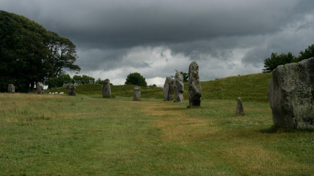

Pokud chcete monument, který se ve vaší hře objeví, losovat náhodně, hoďte nejdříve k6 kostkou pro určení sudá–lichá a pak ještě jednou pro určení čísla 1 až 6. Můžete házet najednou dvojicí různě barevných kostek, kde jedna barva určuje paritu čísla (sudá–lichá) a druhá číslo v tabulce.

Položky L1 až L6 jsou památky pocházející od dobyvatelů a přistěhovalců. Položky S1 až S6 jsou památky zanechané domorodým obyvatelstvem.

- L1 Ze země, obrostlá vegetací, ošlehaná větrem a pomalovaná mnoha symboly, trčí gigantická kamenná ruka, která kdysi něco držela v sevření, ale již není patrné, co. Déšť a vítr zahladil všechny rysy. Blízký domorodý kmen se k ní chodí modlit a na prostranství před ní pořádá rituální zápasy. Místo je však také svatým místem pro Surty konvertované na víru v Nebeského ducha, kteří jsou přesvědčeni, že ruka původně držela svatý symbol Nebes. Díky tomu se zde občas odehrávají krvavé potyčky mezi oběma náboženskými skupinami.
- L2 Nijak výrazný vstup do jeskyně vás zavede do místa s až hmatatelnou a tíživou atmosférou. Jeskynní haly, které na vstup navazují, jsou totiž plně zařízené. Svícny, sochy, nábytek a mnoho dalšího, to vše je vytvořené pouze z lidských kostí. Museli jich být použity stovky, ne-li tisíce. Místo nyní vypadá opuštěně, ale máte nepříjemný pocit, jak vás prázdné důlky nespočtu lebek neustále pozorují. Kostnice je hrobkou první větší agolzarské komunity mírumilovných taurilských přistěhovalců; ti zde ukládali své mrtvé, protože věřili, že místo ochrání jejich ostatky před duchy uctívanými domorodci. Stále tu jsou magické ochrany proti narušitelům.
- L3 Největší obraz na světě tu nakreslil před dvaceti lety mág-umělec z Kalusu na velkou náhorní plošinu. Je na něm vyobrazená fauna, flóra a obyvatelstvo Agol Zaru, který autora fascinoval. I když vše vyobrazené není úplně podle pravdy, Surtům se obraz líbí a sami jej rozšiřují. Pravidelně jej chodí pár šamanů opravovat a dokreslovat na okolní plošiny, které spojují lanovými mosty.
- L4 Zdobená hrobka s vybouraným vchodem patřila podle zašlých nápisů dobyvatelce Renesmee Dellamy. Uvnitř leží poházené kosti a rozbité předměty. Hrobku obchází kvílící duch preláta, kterého tu pohřbili zaživa za to, že chtěl Církev a pozůstalé Renesmee oklamat falešnou hrobkou, přestože se ve skutečnosti Renesmee ztratila v divočině a Církev její ostatky nikdy nenašla. Prelát nenajde klid, dokud sem nebudou pohřbeny skutečné ostatky Renesmee, nebo kletbu nezruší potomci Hugena Dellamyho, který ji vy­řkl. Ale možná jsou i jiná řešení, jak kletbu zrušit.
- L5 Pod mechem obrostlým symbolem Nebes prosvítá původní zlacení. Další hanobení obrazce by s sebou mohlo nést hněv Nebes, a naopak očištění obrazce od nánosu a jeho vystavení na odiv slunci, odkud by mohl čerpat magickou energii, zase hněv Velké dračice. Stála by případná odměna za to?
- L6 Tmavě šedá pyramida s kruhovým podstavcem, jen o málo větší než povoz, stojí osamocená uprostřed nedotčené přírody. Není na ní vidět žádný vchod či jediný spoj a je postavená ze žuly, kterou jste možná viděli na masivu Arzath. V blízkém okolí se velmi dobře daří rostlinám a zvířatům. Ty tu dorůstají mnohem větších rozměrů než je u nich obvyklé, a vyskytují se tu i druhy jinde neviděné. Pyramidu vystavěli mágové Kosmu z úlomku kamene z Arzathu jako experiment. Kdo zná správný postup, může ji odemknout a najde tam mapu k dalším podobným menším pyramidám a vědění Kosmické magie. Zaklepete-li však na kámen špatně, pak si na vás oni zvláštní živočichové zkusí pochutnat.
- S1 Na první pohled je tento chrám vytesaný do skály opuštěný. Je schovaný v údolí, skrz které zurčí malý potůček padající dolů v kaskádách vodopádů. Je to nádherné místo, na kterém jsou vidět neskutečné objemy času, který jeho tvůrci museli položit jako oběť jeho stvoření. Všechny sloupy, obětní oltáře i lavice jsou vytesané rovnou ze skály. Žije zde málo početný domorodý kmen, který se stará o stav chrámu, neustále rozšiřuje jeho chodby hlouběji do země a hlídá tajemství, která jsou tam ukrytá. Tito lidé jsou navenek slušní a milí, ale nemají rádi hosty a pokusí se vás co nejdřív vystrnadit ven.
- S2 Na zdejší mírně kopcovité louce lze narazit na mnoho kamenů zdobených hrubě vyškrabanými runami. Narazíte zde na menší kameny, velké jako sevřená mužská pěst, stejně jako kameny vysoké jako dva lidé. Pokud se vám podaří shlédnout na to z ptačí perspektivy, zjistíte, že jsou vyskládané do složitého obrazce, který možná připomíná mapu. Z různých směrů pohledu bude ale obrazec vypadat pokaždé úplně jinak. Pokud by někdo dokázal najít ten správný úhel pohledu, mohly by vydat své tajemství …
- S3 Malá náhorní plošina je celá pokrytá kolonií stříbřitých broučků. Oblézají povrch úplně všude, občas vlézají v proudech kamsi do útrob a zase vylézají ven. Pod proudy broučků občas prosvítá bílý kámen a na něm runy a písmena ze starého, téměř mrtvého jazyka. Uprostřed plošiny se také leskne nějaký výčnělek či snad předmět, na onom místě jsou brouci ještě rychlejší a horlivější. Písmena pod broučky jsou zaklínadlo, které uklidňuje a uspává místního agresivního ducha přírody. Broučci udržují toto kouzlo tím, že po něm lezou. Pokud je rozeženete, například ve snaze získat poklad uprostřed, máte velký problém.
- S4 Z několika stromů zkroucený a malými fetiši ověšený dřevěný drak je zde opečováván šamany z kanibalského kmene. Ti se tu modlí za divokost Svahamy, aby jejich výtvoru vdechla život a vyslala ho zdevastovat zkažené město Gardorn. Modlitby mají v plánu doplnit lidskými obětmi, jejichž krví pokropí dřevěného draka.
- S5 Shluk travou porostlých pahorků je plný děr vedoucích do hlubin. Při troše představivosti se v nich dají vidět velké krtince. Ve stěnách děr jsou zaražené kameny umožňující sešplhat až na točité schodiště v tunelu se stěnami pokrytými malbami z hlinky. Malby zobrazují orky a Surty žijící spolu. Pod schodištěm je další labyrint jeskyní s nástěnnými malbami, na kterých je průvod orků a Surtů scházejících do jeskyně, pak malby orků válčících se Surty, malby obou národů rozcházejících se a orků táhnoucích hlouběji a Surty jdoucími na povrch. A tam někde začnete slyšet šepot z hlubin… nebo je to jen zdání?
- S6 Uprostřed hustého trnitého křoví se nachází palouk, který připomíná spíše halu. Vévodí jí obrovský trůn vysekaný z žijících a stále rostoucích stromů. Sedával na něm vůdce krutého domorodého kmene, který na trnité stěny sálu napichoval každého, kdo se mu znelíbil, a mrtvoly tam nechával dlouho vystavené. Jednou však mrtvá těla obětí povstala a zabila tyrana. Teď je hala plná nemrtvých a v útrobách trůnu je ukrytý poklad kmene.
