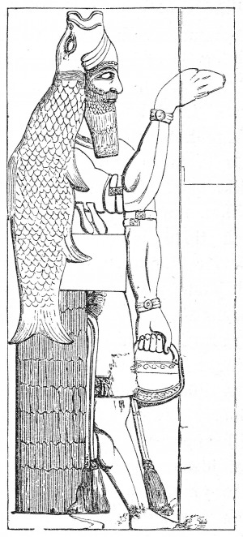
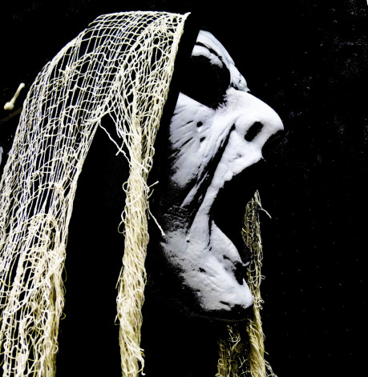
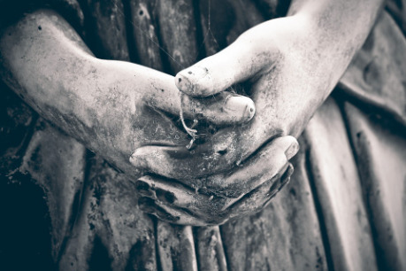
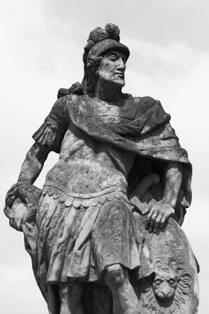
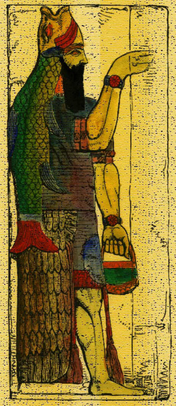

Trstenské pohřebiště je považováno za magické místo mnoha národy, pohřebiště králů, knížat, biskupů a vládců vůbec. Leží na úbočí skalního ostrohu nad stejnojmennou vesničkou. Pohřebiště je čtvrt míle široké a nejméně polovinu té délky dlouhé, celá zadní strana je tvořena masivem Trstena jinak je obkrouženo mohutnou zdí, spíš hradbou, doprostřed čelní stěny je zasazena brána, nad níž plá věčné světlo. Na levé, jižní straně je hned za hradbou prudký sráz, v pravé zdi je otvor, kudy vytéká potok, jež o něco níže přehrazuje cestu ke hřbitovu. Za potokem je cesta spíš schodištěm, velmi ostře stoupá. Před vchodem je kostelík postavený na do skály zapuštěných domcích strážných a správců. U každého hrobu je zasazen strom, čím exotičtější tím lépe, všem se překvapivě dobře daří. Poslední dobou se na hřbitov nikdo neodváží kvůli podivnému chování stráží. Pozůstalí si stěžovali knězi a kněz, otec Kreuzze najal Vaší družinku, aby věc prošetřila, vrátila mrtvým klid a živým možnost navštívit své předky.

Na ochozu hřbitovní zdi hlídají dva strážní v kroužkových zbrojí s halapartnami, nemluví, ale rukama rázně naznačují družince, aby se nepřibližovala. V jejich blízkosti je silně cítit rybina. Pokud se družinka přiblíží ještě víc zaútočí, ač jejich oči prozrazují, že nechtějí. Strážní (přesněji jejich těla) jsou ale pod vlivem Dagona, sumerského božstva moří a ryb, jež se ukrývá v podzemních hrobkách.

__Vyšší strážný:__ Útok 7+6, Obrana 4, Životy: 71

__Starší strážný:__ Útok 8+6, Obrana 2, Životy: 82

_Poznámka_ – Obrana je spočítána jako obranné číslo bez použití akce obrana, v základním soubojovém systému je tedy třeba připočíst 3. Není-li uvedena iniciativa, není dán žádný bonus či postih.

## Vnitřní hrobky Trstena

Devět pater sálů plných hrobek z různých dob propojených v dávné minulosti teleportačním výtahem. Výtah je nyní poškozený snad vytopený (vyšší míra vlhkosti je pak téměř všudypřítomná – náhodné, nepravděpodobné kaluže apod.), proto funguje náhodně (lze použít například hod fudge kostkami).

Pohyb výtahu stojí krev toho, kdo jej „ovládá“. Cena pohybu výtahu v životech je postupně následující:

> 1 1 1 1 1 2 2 2 2 3 3 3 4 4 5 1 2 2 3 3 3 4 4 4 4 5 1 1 1 2 2 2 3 3 3 4 4 4 5 5 5 4 4 4 3 3 3 2 2 2 1 1 1 2 2 2 3 3 3 4 4 4 5 5 5 4 4 4 3 3 3 2 2 2 1 1 1 2 2 2 3 3 3 4 4 4

Bez zatažení za páku se nedá z výtahu dostat dál.

Hroby mají různé provedení, ale vždy se jedna o velmi kvalitní kamenickou práci. Do některých starších sálů byly dodávány novější pohřební komůrky. Pohřbeni jsou obyvatelé z Dubrovníku i širšího okolí, včetně hor a ostrovů.

### Sály:

Sál +4 – Z výtahu se vstupuje do sálu ze solidního šedého mramoru ve tvaru čtverce o hraně 16 sáhů, s výtahem vypadá jako po boji. Proti výtahu z ní vede dva sáhy široká chodba. Zadní, stejně velký, sál je oddělen pevnými dveřmi, které jsou zamčeny evidentně očarovaným zámkem (je třeba klíč z −4). V zadním sálu se nalézají nemrtví – ghoulové (smrtižrouti – lze použít i pravidlové ghúly):

- Starý ghoul – kroužková zbroj, palcát, malý štít,
- Út 9+2, Ob 6, Žt 51
- Tlustý ghoul – hadry, sekáček a nůž, Út 12+2, Ob 4, Žt 74.
- Ghoulí kápo – hrudní pancíř, modrý plášť, široký meč , Út 13+1, Ob 7, Ini +3, Žt 88.

Ghoulí kápo v nultém kole (při otvírání dveří) sešle rychlost na všechny nemrtvé (trvání 4 kola), nebojuje, dokud na něj není zaútočeno, ale spolu s první bojovou akcí sešle dva zelené blesky. Pak průběžně sesílá:

- 1. kolo Pach – past Odo ~ 8 ~ −1 út, ob, ini/nic;
- 2. kolo Krvavé oko – past Int ~ 8 ~ −1 út, ob, ini/nic;
- 3. kolo Pochybnosti o sobě, osobnosti – Char ~ 9 ~ −2 út, ob, ini/−1 út, ob;
- 4. kolo Krvavé oko – Int ~ 10 ~ −2 út, ob, ini/−1 út, ob.

Ghoulí kápo má široký meč +1 (tedy meč s útočným číslem zvýšeným o 1). Meč lze nahradit tzv. hvězdným kamenem +1 k ÚČ, který lze přendat z tohoto meče do jiné zbraně, jíž družinka disponuje, pokud tato má volný slot – zbraně mají 0 až 4 sloty, zbraně s více sloty jsou vzácnější a dražší.

V ghoulím pelechu se skrývá poklad (nějaké zlaté (k6 × k4 × k6), 2× 30žt lektvar, 1× rychlost a 1× biskupská svěcená voda – zraňuje za 10+1k10) a mezi hadry pak je ukryt kovový čtvrtkruh, zadní strana je podivně členitá, přední dokonale hladká s namalovaným obrázkem:

(4/4 kruhu) – Hlava a pravá paže humanoidní bytosti vyrůstající snad z želvího krunýře žlutohnědé barvy, pravá paže je tvořena dlouhým mocným chapadlem chobotnice zakončeným ostrým hákem a pokrytým spoustou přísavek, má temně fialovou barvu navrchu a světle šedohnědou vespod. Hlava vypadá jak od chobotnice, ale je korunována talířem à la medúza, jejíž chapadla tvoří lesklý průsvitný závoj, tři krátká chapadla, jež jsou součástí obličeje, jsou zakončena tlamou murény.

Sál +3 – Obrovitánský kapkovitý sál má na délku možná 80 sáhů, výtah ústí v užší části je, sál pozvolna klesá dolu k jakémusi prostranství. Nejluxusnější nekrálovské hrobky, povětšinou bohaté šlechtické rody z Dubrovníku a okolí. Uprostřed nejnižší části sálu je bohatě zdobená hrobka se světélkujícím sloupem zdobeným vinohradnickými motivy, nápis hlásá, že patří rodu Vranoviců z Epidauru. Na vrcholu sloupu zdobeném světélkujícími hrozny stojí lahev vína. Na této hrobce posedává duch rytíře Zoltána

Zoltán mj. hledá vlastní obouruční meč, který mu trčí ze zad, což je vidět, ale jen při pohledu zezadu, obviňuje ostatní mrtvé, že mu jej sebrali a že jsou nudní a nechtějí si s ním povídat. Lze od něj s trochou snahy vyslechnout příběh o tom, jak bránil malou vesničku jménem Trnová Dolina v horách tak vehementně, že jej zavraždili vlastní spolubojovníci, kteří už měli boje dost a chtěli se vzdát. Pokud se družinka zmocní láhve, tak Zoltán chce, aby mu víno podrobně popsali, jinak je nepustí bez boje (nemůže ale opustit dolní prostor). Duch je laskavý, velmi upovídaný, ale z užitečných informací ví jen málo – cítí přítomnost kohosi mocného, kdo sem nepatří, páchnoucího rybinou, druhá rada je vyhledat paní Taianu, která je jako on, ale není jako on, kdesi dole.

Zoltán duch – Ini +6; Út bez meče 7+1, s mečem 12+3; Obr 7, Žt 55 (kámen +2).

Sál +2 – Cestu dál blokují kamenné dveře s ozdobným umyvadlem a nad ním držákem na pochodeň. Kolem dokola je nápis: _Zde v temnotě odpočívají mrtví spánkem spravedlivých, vstup, kdož jsi čistý a obezřetný. Překážím-li v cestě, prohoď je._ Správným řešením je nějakým způsobem umístit oheň do umyvadla a vodu do držáku pochodně.

Sál ve tvaru rovnoramenného kříže, do posledního místečka zaplněný chudšími hroby, vlastně spíš přeplněný. Koncentrace rozpouštějících se duší znemožňuje kouzlit. Z jednoho hrobu (podle nápisů patří zřejmě jakémusi druidovi z dávnějších let), kam prosakuje vlhkost, rostou houby – od drobounkých rosolovitých vajíček na okraji po dozrálé malé černé špičky s červeným středem hlavičky (smrtelně jedovaté) … uprostřed nich, jako by bylo na náhrobku položeno něco tvaru kruhové čtvrtvýseče … Neopatrná manipulace (jakákoliv) vypustí jedovaté spory z hub, které zasáhnou hex, na němž se nachází hrob a jedno pásmo kolem – jed je past Odo ~ 10 ~ 10+3k10 žt/1+3k6 žt.

(2/4 kruh) – Na čtvrtdisku je velmi detailně zobrazen mohutný štičí ocas směřující ke středu kruhu, kde mizí ve žlutohnědém želvím krunýři, ocas má ostře zelenou barvu, kdežto ploutve na koních přecházejí až do červené.

Sál +1 – Běžné trojsálí (každý sál je čtverec o straně 16 sáhů) v řadě, totálně vykradené (dloou­ho), kosti pietně srovnané …, zlodějský tunel ve druhém sálu zavalen a zapečetěn. Vyskytují se zde běžné myši a trochu větší švábi … Třetí sál je oddělen později vzniklou průrvou, nelze určit její hloubku, protože povrch průrvy je sytě černý a dvojitě zvlněný (vypadá trochu jako plato na vajíčka) pohlcuje světlo i zvuk, může být hluboký hodně moc nebo taky pár yardů. Na dně se nachází kostra lupiče, kolem ní jsou střepy z vícero flakónků, kostra je stále oblečena do kvalitní kožené zbroje (KZ 3, ale zbroj výrazně snižuje nápadnost zloděje – jako by byl o 4 úrovně výše), krátký meč je v pochvě, druhá menší je prázdná, dýku lze nalézt při manipulaci s tělem, během pádu jí měl zloděj zřejmě v ruce a to byla jeho zkáza, na opasku je připevněna brašnička na lektvary, prázdná.

Krátký meč, zdobený obrázkem černého blesku, v záštitě je hluboko zasazen hvězdný kámen bleskový (v meči 1 černý blesk, jinde 1 žlutý blesk), dýka, která zásahem vyléčí svému uživateli 2 životy.

V zadním sálu je podivná, jakoby hrubě opracovávaná socha možná nějaké světice, velmi těžká.

Kostlivý golem – na rychlo poskládané kosti ze zdejších hromad, nemá zbraně zaútočí na družinku zezadu při opouštění patra – Ini +6, Út 15+0, Ob 7, Žt 35.

Sál 0 – Jen v této úrovni lze otevřít dveře výtahu směrem ven z hrobky. Východ ven však blokují mohutné kamenné dveře, v jejichž středu je negativ jakéhosi disku o průměru dvou stop. Tyto dveře, které se zavřou po prvním použití výtahu nejdou otevřít bez složení pečeti.

Na druhé straně tři propojené sály – dva zadní jsou obrovské, přímo nad sebou, spojené hladkou šachtou pod falešným náhrobkem hned u vchodu. V šachtě je komůrka, kde je hrobka hrdiny Hrunna se zlomeným nádherným mečem (dříve magický, magie vyprchala, nelze obnovit ani opravit) a šermířské rukavice s ocelovými chránítky (1× slot na hvězdný kámen). Pytlík mincí a obchodních drahokamů (k20 × k8 × k10 zlatých) a velký štít.

Rukavice krve – kdo si je nasadí a nezaplatí cenu, má −2 k bonusu síly do sundání – to stojí dost krve (1/2 celkových žt). Když zaplatíte krví rovnou, tak naopak sílu zvýší – o 1 stupeň za 1 žt, o 2 st. za 3 žt, o 3 st. za 6 žt, o 4 st. za 10 žt …ani pak ale nebude sundání zadarmo (−1 z maximálních životů). S nasazenými rukavicemi se nejde léčit ani si odpočinout.

Kulatý ocelový štít s motivem býka. Pozdější návštěvník tu zanechal flákonek s kusem provázku, neoznačený, zdá se, že jde o čistou vodu (kardinálská svěcená voda – zraňuje každého nemrtvého za k10 × k10 životů).

Sál −1 – Možná nejstarší tunely, nejméně sály, vlhkost, kapající voda. První sálek je ještě OK, druhý, o něco níže položený, hodně mokrý, chodba do třetího je zatopená. Ve vodě žije světélkující mnohonožka hoodně dlouhá, zvědavá, neagresivní, schopná neverbální komunikace. Vymění jídlo za malinkou hromádku řas a vodní trávy s pokladem – hoď k100:

- 1–25 2+k10 zlatých;
- 26–40 léčivý lektvar 30 žt;
- 41–70 10+6k6 zlatých;
- 71–80 biskupská svěcená;
- 81–88 kardinálská svěcená;
- 89–95 léčivý lektvar 50 žt;
- 96–100 kardinálská svěcená voda, hvězdný
- kámen +2 a šperk v hodnotě 240 zl.

Malé porce mnohonožku urazí, velké přesytí a přijme jen 3, jinak až 6 porcí jídla, po poslední se stáhne do vody a pozoruje družinku. Poslední poklad má kolem sebe více chaluh a mezi nimi se najde i čtvrtina pečeti:

(1/4 kruhu) – ve středu je umístěn žlutohnědý želví krunýř, z něhož na místě ocasu vystupuje drakovité tělo mořského koníka, místo pravé želví končetiny zaujímá šedostříbrné tělo žraloka s vpřed trčící hřbetní ploutví, která je stejně jako obě ocasní zdobena bílým a černým proužkem.

Mnohonožka vodní – Ini +9, (makadla 7+0, klepítka 6+3, kusadla 14+6), Ob 10, Žt 158.

Sál −2 – Cestu dál přehrazuje kamenný blok s obrazem. V komoře na zemi leží mrtvola, hrobka ji chrání před hnilobným rozkladem, ale rozpadá se a schne, jen kůže docela drží, evidentně působí ochrana hrobky dobu nelze odhadnout. Mrtvý je člověk bojovník, plátová zbroj, obouručák s kamenem +2 obyč., brašnička 2× léčení 30 žt, 2× rychlost, 2× obří síla). Při sejmutí hrudního plátu vyleze z hrudníku nemrtvá moucha, Ini +3, Út 6+1, Ob 5, Žt 21, útočí na toho s nejslabší zbrojí, pokud zraní alespoň za 5 životů, vloží do rány vejce, toho se lze zbavit velmi obtížně (výplach alespoň biskupskou svěcenou vodou).

> Na kvádru je obtížně, ale přece jen rozeznatelný velký obraz, krajinomalba kombinovaná s rytinou. Pár míst je viditelně osahaných.
>
> V horní části středu dominuje obrazu jasně svítící slunce, jež mu dodává docela příjemnou atmosféru, v kontrastu s tím je ale vidět i několik souhvězdí. Uvnitř slunce se nachází runový nápis _Mír a pokoj_.
>
> Ve středu obrazu je vidět trstenské pohřebiště obdélníkového tvaru, pohřebiště je vyplněno obrázky krásných stromů a keřů. Zdi hřbitova jsou obklopeny symbolikou čtyř živlů – nahoře skála, země, vpravo potok, voda, dole věčné světlo, oheň a vlevo sráz, vzduch.
>
> Na nádvoří (mezi portálem a hradbou) je vyobrazeno několik osob – prostřední skupinka zřejmě představuje pohřební průvod zahrnující zřetelně lidi ale i další rasy, pod ní je dvojice trpasličích kameníků s nářadím a ještě pod nimi trpaslík a člověk ve zbroji, nad nimi pak obyčejně vypadající rodina neurčité rasy. Úplně nejvýše je skupinka tvořená lidským klerikem, možná biskupem a dvěma pomocníky. Všichni směřují ke vstupu do hrobky. To zabírá celou pravou třetinu obrazu.
>
> Okraje obrazu jsou vyplněny stylizovanou mapou pobřeží a okolí vůbec. V levém horním jsou zachyceny Benátky, symbol města je vyveden zlatě. Pak následovali již na této straně moře v bronzu zobrazené Pula, Reccum, stříbrná Zarra, Šibenik, Split, bronzová Janija pánů z Drače, stříbrný Ston ozdobený kopci soli, zlatý Dubrovník, bronzový Epidaurus a poslední z pobřežních měst byla Soluň, ve stříbře. V horách bylo spousta drobných bronzových teček, mnohdy bez názvu, stříbro značilo horu Divin, pod níž někde se nacházelo hlavní město zdejších trpaslíků. Tajemný Mostar si pak od dávného umělce vysloužil zlatou.
>
> Ve střední části mezi mapovými okraji a pohřebištěm byla zachycena řada staveb, od nuzné chatrče, přes selské stavení, řemeslnickou dílnu, měšťanský dům, klášter až po tvrz. Jinak je obraz vyplněn symbolizovanými obrázky rostlin, zvířat a celkově působí pokojně až pietně.

Kámen kdysi stával o vchodu a měl navést příchozí ke správné hrobce – příchozí řekli kdo jsou (zmáčknutím některého z domečků), odkud pocházejí (symbol města nebo jiného místa na mapě) a z jakého důvodu přicházejí (skupinky osob před hrobkou). Při jednoduchém řešení stačí zmáčknout jakýkoliv ze symbolů ve správném pořadí (obydlí – místo – profese), v obtížnější kombinaci je třeba uvést přesně – stav a místo původu alespoň někoho z družinky, a pak symbol mužů ve zbrojích.

Nemrtvý kdysi zřejmě člověk, teď vypadá dosti nebezpečně, ale není ošklivý … světlá pleť, výrazné rty se zářivě býlími zuby, černé vlasy, a ty oči, ty oči … meč bastard tmavočervené barvy, elegantní (3 sloty na hvězdné kameny), černý honosný šat, zářivě bílý šátek.

Upír – ini +7, útok 9+1, neobrana 3, žt 68.

_Triky:_ Když zraním, mám +2 k úč; Obyčejné zbraně působí jen poloviční zranění; Šátek – hod k10: kouzla 1–2 obrátí kouzlo proti sesilateli, 3–8 nic, 9–0 kouzlo je pohlceno; svěcená voda obyčejná nic, biskupská jen poloviční zranění, kardinálská plně.

V místnosti jsou dále dvě další mrtvoly, barbarský šermíř se zlomeným kdysi asi hodně dobrým bastardem, kámen Všezraň (zraň zraňuje podle nejvyšší zranitelnosti nestvůry). Velmi kvalitní kroužkoplátovka (kz 6), kámen +1 KZ, umí rychlost na 3 kola na příkaz. Druhá mrtvola je alchymista, taky barbar, možná bratr. Hůl kovová alchymistická, SZ 5/ útočnost 1/ obrana zbraně 2, destičková zbroj. Levý náloketník, ze stříbra s runou (síla +2 stupně, obratnost +1, odolnost −1). Při pokusu o odnětí povstane jako nemrtvý, žádné jedy, útok 10+1, obrana 5, životy 35.

V koutě je stále ještě trochu živý kouzelník, půlelf, byl udržován zmámený upírem, pokud se trochu vzpamatuje (s pomocí družinky leda), spáchá sebevraždu, blouzní: „de … de … de … démon je … tady dy … dy … střeží ces … tu … zpět“, je nahý … po smrti upíra pozvolně umírá.

Sál −3 – Socha strážícího trpasličího rytíře v nadživotní velikosti (C), má dvoubřitou sekeru, jeden břit z ocele druhý ze zlata, při každé návštěvě je třeba dát dáreček, jinak varuje, a pak zaútočí. Pokud družinka nevykrádala hroby, jde na plocho.

Za ním je průchod do galerie, vlevo jsou ve třech patrech vstupy do devíti pobočných sálů, schody jsou na obou koncích galerie), vpravo jsou na pohled skromné hroby jednotlivých vládců Dubrovníku. Každý sálek vlevo patří mocnému rodu nebo dokonce celému regionu. Máte pocit, že Vás na každém kroku sleduje pohled trpasličího rytíře, v každém z devíti sálků je pak místní strážce, rovněž dobře vyzbrojená socha. Naproti vstupu do galerie se nachází kaple s velkým křížem, Kristus má kolem těla omotaného hada. Rána v Kristově boku je větší než se normálně zobrazuje (a je v ní zasazen 3/4 kruh pečeti). Za Kristovou hlavou jsou průduchy, jimiž sem proudí svěží vzduch, na pravém ramenu kříže plá věčný plamínek, z levého vytéká pramínek vody, který je dole zachytáván v misce. Za miskou lze při důkladném pátrání nalézt tři plné flakónky (1× kardinálská, 2× biskupská svěcená voda).

(3/4 kruhu) – malovaná plocha čtvrtdisku zobrazuje spodní pohled na želví krunýř, z něhož však místo levé přední končetiny vyrůstá mohutné růžovooranžové krabí klepeto, klepeto i z něj vyrůstající trny vypadají velmi ostře, avšak tvarem a rozměry připomíná spíše štít.

1. Viševicovi/Ston – hlídá dubrovnický gardista s plátem a halapartnou.
1. Páni z Drače – nejvýše položený vchod – hlídá elfí čarodějka na draku, socha se vznáší uprostřed místnosti a hýbe se – je ochotná komunikovat, Taiana, manželka Zvonimira I. z Drače (_při rozhovoru může naznačit použití pečeti a význam její orientace při zasazení_). Velmi inteligentní, velmi krásná, ale marnivá, namyšlená, je třeba dosti lichotit, s postavami se záporným bonusem k charismě nekomunikuje vůbec. Boj s čarodějkou je prakticky nemožný, jeho přežití vyloučené.
1. Zamčené dveře – z nápisů lze usoudit, že zde leží Benátčané.
1. Zamčené dveře – menší mimodubrovnické rody.
1. Církevní hodnostáři, stráží je socha paladina, lze zde za dobré slovo získat několik flakónků obyčejné svěcené vody.
1. Zamčené dveře – menší dubrovnické rody.
1. Mostarští a horalé – strážce horal v kroužkoplátovce s šavlí a štítem z kozí kůže, stejně jako plášť, kozí motivy jsou i na přilbici (malé růžky), osmiboká místnost, v každém rohu je soudek piva, strážce neví, které si má vybrat, a chce po družince, aby mu poradila. Nemluví, jen gestikuluje. Za odměnu dá družince jedno léčení 50 žt a jednu kardinálskou svěcenou vodu.
1. Zamčené dveře – Salonští a ostrované
1. Nejníže položený vchod, trpasličí mocní – dvě strážní sochy: trpasličí bojovník s obouručným kladivem/krumpáčem a šjz se štítem a dlouhou sekerou, usmívají se, ale vypadají ještě děsivěji než strážce u vchodu, po čarodějce nejpůsobivější ochrana.

Kamenný trpasličí rytíř – rytířské zásady (ne­ú­točí bez varování), jsem kámen (pocit ne­ohrozitelnosti), Út: 15+4; Ob: 10, Ini: +9, Žt: 125

Po boji, pokud není zničen, zaklíní dveře výtahu v tomto patře.

Sál −4 – Malinkými světlíky vysoko ve stropě sem proudí světlo a čerstvý vzduch, sál je podlouhlý, prostší než většina ostatních. Pod posledním ze světlíků je na laně váček (a v něm zlatý klíč). Při pokusu o stáhnutí vypadne mrtvola vykradače hrobů.

Jinak nic zajímavého, jen na některých zřejmě náhodných hrobech v sálu leží těla číchsi obětí, zdají se většinou utopená, ale některá z velké části ohlodaná. Je jich už víc než pět desítek. Pastevci, rolníci, sem tam nějaký kněz, nějací dobrodruhové taktéž. Nemrtvý vstávají postupně (podle hodu k8):

1. Lidský bojovník – kladivo, plátovka – Ini: +3, Út: 11+4, Ob: 3, Žt: 69.
1. Rolník – hadry, srp – Út: 6+2, Ob: 2, Žt: 33.
1. Trpasličí alchymista – destičky, kovová hůl (kámen jedu) – Ini: +7, Út: 9+1 (jed Odo ~ 5 ~ 3k6/1k6), Žt: 74.

> (brašnička s lektvary – 3× rychlost +7; 1× neviditelnost; 4× léčení: 10, 30, 30 a 50 žt; 1× metamorfóza)

1. Vesnické děti – sváteční šatičky, holčička má panenku, chlapec vyřezávaný meč

_Vrhací panenka_ bouchá a opět se zhmotní holčičce v ruce – centrhex Obr ~ 7 ~ 1k10+10/1k6+3, 2 pásma kolem 1k6+1/1k6/2.

_Dřevěný meč_ – Út: 10, Ob: 1, Žt: 12 (musí najednou zemřít, jinak zas obživnou – přivolají se, zranění mečem nechává 2 třísky, které ubírají 1 ze síly a 1 z obratnosti. Při vyndávání každá tříska 1k6 žt).

Útok na ně Int ~ 7 ~ nic/běžný útok.

Holčička má u sebe drahý náramek (stříbro se zelenými polodrahokamy, 400 zl.).

1. Vesničanka – zástěra, jinak nic, velká vařečka na prádlo Út: 5−2, Ob: 4, Žt: 18, pokud ji někdo zraní, další útok míří na svého spolubojovníka.

Zástěra je magická/prokletá – krásně září čistotou, ten kdo ji nosí, ji nechce sejmout ani za nic, připadá si čistý, upravený, elegantní, svěží (charisma + 3 pro opačné pohlaví, −4 pro stejné), není schopen jíst či spát v neuklizeném prostředí, zástěra má k tomu nástroje – prachovku, utěrku apod.).

1. Starý kněz – předčítá z vlastnoručně krví psané Apokalypsy a drží železný brk, ÚČ: 6 na všechny. S každým zraněním roste útok o 1, je-li zraněn (obrana stejná jako útok) kněz, tak útok klesne o 1, pří útoku 0 je kněz zničen, nelze zacílit kouzlem.
1. Mladá kouzelnice – 5 obrazů, jednou za kolo 4 modré blesky.
1. Barbarský šermíř – dl. meč, štít, kroužkopláty – Ini: +6, Út: 15+1, Ob: 7, Žt: 112.

Hvězdný kámen +2 zbraň a druhý +1 zbroj.

***

Po spojení všech 4 čtvrtkruhů na dveřním panelu lze obrázkem pootočit (hlavou nahoru nebo hlavou dolu), to povolá rybího démona, teprve po jeho porážce se družinka dostane ven.

Démon hlavou dolů – Ini +12, (Út 13+2; 13+2; 11+6), Obr 7; Žt 135

Místnost postupně zaplavuje voda, každé kolo družinka Ini −1, Dagon Ini +1, jeho útoky jej léčí za 3 žt.

Démon hlavou hore – Ini +6, (Út 9+1; 10+6), Obr 9; Žt 111.

Místnost postupně zaplavuje voda, každé kolo Dagon Ini +1, jeho útoky jej léčí za 2 žt, past Int ~ nic/9/-2 obr a út/6/-2 obr út a ini, −1k6 žt. Nelze kouzlit.

Kouzla: 2 akce, neomezené opakování, pokud klesnou démonovy životy pod 30, obě vlny naráz.

Léčivá vlnka vyléčí démona za 40 žt, naopak družiníkům v bojové vzdálenosti způsobí zranění za 10+k10 žt.

Vlna – Odhození – Síla odhození + zranění 12−hod/zranění za 1k6

Žralok – nad Dagonem se zjeví přízračný černý žralok, v příštím kole zaútočí jediným hryznutím (nelze se bránit) – k6+k20+k10.
