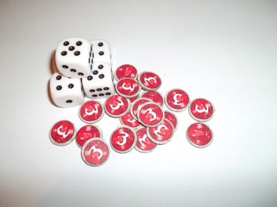

## Příprava hry

Ještě před hrou si hráči sestaví balíčky z karet národů, které si vyberou, jak je popsáno na konci této recenze a podle karty svého vyvolavače rozmístí některé Běžné jednotky ze svých balíčku a jednu zeď na svou polovinu hracího plánu. Hodem se určí začínající hráč a hra začíná jeho prvním, o některé fáze ochuzeném, tahem. Po tomto zkráceném tahu se hráči již střídají v normálních herních tazích.

## Tah

Každý tah, kromě prvního; tam začínající hráč začíná čtvrtou fází; má šest fází. V tazích se hráči střídají, každý odehraje jeden, aniž by měl ten druhý šanci mu ho nějak aktivně překazit. Pořadí fází v tahu je pečlivě rozvrženo a nesmí být porušeno. Teda, nemělo by. Potom totiž vznikají různé super silné kombinace narušující zaběhlý chod hry.

### Dobrání karet

Na začátku každého tahu hrající hráč dobere __do__ pěti karet na ruce. Proměnný počet dobíraných zajišťuje větší trvanlivost balíčku a vnáší do hry jakýsi prvek šetření zdroji a nutnosti počítat s tím, co v balíčku ještě je; počet dobraných karet se odvíjí od počtu vyložených a odložených karet. Pokud hráč dobere poslední kartu ze svého Dobíracího balíčku, neděje se nic kromě toho, že již nedobírá karty a hra se tak pro něj stává mnohem obtížnější.

### Vyvolání jednotek

V této části tahu, od které se odvíjí název hry, a který ji činí výjimečnou, se na plán dostanou hráčovy jednotky, které má na ruce. Každá z jednotek má svou cenu. Tu musí hráč zaplatit ze svého Magického balíčku. Platba se provede tím, že se počet vrchních karet rovných ceně jednotky odhodí do Odhazovacího balíčku. Karty se do Magického balíčku dostanou z ruky, na konci tahu, pokud si to hráč přeje a také z herního plánu- všechny ztráty jdou do Magického balíčku toho, jemuž patřila jednotka, která odstranila jednotku, která jde do Magického balíčku. Proto se většinou dražší Hrdinové jen stěží dostanou do hry v průběhu prvních tahů hry.

### Hraní karet událostí

Ve třetí fázi se z ruky hrají karty událostí. S jejich pomocí získáváte převahu na bojišti. Patří mezi ně Popálení, které poškodí jednu soupeřovu jednotku, Holomráz, díky kterému se nesmí jedna zvolená nepřátelská jednotka pohnout, dokud není vykoupena magií z Magického balíčku soupeře, či Duch fénixe, zajišťující automatické zásahy zvolené jednotky na toto kolo. Mezi karty událostí patří i Zdi, které slouží k výhodnějšímu vyvolání jednotek.

### Pohyb

Ve fázi pohybu se můžou až tři hráčovy jednotky pohnout až o tři pole. Jednotky se můžou pohnout v přímém směru, nikdy ne v diagonálním. Některé národy mají i zvláštní jednotky mající svou vlastní fázi pohybu nezávislou na ostatních. I zde však platí určitý limit jednotek. Podobné je to i s délkou pohybu. Standardní pohyb jsou tři pole, ve hře můžete nalézt ale i rychlé jezdce na lvech pohybující se o sedm polí v přímém směru, či pomalé Golemy, kteří nesmí útočit, pokud se pohnou o dvě pole.

### Útok

Útok se dělí na dva typy- střelecký a útok na blízko. Střílet smějí jen některé jednotky, jsou to ty, které mají na své kartě symbol luku. I střílející jednotky však můžou útočit, či lépe střílet na sousední pole. Střelba má limit tří polí, dále dostřelí jen některé jednotky.

Každá jednotka má určený počet kostek, kterými útočí. Hráč jimi hodí a vyhodnotí každou zvlášť. Čísla od tří nahoru se počítají jako zásahy. Vzhledem k tomu, že v této hře je zbroj reprezentována výhradně životy (ačkoli jsou i výjimky, například Nosorožci jsou zasaženi až na čtyři a více), přemění se všechny zásahy na zranění. Pokud nějaká jednotka utrpí větší zranění, než je její maximum životů, je vyřazena ze hry tím, že pustí herní plán a přesune se do Magického balíčku toho, čí byla jednotka, která ukončila nyní zabitou. A ano, dá se útočit na své vlastní jednotky. Pro některé národy zavrženíhodný čin, pro nemrtvé nutnost.

I zde je limit útočících jednotek. Je dokonce stejný, jako u pohybu. Tři útočící jednotky za kolo. Pokud je v útoku zabit jeden z vyvolavačů, hra končí a vítězí ten, jehož vyvolavač stojí (či spíše leží, jedná se o karty) na herním plánu.

### Konec kola

Na konci kola může hráč odhodit karty z ruky do Magického balíčku, pokud chce. Buduje si tak zásoby na příští kolo. Poté, co odhodí tolik karet, kolik chce, předá tah protivníkovi. Ten začne nový tah- dobere karty do ruky, vyvolá jednotky, pokud chce, zahraje události, pohne jednotkami, zaútočí, pokud má tu možnost, odloží karty a předá tah.

## Základní sada

V základní sadě naleznete vše, co je pro hru potřeba. Pět kostek, herní plán, žetony zranění a dva připravené balíčky národů.

Pět kostek je dost ke hraní, kdy si dáváte pozor, kam kostky dáváte, ale zároveň ne dost pro neopatrné hráče díky úžasné schopnosti kostek ztratit se na stole kdykoli je potřebujete. Naštěstí se ve hře nenachází příliš jednotek, které by potřebovaly více, než tři kostky. Těchto pět kostek je velice kvalitní, jsou velké, dobře čitelné, a protože jsou plastové, nehrozí obití laku.

Žetony zranění jsou oboustranné. Na jedné straně jsou čisté, na druhé straně mají velkou bílou trojku. Bílá trojka je na červeném pozadí dobře viditelná, šedý okraj umocňuje vzhled a na mistrné provedení poukazuje i červené pozadí stylizované do podoby krystalu. Díky jejich tloušťce se s nimi dobře manipuluje a jsou i dostatečně malé, aby se jich na kartu vlezlo velké množství a informace o jednotce byly i nadále dobře čitelné.

Herní plán je z papíru, tvoří tedy nejzranitelnější herní komponent. Díky častému skládání se přehyby mohou rychle prošoupat. To ale neznamená, že by si s tímto komponentem nedal práci. Opak je pravdou a všechna místa pro balíčky jsou hezky stylizovaná, středová čára je dost tlustá na to, aby byla vidět, ne však tolik, aby poutala příliš pozornosti, ostatní čáry jsou také dobře viditelné. Alternativou tohoto papírového plánu je plán lepenkový s ochranným povlakem, který podle slov výrobce neohrozí ani vylitý nápoj. Ten však není dokonalý. Jsou na něm načrtnuty jakési taktické manévry pomyslného stratéga, lesy, vesnice, řeky a města, co podle mě působí poněkud rušivým dojmem.

### Balíčky základní sady

Prvním z balíčků jsou __Fénixoví elfové__, poněkud nestandardně pojatí elfové obývající svahy sopek mající v posvátné úctě oheň, což se projevilo i na jejich kartách událostí. Mezi ostatními dominuje možnost zranit jednu nepřítelovu Běžnou jednotku ohněm. Jejich vyvolavač je silný v útoku proti Běžným jednotkám nepřítele, se čtyřmi životy však nějak velkou útočnou sílu nepředstavuje a je nutno si jej chránit za každou cenu, neboť každé zranění může velkou měrou uspíšit jeho, a tedy i váš konec. V jejich řadách bojuje i drak, či spíše něco, co by někteří označili díky obrázku spíše za Wyvernu. Jeho specialitou je schopnost zasáhnou i několik jednotek za sebou a připravit soupeři nemilé překvapení.

Mezi Běžné jednotky patří například Lučištníci s dostřelem čtyři pole nebo Šermíři s úžasnou manévrovací schopností. Základní balíček, který je sestaven v této základní sadě není úplně přívětivý k nováčkům, a podle mě nebyla dobrá volba ho dávat zrovna do základní sady. Za tyto elfy není jednoduché hrát proti jejich protivníkům s poněkud přímou strategií brutality a neúprosného postupu- Orky z tundry. Elfové totiž vyžadují mistrovské zvládnutí obranné strategie, a umění určit, kdy je dobré zariskovat a hlavně jak moc.

__Orkové z tundry__, kteří tvoří druhý balíček základní sady, mají jednoduchou strategii. Útok za všech okolností. A vše je tomu podřízeno. Jejich Bojovníci, snad nejpočetnější Běžná jednotka v tomto balíčku může díky své schopnosti útočit i vícekrát za kolo při dobrém hodu. Šamani ovládající silnou, ale nestálou magii se projeví svými dvěma kostkami útoku na dálku a Hromotluci, nahrážka trollů ničí nepřátelské šiky jeden za druhým.

Každý útok se ale jednou zasekne- pokud Šamanům padne alespoň jeden neúspěch, celý útok selhal. Hromotluci jsou příliš velké cíle- útoky, které je zasáhnou, dávají automaticky poškození rovné útoku protivníka. I pro tyto případy myjí Orkové řešení- hrdinové, s mnoha životy a velkými útoky se chystají vstoupit na bojiště a nepřátelské jednotky zastihne vánice tak silná, že se nebudou moci hýbat, ani bojovat. A to ještě nemluvím o ledových zdech, kryjících vlastní jednotky a umožňující vyvolat další mnohem blíž k nepříteli.

## Další možnosti hry

Vzhledem k tomu, že se jedná o veskrze karetní hru, mohou si hráči sestavovat své vlastní balíčky. Ke stavbě nového balíčku je potřeba jeden vyvolavač se svými kartami událostí a základními jednotkami, které začínají hru na herním plánu. K tomu tři libovolní Hrdinové vyvolavačova národa a Běžné jednotky dorovnávající počet Běžných jednotek na osmnáct.

A aby nebyla stavba balíčku tak jednoduchá, jsou ve hře karty Žoldnéřů. Žoldnéři mají svého vlastního vyvolavače, jsou to tudíž samostatný národ. To ale není to jediné, co nabízejí. Jejich speciální schopností je, že můžou být přiřazeni do jakéhokoli balíčku. Nesmějí však být nad limit- za každého Žoldnéře je nutno jednu kartu, kterou nahrazuje z balíčku odstranit.

Hra také podporuje mód hry ve více, než ve dvou hráčích. V takovém případě se srazí dva a více herních plánů, čímž vznikne herní plocha pro čtyři (šest, osm, …) hráče. Každý z hráčů má svůj vlastní balíček a úkolem jedné strany je vyřadit všechny soupeřovy vyvolavače.

## Výhody hry

Hra celkem rychle odsýpá. Tahy se střídají rychle a jedna partie zabere asi tři čtvrtě hodiny na dva hráče. Balíčky jsou velmi různorodé, každý tedy najde ten svůj, jehož herní styl mu vyhovuje. Vlastí stavba balíčků zajišťuje nekonečné množství možností.

Každý z národů má na webu původního vydavatele Plaidhat games vlastní sekci, kde jsou popsané ideální taktiky jednotek tohoto národa a i příběhy provázející jeho vyvolavače i hrdiny. Svět Itharie, kde se Války vyvolavačů, megalomanský konflikt probíhající na celé Itharii, tak nabývá i hlubšího rozměru- první Kámen vyvolání našel panovník nemrtvých hord Ret-Talus, druhý také a daroval ho … to si už přečtěte sami.

Jediný problém je se samotnými Vyvolavači. Nikde není popsáno, jak jejich magie vlastně funguje, a tak se kameny vyvolání přesunují kamsi do kategorie technoblábolů, u kterých se ví, jaký mají efekt, ale nikdo neví, jak vlastně fungují.

## Nevýhody hry

První a velkou nevýhodou SW je dopad toho, že 2/3 kostek se vyhodnotí jako zásah. Je to poměrně velké číslo, mající na svědomí rychlé umírání jednotek. V jednom tahu máte na plánu velkou armádu rovnající se silou a velikostí té Napoleonově a do dvou tahů jsou z ní trosky vracející se od hlavního stanu se silným Hrdinou nepřítele v patách. Za další dvě kola se situace obrací a Hrdinu máte naopak vy. A pak se karta znovu obrátí a Štěstěna se přikloní k vašemu soupeři. Zvláštní? Rozhodně.

Díky tomuto podivnému efektu vymírání druhů a jednotek se poslední fáze hry, kdy by proti sobě měly teoreticky stát velmi mocné armády, zvrtne na duel dvou vyvolavačů, protože oběma hráčům dojdou karty v balíčku i na ruce. Je to poměrně otravné posunout se svou jedinou jednotkou o dvě pole a doufat, že nakonec zatlačíte soupeře na kraj mapy, kde ho budete moci rozmetat na atomy pomocí velmi mocné magie. Potom to trošku i zamrzí, že celou hru vedete a pak … skončíte na dvě špatně hozené kostky.

## Zhodnocení

SW jsou fajn deskovka. Se svojí cenou nahrazují regulérní figurkové hry – a to i rozmanitostí, v anglické vydání hry je totiž 16 národů, s anglickým rozšířením se do hry dostaly i aliance kombinující dva národy (těch je osm). Možnost postavit si své vlastní balíčky je hezká, jen v ČR poněkud omezená kvůli neochotě vydavatele vydávat „Second Summoner“ balíčky obsahující druhého Vyvolavače a další karty k jeho národu. I tak SW doporučuji. Ale pozor! Jedno je jasné. A to, že u základní sady rozhodně nezůstanete.
