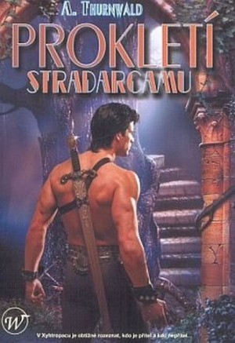
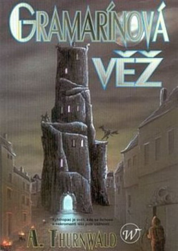
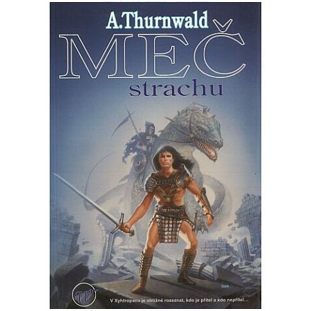
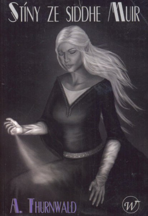

Můj první svět, Vaelnad, byl typickým začátečnickým RPG světem; splácaný ze všech zdrojů, které tehdejší chudá knihovna fantasy literatury dokázala poskytnout, stylem „jak pejsek a kočička vařili dort“. Navzdory tomu nebyl zas tak hrozný, jenom prostě moc přeplácaný.

V dalších letech následovaly další světy, vesměs opačného extrému: první Ornilie, Álfheim, Formenor. (Tento svět byl postavený speciálně tak, aby nebylo možné v něm hrát lukového trpaslíka. Ne, luky byly v pořádku. Nebyli tam trpaslíci.) Opačným extrémem míním to, že svět byl podroben jedné nosné myšlence. Ani to však nebylo ono. Řada světů, které ve fantasy vznikly, jsou právě tyto „jednosměrné“ světy. Ne že by se v takovém světě nedal hrát zajímavý příběh, to určitě dal. Jde jen o to, že potenciál světa je omezený, zejména ve vztahu k jiným GM, kteří by v něm třeba chtěli panovat.

Zároveň je poměrně jasné, že tříštit síly tvorbou několika světů je zbytečné (samozřejmě to dělám dodnes, nicméně ty ostatní světy jsou většinou jen rozvojem světů již existujících – hrajeme v Conanově světě, v shadowrunovém světě (Nová Praha), v alternativním světě Prahy za dob první republiky, v 13. století. Na všechny světy a jejich příběhy se lze podívat na [mém fóru](http://forum.gramarine.net/index.php).

Myšlenka finálního světa, který budu jako jediný hlouběji rozvíjet, vykrystalizovala v koncepci, které soukromě říkám „polouzavřená“ (nebo polootevřená, jak chcete). Oba extrémy jsou dle mého názoru špatné (resp. ne tak dobré), a to jak stav, kdy je svět zcela otevřený jakýmkoli nápadům, tak stav, kdy je svět těmto nápadům zcela uzavřen. Tato koncepce je postavena na nosné osnově světa, kdy je dán jeho příběh (způsob, jakým byl svět stvořen, většina jeho bohů a nadpřirozených bytostí a rasy). Způsob stvoření světa je dle mého důležitou součástí koncepce světa, bez které vzniká při dalším rozvoji zmatek. Zcela vědomě jsem se vyhnul planetovému klišé – Ornilie (resp. Ryovora, Ornilie je jméno hlavního kontinentu) není planeta. Ryovora znamená v jazyce Xarů (jednoho z národů Ornilie) „říše času“.

Stejně tak dána je i koncepce hlavních bohů. Vzhledem k tomu, že monoteismus (ačkoli se i s ním dá různě vyvádět) mi přijde chudý, dal jsem světu 7 hlavních bohů. Legenda je taková, že bohové (mocné bytosti, pohybující se v Propasti Chaosu) stvořily tento svět svou mocí, ale jen 7 z nich ve světě zůstalo, aby bojovalo o vládu nad ním (podrobněji na webu [Gramarine.net](http://www.gramarine.net/)). 7 bohů však neznamená 7 kultů. Každý z bohů má své aspekty, které obvykle mají své vlastní jméno a ztělesňuje je některý z nižších bohů, tvořících družinu velkého boha. Existují rovněž i menší bohové, kteří nepatří do zástupu žádného z velkých bohů. Tyto menší bohy lze do světa téměř volně přidávat, což je právě rys té polouzavřené koncepce. Upustil jsem od snahy popsat vše na začátku, ale ponechal jsem značně volné pole pro další vývoj. Zároveň jsem však napevno postavil základní koncepci. Tento přístup skýtá dle mého největší výhody při tvorbě a dalším rozvoji světa.

Krom bohů samozřejmě existují polobohové, héróové, avataři atd., prostě možností je velké množství.

Svět Ornilie byl kdysi dávno zásadně ovlivněn třemi fantasy zdroji. Tím úplně prvním bylo Hiwaiw, svět Mečů Lorgan Vilmy Kadlečkové, druhým svět Plamenů Severu Wayne Chapmana a třetím svět Warhammeru. Současně jsem do světa přenesl řadu prvků ze svých předchozích světů, vesměs v modifikované podobě.

V době tvorby druhé Ornilie jsme začali hrát Shadowrun, jehož základní myšlenka „běhu“ zcela převládla nad původní koncepcí „tažení“ z DrD (resp. DnD), v této době zcela pokažené nešvarem „tady jsme to pohnojili tak jedem jinam“. Svět Ornilie byl proto „optimalizován“ na herní prostředí umožňující konstruovat příběhy podobným způsobem, jako to dělá Shadowrun, tedy na omezený prostor, silnou sociální interakci s okolím a důsledky činů postav odražené v jejich reputaci s tím, že kdo odjede jinam, vypadává z příběhu. Je přirozené, že toto pojetí vyžaduje značně rozpracované reálie herních míst (samozřejmě, i v Ornilii lze hrát tažení a jakýkoli jiný koncept – je nastavena tak, aby vyhověla všem variantám). Zároveň je třeba mít rozpracované reálie pro potřeby dalších GM, kteří ve světě panují příběhy.

Částí světa, na kterou jsem se při popisu zaměřil, jsou země Argovie a Élidy, inspirované středověkými říšemi Francie a Německa (resp. Svatu říší Římskou národa německého), potažmo Starým světem Warhammeru, Císařstvím a Bretonnií (které jsou rovněž inspirovány Francií a Německem). Je to proto, že toto prostředí máme jako hráči zažité a je nám kulturně blízké, aspoň mentalitou (přenést se do středověkých reálií bývá často problém – zásadní potíže nastávají třeba při střetech se zákonem. Myšlení „já to přece neudělal, tak se mi nemůže nic stát“ je těžko pochopitelné i v dnešní realitě, natož pak ve středověku, kde mnohem víc záleželo na sociálním statusu dotyčného než na nějaké pravdě. Hráči mají rovněž často problém vstřebat zjevné bezpráví, které se postavám stane, a reagují způsobem, který obvykle spolehlivě vede ke smrti postavy). Nicméně i tak se jedná aspoň o stejný kulturní okruh, proto jsem jej zvolil jako primární k dalšímu rozvoji a podrobnějšímu popisu. Opět, nic nebrání nikomu hrát ve zcela jiném regionu. Ale…

Například takový Reignabad. Je to město v poušti, kde sídlí kalif Geoframie a spousta kočovníků. Úžasné místo. Dá se tam toho odehrát spousta. Nicméně postrádá takovou maličkost, jako třeba domy (čímž odpadají ze hry zámky, dveře, lezení po střechách atd.). Nebo kanalizaci, do které se dá vlézt. Nebo sociální strukturu, protože se tam žije v kmenech, které se o spravedlnost atd. starají samy. Kdo je mimo kmen, má smůlu. Interakce mezi lidmi jsou tam sice hojné, ale nepříliš herního charakteru. Není tu žádná spravedlnost, většinou se kmeny dohodnou mezi sebou, nebo zasáhne kalif – a to pak lítá zlato a hlavy. Hlavně hlavy. Pro dobrodruhy nic moc.

Nebo elfí země. Krásné místo, věčně zalité sluncem. Jenomže... téměř nulová zločinnost. Samá ctnost, udatnost a milosrdenství. Nic pro dobrodruhy.

Města Élidy, zejména pak Vindana Portus, jsou uměle přizpůsobena k poskytování ideálního herního prostředí. Mají starobylou minulost, kanalizaci, komplikovaný sociální systém, rozvinuté podsvětí, vysokou zločinnost. Je to herní prostředí, alespoň pro styl, který hraji já jako GM.

Samozřejmě, pokud by někdo chtěl hrát úplně jiným stylem, např. vyprávění o hodné družině, která se jen setkává s krásnými bytostmi, vílami atd., může klidně hrát v elfích zemích a bude mu to naprosto vyhovovat. Kulisou pak v tomto případě bude zlý svět kdesi v dálce.

Tolik tedy k tomu, jakým způsobem jsem se zaměřil na rozvoj a podrobnější popis světa. Krom Élidy a zejména města Vindana Portus jsem podrobněji popsal ještě jednu oblast, podzemní říši Xyhtropac. Ta byla vybudována jako prostor pro hry strategického charakteru (hráli jsme fantasy verzi Warzony), později se i tam odehrávaly příběhy postav. Xyhtropac je jediným místem Ornilie, kde přežívají zbytky staré rasy Xarů. Odehrává se v něm děj jedné z mých knih ([Prokletí Stradarcamu](https://www.kosmas.cz/knihy/172584/prokleti-stradarcamu/)), ostatní mají děj zasazen do různých míst Ornilie včetně právě Vindana Portu ([Meč strachu](https://www.kosmas.cz/knihy/172583/mec-strachu/), [Gramarínová věž](https://www.kosmas.cz/knihy/172582/gramarinova-vez/), [Stíny ze Siddhe Muir](https://www.kosmas.cz/knihy/167303/stiny-ze-siddhe-muir/)). Z knih se lze o světě, lokalitách a zvycích rovněž mnohé dozvědět.

Na webu Gramarínové věže najdete popis stvoření světa, bohy, vznik ras, některé zajímavé lokace, historii lodního stavitelství, významná data historie, popis některých významných bitev, údaje o Argovii a Élidě (jazyky a dialekty, města, říšské stavy, vysoké úřady, dějinná data), zemi Thévengond, zemích elfů a městě Vindana Portus. Dále je tu mapa světa, kterou fakt pěkně zpracoval Gary a dvě balady.

Xyhtropac tu má samostatnou záložku, kde jsou popsány rasy v něm žijící, některé dějinné události, demografie a ekonomika a jmenný rejstřík.

Na foru je jednak popis všech kampaní, které se hrály (byť neúplný), popis církví a některých dalších organizací v Argovii a Élidě, popis některých zvyklostí (topic „V pozadí“), trocha historie, podrobnější popis Vindana Portu (chrámy, instituce, zločinecké gangy) a další údaje ke Xyhtropacu (xarské Domy, města atd.).

Pro ty, kteří stejně jako my používají herní systém Shadowrunu, je zde pak soubor s pravidly upravenými pro fantasy svět, případně i nový systém magie.

To je, co se týče světa, zhruba všechno podstatné. Jakékoli dotazy, pokud na webu či foru nenajdete na ně odpověď, rád zodpovím (nejlépe na foru).
