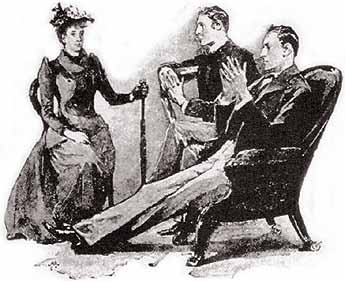
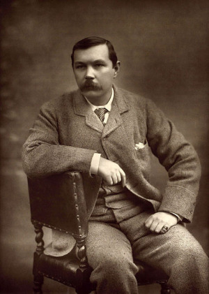
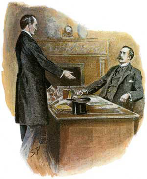
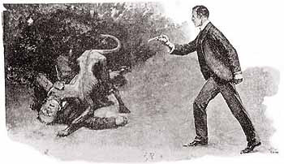

Detektivka je mnohem víc, než nudné policejní výslechy a finální scéna s odhalením pachatele. Není to jen žánr, ale [kompoziční manévr](http://drakkar.sk/35/), kdy přehodíme pořadí informací; neříkáme to, jak se to přirozeně lineárně děje, ale _něco zatajíme a necháme si to na později_. Což je základ značné části moderního epického vyprávění.

[Sherlock Holmes](http://drakkar.sk/61/) není zdaleka moje nejoblíbenější čtení. Není to technicky nijak závratně dobře napsané, postrádá to druhé a další plány. Ale je to strašlivě jednoduché a názorné; a právě nedokonalost je možná pro nadšené psavce a gamemastery daleko inspirativnější, než perfektní příběhy, dotažené k dokonalosti. Dnešní výprava za literaturou bude proto výjimečně s demonstrací některých možností přímo na konkrétním díle. Čímž bude Holmesův případ _Dům u měděných buků_ [(COPP)](https://search.mlp.cz/cz/titul/pribehy-sherlocka-holmese/3347685/) z roku 1890, který lze kompletní objevit na odkazu. A ještě bude další díl, kde uvidíme, co z toho nakonec autor vytěžil sám.

Inspirativní je již úvodní debata Holmese s Watsonem o vyprávění. Kompozičně je to nesmysl, neb to nijak nesouvisí s následujícím dějem. Naše doba sto let po Holmesovi ovšem podobné postmoderní náhledy za kameru užívá často; stojí tedy zato debatu prostudovat. Watson je zpočátku jako obvykle defenzívní, Holmes poučující, ale ve finále se to najednou úplně zvrtne:

> HOLMES: „Obávám se však, že jste se vyhýbal senzacím a zabředl přitom až do přílišné všednosti.“
>
> WATSON: „Možná že to tak nakonec dopadlo, ale aspoň jsem použil nových a pozoruhodných metod.“

Takže ne Holmes při odhalování případu, ale Watson při jeho popisování používá nové a pozoruhodné metody! Na moment zahlédneme celou legendu v úplně novém světle; ve skutečnosti je to možná Watson, kdo má celou situaci pevně v rukou! A možná nejde vůbec o geniální Holmesovu metodu pátrání, ale daleko spíš o Watsonovu metodu vyprávění.

Po té teprve Holmes hodí před Watsona neznámý dopis a začíná normální expozice příběhu. Kdybychom začali až zde, na děj by to nemělo sebemenší vliv.

> „Milý pane Holmesi, velmi ráda bych se s Vámi poradila, mám-li či nemám přijmout místo guvernantky, které se mi naskytuje. Zastavím se u Vás zítra v půl jedenácté a doufám jen, že Vám to tak vyhovuje. S pozdravem Vaše Violeta Hunterová“

Expozice typu spin off, popsaná [zde](http://drakkar.sk/65/). Zpočátku to celé vypadá jako nepodstatná ptákovina.

> (…) Sotva domluvil, dveře se otevřely a do pokoje vstoupila mladá dáma. Byla jednoduše, ale pěkně oblečená, obličej měla svěží, bystrý a pihovatý jak vejce kulíka a chování rázné jak žena, která se o sebe musí umět sama postarat.

Anglické krásno. Přirovnávat hlavní hrdinku příběhu k vejci kulíka …? Ale věnujme se tomu, jak byla slečna Hunterová na pracovním pohovoru:

> „(…) Hledáte místo, slečno?“
>
> „Ano, pane.“
>
> „Jako guvernantka?“
>
> „Ano, pane.“
>
> „A jaký vyžadujete plat?“
>
> „Ve svém posledním zaměstnání u plukovníka Spence Munroa jsem dostávala čtyři libry měsíčně.“
>
> „Ale to snad ne, to snad ne! To je přece pakatel - hotový pakatel,“ zvolal a mával tlustýma rukama ve vzduchu, jako by byl doslova unesen vzrušením. „(…) U mne budete mít, madam, počáteční plat sto liber ročně.“
>
> „Dovedete si jistě představit, pane Holmesi, že mi v mém zoufalém postavení zněla taková nabídka až neuvěřitelně.“

Následují čím dál podivnější požadavky zaměstnavatele, až po to, že by si slečna měla ostříhat vlasy. To už dívka odmítne. Ale nabídka je ještě zvýšena v dopise, který přijde dodatečně:

> (…) Milá slečno Hunterová (…) Jsme ochotni platit Vám třicet liber čtvrtletně, to jest 120 ročně, abychom Vás trochu odškodnili za menší, možná trošičku nepříjemné nároky, které si na Vás při svých rozmarech budeme klást. Nejsou však tolik nepříjemné. Má žena si například potrpí na určitý odstín ostré modři a snad byste byla ochotna chodit dopoledne po domě v takových šatech. Nemusela byste si ovšem dělat výlohy a kupovat si je sama, máme doma podobné šaty patřící naší drahé dceři Alici (která je nyní ve Filadelfii) a jistě by Vám dobře padly. Pokud bychom na Vás chtěli, abyste se posadila tu i onde nebo se bavila, jak Vás požádáme, určitě by Vám to nijak nemuselo vadit. Co se Vašich vlasů týče, je jich nesporně škoda, protože i za našeho krátkého rozhovoru jsem si musel povšimnout, jak jsou krásné, ale nezbývá mi bohužel než zůstat v tomto bodě pevný, a doufám jen, že zvýšený plat Vám ztrátu poněkud vynahradí. Pokud jde o Vaše povinnosti k dítěti, budou velice snadné. Pokuste se prosím, přijet a já Vás budu očekávat s bryčkou ve Winchesteru. Napište jen, kterým vlakem pojedete.
>
> S nejsrdečnějším pozdravem Váš Jephro Rucastle

> „(…) To tedy je dopis, který jsem právě dostala, pane Holmesi, a rozhodla jsem se, že nabídku přijmu. Napadlo mne však, že než se odhodlám ke konečnému kroku, měla bych ještě předložit celou věc k uvážení vám.“

Jsme na osmé straně, asi ve třetině příběhu. Místem se moc nešetřilo, k expozici by stačily ty dva dopisy a pár spojovacích vět. Situace je jasná; místo je lákavé, ale podmínky tak divné, že už divnější být nemohou. Plat je podezřele velký a kostýmní hrátky majitelů vzbuzují nejhorší obavy. Takže Holmes praví:

> „Přiznám se vám, že bych nikterak neuvítal, kdyby se o takové místo ucházela má sestra.“
>
> (…) „Ale ty peníze, pane Holmesi, ty peníze!“
>
> „Ano, jistě, plat je to dobrý – až příliš dobrý. A to mně právě znepokojuje. Proč by vám měli platit sto dvacet liber ročně, když si mohou za čtyřicet ještě vybírat? Za tím musí být nějaký pádný důvod.“
>
> (…) „Nebezpečí! Jaké nebezpečí předví-dáte?“
>
> Holmes vážně zavrtěl hlavou. „Jakmile bychom je mohli definovat, přestává být nebezpečím,“ řekl. „Ale kdykoli mě budete potřebovat, ve dne či v noci, pošlete telegram a přijedu vám na pomoc.“
>
> „To mi úplně stačí.“ Slečna Hunterová svižně povstala ze židle a všechna úzkost jí vymizela z obličeje. „Pojedu teď do Hampshiru s naprostým klidem. Napíši rovnou panu Rucastlovi, obětuji své ubohé vlasy a zítra se rozjedu do Winchesteru.“ Vděčně ještě Holmesovi poděkovala, s oběma se s námi rozloučila a hbitě zas vyšla z pokoje.

Autorův kompromis není nic moc. Pokud jsou pan Rucastle a spol. banda vrahů, pak by měl být Holmes někde za oknem domu, ne až v Londýně.

Řešením by mohla být alternativa, kdyby slečně Hunterové neřekli na začátku všechno. Třeba to s těmi vlasy. Na cestu by se vydala s tím, že si za dvojnásobný plat bude občas muset obléct nějaké šaty.

> (…) V jedenáct dopoledne druhého dne jsme již ujížděli k starému anglickému městu. Holmes byl po celou cestu ponořen do ranních novin, ale když jsme přejeli hranice Hampshiru, odhodil je a začal se obdivovat krajině.

Příběh šlo začít prostě tak, že posadíme Holmese s Watsonem do vlaku, necháme přistoupit slečnu Hunterovou a vyprávět. Myslím, že by to zabralo tak dvě strany; to podstatné shrnuje dopis pana Rucastla.

Autor cestu ve vlaku místo toho vycpal další postmoderní úvahou o zločinech, že je na venkově daleko nebezpečněji, než ve městě. Mezi řádky se rýsuje pokračování – pan Rucastle a spol coby sadistické doupě, kde se nebohá slečna Hunterová ničeho nedovolá. _Mlčení jehňátek_ a _Masakr motorovou pilou_ v jednom. Nic vám nebrání něco takového stvořit. Řešení se ale nabízí tak moc, že to vypadá dost průhledně a ne příliš originálně.

Slečna Hunterová nadhodila již v původním textu, že by paní Rucastlová mohla být šílená a pan Rucastle to zkouší zakrýt. Autor tohle Holmesovými slovy rozvádí dál:

> „Vymyslel jsem pět různých vysvětlení, ale jsou všechna založena jen na okolnostech … ale už vidím věž katedrály a zanedlouho se dovíme, co má slečna Hunterová za zprávy.“

A příběh pokračuje dalším vyprávěním slečny Hunterové. Bylo asi mnohem lépe to odehrát naživo z první ruky. Nabízelo se třeba nechat Watsona s Holmesem šmírovat za oknem a mít proto jen obraz bez zvuku, což dává napínavé možnosti. Nebo by to celé prožila slečna Hunterová od začátku, a Holmese – pokud ho bude vůbec třeba – tam vpustíme ještě později.

> Když jsem přijela do Winchesteru, pan Rucastle již na mne čekal a odvezl mne bryčkou do domu U měděných buků … Těsně před dveřmi do haly roste několik buků temné, jakoby měděné barvy, podle nichž je dům pojmenován.

Povídka založila tradici názvů podle místa Holmesova případu, které nemají bohužel vztah k ději. Bylo by lákavé ty měděné buky zapojit do děje, případně je alespoň barevně sladit s vlasy hlavní hrdinky a tím sledovat nějaký další smysl. Žel, nestalo se.

> Domněnka, k níž jsme dospěli ve vašem domě na Baker Street jako k nejpravděpodobnější, se však, pane Holmesi, nepotvrdila. Paní Rucastlová není šílená.

Škoda. Mohla být psina. A pomalu opouštíme falešnou prvotní expozici a řešíme podstatné věci:

> Je to tichá, bledá žena, o hodně mladší než její manžel; hádala bych jí sotva třicet a jemu je určitě již pětačtyřicet. Z jejich rozhovoru jsem usoudila, že jsou spolu asi sedm let a pan Rucastle byl vdovec. Z prvního manželství měl prý jen jedno dítě, dceru, která odjela do Filadelfie. Pan Rucastle mi po straně prozradil, že ujela z domova, neboť si z jakýchsi pošetilých důvodů znelíbila jeho ženu. Dceři však musí být již jistě dvacet a dovedu si docela představit, že se necítila s tak mladou otcovou ženou nikterak dobře.
>
> Paní Rucastlová mi připadá úplně bezbarvá, povahou i zevnějškem. Neudělala na mne příznivý ani nepříznivý dojem. Člověk ji skoro nevnímá. Na první pohled se pozná, že je hluboce oddána manželovi i synkovi. Ustavičně bloudí světlýma šedýma očima od jednoho k druhému, snaží se uhodnout každé jejich přání a pokud možno je splnit, ještě než je vyřknou. I on je na ni hodný svým trochu neomaleným hlučným způsobem a zdá se, že jsou spolu celkem šťastni.
>
> A přece má ta žena jakési tajné soužení, často zůstane sedět v hlubokém zamyšlení a s nepopsatelně smutným výrazem ve tváři. Několikrát jsem ji již zastihla v slzách. Někdy si myslím, že ji tak trápí povaha jejího dítěte, neboť jsem nikdy neviděla tak rozmazlené a zlomyslné malé stvoření. Chlapec je na svůj věk neobyčejně malý a má neúměrně velkou hlavu. Mám pocit, že se celé dny buď zuřivě vzteká a mlátí sebou, nebo se mračí a trucuje. Zná jenom jedinou zábavu - působit bolest slabším tvorům, než je sám, a projevuje pozoruhodný talent při vymýšlení, jak chytat myši, drobné ptáčky a hmyz.

Jsou tu exponovány hned čtyři linie. Pan Rucastle je úchylný sadista, jak padlo výše. Paní Rucastlová je šílená, jak padlo výše. Dcera je mrtvá, jak naznačeno nově. Nebo konečně je šílený syn; něco jako _Utažení šroubu_ od Henryho Jamese. Mimochodem, je dost pravděpodobné, že James znal tuto povídku. A dodejme, že Dan Simmons vymyslel nedávno ještě další a [zjevně nejlepší](https://www.databazeknih.cz/knihy/pate-srdce-304720) řešení.

Načež se objeví ještě další postavy:

> Jedno mne na domě hned dost nepříjemně zarazilo, a to vzezření a chování služebnictva. Jsou to vlastně jen dva lidé, manželé. Toller, neboť tak se muž jmenuje, je hrubý neotesanec s prošedivělými vlasy a knírem a v jednom kuse z něj táhne alkohol. Co jsem v domě, byl už dvakrát úplně opilý, ale panu Rucastlovi to zřejmě vůbec nevadí. Jeho žena je vysoká a silná, má zatrpklý obličej a mlčenlivá je jak paní Rucastlová, ale zdaleka ne tak sympatická.

No a pak se teprve odehraje to, na co jsme celou dobu čekali.

> „(…) Ach ano,“ řekl pan Rucastle a otočil se ke mně. „Jsme vám nesmírně zavázáni, slečno Hunterová, že jste tak vyhověla našim libůstkám a dala si ostříhat vlasy. Musím vás ujistit, že vám to ani maličko neubralo na kráse. A teď uvidíme, jak vám sluší ty ostře modré šaty. Čekají vás už rozložené na posteli ve vašem pokoji a byli bychom vám velmi vděční, kdybyste byla tak hodná a oblékla si je.“
>
> Šaty, které mi připravili, měly zvláštní odstín modře. Byly z prvotřídní látky, jakési zvláštní vlny, ale hned se na nich poznalo, že je už někdo nosil. Nemohly mi lépe padnout, ani kdybych je měla šité na míru. Když mě v nich pan Rucastle s paní viděli, úplně se rozplývali nadšením, které mi připadalo až přehnané. Čekali na mne v salónu, velikém pokoji, který se prostírá podél celého průčelí domu a má tři vysoká okna sahající až k podlaze. Ke střednímu oknu byla přistavena židle, obrácená opěradlem ven. Byla jsem vybídnuta, abych se na ni posadila, a potom začal pan Rucastle přecházet sem a tam po druhé straně pokoje a vykládat mi nejsměšnější historky, jaké jsem kdy slyšela. Neumíte si ani představit, jak byl legrační, a já se musela smát, že jsem sotva dechu popadala.

Jásání slečny Hunterové, která se o sebe údajně „umí postarat“ nad panem Rucastlem, který je všechno, jenom ne veselý srandista, je mimo charakter postavy a také je to mimo tísnivou náladu vyprávění. Poznámku lze prostě vyhodit. Ale zkusme si třeba představit, že pan Rucastle bude mladý a příjemný a slečně Hunterové se bude líbit. A zase se nám to zajímavě zkomplikuje.

> Za dva dny nato se celé představení opakovalo za přesně stejných okolností. (…) Jistě si umíte, pane Holmesi, představit, jak ráda bych se byla dopátrala, co má to zvláštní divadlo znamenat. Povšimla jsem si, že Rucastlovi dbají vždy velice o to, abych seděla s obličejem odvráceným od okna, a přímo mě stravovala touha přesvědčit se, co se děje za mými zády. Zprvu se mi to zdálo zhola nemožné, ale brzy jsem si vymyslela, jak na to. Rozbilo se mi příruční zrcátko a tu jsem přišla na šťastný nápad a schovala jsem si střípek do kapesníku. Při nejbližší příležitosti jsem si uprostřed všeho smíchu najednou přiložila kapesník k očím, a když jsem ho trošičku natočila, mohla jsem se konečně podívat, co se za mnou děje.

Tady to, mimochodem, dostane atmosféru. Kouzlo tkví v tom zrcátku. Nemýlí se mistr Bradbury, že pravda tkví v detailu. Je občas třeba opustit generální pohled kamery a sjet na detail.

> Povšimla jsem si, že na southamptonské silnici stojí jakýsi menší muž s bradkou a v šedém obleku, a zdálo se mi, že se dívá přímo na mne.
>
> „Není to nějaký váš známý, slečno Hunterová?“ zeptal se mne pan Rucastle.
>
> „Ne, já tady vůbec nikoho neznám.“
>
> „Proboha, to je ale drzost! Otočte se laskavě a pokyňte mu, aby odešel.“
>
> „Jistě by se hodilo lépe, kdybych si ho nevšímala?“
>
> „Ne, ne, to by se nám tu potloukal pořád. Jen se laskavě obraťte a ukažte mu, ať si jde po svých.“ Učinila jsem, jak mi přikázal, a paní Rucastlová hned stáhla žaluzii. To bylo před týdnem a od té doby jsem už ani jednou v okně neseděla.
>
> (…) Hned prvního dne, kdy jsem byla U měděných buků, mne pan Rucastle zavedl k malé kůlně, postavené za dveřmi od kuchyně. Jak jsme se k ní blížili, zaslechla jsem hlasité řinčení řetězu a hluk, jako když tam pobíhá jakési veliké zvíře.
>
> „Podívejte se,“ vybídl mě pan Rucastle a ukázal mi škvíru mezi dvěma prkny, „není to krasavec?“ Nahlédla jsem dovnitř a spatřila dvě žhnoucí oči a jakési tělo schoulené ve tmě.
>
> „Jen se nebojte,“ řekl můj zaměstnavatel a srdečně se smál mému leknutí. „To je jen Carlo, můj pes. Říkám sice můj, ale vlastně si s ním dovede poradit jenom můj kočí, starý Toller. Krmíme ho jen jednou denně, a ještě ne moc, takže je pořád hladový jak vlk.“
>
> (…) Dvě noci nato jsem náhodou asi ve dvě hodiny vyhlédla z okna své ložnice. Byla překrásná měsíční noc a trávník před domem zalévalo stříbrné světlo, takže se celý třpytil. Stála jsem okouzlena poklidnou krásou scenérie, když tu jsem si pojednou uvědomila, že se ve stínu pod měděnými buky cosi pohnulo. Vzápětí se to už vynořilo v měsíčním světle a viděla jsem, co to je. Byl to obrovský pes, veliký jak tele, žlutohnědý, s převislým podbradkem, černou mordou a obrovskými vyčnělými kostmi. Pomalu přešel přes trávník a zmizel mi ve tmě na druhé straně. Zalekla jsem se toho příšerného tichého hlídače víc, než by mě myslím dokázal vystrašit nějaký lupič.

Tady je asi jasné, co vás napadlo. Ano, právě o tom bude příští pokračování v Drakkaru.

> (…) Jak víte, dala jsem se v Londýně ostříhat a uložila jsem si vlasy ve velkém vrkoči na dně kufru.
>
> (…) A tak jsem vyndala svazek klíčů a zkoušela skříňku otevřít. Hned první zapadl do zámku jak ulitý a snadno jsem zásuvku otevřela. Byla v ní jedna jediná věc a určitě byste neuhodl co. Vrkoč mých vlasů. Vyndala jsem jej a udiveně jej prohlížela. Měl stejný zvláštní odstín a vlasy byly i stejně silné. V té chvíli jsem si teprve s ohromením uvědomila, že to mé vlasy být nemohou. Jak bych je mohla mít zamčené v této zásuvce? Roztřesenýma rukama jsem otevřela kufr, všechno z něj vyndala a ze samého dna vytáhla své vlasy. Položila jsem oba copy vedle sebe a mohu vás ujistit, že byly naprosto stejné.

V zásadě jde spíš o atmosférickou záležitost, jako to zrcátko předtím, protože to, že se slečna Hunterová má vydávat za někoho jiného je dost zřejmé už delší dobu. Ale proč ne.

> (…) Jednou však, když jsem šla ze schodů, zahlédla jsem pana Rucastla, jak právě vychází z těchto dveří se svými klíči v ruce a na tváři výraz, který ho dočista proměnil; vůbec v té chvíli nevypadal jak onen tlustý žoviální pán, na kterého jsem byla uvyklá. Tváře měl rudé, obočí zježené vzteky a na spáncích mu samou zlostí vystupovaly žíly. Zamkl dveře a proběhl kolem, aniž mi věnoval jediné slovo nebo pohled.
>
> (…) Jenomže, pane Holmesi, od okamžiku, kdy jsem pochopila, že se v té řadě pokojů tají něco, o čem se nemám dovědět, jen jsem hořela touhou do nich proniknout.

Další klasické téma – třináctá komnata. Užít to lze ve většině variant, které tu byly nadhozeny.

> (…) Má chvíle se mi naskytla až včera. (…) Tichounce jsem otočila klíčem v zámku, otevřela dveře a proklouzla dovnitř. Přede mnou se objevila úzká chodbička s holými zdmi a nepokrytou podlahou, která se vzadu stáčela do pravého úhlu. Za rohem jsem spatřila v řadě troje dveře a první a třetí z nich byly otevřené. Vedly do prázdných pokojů, zaprášených a bezútěšných. V jednom z nich byla dvě okna a v druhém jedno, ale všechna byla tak hustě pokrytá špínou, že jimi večerní světlo sotva pronikalo. Prostřední dveře byly zavřené a navíc zajištěné širokou tyčí z železné postele, která byla z jedné strany připevněna visacím zámkem ke kruhu ve zdi a z druhé přivázána pevným provazcem. Dveře samotné byly také zamčené, ale klíč v nich nebyl. Zabarikádované dveře určitě odpovídaly oknu se staženými žaluziemi, které jsem viděla zezdola, ale podle světla, jež pod nimi prosvítalo, jsem poznala, že v pokoji nemůže být tma a že je tam zřejmě ještě vikýř, který propouští světlo shora.
>
> Jak jsem tak stála v chodbičce, prohlížela si ty zlověstné dveře a hloubala, jaké tajemství asi skrývají, zaslechla jsem pojednou z pokoje kroky a zahlédla, jak se v nepatrné štěrbince světla pronikajícího zpod dveří mihl sem a tam jakýsi stín. Zachvátila mne z toho pohledu hrůza, pane Holmesi, šílená, nezvladatelná hrůza. Až k prasknutí napjaté nervy mi náhle vypověděly a já se otočila a prchala - prchala jsem, jako kdyby se po mně vztahovala jakási obludná ruka a chytala mne již za sukni. Proběhla jsem jak šílená chodbou i dveřmi a vpadla jsem přímo do náruče pana Rucastla, který čekal venku.
>
> „Aha, tak jste to přece vy,“ řekl mi s úsměvem. „Však jsem si to hned myslel, když jsem viděl ty otevřené dveře.“
>
> „(…) Byla jsem hrozně pošetilá a vešla do toho prázdného křídla,“ odpověděla jsem mu.
>
> „(…) A proč myslíte, že zamykám ty dveře?“
>
> „To doopravdy nevím.“
>
> „Aby tam nelezl nikdo, kdo tam nemá co pohledávat. Chápete?“ Pořád se ještě na mne líbezně usmíval.
>
> „Kdybych to byla jen tušila –„
>
> „Tak teď už to víte. A jestli ještě jednou překročíte ten práh,“ – úsměv mu najednou ztuhl do rozzuřeného úšklebku a podíval se na mne nenávistně, s výrazem přímo ďábelským, „hodím vás psovi.“

Geniální. Od rozverného začátku nám příběh pomalu odplynul do gotického hororu. Hrdinka bloudí zlověstnými chodbami vstříc děsivým tajemstvím. Málokteré téma je tak provařené, a přesto stále funguje. S lítostí krátím další scény, které hrdinku posunou tam, kde jsme už byli – do hostince a k setkání s Holmesem a Watsonem.

Všimněme si kompozice. Celou druhou třetinu příběhu slečna Hunterová vypráví, Holmes s Watsonem poslouchají. Povídka působí dojmem, že ji autor vymyslel a pak do ní dodatečně nacpal Holmese s Watsonem. Což dává možnost je zase vyhodit. Slečna Hunterová by si vystačila sama. Pak netřeba ani scény ve vlaku, můžeme mít expoziční první dialog s žádostí o práci a plynule pokračovat v domě U měděných buků. Nikdo nikomu nic nevypráví. Děj se zdrcne sotva na polovinu, a to tu daleko napínavější. Zbude víc místa na přímou řeč a na detaily, podobné scéně se zrcátkem nebo s vlasy. Nebo s tím psem za měsíčního svitu.

> „Zachovala jste se v celé té záležitosti jak velmi odvážná a statečná dívka, slečno Hunterová. Myslíte, že byste dokázala podniknout ještě něco, k čemu je třeba značné odvahy? Nežádal bych to po vás, kdybych nevěděl, že jste naprosto výjimečná žena.“
>
> „Pokusím se. A co bych měla udělat?“
>
> „V sedm hodin přijdeme, můj přítel a já, k Měděným bukům. Rucastlovi budou již pryč a Toller, jak doufám, neschopný pohybu. Zbývá jen paní Tollerová, ale není vyloučeno, že by mohla ztropit poprask. Velmi byste nám práci ulehčila, kdybyste ji poslala pod nějakou záminkou do sklepa a otočila za ní klíčem.“
>
> „Zařídím to.“

Takže nejenom, že Holmes a Watson ještě nic neudělali, ale nechají slečnu Hunterovou zpacifikovat i poslední nebezpečnou osobu!

Teprve pak nám Holmes konečně řekne, o co tu vlastně jde. Je to jedna z linií, které se nabízely.

> „Rucastlovi vás k sobě povolali, abyste někoho zpodobňovala, někoho, kdo je uvězněn v tom pokojíku. To je nad slunce jasnější. Pokud jde o to, kdo je tam uvězněn, pak jsem si zcela jist, že je to slečna Alice Rucastlová, o níž, pokud si správně pamatuji, tvrdí její otec, že odjela do Ameriky. Vybral si vás bezpochyby proto, že ji připomínáte výškou, postavou i barvou vlasů. Nejspíše prodělala nějakou nemoc a musela se dát ostříhat, a tak jste samozřejmě musela obětovat vlasy i vy. Úplnou náhodou jste přišla na její cop. Muž na silnici byl bezpochyby její přítel – a možná i snoubenec – a protože jste sedávala u okna v jejích šatech a tolik jí byla podobná, a protože kdykoli vás viděl, jste se smála, usoudil zřejmě z vašeho veselí a později i pohybu, jímž jste mu naznačovala, aby odešel, že slečna Rucastlová je zcela spokojená a nepřeje si již, aby jí projevoval zájem. Psa pouštějí na noc ven, aby mu znemožnili veškeré pokusy jakkoli se s ní domluvit. Až potud je mi vše jasné.
>
> (…) Přesně v sedm jsme dorazili k domu U měděných buků.
>
> (…) „Doufám, že nejdeme pozdě,“ řekl Holmes. „Raději tady počkejte, slečno Hunterová. Vy se, Watsone, opřete ramenem do těch dveří a uvidíme, jestli se dostaneme dovnitř.“
>
> Dveře byly staré a chatrné a pod naším společným náporem rázem povolily. Vpadli jsme oba do pokoje. Ten však byl prázdný. Nebyl tu žádný nábytek, jen úzká postel se slamníkem, malý stolek a košíček s nějakým šitím. Vikýř nahoře byl otevřený a vězeňkyně pryč.
>
> „Zase tu provedli nějakou ničemnost,“ řekl Holmes. „Ten chlap určitě uhodl, k čemu se slečna Hunterová chystá, a svoji oběť unesl.“

Zde by Holmes již zasloužil ocenění Bezejmenného hrdiny – přes veškeré úsilí stále ještě nezasáhl do děje. Po všech přípravách nakonec dorazil pozdě! Jediný výsledek je toto:

> „(…) slyším tam nějaké kroky. Měl byste si, Watsone, připravit revolver.“
>
> Ještě to téměř nedořekl a do dveří vpadl tlustý hřmotný chlap s těžkou sukovicí v ruce. Slečna Hunterová vykřikla a ucouvla před ním ke zdi, ale Holmes se vrhl kupředu a postavil se mu tváří v tvář.
>
> „Vy ničemo!“ zvolal. „Kde máte dceru?“
>
> „Na to bych se měl ptát já vás,“ zaječel muž. „Vy zloději! Vy špehové zlodějští! Ale teď jsem vás přistihl, co? A mám vás pěkně v hrsti! Však vám to taky ukážu!“ Otočil se, a co mu nohy stačily, hlučně seběhl ze schodů.
>
> „Utíká pro psa!“ vykřikla slečna Hunterová. „Mám přece revolver,“ utěšoval jsem ji.
>
> (…) Ještě jsme ani nebyli v hale, když jsme zaslechli štěkot obrovského psa a potom děsivý bolestný výkřik a strašný úzkostný jek, který nám přímo rval uši. (…) Před sebou jsme spatřili obrovské vyhladovělé zvíře s černou mordou zahryzlou do Rucastlova hrdla a pod ním Rucastla svíjejícího se na zemi a ječícího děsem. Vrhl jsem se k nim, rozrazil psovi lebku a zvíře se prudce převalilo, pořád ještě zakousnuto nenasytnými bílými tesáky do záhybů na krku svého pána. Dalo nám mnoho práce, než jsme je od sebe odtrhli, a Rucastla jsme pak odnesli živého, ale zle pokousaného do domu.

Pěkné dramatické finále. A případ se mezitím vyřešil sám bez Holmese, díky paní Tollerové ex machina, která nám vysvětlí, že:

> „(…) Slečna Alice nebyla doma šťastná … nejhorší bylo, když se u jedné přítelkyně seznámila s panem Fowlerem. Jak jsem se aspoň doslechla, měla nárok na nějaké dědictví, ale byla chudinka vždycky tak tichá a trpělivá, že se o něm jakživa slovem nezmínila a všechno nechávala na panu Rucastlovi. Věděl, že se jí bát nemusí, ale jak si uvědomil, že by si mohla najít manžela a ten že by potom jistě žádal, co mu po právu náleží, rozhodl se, že jí v tom radši zabrání. Nejdříve na ní chtěl, aby mu podepsala nějaký dokument, že ať se vdá nebo ne, má na její peníze právo on. Když odmítala, naléhal na ni tak dlouho, až z toho dostala mozkovou horečku a šest neděl se potácela mezi životem a smrtí a i ty krásné vlasy jí ustřihli. Jenže její mládenec se tím nedal nijak odradit a zůstal jí věrný jak pravý muž.“
>
> „Ach tak,“ řekl Holmes, „z toho, co jste nám laskavě vysvětlila, je mi už záležitost naprosto jasná a zbytek si dovedu domyslet. Pan Rucastle pak zřejmě přistoupil k metodě věznění?“
>
> „Ano, pane.“
>
> „A přivezl z Londýna slečnu Hunterovou, aby se zbavil nepříjemné vytrvalosti pana Fowlera.“
>
> „Opravdu, tak to bylo, pane.“
>
> „Jenže pan Fowler se hned tak od­být nedal, jako ostatně žádný dobrý námořník, a obléhal dům tak dlouho, až se s vámi dohodl a pomocí jistých argumentů, zřejmě i pěkně šustivých, vás nakonec přesvědčil, že jeho zájmy se kryjí s vašimi.“
>
> „Pan Fowler je moc laskavý a štědrý gentleman,“ odpověděla vážně paní Tollerová.
>
> „A proto se také postaral, aby vašemu dobrému muži nikdy nechybělo něco k napití a aby tu čekal žebřík připravený na chvíli, kdy váš pán odejde z domu.“
>
> „Přesně tak se to stalo, pane.“
>
> Tak byla tedy vyřešena záhada zlověstného domu, před jehož vchodem rostly nádherné měděně zbarvené buky.

Mno. Člověk si řekne – promrhaný potenciál. Tollerovi jsou další nadbytečné figury, záchranná akce by lépe slušela slečně Hunterové. Jejím protivníkem je vlastně jen pan Rucastle a ostatní nemají co na práci. Toller, paní Rucastlová, zlý chlapec, Fowler, dokonce i Holmes s Watsonem – všechny tam můžete mít i nemít podle libosti, a pokud byste je nechali, vymyslete jim nějakou činnost.

Přesto je příběh tíživý a zneklidňující, a funguje i jako román, jak dokazuje to _Utažení šroubu_. Nebo jako to, co bude v dalším pojednání. A pochybovače o nevyužitých možnostech tohoto příběhu asi přesvědčí neslýchaná závěrečná věta:

> (…) Pokud jde o slečnu Hunterovou, ztratil o ni můj přítel k mému značnému zklamání zájem, sotva pro něj přestala představovat jeden z jeho problémů, a teď je ředitelkou jakési soukromé školy ve Walsallu, kde prý si vede neobyčejně dobře.
