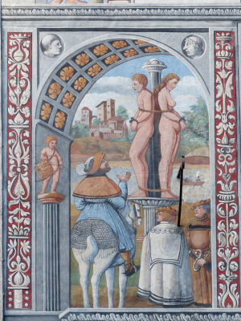
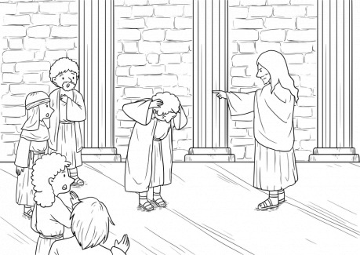
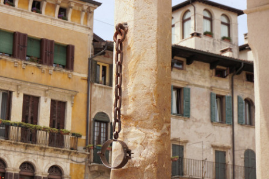
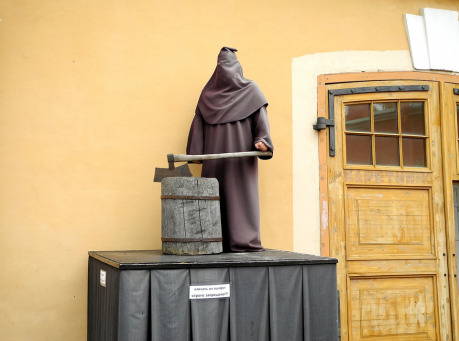
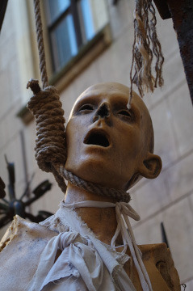

Otázka „opovrhování“ katem totiž nemá s opovrhováním, jak jej známe dnes, téměř nic společného. Hovoříme zde o prastarém právním institutu zvaném infamie, česky ztráta cti. Ježto jsem tomuto tématu věnoval kapitolu své diplomové práce, pokládám se (zda právem, posuďte sami) za osobu povolanou věc poněkud blíže osvětlit.

Institut ztráty cti je nám dnes již jen těžko pochopitelný; žijeme v době, kdy cti jako takové již nikdo nehledí a téměř normou se stává prodat se co nejvýhodněji, ba se i tím následně chlubit. Ztráta cti pro dnešního člověka by byla, až na menšinu případů, jen pro zasmání a nejčastěji se tento termín používá ve spojení s počátkem sexuálního života mladých dívek.

Pojem „cti“ však sahá až do starého Říma (možná i dále, ale z Říma jej máme spolehlivě doložený). Každý (resp. každý svobodný muž, ale i některé ženy) disponoval dvěma oblastmi, které spolu tvořily společenskou vážnost: _auctoritas_ a _dignitas_. _Auctoritas_ byla vymezena poměrně jasně: představovala společenský vliv svého nositele, de facto schopnost přimět ostatní, aby jednali dle jeho vůle. Jako taková byla souhrnem mnoha faktorů, starobylosti a vážnosti rodu, jakož i konkrétní osoby, množství jejího majetku a klientů, osobních vlastností a v neposlední řadě i úřadu, který zastával. V souladu s těmito se také mohla celkem snadno měnit.

_Dignitas_ byla pojmem mnohem více neuchopitelným. Čest, a to ani středověká, není jejím přesným ekvivalentem. Spíše připomínala „neposkvrněnou pověst“. Získat si dignitas bylo podstatně těžší než v prvním případě; ztrácela se však velmi snadno. Obnovit ztracenou _dignitas_ pak bylo prakticky nemožné. Obava ze ztráty _dignitas_ vedla Římany k mnohdy katastrofálním rozhodnutím; mnohý římský generál by se raději dal pobít s celou armádou, aby unikl pohaně způsobené ústupem.

Římský vyhnanec pak ztrácel svou _dignitas_; její odnětí bylo součástí trestu.

Čest středověkého člověka vzcházela ze dvou odlišných kořenů; z již zmíněného římského dědictví a ze cti tak, jak ji chápaly barbarské národy, kterou reprezentovalo zejména slovo ve formě slibu nebo přísahy. Ve středověku se pak přerodila v institut, řekl bych, „téměř hmotné povahy“. Středověk výslovně a jasně určoval, kdo čest má a kdo ne, kdo ji ztrácí, a kdo dokonce nabývá a komu se ztracená čest obnovuje.

Ztráta cti mohla být ve středověkém právu trestem samostatným; nejčastěji však byla spojována s jiným. V některých případech musela býti zvláště vyslovena, aby vstoupila v účinnost, u jiných trestů pak nastupovala automaticky. V některých případech, kdy měla nastoupit automaticky, mohla být zase výslovně odvolána, resp. dotyčnému soudem čest navrácena.

## Co to vlastně ona ztráta cti byla?

Infamie s sebou nesla úplné sociální vyloučení (včetně ztráty všech veřejných funkcí), ztrátu příslušnosti k městské obci a jakékoli vážnosti mezi spoluobčany. Difamovaní nemohli svědčit ani např. jít dítěti za kmotra a často už poté ani nedokázali zabezpečit obživu pro svou rodinu!

Zde dobře vidíme, že následky ztráty toho, co v dnešní době na první pohled nezaujme, tedy „cti“, byly nesmírně závažné. Čest zahrnovala v podstatě řadu občanských práv, včetně institutu tak základního, jako je způsobilost k právním úkonům.

To však nebyly všechny problémy, které ztráta cti přinášela (jako by už takhle toho nebylo dost). Patrně vůbec nejhorším důsledkem, který infamie mohla přinést, byl její dopad na okolí, které s potrestaným přicházelo do styku. V první řadě byla postižena rodina a příbuzenstvo a sama obec se často bránila případnému poskvrnění prevencí, kterou bylo vypovězení z města či země.

Způsobů, jak ztratit čest, byla ve středověku celá řada:

- odsouzením za některé typy zločinů
- výslovným konstatováním soudu
- výkonem některého řemesla
- stykem s bezectnými lidmi
- neubráněním se osočení z bezectnosti
- porušením slibu

Pobyt ve vězení např. přinášel ztrátu cti, neboť potrestaný byl postaven na roveň zločincům, tedy osobám bezectným (čest bylo možno ztratit právě i stykem s bezectnými lidmi). Dlužnické vězení, naopak, tuto nepříjemnost s sebou neneslo. Dále záleželo na místě, kde k trestu došlo a kdo jej prováděl; ke ztrátě cti docházelo, pokud trestaný upadl v ruce kata. Typicky zneucťujícím trestem bylo vystavení na pranýř. V českém právu zemském se často setkáváme s výslovným prohlášením ztráty cti. Zde dobře vidíme výše zmíněné rozdíly. Pokud pobyt ve vězení mezi zločinci přinášel ztrátu cti, začnou nám rázem dávat smysl všechny na první pohled uchu moderního člověka podivně znějící instituce záruk, ležení a slibů, a právě tak skutečnost, že porušením slibu se čest ztrácela.

Obdobně jako v Čechách vypadala i situace v Říši, jak ji podává R. van Dülmen (_Bezectní lidé: o katech, děvkách a mlynářích: nepočestnost a sociální izolace v raném novověku_, Dokořán 2003, Praha). Pokud byl dotyčný potrestán katem (lehčí tresty obstarával dráb, biřic atd.), jednalo se o zásadní zásah do provinilcovy cti; návrat k předchozímu životu mu byl prakticky znemožněn.

Nebylo divu, že trest ztráty cti patřil k velmi obávaným, neboť mohl zasáhnout osoby z širokého okolí postiženého. Ty pak byly v dalším životě v obci svázány malými rozměry a sousedskými vztahy, vystaveny posměchu a ostrakizování lidu.

Vzhledem k velké závažnosti, kterou infamie nesla, nebyla ukládána obecně, nýbrž jen za některé typy zločinů. Jednalo se o tzv. „nepočestné“ zločiny. Jejich znakem bylo to, že byly spáchány potají a se zlým úmyslem. Z našeho dnešního pohledu vyznívá jejich rozdělení někdy logicky, jindy méně; že je za nepočestný považován mord (vražda) a za „počestný“ (ano, zní to zvláštně) zabití, asi dokážeme pochopit. Ale nepočestná byla i krádež, zatímco loupež (neboť byla provedena zjevně) náležela mezi počestné – rozhodovalo hledisko „tajnosti“, což už je pro nás dnes pochopitelné jen stěží.

Výše popsanému dělení pak odpovídají i ukládané tresty. Neskrývaný zločin (např. spáchaný v afektu) býval potrestán mečem, což umožňovalo řádný pohřeb do vysvěcené půdy. U nepočestných pak nastupovalo upálení, utopení či oběšení; popravení pak neměli nárok na křesťanský pohřeb, případně byli zcela nepohřbeni. Typická žádost o milost se netýká snahy o zachování života (jak známe dnes), ale prosby o změnu způsobu popravy na stětí; žádostem bývalo často vyhověno. Infamie „nepočestně“ popraveného totiž dopadala na celou rodinu. Podle van Dülmena byl způsob popravy stětím v původní podobě výsadou urozených; teprve od počátku 17. století se začal prosazovat jako obecná praxe.

Je tedy zjevné, že dopad ztráty cti na postavení postiženého byl velmi hluboký a rozsáhlý. V podstatě bychom jej mohli nazvat „právní smrtí“ dotyčné osoby (nešel tak daleko jako „civilní smrt“, kdy se i manželství a vztahy psancovy rozvazovaly), nicméně nemožnost činit právní úkony se dotýkala zneuctěného velmi silně – je otázkou, jestli vůbec mohl nabývat majetku nemovitého charakteru.

## Jak to bylo s katem?

Co se týkalo výkonu povolání, kat byl typickým zástupcem povolání, jejichž vykonavatelé náleželi k lidem se sníženou ctí. Jinými slovy, měšťané se vyhýbali katovi nikoli proto, že by jím opovrhovali, ale proto, že pokud by se mu nevyhýbali, snadno mohli přestat být měšťany a ztratit většinu práv.

Kat však zdaleka nebyl v tomto osamocen. V různých dobách a místech patřila k těmto povoláním celá řada dalších. Van Dülmen uvádí: _„Patřila sem nejenom tzv. špinavá řemesla jako pohodní, kati, lázeňští pomocníci, holiči-lazebníci, markytánky a prostitutky, ale i většina těch, kteří se živili podomním obchodem, potulní komedianti, žebráci či ti, kteří skončili život jako sebevrazi – a pro dnešního člověka poněkud překvapivě i mlynáři, celníci a tkalci.“_ Nyní vidíme, že nejen katovna, ale i mlýn a lázně stály za hradbami ze stejných důvodů.

Z výšeuvedeného vyplývá, že většina dobrodruhů, kteří jsou potulnými existencemi, by patrně patřila k bezectným lidem. •‿•

Co se týče styku s bezectnými lidmi, o tom je již zmíněno výše; to byl onen důvod, proč se lidé katovi (rasovi atd.) vyhýbali. Pokud byl někdo ve městě vystaven ztrátě cti, byl obvykle rovněž z města vypovězen, aby nemohl „nakazit“ ostatní občany – infamie byla infekční.

Nejzajímavějším způsobem ztráty cti, který se týkal většinou šlechty, bylo tzv. „neobránění cti“.

„Jsi hanebný panchart a z kurvy syn,“ děl vyzyvatel a diváci zatajili dech. Budou taseny meče?

Musely být. Pokud nebyly, osočený mohl ztratit svou čest se všemi výše popsanými následky! Jinými slovy, šlechtici nebyli extrémně urážliví a nebojovali pro každou hloupost, ale bránili svá reálná práva na majetek a šlechtické postavení … Později bylo v zemských zákonech vyhrazeno, že namísto soubojem se má věc řešit na soudu, a potom tato zaběhlá praxe upadla.

Zajímavý je ještě jeden aspekt zneuctění, a to jeho náboženský dopad. V konceptu infamie je zřetelný náboženský obsah, co se týče odepření řádného pohřbu. Pokud používáte ve světě církev obdobnou křesťanské, lze to aplikovat; pokud jinou, musíte si systém přizpůsobit. Dobrým vzorem může být starý Řím se svým polyteismem.

## Další postřehy

K výše citovanému Ecthelionově článku již jen pár drobností. Přísežní nebyli předchůdci konšelů (možná v některých oblastech), ale byli to přímo konšelé (_consules_). Na soudech zasedali jako soudci spolu s rychtářem. Svědčit u soudu mohl každý svobodný člověk; výše majetku byla stanovena jen pro některé případy. Šlo o to, že svědek byl zároveň ručitelem a musel případně platit za poraženou stranu. Ostatně, _Chanson de Roland_ uvádí, že po prohraném soudu byl zrádce Ganelon popraven i se svými svědky (patrně proto, že křivě přísahali). Svědek středověkého soudu nebyl nezaujatým pozorovatelem, jak to vnímáme dnes, a nevypovídal o tom, co viděl; byl tzv. podporovatelem jedné strany a svědčil zpravidla o důvěryhodnosti a „zachovalosti“ dotyčného. Pokud měly svědky strany obě, rozhodoval počet svědků; bohatší šlechtic měl více leníků, tím více podporovatelů a tím i u soudu víc pravdy. •‿• Na Islandu došel tento problém tak daleko, že se družiny místních šlechticů cestou na zemský sněm, kde se soudy konaly, navzájem přepadaly a snažily se pobít protistraně co největší počet možných svědků, aby zvýšili své šance.

Co se týče soukupů, většinu středověku byl tento výraz vnímán jako hanlivý a spolumajitelé městských domů by se patrně urazili, kdyby byli takto označeni.

K výměře vesnických polností známe i lá­ny o rozměru 23 hektarů (což bylo hodně), běžný lán se pohyboval mezi 9–18 hektary.

Obecně, výkon středověkého práva vypadal dosti odlišně od práva našeho, na které jsme zvyklí. Dlouho se držela krevní msta; pokud si někdo myslí, že jejím terčem byl pachatel zločinu, mýlí se. Krevní msta směřovala proti hlavě zločincova rodu. Je proto logické, že se mohla, každou další smrtí znovu rozdmýchána, táhnout mezi rody i několik staletí.

Lánový systém, o němž Ecthelion rovněž píše, je pro hru dobrý a přehledný, ve středověku se však prosadil až ve 12.–13. století, v Čechách během kolonizace za Václava I. Tzv. emfyteutické právo přišlo z Německa a přinášelo mnohem lepší přehled o pozemcích, což přispívalo k lepšímu výběru renty a daně. Před ním převládalo hospodářství občinové, kdy pozemky v obci (nutno si uvědomit, že obec = rod; migrace mezi vesnicemi vyjma sňatků prakticky neexistovala a všichni ve vesnici byli obvykle příbuzní) byly společné a vesnice sama rozhodovala, kdo který obdělá a pobere z něj užitek.

Zajímavé bylo i to, že většina lidí ve středověku nežila v manželství, což se dnes obecně neví. Pro manželství byla třeba jistá majetková kvalifikace (a samozřejmě zachovalá čest), čili v manželství žila šlechta, měšťané a svobodní sedláci, tedy cca 20–30 % obyvatelstva. Zbytku nebylo souzeno se nikdy oženit/vdát, takže byla opravdu hodně rozmnožená prostituce (ve městech), jakož i instituce konkubinátu, zatímco na venkově se žilo víceméně ve volných sexuálních vztazích, které jsou v dnešní puritánské a na soukromí háklivé společnosti zcela nepředstavitelné. Soukromí ostatně neexistovalo ani u těch nejvýše postavených; bylo obvyklé, že např. porodu královny přihlížel (ještě za Ludvíka XIV. ve Francii) celý dvůr, asi 300 osob. Nebylo výjimkou, že bylo dohlíženo na řádné oplodnění.
