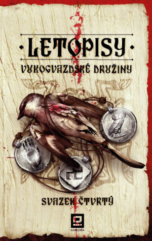
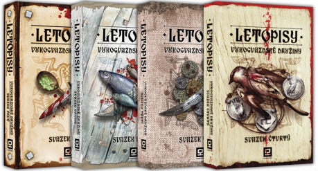
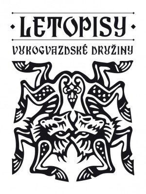

Článek Vukogvazdských _Herní praxe přetavená v literaturu aneb Z Vlčího hvozdu není návratu_ nás v říjnu 2014 zanechal ve stavu, kdy se teprve schylovalo k vydání třetího svazku Letopisů. Od té doby se v _Drakkaru_ neobjevila ani zmínka o tomto mimořádně zajímavém počinu, snad vyjma kritického hodnocení v diskusi k dvaapadesátému číslu, kdy byly uvedeny jako příklad toho, že není lehké udělat knihu z herních zápisků. S tím rozhodně souhlasím, ale _Letopisy_ nejsou zrovna ideální příklad, protože i jako literatura fungují velmi solidně a podle mého rozhodně patří k tomu lepšímu, co může v češtině vycházející fantasy nabídnout. V kategorii českých autorů mne pak napadá jediné jméno, shodou okolností též spjaté s letopisy, které se s nimi může měřit – a jak bude rozvedeno dále, je to srovnání z mnoha důvodů zajímavé.

## Zdroje a inspirace

Jak vyplývá z výše uvedeného, _Letopisy Vukogvazdské družiny_ vycházejí z odehraných dobrodružství party hráčů Dračího doupěte. Nejde však o žádnou formu herního deníku či jiného záznamu hry, ale výchozí materiál doznal rozsáhlého literárního zpracování a výsledkem je plnohodnotná literatura, ať už tento termín znamená cokoliv. Čtvrtý díl _Letopisů_, stejně jako všechny předchozí, přináší trojici relativně ucelených, uzavřených dobrodružství, jejichž vyprávění zaujímá necelých 400 stran, a vydala jej Gorgona v Praze loňského roku. Pro encyklopedický záznam lze zmínit, že ilustrace (nepočetné) stejně jako všech tisíc výtisků knihy vznikly v Polsku rukou Piotra Cieślińského (obálka) a Dominika Bronieka (vnitřní ilustrace) respektive stroji Opolské tiskárny. Mimochodem, stránky nakladatelství doporučuji navštívit, tamní redakční články skrývají nejednu zajímavost, třeba o tom, jak si rozvrhnout strukturu vlastního příběhu tzv. metodou sněhové vločky.

Pokud by někdo měl vzhledem k použitému inspiračnímu zdroji pochyby, tak si dovolím uvést, že na pravidla Dračího doupěte odkazuje v celém textu jediné slovní spojení, a sice rudý blesk, což je sice název konkrétního kouzla střední úrovně z pravidel pro pokročilé, ale atmosféru to v žádném případě neruší. To se již najde více odkazů na Sapkowského svět – stříbrný meč na nestvůry, striga, zmínky o vědmácích. Jan Kravčík spolu s ostatními autory (všechny popisky se alespoň tváří tak, že jde vlastně o kolektivní dílo) šel dokonce tak daleko, že se neshodují ani místa a způsoby smrti hlavních postav. V tom se však inspirace hrou úplně nezapře. Úmrtí hrdinů přichází častěji, než je běžné z obdobné literatury (pokud bychom nesrovnávali přímo s G. R. R. Martinem), a v situacích, které třeba z hlediska příběhu nejsou natolik podstatné, ale když kostka nepadá, padají hlavy. Kdo hrál někdy podobný styl hry na hrdiny, tak to dobře zná.

## Prostředí

Srovnání se Sapkowským se nabízí i vzhledem k celkové atmosféře Vukogvazdského hvozdu, oba světy jsou ponuré, téměř temné, méně epické než převažující angloamerická tvorba. Nicméně _Letopisy_ jdou v míře epičnosti ještě podstatně níž než Zaklínač. Za celou dobu se do držení družinky dostane jediný magický meč, o nějž navíc stejně přijdou. Dokonce ani s těmi obyčejnými meči to není kdovíjak slavné. Literární Vukogvazdští dokonce ani nedisponují kovovými zbrojemi, což představuje jeden z rozdílů oproti hře, alespoň soudě dle poznámek na stránkách [vukogvazd.cz](http://vukogvazd.cz), neboť tam nějaké ty kroužkové zbroje získali. Celkově je představovaný svět zablácený, ne snad spisovatelským neumětelstvím, ale naopak poctivým vystihnutím strastí života ve středověkém prostředí. Hlad a nedostatek je věrným souputníkem a postihuje i rytíře s vlastním panstvím, když mu zrovna štěstí nepřeje. Z této blátivosti však umí tóny krve a ohně vysvitnout skutečná temnota, když se například kudůcká čtvrť jednoho z městeček stane terčem vrchností nařízeného pogromu. Zatímco ve světě Zaklínačově jsou násilí, drogy a podobné zlořády na denním pořádku, takže jednotlivý případ zapadne, tak v sice drsném, ale nikoliv nerealisticky brutálním světě Vukogvazdu zapůsobí naplno.

## Atmosféra

Budování atmosféry velmi napomáhá i bohatý jazyk, jenž se navrací ke spoustě slov a názvů z minulosti. V tom tedy promočlánek v žádném případě neklamal. Stejně tak historická korektura byla provedena zodpovědně a pečlivě. Z hlediska jazykového lze uplatnit snad jedinou výtku, a kdo ví, nakolik oprávněnou, a sice nadbytek germanismů, za všechny uvedu třeba slovo raubritter – loupeživý rytíř. V minulosti se v našich i pobaltských končinách celá řada německých slov nepochybně používala, možná dokonce ještě ve vyšší koncentraci, ale v knižní podobě to vyvolává asociaci s jinde nadužívanou angličtinou. Právě precizností jazyka a historických reálií se nabízí srovnání světa _Letopisů Vukogvazdské družiny_ se světem Argonantnovým, jenž je vepsán mj. do _Letopisů ztracených_.

Historicky vzato jsou Vukogvazdští a Argonantus více méně současníky, dělí je možná padesát, nejvýše sto let, o něž se příběh pražského písaře odehrává dříve. Samozřejmě je zde rozdíl světů, zatímco Argonantus putuje po reálných místech našeho světa, tak Vukogvazdská družina putuje po světě vlastním, originálním (i když existence města Vizima opět odkazuje k Sapkowskému), jenž je jen inspirován prostředím středověkého Pobaltí, Polska a našich končin. Zatímco Argonantus se soustředí více na příběh a prostředí se věnuje převážně tehdy, když je to potřeba, v Letopisech slouží k hlubšímu vcítění se do vyprávění.

Mírou popisu prostředí vzniká rozdílný dojem z obou děl. Ten je pak dále umocněn tím, že Argonantův příběh se soustředí na jediného hrdinu, kdežto Letopisy Vukogvazdské družiny využívají střídaní pohledů hlavních postav, čímž sice zpestřují výsledný obraz, ale na druhou stranu ve spojení s již zmíněnou častější obměnou ústředních protagonistů není úplně lehké se s hrdiny ztotožnit či jim fandit, zkrátka oblíbit si je – když víte, že nejbližší příští skřetí střela či sedlákova kosa mohou jeho existenci ukončit. Na druhou stranu z pozice pána jeskyně je třeba ocenit vysokou míru sebekázně vukogvazdských dějmistrů, kteří udrží prostředí v maximálně skromné úrovni a ještě navíc dokáží inhumovat i oblíbenou hráčskou postavu (přestože herní realita bude pravděpodobně malinko přívětivější než knižní zachycení). Bylo by z tohoto hlediska zajímavé vědět, kolik těch úmrtí bylo v důsledku herních skutečností a kolik, pokud vůbec nějaké, vyvolaly odchody z hráčské skupiny.

## Shrnutí děje

Nemá asi valného smyslu popisovat přímo děj čtvrtého dílu _Letopisů_, když ani předchozí díly nebyly tímto způsobem převyprávěny, navíc na internetu lze nalézt jak stručný obsah jednotlivých epizod, tak ukázky z knih. Souhrnně lze říci, že všechna tři dobrodružství popisují cesty vykonané hraničářem Lopinem, správcem jedné ze vsí na ostrorepském panství do sousedních krajů. První je vykonána na popud ostrorepského pána a skončí neúspěšně, i když v budoucnu se možná podaří úkol splnit, při tom zahyne jeden z družiníků, válečník Grog. Druhé dobrodružství začíná jako přátelská návštěva u bývalé členky družiny, alchymistky Meody, a skončí lámáním kletby, jež ohrožuje celé město. Kletbu si na sebe přivodili samotní měšťané svou tupostí. Zajímavější otázkou však je, zda lze zlomit kletbu s využitím temné, zakázané nekromancie, neboli po zdejším valpurtství … Třetí příběh splnil jeden ze slibů učiněných autory v předchozích dílech a vrátil se do známých a zajímavých míst poblíž Krehštajnského panství. Ačkoliv stál život nejméně jednoho družiníka, učence Gindora, konec zanechaný doslova dokořán, je příslibem, že i páté a prý poslední pokračování _Letopisů_ bude nejméně stejně napínavé jako ta dosavadní.

## Závěrem

Hodnotit Vukogvazdské letopisy není jednoduché, protože na této úrovni se jedná o dílo prakticky ojedinělé, rozhodně mezi těmi vydanými knižně – srovnání by jistě snesl na internetu publikovaný cyklus zápisů [Stíny Angmaru](https://rpgforum.cz/forum/viewtopic.php?f=115&t=12560) (a pokračování [Mráz Angmaru](https://rpgforum.cz/forum/viewtopic.php?f=115&t=13112)), u nějž je třeba ocenit, že uspěl v disciplíně obzvláště náročné, byv zasazen do světa Středozemě. Pokud budeme _Letopisy_ hodnotit čistě jako literaturu, nutno říct, že vyprávění sice hezky odsýpá, ale příběh se posunuje pomaleji, přesto zejména schopností vtáhnout čtenáře do popisovaného prostředí je na místě hodnotit dílo vysoko – 88 %.
