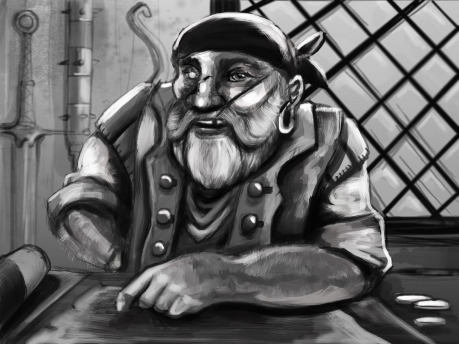
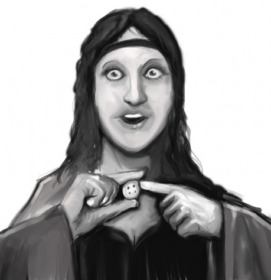

Pokud chcete obchodníka, který se ve vaší hře objeví, losovat náhodně, hoďte nejdříve k6 pro určení sudá–lichá a pak ještě jednou pro určení čísla 1 až 6. Můžete házet najednou dvojicí různě barevných kostek, kde jedna barva určuje paritu čísla (sudá–lichá) a druhá číslo v tabulce. Položky L1 až L6 jsou muži, S1 až S6 jsou ženy.

__Autoři:__ kolektiv kreativních lidí z RPG fóra

__Ilustrace__ © Jan Krůček,[ krokcz @ DeviantArt](http://krokcz.deviantart.com/)

[www.neviditelnakniha.cz](http://www.neviditelnakniha.cz/)

- L1 Gallen. Člověk, 50 let. Vypadá jako vysloužilý pirát či mořský vlk – šátek přes hlavu, náušnice v uchu, šátek na krku, jizvy na obličeji. Při konverzaci si neustále po něčem stýská: po mládí, po moři, po dobrodružstvích, po předchozím správci tržiště, po svém věrném mastifovi apod. Na moře se vrátit nemůže, protože po vyloupení jednoho chrámu zasvěcenému Hodaiovi na něj přešla kletba, kvůli které se mu dělá extrémně zle z houpání na vlnách. Nyní se snaží vydělat peníze, aby ho mocný mág nebo klerik kletby zbavil a on se mohl plavit jako zamlada.
- L2 Shirley. Elf, 25 let. Shirley je lidské dívčí jméno, ale tento elf je k nerozeznání od velmi pohledné ženy a také tak vystupuje. Využívá rovenských líčidel a rád se obléká do hedvábí. Vždy krásně upravený s vyzývavým chováním a charakteristickou sladkou vůní parfému. Stačí mu zalichotit a získáte slevu. Společná noc však odemkne odvážnému dveře do světa tajemství mocných a bohatých, kteří chtějí zažít něco netradičního. Shirley zná mnoho tajemství, protože je ve skutečnosti tajný agent z Dakie.
- L3 Mozren. Půlelf, 14 let. Hubený, se zkaženými zuby. Je nepříjemně vlezlý, nerespektuje osobní prostor, umí být i agresivní, když se debata nevyvíjí podle jeho představ. Velkou část svého výdělku mu seberou místní gangsteři za „ochranu“, zbytek utopí v lehkých drogách. Trpí bolestivou nakažlivou nemocí.
- L4 Koskel. Člověk, 40 let. Ramenatý, vousatý, na krku amulet ve tvaru stromu, stánek má ozdobený dalšími amulety se symboly duchů přírody. Nesnáší uctívače Nebeského ducha a neopomene zájemcům o nákup sdělit, že nebešťákům nic neprodá. Taky si stěžuje na svou ráznou ženu a občas nervózně koukne přes rameno, jestli ho nepřišla zkontrolovat, zda prodává každému a ne jen tomu, kdo je mu sympatický.
- L5 Tabor Ugu. Člověk. Asi kolem třiceti, sám neví kolik mu je, jeho kmen nezná koncept let. Snědý domorodec z Agol Zaru se snaží živit tím, čím se živil doma a byl v tom dost dobrý. Obchodem. Problém je, že naráží nejen na to, že je jiný než lidé kolem něj, ale i na to, že neumí dobře místní jazyk, a tak se snaží smlouvat rukama a nohama.
- L6 Lukaz. Člověk, 13 let. Mladý blonďatý kluk se zelenýma očima, učeň a tovaryš úspěšného obchodníka, který ale velmi vážně onemocněl a nemůže se starat o svůj obchod. Proto za něj Lukaz zaskakuje, aby mu vydělal na drahou léčbu. Jenže není připravený, koktá, plete si ceny a když na něj někdo zatlačí tak se zlomí a ze smlouvání ustoupí. Proto je velmi jednoduché od něj nakoupit věci pod cenou. Dovolí vám to ale svědomí?
- L6 Artur a Rankor. Opálený trpaslík vonící po medu, 45 let, a mohutný tmavě zelený ork, 25 let. Artur byl poměrně úspěšný trpasličí obchodník a Rankor je, vlastně spíš byl, Arturův osobní strážce. Ale Artur se pokusil Rankora podvést, nezaplatit mu a utéct od něj. Proto mu Rankor zlomil obě nohy a nyní ho stále „hlídá“ a bere si od něj všechny vydělané peníze, dokud mu vše nesplatí a pak od něj plánuje v klidu odejít. Zboží si sám nevzal, protože by pak mohl být obviněn z krádeže, a hlavně kdo by si tohle zboží kupoval od špinavého orka, který ani neumí pořádně číst?

- S1 Murana. Člověk, 40 let. Unavená ženská s kruhy pod očima, při bližším pohledu jí jsou na těle vidět modřiny. Chová se rezignovaně, obchoduje naprosto rutinně. Mohla by pookřát, pokud by se někdo začal zajímat o její osobu a její osud a dal jí najevo, že by mohla pro někoho být podstatná. Žije s násilnickým manželem a stará se o šest dětí, z toho čtyři po své zemřelé sestře, a téměř rezignovala na to, že ještě někdy bude šťastná.
- S2 Thea. Člověk, 20 let. Menší dívka s rozcuchanými vlasy a v ušpiněných hadrech, která neustále těká očima po okolí. Má na dívku netradiční chraplavý hlas a často si odkašlává. Když se pustí do povídání, stěžuje si na šlechtu a bohaté. Je členkou Očistného plamene a obchoduje s tím, co zůstane po jejich žhářských a loupeživých akcích. Ve skutečnosti by stačilo najít ji nový domov a dát ji trochu lásky, protože v nesmysly kultu nevěří.
- S3 Bena. Ork, 30 let. Nepřehlédnutelná a nepřeslechnutelná vysoká orkyně s výrazně růžovou barvou kůže. Své zboží až teatrálně vychvaluje a povídá o něm kolemjdoucím fantaskní historky. Pochází ze zlodějské komunity, ale vzhledem k barvě kůže na ni zbyla role odpoutávače pozornosti. Kolem se potuluje její drobná a nenápadná kamarádka Mata, která okrádá lidi.
- S4 Drytira. Trpaslice, 17 let. Neposlušné krátké zrzavé vlasy držené křiklavě barevnou pletenou čelenkou, k oku připevněné velké čtecí sklo. Zahlcuje zákazníky spoustou technických informací o svém zboží, místo toho, aby vychvalovala, proč by si ho měli koupit. Je to studentka, která na tržišti výjimečně zaskakuje za bratra. Bohužel dost špatně vidí, takže je jednoduché ji okrást. Možná budete zrovna svědkem takového pokusu od někoho, kdo se ochomýtá kolem. Co uděláte?
- S5 Ulandra. Půlelfka, 35 let. Vlasy dlouhé až do pasu, spletené do dvou copů. Ulandru posedl démon obchodu a tak se do toho pustila s pořádnou vervou a dovedností. Prakticky nespí a je ochotná obchodovat kdykoliv a kdekoliv. Jednu věc ale při svých obchodech odmítá, protože jí nepovažuje za zajímavou výzvu, a to jsou peníze. Peníze jsou nudné. A tak všechen obchod u ní probíhá pouze výměnou za jiné zboží, přičemž se snaží dostat za to, co nabízí, co možná nejzajímavější věc, která má třeba i menší hodnotu, ale o které tuší, že by jí jinde mohla výhodně směnit. Znáte tu pohádku o tom, jak obchodník šel vyměnit jehlu za krávu? Toho se snaží dosáhnout Ulandra. Začala s knoflíkem a doufá, že to dotáhne alespoň na panství.
- S6 Stará Jarma. Člověk, 40–50 let. Postarší a mile působící paní s vytetovaným ornamentem na hřbetu levé ruky, která má jako jediná zde poměrně jinak nedostatkové zboží. To proto že za pomoci levných kriminálních živlů (v Kalusu se pro to nabízejí krysáci) vyhrožuje a ničí konkurenci.
