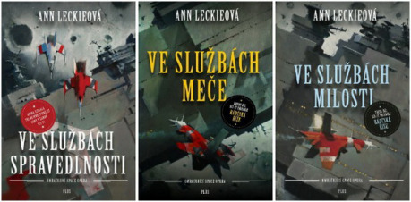
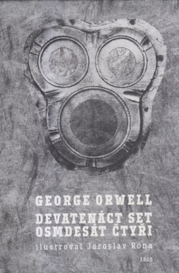
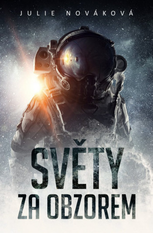

Jazyk nepochybně ovlivňuje to, jak myslíme – ovšem do jaké míry? Ve 30. letech na základě studia indiánských jazyků formuloval lingvista Benjamin Lee Whorf hypotézu, že jazyk ovládá naše myšlení – zjednodušeně řečeno, když například nebudeme mít koncept času, nebudeme vnímat jeho plynutí, bude pro nás představovat cosi jako moře spíše než řeku plynoucí určitým směrem. Už tehdy byla tato představa značně kontroverzní a pozdější výzkumy ji dosti spolehlivě vyvrátily.

I když ale nemůžeme tvrdit, že by jazyk zcela kontroloval naše myšlení a třeba Češi a Britové by tak žili v docela odlišných světech, rozhodně má na myšlení vliv – diskutuje se jen o jeho míře. Ve sci-fi se často objevuje motiv kontroly obyvatelstva pomocí jazykových prostředků (poměrně realisticky v Orwellově _1984_, méně uvěřitelně a podobněji Whorfovým idejím třeba ve Stephensonově _Sněhu_) nebo jazyka propůjčujícího svým mluvčím zvláštní schopnosti (Chiangův _Příběh tvého života_, z našich končin Seinerův _Hexagramaton_). Zajímavě Whorfův koncept uchopil China Mieville v románu _Ambasadov_.

Jazyky ale nejsou izolované. Můžeme je zařadit do širších skupin, souvisejí a stále se navzájem ovlivňují. Už proto, že jsme schopni je různě propojovat a vytvářet nové koncepty, je Whorfova domněnka o člověku „pevně naprogramovaném“ rodným jazykem až úsměvná. Ovšem jak tu již padlo – do určité míry samozřejmě jazyk smýšlení ovlivňuje a já nevím o lepším příkladu než psaní a překladu.

Podívejme se třeba na rádčskou trilogii od Ann Leckieové. Pokud nevíte, oč jde, v rychlosti přiblížím hlavní jazykový oříšek: Občané mezihvězdného impéria Rádč nemají ve svém jazyce gramatický rod – všichni jsou „ona“, bez ohledu na biologické pohlaví. V angličtině zní celá trilogie zcela hladce a přirozeně. Koneckonců až na to, jestli napíšeme „he“, nebo „she“, zní vždycky zbytek věty stejně. Není tu jiná koncovka slovesa, není tu skloňování nebo přechylování jmen. Překladateli Petru Kotrlemu vskutku nezávidím překlad této série do češtiny – muselo to dát neskutečně zabrat, a ač je Petr vynikající a zkušený překladatel, výsledek zkrátka nikdy nemohl znít tak přirozeně jako originál.

Napsala by Leckieová příběh stejným způsobem, kdyby byla třeba Češka? K tomu mám jiný příklad – svůj vlastní. Povídku _We Shadows_ jsem napsala v angličtině, jak je v posledních letech mým zvykem, a pak jsem si ji pro sbírku _Světy za obzorem_ (vyšla letos v dubnu) potřebovala přeložit do češtiny. Jenže … V tomto případě mi to dalo trochu zabrat. Posuďte sami úvodní odstavec:

> Chief inspector A. J. Gaillard knew to expect trouble when the circus arrived to Oberon. They came on a supply ship from Ganymede and were on their way further out the system – as far as Charon, if claims about their destination were to be trusted.

Na tom nepůsobí nic podivně, ne? Ale podívejte se na jinou ukázku …

> Gaillard sent her their card.
>
> Byrne looked at the screen of her pad immediately. “A. J.,” she read. “What does it stand for?”
>
> “Anton Jasmine.”
>
> “But that’s …” She stopped, then frowned in disbelief. “That means you’re …”
>
> “Yes,” Gaillard said simply.
>
> “How does someone like you end up … here?”
>
> How does someone like you, despite the damage, end up in Hayden’s circus? Gaillard thought.
>
> “We’re needed here at present,” the inspector answered, changing into plural almost without notice, bowed their head slightly and, back in the singular, added: “Now I’d like to talk to the others.”

Už vidíte problém? V angličtině je to snadné a nikterak rušivé, ale jak v češtině referovat o osobě, která má hned dvě paralelně běžící plnohodnotné osobnosti, jednu mužskou a jednu ženskou? A. J. Gaillard. Gaillardová? Gaillardovi? Střídat osoby v jednotném čísle? Ale co když mají v danou chvíli stejnou roli oba? Střídat ještě jednotné a množné číslo? To už by bylo opravdu absurdní. Inspektor, inspektorka, inspektoři? Jak je/ho/ji vůbec oslovovat? Střední rod nechme být, nejsme u _neut_ Iana McDonalda. Snad oprášit duál? Převést příběh do první osoby – a v ní střídat či nestřídat čísla a rody? Nebo by snad pomohlo změnit minulý čas na přítomný?

Nebudu vás déle napínat – jako nejlepší řešení mi nakonec přišel prachobyčejný plurál. Čtenáři [Světů za obzorem](https://www.kosmas.cz/knihy/242826/svety-za-obzorem/), kteří ovládají angličtinu, si při čtení mohou zkusit představit originál, pakliže je to nebude rušit (a mohou si tak například uvědomit, že v první scéně – dokonce v první _větě_ – český čtenář zjistí, že něco je jinak, zatímco pro anglického čtenáře ještě dlouho zůstává „chief inspector A. J. Gaillard“ zcela obvyklou postavou).

Benjamina Lee Whorfa tedy necháme hezky u ledu, kam patří, ale různé jazyky nám do jisté míry přece jen umožňují o věcech přemýšlet jinak a odlišně – snáz či obtížněji, stručněji či rozmáchleji – se vyjadřovat o světě. Jsem ráda, že plynně hovořím alespoň dvěma jazyky, a doufám, že časem se mi podaří to číslo rozšířit, protože každý jazyk současně trochu rozšiřuje mé autorské (popřípadě překladatelské možnosti). Mimochodem, zmíněný _Hexagramaton_ od Hanuše Seinera (ač tam jde spíše o kryptografii než lingvistiku jako takovou) jsem [přeložila do angličtiny](https://www.tor.com/2017/05/10/hexagrammaton/) a dočkal se poměrně vřelého přijetí.

Lingvistická sci-fi zkrátka táhne! A tak na to nezapomeňte, až budete vymýšlet třeba nový herní svět, a pohrajte si s tím, jaké úžasné obzory před námi mohou otevírat různé jazyky.
