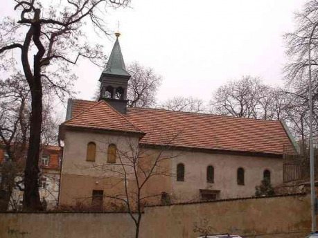
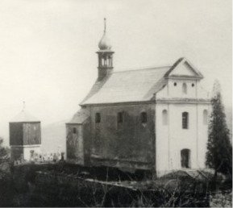
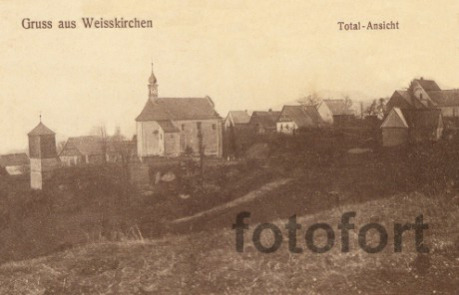
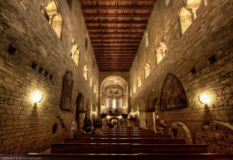
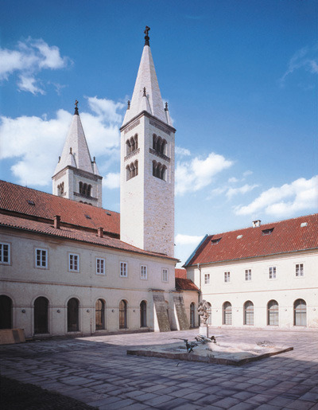

> Kolosální rozsah tématu mne vždycky děsil. Až nedávno jsem našel zajímavý klíč – budu se zabývat pouze chrámy, které Argonantus navštívil během svých dobrodružství. Všechny reálně stojí a stály již ve 12. století. Většinou u nás, ale občas i jinde. A zaměřím se hlavně na ty, které si v případě pochybností můžete prohlédnout i dnes.
>
> Článek by měl být zároveň i slovníkem obvyklé architektonické terminologie. Ta slova jste možná zapomněli, nebo je možná marně hledáte.
>
> A téma bude zřejmě ještě pokračovat, chci postupně dojít až ke katedrále.

## I. Svatý Kliment na Letné v Praze

Začneme doslova pár kroků od Argonantova domu. Svatý Kliment je první kostel, o kterém kdy byla v souvislosti s Argonantem řeč; protože jsou v něm ty prvotní _Zavřené dveře_.

Pro nás bude ukázkou toho, jak může být středověk nenápadný a zároveň všudypřítomný. Argonantův svět začíná pár kroků od toho vašeho; jdete pár kroků od Strossmayerova náměstí k Vltavě, zahnete za roh, a tam je najednou schovaný kostel. Architektura je to děsivě prostá; obdélný prostor se čtyřmi stěnami a rovným stropem. Taková chalupa, tvarem i velikostí. Všechny další přístavky okolo kostela doplnily až pozdější věky, takže si jich nemusíme všímat. Lze předpokládat, že ve 12. století mohl být ten obdélník ještě o něco kratší. Jednodušší ovšem už být nemohl, protože to vlastně nejde.

Všimněme si oken. To je vlastně jediná specifická architektura, kterou na tom najdeme a která dává stavbě nějakou výjimečnost. Z kvádrů vyzděný vysoký tvar s půlkruhovou klenbou nahoře je základní příznak románského slohu. Nese jméno po Římanech, protože celá technika je převzata z antiky, počínaje tímto tvarem okna. Zrovna svatý Kliment na Letné nás ale poučí, jak je to někdy s těmi slohy zrádné. Většina jeho oken je totiž nejspíš přezděna v pozdějších dobách; možná jsou barokní a možná dokonce klasicistní. Jsou na pravá románská okna podezřele veliká, i když mají ten správný tvar.

Románská okna byla hodně malá proto, že ještě nebylo obvyklé je zakrývat sklem; tento vynález byl ještě drahý a ne příliš rozšířený. Takže v létě byla okna volně otevřená, přístupná větru a dešti, a v zimě je zakrývali tím, co se právě nabízelo; třeba kusy prken nebo senem. Prý se používaly natažené rybí měchýře, spíše průsvitné než průhledné, a jejich trvanlivost nebo odolnost proti zimě také za moc nestála.

Strop kostela byl nejspíš rovný, trámový a nezaklenutý. Jak ještě uvidíme, rovné stropy měly chrámy i daleko větší a významnější, než tento.

Zkusme si také na tomto úplně nejjednodušším možném příkladu uvědomit, k čemu ta stavba sloužila. Kdysi dávno mne překvapil jeden křesťan tím, že v Bibli se o kostelech vůbec nic nepíše. Neexistuje žádná Bohem uložená povinnost stavět kostely, a tím méně nějaké závazné pravidlo, jak mají kostely přesně vypadat. Modlitba, přijímání Božího těla nebo kázání Božího slova – což jsou asi nejběžnější rituální úkony křesťanů – mohou klidně probíhat mimo kostel, a také tomu tak odedávna bylo, jak se dočteme třeba v Matoušovi, _Kázání na hoře_.

Ten známý pravil lakonicky, že kostely jsou k tomu, aby na věřící nepršelo. Pokud má zkoumaný kostel plochu běžné chaty, padesát metrů čtverečních, pak je zřejmé, že úplně nesplňoval ani tento požadavek. Středověké zalidnění bude jen zlomek toho dnešního, přesto bezpečně přesahovalo těch asi dvě stě lidí, které by sem šlo teoreticky nacpat. V raných dobách musela proto stát část lidí venku a uvnitř byli jen ti, na kterých opravdu záleželo.

Když se vrátíme k té mši, funkční požadavky na kostel trochu připomínají divadlo a rozdělují ho na dvě základní části. Na jednom konci obdélníka, zvaném kněžiště nebo chór, je kněz, který provádí rituál, a proti němu sedí či stojí v chrámové lodi obecenstvo, čili věřící. Chór je tedy nejdůležitější, tam se děje vše podstatné. Tradičně tam stojí oltář, což nic jiného není, nežli nějaký stůl. Nebo v nejprostší verzi placatý kámen. Oltář při tom křesťanství vlastně také nepotřebuje, neb oběti tomuto novému Bohu se provádějí pouze symbolicky. Křesťané přesto oltář automaticky převzali od chrámů starších, patřících jiným náboženstvím. Pokud tedy tvoříte náboženství zapomenutého starověkého boha, třeba Dagona, pak se můžete vsadit, že chrám bude mít tuto povědomou strukturu. Bude tam oltář, možná s nějakou sochou nebo obrazem, a kněz, provádějící rituál, a věřící, kteří na něho koukají. Jednodušeji to snad už ani nejde.

Oltář kostela je na východě. Tak spolehlivě, že podle kostelů lze odhadovat světové strany. Důvod to z hlediska křesťanství opět žádný nemá, je to zvyk, přejatý z chrámů jiných a starších bohů. Občas se také někdo vzbouří a udělá z jakýchsi důvodů chrám úplně obráceně, jako je to třeba v případě barokní Panny Marie Vítězné na Malé Straně, známé spíše jako Pražské Jezulátko. Ale není to moc časté a v románské době jsem takový případ nikde nezaznamenal. Dovoluje nám to mluvit standardně o východní, západní, severní či jižní části chrámu, s tím, že dopředu tušíme, co tam bude.

Skutečnost, že svatý Kliment na Letné nemá nijak oddělený chór a nemá pro Argonantovu dobu typický polokruhový závěr, představuje malou záhadu. Není vyloučeno, že ten závěr kdysi měl, a odstranili ho při zvětšování chrámu. Ale je také možné, že je pravoúhlý od začátku, a tím se ocitá v podezřelé skupině prastarých chrámů, které by mohly mít iroskotský původ a pocházet z 8. či 9. století. Ty totiž přesně takto vypadaly, jak dosvědčuje nepříliš dávno rekonstruovaný chrám v Modré u Uherského hradiště. U Klimenta to moc pravděpodobné není, protože jsou jiné důvody, které nám ho umožňují datovat někam mezi vládu Vratislava II. a Vladislava II.

Chrám je tak jednoduchý, že by ho zvládl postavit i lepší zedník, a to je také důvod, proč ho lze směle připsat Argonantovi jako jeho vlastní dílo, jak se tvrdí v _Sedmi rybách_ i jinde.

## II. Svatý Havel v Bílém Kostelci u Úštěku

Tento kostel patří mezi ty, které jsou tak změněné pozdějšími věky, že nejsou k poznání. Zřejmě vypadal dost podobně, jako předchozí případ; odlišuje se ale typickým románským půlkulatě zaklenutým chórem. To ho prozradí i přes zásadní barokní přestavbu. A také jsou tu písemné prameny, které ho zmiňují dle některých verzí už v zakládací listině Litoměřického biskupství k roku 1057.

Zařazuji ho sem hlavně kvůli místu, kde stojí. Ve _Vězních času_ se praví:

> Pozoruhodná stavba byla přehlídkou moci Litoměřické kapituly, nejvzdálenější výspa jejich hospodářství. Pevný bod, kam kdysi došel nějaký dávný misionář. Kolem byla louka a za ní už jen zelený les, v něm divoká zvířata a možná i draci.

V tomto případě s draky moc nepřeháním. Svatý Havel, kterému byl kostel zasvěcen, v rámci svojí mise někde ve Švýcarsku údajně s draky bojoval svojí holí. Byl to dobrodružný akční hrdina své doby. A pokračoval v tom i jeho žák a nástupce, svatý Magnus. Argonantus získal přesně tuto hůl, jak víme ze _Sedmi ryb_. Zasvěcení čili patrocinium kostela konkrétnímu svatému je tedy často další důležitá informace, kterou se vyplatí znát. Dovoluje nám nahlédnout do mysli zakladatelů kostela a pochopit jejich motivy. V tomto případě jde zjevně o misionářský kostel, hlásající křesťanství v nebezpečných pohanských pustinách. Takto viděno je kostel Chrámem Božím a Pevností na Skále, demonstrací síly a trvanlivosti toho nového Boha, proti kterému jsou ti předchozí pohanští bohové naprostí saláti.

Příchod křesťanů do našich zemí je roven příchodu civilizace; objevilo se písmo, objevily se kostely a čas poprvé začal běžet odněkud někam. Což předtím v době pohanské kupodivu nedělal; točil se v mytologickém kruhu stále dokola. Protože za dědečka to bylo až doposud stejné, jako dnes, a jako to bude za sto let. Na jaře zasejeme a na podzim sklidíme.

Nové pojetí času podle šiřitelů křesťanství tedy přináší drastickou změnu; za dědečka to bylo přece jen trochu jiné, než dnes. Svět se mění. Čas běží stále kupředu, od Stvoření světa k Poslednímu soudu. A bude to trvat celé tisíc let, což se z tehdejší perspektivy jevilo příšerně dlouho.

O tom všem vypovídaly dva úplně nejzásadnější civilizační vynálezy, s křesťanstvím neodvolatelně propojené; knihy a kamenné kostely. Knihy mohl obdivovat a číst málokdo; byly příliš drahé a příliš nedostupné. Ale kostel si mohl prohlížet každý, kdo šel okolo.

Celá technika stavění z kamene pomocí malty, která nám připadá samozřejmá, čili z_diva na římský způsob_, byla také zpočátku něčím výjimečným. Na vlastním území Říma po jeho pádu roku 476, čímž středověk oficiálně začíná, kamenných staveb prudce ubývá, neb je nikdo neudržoval a začaly se rozpadat. Samotný Řím, původně milionové město, se propadl obyvatelstvem někam ke čtyřiceti tisícům; a je jasné, že jeho obyvatelé celá staletí nic nového stavět nepotřebovali. Jiná slavná města na tom nebyla lépe a drtivá většina z nich úplně zanikla.

Mimo římskou říši to pochopitelně s kamennými stavbami nebylo lepší. Slovani, Germáni ani Keltové, jakkoli jsou jejich schopnosti často obdivovány, stavět z kamene původně neuměli. Používali dřevo, a pokud to chtěli udělat pevné a nespalitelné, pak z hlíny a z kamene nasucho. K převzetí složité římské techniky s maltou dlouho neměli důvod.

Křesťanský kostel právě v tomhle představoval dramatickou změnu. Zpočátku stál v krajině úplně osamocený. Ten, o kterém je řeč, je dvacet kilometrů od nejbližšího souseda v Litoměřicích a ovládal celé údolí, až kam bylo vidět. Původně zřejmě zářil na svahu, pro což místo dostalo jméno Bílý Kostelec. Stojí na vyvýšené pískovcové skále, což přináší jednak nabízející se biblický symbol, jednak to, že je opravdu pevně založen a konečně i to, že ho lze výhodně bránit jako pevnost. Možná někoho překvapí, že by se mělo v kostele bojovat, ale protože to byla jediná kamenná – a tudíž nespalitelná – stavba, pak se toto využití nabízí. Důkazem, že to někoho opravdu napadlo, je oddělená pevnostní věž, která o něco později stála na jednom konci skály, už zjevně v gotickém slohu.

Také se tím dostáváme k dalšímu důvodu, proč románská okna v kostele nebývají moc veliká, a často podezřele připomínají střílny. A proč bývají umístěna v horní části lodi, takže jimi není snadné prolézt bez nějakého žebříku. Do středověkého kostela nebo ven z něho není za normálních okolností vidět, i když jsou okna zcela nezakrytá. Což znamená, že nelze nikoho zvenku zákeřně zastřelit. Bezpečnost je jedním z prvních pravidel, na které středověký stavitel myslel.

Nejistotu prvních výbojů křesťanství do přírody tento kostel demonstruje skvěle už tím, že dnes se situace po tisíci letech zase obrátila a příroda si bere chrám zpátky. Je už jen příbytkem draků a sov, jak kdysi vyhrožoval prorok Izajáš.

## III. Svatý Petr v Poříčí nad Sázavou

V příběhu _Boží soud_ vystupuje celá série kostelů ve středním Posázaví, vzdálených od sebe jen nepatrně. Tento je zmíněn jen letmo, ale vybírám ho pro mimořádnou instruktivnost. Je totiž přesně tím, co si máme vybavit při spojení _románský emporový kostel_, a souvisí s Argonantovou dobou vzniku feudalismu víc, než cokoli jiného. Zatím jsme poznali jednoduché typy malých chrámů, porůznu přežívajících z dob daleko starších; vlastně je na nich často těžké vůbec nějakou svébytnou architekturu objevit. V Poříčí je naproti tomu k vidění románský sloh v plné slávě. A navíc se nám dochoval v pozoruhodně nedotčeném stavu dodnes.

Svatý Petr v Poříčí názorně ukazuje, že i ve středověku existoval pokrok, a to docela výrazný. Stačí si tento kostelík porovnat se svatým Klimentem na Letné. A ještě pozoruhodnější změnu zjistíme statisticky. Počet chrámů se v Argonantově době zmnohonásobil. Zatímco 11. století u nás vystačilo s desítkami kostelů, ve 12. století jsou jich najednou stovky. A hlavním jádrem této laviny jsou právě emporové kostely. Je to způsobeno tím, že jde skoro vždy o soukromá založení; chrámy už nezakládá jenom kníže, ale jednotliví feudálové, jako symbol nově nabyté moci nad částí světa.

Chór kostela je podobný tomu, který jsme zkoumali u svatého Havla v Kostelci, ale zde je ve výtečném pořádku a vypadá tak, jako kdyby středověk stále trval. Chór je od lodi oddělený takzvaným vítězným obloukem. Tento prvek se od těchto dob stává skoro povinným a najdeme ho ještě u chrámů daleko modernějších. Nahoře je tento chór zaklenutý typickou klenbou, kterou jsme viděli už v Bílém Kostelci. Jedná se vlastně o polovinu kupole, a technicky pochází tento tvar také od Římanů.

Třetí částí kostela je věž. Z minulých příkladů je jasné, že to není původně samozřejmá ani povinná součást kostela. Ve 12. století se ale u tohoto typu objevuje přímo masově, protože má hned několik dalších funkcí. Mimochodem, pokud Argonantus přirovnává něco svojí výškou a rozměry ke kostelní věži, má obvykle na mysli právě toto. Tedy věž daleko menší, než si představí běžný obyvatel 20. století.

Díky schodišti uvnitř věže je přístupná empora, útvar, po kterém byl tento typ kostela pojmenován. Jakýsi balkon na západní straně zevnitř, kam se v pozdějších dobách dávaly varhany. Za Argonanta měla empora zcela zásadní funkci – stál na ní totiž feudál s rodinou, výrazně oddělený od obyčejných poddaných dole. V chrámu v Poříčí se s nimi při mši vůbec nemusel setkat, protože přišel po dřevěném mostu dnes zazděným vchodem těsně u věže přímo ze svého sídla. Toto sídlo stávalo hned vedle kostela a bylo stále ještě dřevěné. Vidíme tedy, že takový emporový chrám byl obvykle součástí složitějšího sídelního komplexu a zároveň jeho nejdůležitější stavbou, jedinou kamennou, takže ze všeho nejpevnější. Lze si všimnout téhož, co v Bílém Kostelci – tento chrám zjevně sloužil také jako pevnost, protože na věži najdeme kamennou střílnu. Obrana je tedy další a zřejmě rozhodující důvod, proč se věže u emporových kostelů stavěly ve většině případů.

Zajímavá jsou okna na věži. Zatímco jinde v lodi nebo v chóru nacházíme ten nejjednodušší typ s půlkruhovou klenbou nahoře, zde jsou k vidění sdružená okna, s typickým středním sloupkem. Přesně taková, jaká se vyskytují v Argonantově příběhu _Dračí hlava_. V Poříčí jsou dokonce ještě zdvojená a ve dvou řadách nad sebou. Takové bohaté provětrání vršku věží je u emporových kostelů dost časté. Kromě estetické funkce to zjevně sloužilo k lepšímu výhledu z věže do dálky, což zase souvisí s obranou, a také se těmi zvětšenými otvory mohl nést lépe zvuk prvních zvonů, pokud je už nějaký kostel měl. Občas to máme i doloženo, zde ještě nikoli. Jinak co se týče sdružených oken, častá jsou i trojokna se dvěma sloupky, čtyřokna, a rekordní je zřejmě šesterečné okno z [Postoloprt](http://postoloprty.farnost.cz/kostely-a-kaple/kostel-nanebevzeti-panny-marie/).

V Poříčí najdeme také přímo učebnicovou skladbu celého osídlení, kde je na jižním svahu kopce na nejvyšším místě kostel, kolem něho panské sídlo, a pod ním pokračuje směrem dolů po svahu vesnice. Lze předpokládat, že chalupy byly všechny tímto směrem, stavět je na méně příznivém severním svahu nebyl žádný důvod. Kostel byl tedy vidět přímo z vesnice jako hlavní dominanta, a to typicky z jižního boku, jak se tyto kostely dodnes běžně zobrazují. Slavný kostel Josefa Lady v Hrusicích je dost nedaleko a má navlas to samé uspořádání. Pohled zboku je také důvod, proč byl hlavní vchod do emporových kostelů typicky z jihu, nikoli ze západu, jak jsme dnes zvyklí. V tomto exponovaném místě – dnes v Poříčí bohužel druhotně zazděném – býval obvykle tympanon, oddělený půlkruh dveřního výklenku, což je nejčastější místo, kde má smysl hledat nějaké prvotní sochy.

## IV. Svatý Jiří na Pražském hradě

Pokud je řeč o románském slohu, svatý Jiří v Praze je často úplně první chrám, na který si laik vzpomene. Svatý Jiří není novější, než předchozí kostel, patří naopak mezi ty úplně nejstarší bezpečně prokázané, neb ho prý postavil třetí doložený kníže Vratislav, vládnoucí v letech 915–921. Ovšem tehdy byl zřejmě kostel podstatně menší a bez věží.

Potom chrám výrazně změnil funkci, stal se totiž po roce 976 součástí našeho úplně nejstaršího kláštera. V takovém případě si můžeme být rovnou jisti, že je to klášter benediktinský, protože před rokem 1140 žádné jiné u nás nebyly. Ale ať benediktinské, nebo později i jiné, kláštery měly společnou architekturu, jejímž jádrem byl rajský dvůr, otevřená kamenná arkáda, uzavírající čtvercové nádvoří, často s jezírkem nebo studnou. Z tohoto dvora se chodilo do všech místností okolo, při čemž jednu stranu obvykle zabíral chrám. Dvůr byl bohužel v pozdějších dobách dost výrazně přestavěn, a také znepřehledněno tím, že v původním klášteře jsou výstavní prostory Národní galerie a není možné volně procházet z chrámu do kláštera jako dříve. Pokud bychom chtěli zkoumat mnohem lepší rajský dvůr, nabízí se blízký Strahovský klášter, a úplně nejlepší u nás je pak ten vedle katedrály v Olomouci.

Za Argonanta byl celý klášter i s kostelem svatého Jiří přestavěn podruhé, a to právě po roce 1142 v souvislosti s obléháním Pražského hradu, kdy byl vážně poškozen. O čemž se podrobně vypráví v _Sedmi rybách_. Zde, mimochodem, máme opět jasně doloženo, že byl chrám bráněn jako pevnost. Teprve po této významné přestavbě nabyl tvar, který dnes známe a můžeme obdivovat; další věky k tomu připojily už celkem nepodstatné detaily, jako ohavnou barokní západní stěnu a o dost zdařilejší kapli Jana Nepomuckého.

Když vejdeme dovnitř, zjistíme, že to byl kostel trojlodní a daleko větší, než v předchozích případech. Má přes 500 metrů čtverečních. Což dává možnost sem umístit celkem pohodlně přes 1000 lidí, i více. Pokud uvážíme, že na samotném hradě existoval ještě větší kostel svatého Víta, nedaleko pak tři další klášterní chrámy, v dolní Praze pak ještě čtyři farní kostely, pak další baziliky na Poříčí, na Proseku a na Vyšehradě, a k tomu desítky menších kostelů. Tím už je možno tvrdit, že se v dobách 12. století možná vešli dovnitř všichni obyvatelé města včetně cizích křesťanských návštěvníků. Zvyklosti se začaly měnit. A my také od 12. století můžeme z velikosti chrámu usuzovat na význam místa a počet obyvatel.

Co znamená trojlodní bazilika je vysvětleno ve _Vězních času_:

> Takový chrám mohl být jedině trojlodní bazilikou, kde __střední loď__, oddělená řadami __arkád__ a sloupů, výrazně převyšovala obě __lodi postranní__, takže dovnitř mohlo světlo proudit __bazilikálními okny__ šikmo shora. Podobnému světlu byl přikládán nesmírný význam, neboť bylo obrazem samotného Ducha Svatého, který na věřící sestupoval z nebes, aby v nich zažehl oheň.
>
> Argonantus ovšem věděl, že tento tvar stavby vynalezli kdysi dávno Římané k něčemu daleko přízemnějšímu; užívali ho prostě jako kryté tržiště. Byl to důmyslný způsob, jak zajistit světlo uprostřed velikánské prostory, určené pro shromáždění spousty lidí. Pro křesťany se stal tento tvar přímo esencí velikého chrámu; ne každý tušil, že na světě existují i veliké chrámy výrazně odlišných tvarů.

I zde platí, že ani tato bazilikální okna ještě nejsou moc veliká, a že jsou umístěna relativně vysoko. Oslabit stěnu příliš širokými otvory by ohrozilo její stabilitu. Výsledek je, že i románská bazilika je stále poměrně temná. Kdyby byla prosvětlena pouze okny v bočních lodích, byla by tu tma přímo neúnosná. Technickým důvodem tří nestejně vysokých lodí chrámu jsou tedy ta okna a světlo, nikoli opora střední lodi, aby mohla být vyšší, jak se často traduje. Ostatně, u lodí většiny chrámů je strop rovný a trámový, jako ve všech předchozích případech. Výška lodi proto nemá přímý vliv na boční tlaky, které u této konstrukce nejsou velké.

U svatého Jiří snadno najdeme ty samé prvky, jako u svatého Petra v Poříčí. Románská sdružená okna jsou v interiéru hned dvoje ve dvou řadách nad sebou. Nahoře jsou ta bazilikální, která vedou ven a prostor osvětlují. Pod nimi jsou trojitá okna další, která vedou na emporu. Empora tu prodělala zajímavý přesun do boků; jsou tu proto hned dvě, nad oběma postranními loděmi. Do chrámu se tedy v tomto uspořádání vejde ještě daleko víc lidí, než se zdá na první pohled, protože postranní lodě jsou fakticky patrové. V daném případě sloužila empora pro řádové sestry, oddělené od běžného lidu dole v lodi. V obou případech pak byli věřící co nejblíže ke knězi a slyšeli ho, případně na něho dokonce viděli.

V chrámu je opět výrazně oddělený chór. Je rovnou trojitý, protože každá loď končí samostatných chórem. Hlavní vchod byl z jižního boku, právě jako u Poříčí. Tady to už moc velký smysl nemá, spíš je to tradice. A než začnete jásat nad skvělým tympanonem se svatým Jiřím, který je nad tím jižním vchodem, uvědomte si, že je renesanční a se 12. stoletím nemá nic společného.

Věže jsou tentokrát dvě, umístěny jinde, než bylo běžné v pozdějších dobách. Jak ještě uvidíme, u velkých románských chrámů se často vyskytovalo věží podstatně víc, a byly umístěny do nejrůznějších koutů. Najdeme v nich nahoře opět sdružená okna, v tomto případě trojitá, a věže jsou úměrně vyšší, než u venkovského kostelíka.

Nakonec to nejzajímavější – řešení středního chóru. V místě vítězného oblouku, v interiéru velmi výrazného, vedou dvoje schody, jednak o půl patra nahoru a jednak o půl patra dolů. Chóry jsou takto vlastně dva nad sebou, ten „hlavní“ je nahoře, a druhý je v podzemní __kryptě__. Takto zdvojený patrový závěr bývá dost častý u benediktinských klášterních chrámů. Zde se za řešením skrývají zřejmě i technické důvody, které vysvětlí v _Sedmi rybách_ dva stavitelé, přemýšlející nad stavbou právě tohoto kostela:

> „Chrám je nenáležitě malý. Stavba by měla být protažena dál na západ a možná i na východ. Také by bylo možno přidat věže. Vůbec by měl být výstavnější; od dob svatého Václava se na něm vlastně mnoho nezměnilo.“
>
> „Na východ se země svažuje; to by se chór ocitl ve vzduchu.“
>
> „Bylo by to dobrý důvod ke stavbě krypty a dvou poschodí.“

A přesně tak to bylo provedeno. Při pohledu z Jiřské ulice je to úplně jasné.

## V. Panna Maria v Doksanech

U krypty se ještě chvíli zastavíme. V gotických románech nebo v RPG hrách je to velmi oblíbený prvek, protože to je vlastně pravý a nefalšovaný podzemní dungeon. Velmi často se pojí s hroby a kostrami a jinými hororovými rekvizitami, jak nás přesvědčuje HBO seriál _Tales from the Crypt_. Je třeba upozornit, že si lidé často pletou kryptu a katakomby. Katakomby jsou podzemní chodby, sloužící opravdu hlavně k pohřbívání do stěn. Mohou být poměrně dlouhé a nepřehledné. V románské střední Evropě si ale na žádný příklad nevzpomínám; nejvíce se asi nabízí po nich pátrat v antickém Římě, nebo naopak v dobách daleko novějších, třeba v baroku.

Krypta je naproti tomu podzemní patro kostela, nic víc a nic méně. Lze tam normálně sloužit mše a provozovat to jako kostel. Žádné mrtvoly by se tam tedy za normálních okolností válet neměly. Pohřbívat tam samozřejmě lze také, a dělalo se to, stejně jako v podlaze normálních kostelů. Obvykle se to vztahovalo na velmi významné osoby, například rodinu zakladatele kostela (u emporového feudálního kostela) nebo významného kněze. Tento případ je i hrobka českých králů ve svatém Vítu z pozdější doby. Nebo již zmíněný svatý Jiří.

Najít pravidlo, podle kterého má některý kostel kryptu a jiný nikoli, je nesnadné. Zdrcující většina z nich nemá nic podobného; tím spíše, pokud je někdo postavil na skále. Lze objevit i hodně významné kostely bez krypty. V Argonantově době třeba Panna Maria na Strahově, nebo Panna Maria před Týnem, nebo svatý Štěpán v Litoměřicích. Všechno jsou to baziliky významem srovnatelné se svatojiřským chrámem.

Naopak najdeme překvapivé případy, kdy má z nějakého důvodu kryptu i kostel někde na venkově. Příkladem je již zmíněné Poříčí nad Sázavou. Kromě svatého Petra tu mají totiž ještě jeden románský kostel svatého Havla, a ten je možná ještě zajímavější, právě díky kryptě. Závěr je proveden velmi podobně, jako u svatého Jiří, a možná má toto řešení stejný důvod – i zde je kostel postaven na svahu a přesahuje rozměry kopečku, na kterém stojí.

U klášterního chrámu Panny Marie v Doksanech je to trochu jinak. Ve _Vězních času_ se k tomu říká:

> Ohromný chrám, rozestavěný po křížové výpravě, ještě překonával ten strahovský tím, že měl navíc podzemní kryptu. Původně ji neplánovali. Jenomže se po vytýčení chrámu a počátku stavby začaly zdi propadat, a ukázalo se, že podloží v jednom místě tvoří říční nános. Bylo nutno písek vykopat, dokud se nedostali na pevnější podklad, a tím vznikla veliká dutina. Nebylo možné ji celou vyplnit kamením, výhodnější bylo postavit podzemní kryptu.

Domnívám se proto, že plno krypt má v jádru nějaký podobný technický důvod. Ale ať jsou důvody jakékoli, bývá to velmi působivý prostor, který nejspíš uvede milovníky dungeonů v nadšení. V případě ohromného chrámu v Doksanech je tato naše asi největší románská krypta vlastně jediné, co bylo z Argonantových věků uchráněno, protože vše nad zemí bylo radikálně přestavěno v baroku.

Ač tu ve skutečnosti nepotkáte hordu kostlivců – ještě se mi to nepodařilo v žádné kryptě – lze si je velmi snadno představit. Pro nějaké bitevní scény je třeba pamatovat, že v kryptě nebývají okna, výjimečně jen hodně malá a nízko pod stropem, jako třeba u toho svatého Havla v Poříčí; a že sloupy nebo pilíře bývají přirozeně ještě mohutnější, než u horní stavby. Takže se za nimi lze různě schovávat. No, a další možností je, že odtud vede podzemní chodba ještě dál, případně šnekové schodiště někam nahoru. Podobné složité struktury u nás nejsou, ale v některých hodně velkých chrámech ve světě ano.

Tam se ale vypravíme až příště.
