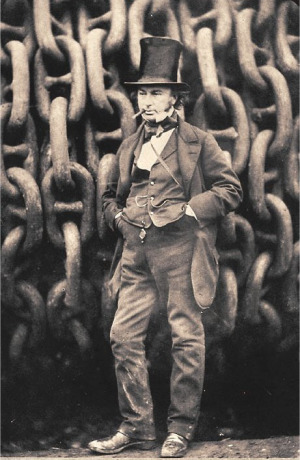
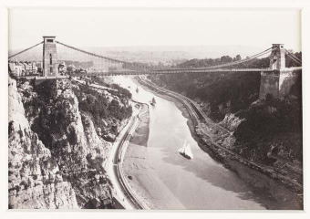
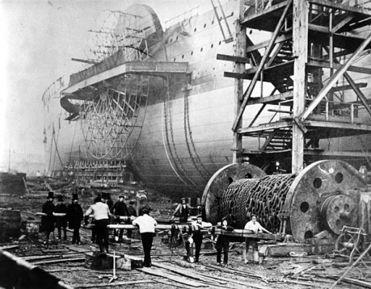
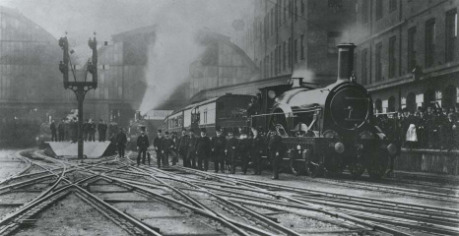

Pán Brunel je encyklopedický príklad, kde kombinácia dobrého pôvodu, ešte lepšieho vzdelania, zlyhaných projektov a úspešných projektov z neho urobili inžiniersku ikonu Imperiálnej Británie, nad ktorou slnko nikdy nezapadlo.

## Projekt 1. Tunel pod Temžou (1822–1828)

Ak máte pri oboch brehoch Temže dva riečne prístavy, ako ich spojíte? Most zavadzia, ale keby ste ho postavili pod vodou, teda spravili si tunel… A presne tento nápad mali aj Londýnčania, akurát, že na realizáciu potrebovali dva márne pokusy, dvadsať rokov, hrdinský _reboot_ v podobe nápadu Marka Isambarda Brunela (pána otca), ešte ďalšich dvadsať rokov, dve katastrofy a 650 tisíc vtedajších libier. „Ôsmy div sveta“ (povedal istý Američan), „trochu sklamanie“ (povedal ten istý Američan, keď ho navštívil), ale jedno je isté – bol to prvý podvodný tunel na svete. A dodnes cezeň jazdí londýnske metro.

A kde bol Isambard? Otec ho zaučil a využil natoľko, že na celý rok dokázal nahradiť jeho hlavného zástupcu. Projekt opustil až vtedy, keď tunel zaplavilo a Isambard prežil len vďaka šťastiu hollywoodskeho hrdinu, keď z posledných síl zabúchal na zavretý núdzový východ, z ktorého ho vytiahli v bezvedomí.

## Projekt 2. Plynový motor (1823–1833)

> Táto vec teda musí zakapať [...] škoda, škoda, ale nedá sa tomu pomôcť.

Po nehode v tuneli si Isambard išiel oddýchnuť. Podľa kusých legiend vraj do Bristolu, kde dostal nápad na projekt č. 3, ale ešte kým sa k nemu dostal, vrátil sa k svojej dlhodobej bokovke. Po prednáškach pána Faradaya o vlastnostiach plynov sa spolu s otcom rozhodol, že si navrhne vlastný motor na uhoľnatý plyn. Keby sme mali skvapalnenú zmes CO, ktorá by sa striedavo splyňovala a skvapalňovala, vyrobil by sa tlak na pohyb piesta a … hýbeme sa! Idea skvelá, ale vtedajšie materiály by nedokázali odolať obrovským tlakom. Po desiatich rokoch striedavých nápadov a zlyhaní si I. K. B. uvedomil, že tadeto cesta nepôjde a projekt opustil.

## Projekt 3. Bristolský reťazový most (1831–1843)

> Moja prvá láska, môj miláčik.

Ešte v roku 1753 venoval bristolský kupec tisíc libier na výstavbu mosta na mieste, ktoré bolo viac romantické než zmysluplné – nad najvyšším miestom utešenej cliftonskej rokliny. O 75 rokov, keď úroky nazbierali dosť peňazí, vyhlásio mesto architektonickú súťaž. I. K. B chcel vyhrať až tak veľmi, že poslal rovno štyri návrhy. Neuspel, ale to ho nezlomilo. Vďaka priaznivej situácii a nenápadnému lobovaniu bola vyhlásená ešte jedna súťaž. Tam prehral opäť, ale po debate s predsedom komisie sa predsa len rozhodlo, že Brunelov prepracovaný návrh je nielen lacnejší, ale pseudoegyptské levy a pyramídy v návrhu jednoducho __musia vyhrať__. V tomto prípade syn dokonca prekonal otca, pretože ani starý pán Marc Isambard neveril, že rýdzo reťazový most - bez akejkoľvek podpory a s dvestometrovým rozpätím - nespadne, a že sa stane vtedajším najdlhším reťazovám mostom na svete.

Napriek počiatočným úspechom sa Brunel dokončenia mosta nedožil. To sa stalo až v roku 1864, päť rokov po jeho smrti, keď návrh prešiel istými zmenami, pompézne sfingy a pyramídy vypadli z rozpočtu, a samotné reťaze sa prevzali z iného rozobratého Brunelovho mosta. Dnes je však cliftonský most legendou: vykonal sa z neho prvý bungee jumping, preletel popod neho Concorde a hoci stále tak trochu vedie odnikiaľ nikam, je z neho inžiniersky zázrak.

## Projekt 4. Veľká západná železnica (od 1833)

> Božia a fantastická dráha.

V roku 1833 – po katastrofe s tunelom a počas ságy s reťazovým mostom – si Brunel vzal do hlavy ďalší nápad. Čo takto __megaanglická integrovaná doprava?__ – Veď cestujúci by si mohol kúpiť lístok z Londýna krížom cez celé Anglicko do Bristolu a ďalej na waleské západné pobrežie, kde by mohol nasadnúť na zaoceánsku loď a vystúpiť až v New Yorku.

O dva roky dvadsaťdeväťročný Brunel začal hrať svoj osobný _Transport Tycoon Deluxe_. Osobne vymeriaval 190 km trať s precíznym profilom bez stúpaní či zákrut a po ceste si nahadzoval traťové rekordy. Maidenheadský most (1839) s rekordne plochými oblúkmi („ten určite spadne“), ktorým vedie aj súčasná trať do Bristolu. Trojkilometrový tunel cez kopec Box („ten sa určite zavalí“), v tom čase najdlhší na svete (1841). Bristolská železničná stanica s najväčšou jednopriestorovou koľajovou halou na svete (1840). A neskôr, ako osobnú čerešničku na torte, si navrhol londýnsku stanicu Paddington.

A ako súčasť svojho pevného presvedčenia začal bojovať v _Bitke o koľajový rozchod_. Predovšetkým si povedal, že sedemstopový široký rozchod je jednak znakom Tradície (prevzatý z banských tratí) a jednak najlepší pre veľké rýchlosti a pohodlie cestujúcich. (Mimochodom, Brunelov rozchod je najširší zo všetkých doposiaľ používaných tratí.) Hoci konkurenčné železnice razili klasický 14355mm rozchod, trvalo vyše 50 rokov, kým poslednú Brunelovu koľajnicu nahradil európsky štandard.

## Projekt 5. Loď Jej Veličenstva Great Western (Veľká Západná) (1836–1838)

Megaanglická doprava nemohla skončiť v Bristole, veď treba plávať až do Ameriky! Brunel s priateľmi a investormi založil _Veľkú západnú parolodnú_, s. r. o., a následne navrhol loď s mimoriadne nekreatívnym názvom __Veľká Západná__ (_Great Western_). Vývojovo išlo o krásny me­dzičlánok. Krásny dvojkolesový drevený parník so železnými výstužami a štyrmi plachtovými stožiarmi, lebo človek nikdy nevie.

Prvá plavba bolo skôr _demo_, pretože loď začala takmer okamžite horieť. Brunel sa opäť prizabil (vraj spadol zo šesťmetrovej výšky) a ostalo mu dôverovať len sedem platiacich cestujúcich boli všetky lístky zrušené. A ako na potvoru vyplávala z Londýna konkurenčná loď _Sirius_, čo vyvolalo _rýchle a zbesilé_ preteky cez Atlantik. _Great Western_ takmer štvordňové meškanie, a keby na _Siriuse_ vo finále nepálili nábytok, stožiare a všetko, čím sa dalo kúriť (pamätáte si scénu z _Cesty okolo sveta za 80 dní_?), vyhral by cenu, ktorá sa neskôr nazvala Modrá stuha. _Great Western_ sa oneskoril len o jeden deň, a to mu ešte ostalo kopec uhlia a rýchlostný rekord 16 km/h. (Cestu zvládol za 16 dní.)

Po štyridsiatich piatich zaoceánskych plavbách a ôsmich rokoch služby bola loď preradená inam, ale to bol len začiatok zaoceánskych plavieb.

## Projekt 6. Loď Jej Veličenstva Veľká Británia / Great Britain (1839–1845)

Keďže _Veľká Západná_ lopatkovala ostošesť, bol čas na verziu 2.0. _Veľká Británia_ bola desať rokov najdlhšou osobnou loďou, a navyše prvým oceľovým parníkom s lodnou skrutkou. Na slávnostné vyplávanie docestovall sám princ Albert (Viktóriin manžel) a to ako inak – po Brunelovej železnici priamo z Londýna. Hoci rýchlosť lode bola zhruba 20 km/h, jej kariéra nebola závratná. Sotva po troch rokoch stroskotala a bolo po paráde a po peniazoch investorov. Neskôr si ešte užila druhý dych kariéry ako legendárna loď na prepravu emigrantov do Austrálie až kým ju vetry neodviali na Falklandy, kde štyridsať rokov hrdzavela, až kým sa nepotopila. Tretia fáza kariéry trvá až dodnes. Sir Hayward dostal v roku 1970 extravagantný nápad, zasponzoroval jej vytiahnutie, dovlečenie do rodného Bristolu. Teraz slúži ako múzeum a pamätník Brunelovho umu.

Brunel sa však ani tu nezastavil. _Väčšie, rýchlejšie, atakďalej!_ Na to si však ešte musel dať istý návrat na zem.

## Projekt 6. Fantazmagorická atmosférická železnica (1844–1847)

Veľká božia trať sa postupne plazila cez Bristol na juh až do Exeteru a bolo len logické pokračovať ďalej do prímorského Plymouthu. Mimoriadne kopcovitý terén však bol nad sily vtedajších lokomotív a vymerať trať bolo takmer nemožné. _Podržte mi sherry!_ povedal Brunel. Ak to nezvládne parný stroj, budeme mať lokomotívy bez nich!

Lokomotíva bez motora síce nevyzerá ako najlepší nápad ľudstva, ale v skutočnosti už predtým bol v prevádzke princíp atmosferickej železnice, a to na viacerých miestach Británie. Brunel si odbehol do Írska, poobdivoval tamojšiu trať v Dalkey a jednoducho ju vylepšil a po­užil pri vymeriavaní trate.

V atmosferickej železnicii sa medzi koľajnicami nachádza rúra, do ktorej jednotlivé stanice pumpujú vzduch. Ak na koľajnice postavíme vagón, na jeho podvozok pripevníme piest, ten vložíme do rúry a to všetko vzduchotesne uzavrieme, pumpovaný vzduch nám bude poháňať celý vlak! Tento nápad ako z najvelejemnejšej Verneovky fungoval – najprv ako skvelé píár (ak náhodou systém nefungoval, stále sa dal zapriahnuť klasický parný rušeň) – potom ako samostatný nápad. Žiaľ, nápad žiť zo vzduchu zlyhal na zlých prepočtoch. Ukázalo sa, že pumpovanie vzduchu zožerie viac uhlia ako rušne, signalizácia medzi stanicami, ktoré mali spúšťať a zastavovať pumpy bola – slušne povedané – nedokonalá a to nehovorím o vzduchotesnosti celého systému, ktorá stála a padala na kožených klapkách. Skrátka, po jednej zime koža zamrzla, stvrdla, obžrali ju myši a bolo po geniálnej myšlienke a po dobrej nálade akcionárov.

> Náklady na výstavbu významne prekročili naše odhady. Náročnosť udržiavania systému, ktorý je dramaticky odlišný od toho, na čo sú všetci - robotníci i cestujúci – zvyknutí, bola príliš veľká.
>
> (I. K. B. na stretnutí akcionárov, 1847)

## Projekt 7. Most princa Alberta (1848–1853)

Teraz už vieme, že Brunel sa úspechmi nenechával nikdy znechutiť. Veď jeho Trať s veľkým Ť nezaháľala. Na rozdiel od Maidenheadského mosta, ktorý musel byť pričupený k rieke, vznikla opačná situácia. Ako prekročiť tisícstopovú rieku tak, aby pod mostom dokázali plávať obrovské lode? Brunel videl dva mostné návrhy Roberta Stephensona (syna slávneho Stephensona-otca železníc) z kujného železa a rozhodol sa ich prekonať. Dva elipsovité segmenty urobili z tohto mosta ďalšiu architektonickú ikonu, ktorá sa využíva dodnes. Hoci sa Isambard nedožil jeho dokončenia, na slávnostné otvorenie opäť docestoval princ Albert a okrem neho dvadsaťtisíc neplatiacich divákov.

## Projekt 8. Loď Jej Veličenstva Veľká Východná / Great Eastern (1853–1859)

> Moje veľké bejby.

Návrat k lodiam bol ešte väčší ako by sa dalo čakať. Amerika bola dobytá, a ďalej sa dalo ísť už len do rozvíjajúcej sa južnej trestaneckej kolónie - do Austrálie. Brunel si teda navrhol _Veľkú Východnú_ – dvestodesaťmetrového leviathana (čo bolo nakrátko jej názvom) s kapacitou štyritisíc pasažierov alebo desaťtisíc vojakov. Až do začiatku 20. storočia, teda vyše štyridsať rokov, to bolo najväčšie hebedo, ktoré kedy plávalo morom.

To však nebola iracionálna megalománia. Ak chce loď doplávať tak ďaleko, potrebuje fantalión ton uhlia. Samozrejme, cestou by mohla doplniť zásoby, ale to by už nemohla konkurovať rýchlym kliperom. Vznikol takmer scholastický diskusný problém. Aká veľká má byť loď, aby uniesla palivo na svoj vlastný pohon? Brunel sa pridal k investorom, agresívne si vybil právo byť jediným vrchným inžinierom a dizajnérom a začal svoju prácu. Do opachy naplánoval všetky tri pohony - lopatky, lodnú skrutku i šesť stožiarov (dve skrutky boli totiž ešte príliš nespoľahlivé).

Budovanie Leviathana však stretávali mnohoraké problémy. Od potreby vybudovať samostatný dok (do londýnskeho prístavu sa totiž nezmestila), cez politické boje (zadávateľ skrachoval a dlžníci si brúsili zuby), obrovské prekročenie rozpočtu a finančné triky so zakladaním nových spoločností a strategickým presúvaním majektov.

Po vyše piatich rokoch bola loď hotová, ale katastrofy pokračovali. Prvé spustenie na vodu malo byť „na tajňačku“, ale zišli sa pri ňom tritisíc Londýnčanov. Namiesto slávy však len videli márny pokus, pretože stroje na spúšťanie to jednoducho nezvládli. Prvá plavba takisto zažila už obligátny výbuch, pri ktorom urvalo prvý komín a na prvej zaoceánskej plavbe sa zúčastnilo len 35 pasažierov.

Loď vykonala niekoľko úspešných križovaní Atlantiku a na jednom z nich sa dokonca zúčastnil Jules Verne, ktorého to natoľko fascinovalo, že spísal román _Plávajúce mesto_. To však bol len malý úspech oproti smutnému osudu celej lode. Málokde mohla kotviť, pôvodné plány o Austrálii nikdy nenazbierali dostatočný počet platiacich cestujúcich a pre investorov bola zakliata. Nakoniec skončila ako jediná loď na svete, ktorá dokázala prepravovať transatlantický telegrafný kábel. Ani nie po tridsiatich rokoch skončila rozobratá na šrot - ale i to vyžadovalo dva roky a 200 mužov.

Smutného konca sa už Brunel nedožil – zomrel náhle na porážku v roku 1895 – ešte pred prvou plavbou lode, ktorú raz možno z rozmaru či zúfalstva navrhol „nazvať, ako chcete, napr. Malíček“.

## Projekt 9: Londýnska železničná stanica Paddington (1852–1854)

> Vybudujem si stanicu podľa svojho gusta.

Vráťme sa však v čase späť. Je rok 1852, a Brunel je pri plnej sile. Po pätnástich rokoch fungovania Západnej železnice na ňu Brunel nezabudol. Vedel, že aj londýnsky terminus Západnej železnice si zaslúži pompéznu budovu – veď železničné stanice mali byť svetskými chrámami ľudského ducha. Inšpiráciu prebral z londýnskeho Krištáľového paláca, a navrhol obrovskú koľajovú halu, ktorá bola ešte o tretinu väčšia než súčasné pražské _Hlavní nádraží_. Prežila až dodnes, hoci celá stanica prešla mnohými úpravami a rozšíreniami.

## Finále

Hoci Isambard Kingdom Brunel zomrel ako zrelý päťdesiatnik, jeho duch však žil ďalej, pretože rozbehnuté projekty sa neraz ešte len dostavovali. Po jeho smrti vyplával moloch _Great Eastern_, o štyri roky neskôr konečne dostavali bristolský reťazový most.

Mapa Južného Anglicka má mnoho bodov, kde zanechal svoju stopu. Či už súčasný Bristol s mostom, múzeom s loďou _Great Britain_ a staničnou halou čerstvo zrekonštruovanou na centrum inovácií, Londýn paddingtonskou stanicou a železničnými múzeami v Swindone a Didcote.

> Som proti tomu, aby sa vytvárali a spisovali zásady pre konštrukciu mostov. Uzákonené pravidlá minulosti sa totiž môžu ukázať ako omyly alebo predsudky a tým sa len zbytočne zamedzí pokroku.
>
> (I. K. Brunel)
