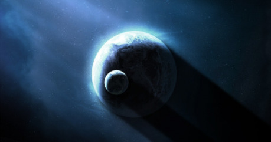

## Mimozemská rasa: Irri-ron (Irrijové)

__Irr__, domovská planeta, ze které Irri-ron pochází, má mírně nižší gravitaci než naše (díky tomu jsou Irrijové zpravidla vyšší a vytáhlejší – v průměru 1,9–2,0 metrů vysocí) a chybí ji měsíc, který by zpomaloval její rotaci (jako pozemský Měsíc). Z toho důvodu má jeden den (jedno otočení planety) okolo osmi hodin a Irrijové jsou přizpůsobeni tomuto cyklu kratších úseků a častějších odpočinků, než lidé. Jejich noci také neosvětloval měsíc, ale noční strana byla osvětlena pouze slabým a vzdáleným svitem hvězd. Z toho důvodu jsou oči Irri-ron přizpůsobeny mnohem větší temnotě a dokážou se orientovat i při velmi slabém osvětlení.

Pro lidi mají Irrijové lehce kočičí podobu, přestože se skutečnými kočkami nejsou nijak příbuzní. Většinou jde spíš o eleganci, se kterou se tito tvorové pohybují. Příslušníci této rasy mají modrou krev - namísto železa (v podobě hemoglobinu), který dává lidské krvi temnorudé zbarvení, mají měď (v podobě hemocyaninu), který dává jejich krvi modrou až tyrkysovou barvu. Stejně tak jsou jejich vnitřnosti (které jsou hustě prokrvené) modře zabarvené. Těla Irrijů mají také schopnost bioluminescence, která jim slouží jako rozšíření komunikace (původně jim sloužily k lákání partnera, vyjádření dominance ve skupině, varování a podobně). Je podvědomá, pokud Irrijové prožívají nějaké silné emoce, pak se rozsvítí světla na jejich trupech a šíjích a doplní tak slova dalším významem, který ostatní Irrijové dokážou číst.

Jejich domovský svět je tvořen celoplanetárním oceánem, kterému chybí větší kontinenty, ale je posetý mnoha ostrovy a ostrůvky pokrytými hustou tropickou džunglí. Díky absenci měsíce nemá jejich svět velké vlny a využití jejich moří tak bylo od podstaty snazší. Jejich státy byly díky roztříštěnosti jejich ostrovů thalassokracie (druh roztroušeného námořního státu, jehož území jsou spojeny navzájem především námořními trasami a jen málokdy pozemními cestami) a jejich kultura je cestovatelská, objevitelská a uvyklá mnoha přístavům mezi kterými je velká vzdálenost. To jim umožnilo snadno se adaptovat na expanzi mezi hvězdami ve chvíli, kdy objevili prostředky, jak překonat vzdálenosti mezi nimi.

Podoba jejich domovského světa (ostrovy porostlé hustou džunglí, oddělené od sebe širým oceánem) je také důvodem toho, že historicky neznali vozidla. Vrcholem jejich vojenské techniky byla kavalerie (která se od podstaty dokáže proplést v džungli a využívat nejisté stezky v husté vegetaci).

## Cestování mezi hvězdami

Svět Irr, ze kterého Irrijové pocházejí, byl jednou ze zastávek podivného tvora, kterému irrijové sami říkají __nétha-rra__. Tento ohromný leviathan, který se vzdáleně podobá pozemské velrybě, ale dorůstá délky několika set metrů až jednoho kilometru, totiž dokáže cestovat ve hvězdném prostoru. Jeho tuhá kůže vydrží chlad mezi hvězdami a dokážou ve vesmírném prostoru vyvinout velké rychlosti, které jim umožňují navštěvovat různé hvězdy. Tito nétha-rra byli nomádi, kteří ve skupinách nebo samostatně cestovali mezi hvězdami Perseova ramene, aby po cestě ve vesmíru sestoupili na planetu, nakrmili se a odpočinuli si. Tito mohutní leviathani jsou všežravci s neskutečným apetitem, kteří dokáží spořádat plankton, ryby a další tvory z širokých oblastí. Jedna skupina těchto tvorů představuje ekologickou katastrofu, která za sebou nechává životuprázdné oblasti moří. Rozmnožují se a žijí na planetách, ale když začnou potraviny docházet, planetu opustí, aby hledali nové „pastviny“ na jiných světech s oceány. Živiny a vzduch potřebné k této cestě si naberou a uloží. Většinu energie pak vynaloží na opuštění gravitace planety, během cest mezi hvězdami hibernují, aby ušetřili energii.

Irrijové kdysi mohutné tvory sestupující z nebes, aby v oceánech planety nabrali síly na další cestu, uctívali a dodnes je chovají v takřka nábožné úctě. V průběhu historie se Irrijům podařilo ochočit si některé z mohutných obrů a díky nim se dostali na další planety a světy. Kdysi Irrijově cestovali v primitivních konstrukcích zavěšených na trupech mohutných obrů, díky pokrokům v bioinženýrství ale postupně vytvořili z nétha-rra mohutné živoucí lodě, s prostory pro posádku jak zvenku, tak zevnitř. Stroje a zvířata jsou propojeny do symbiotického organismu, který dovoluje Irrijům překonávat nekonečné dálky vesmíru. Irrijské kosmodromy jsou skutečné vesmírné přístavy, kde jsou ustájeni ohromní leviathani, kteří se krmí zásobami na dlouho cestu, zatímco jsou plněni nákladem.

Když irrijské živoucí lodě objevily Djagu, domovský svět Dharnaků, bojovní tvorové zaskočili jejich posádky a nétha-rra ukořistili, aby je napříště používali také pro mezihvězdné cesty. Díky nim začali provádět nájezdy na irrijské světy a později pod velením Gwar rozvrátili celou jejich říši. Nétha-rra na rozdíl od lidských mechanických lodí nedokážou překonat Velkou trhlinu mezi oběma galaktickými rameny. Vzdálenost je pro ně příliš velká, nemohou si s sebou nést dost zásob a i navzdory své neuvěřitelně odolné kůži by zmrzli, než by dorazili k oblastem Orionova ramene, které představují světy Terranské unie.

## Historie

Když Irrijové dokázali ochočit nétha-rra a využít je k cestování mezi hvězdami, brzy dokázali objevit a kolonizovat většinu světů, které tito velcí leviathani používali jako své zastávky na poutích vesmírem a které měly velké oceány. Pak navigátoři vedli nétha-rraa k dalším hvězdným systémům. Ne všechny měly podmínky vhodné pro život Irrijů, ale vytvořily základ budoucí říše Irri-Vaë. Dávní irrijští stavitelé vytvořili mohutné stroje, které postupně dokázaly proměnit prostředí planet a „irrifikovat“ je tak, aby jejich podnebí připomínalo Irru. Tyto stroje jsou stále v provozu v hloubi planet a udržují klima planet v rovnováze, dnes ale už nikdo nezná principy jejich fungování a neumí postavit nové. Na osídlených planetách se rozšířila agresivní džungle přivezená z Irry, která vytvořila podobné podmínky k životu, na které byli Irrijové zvyklí.

Irri-Vaë byla vysoce decentralizovaná, neměla absolutního vládce a o většině věcí rozhodovali __vvjarové__, dědiční správcové planet, kolonií a orbitálních stanic, podle složitého tradičního klíče, který jim umožňoval rychle reagovat i přestože celá říše byla rozeseta na mnoha hvězdných systémech. Když byla Irri-Vaë poražena a nahrazena novou dharnackou říší Gwar, většina vvjarů byla nahrazena dharnackými správci, nazývanými __rjali__, kteří se zodpovídají přímo __nawarům__, devíti velitelům barevných armád říše. Na některých okrajových místech jmenovali Dharnakové nové vvjary, kteří by byli loajální říši Gwar, na několika málo zůstaly u moci původní vvjarské dynastie, nyní se zodpovídající nawarům.

## Rozmnožování

Protože jde o mimozemskou rasu, je srovnání obtížné, ale Iriijové mají role rozdělené velice podobně jako savci na Zemi. Rozdělují se na samce a samice, přičemž samice rodí živá mláďata a starají se o ně, zatímco samci vykonávají manuální práce a bojují. Vzájemný styk mezi lidmi a Irriji je možný (laicky řečeno, nástroje vzájemně pasují), ale biologicky nejsou dostatečně podobní, aby mohli vzniknout kříženci.

## Řeč

Irrijský jazyk, který využívají jak Irrijové, tak vládnoucí Dharnakové (kteří ho převzali tak kompletně, že svůj vlastní téměř beze zbytku zapomněli), vykazuje podobné znaky jako polysyntetické jazyky na Zemi (samozřejmě s různými odlišnostmi). Typická jsou dlouhá „slova s významem věty“, využívání spojovníků ke grafickému oddělení morfémů a časté drnčivé zdvojování neznělých hlásek, které dávají irrijštině pro lidi výrazně exotickou podobu.

## Společnost

Irrijové vytvořili vysoce rozvinutou společnost a kulturu, ale během dlouhé a ničivé války s Dharnaky bylo mnoho záznamů zničeno a vynálezů zapomenuto. Jejich rasa se stala podřízenou v novém impériu Gwar a Irrijům je zapovězeno mnoho profesí, především nesmí držet zbraň. I výzkum je tvrdě omezen a pod kontrolou Dharnaků, kteří se obávají, že by jej Irrijové mohli zneužít proti nim. Pouze na dvorech některých nečetných vvjarů se uchoval odlesk původní říše Irri-Vaë, některé dávno ztracené vědomosti a tělesné stráži správců je dovoleno nosit zbraně. Jinak byli v zásadě Irrijové přeřazeni do role nevolníků a otročí jako zemědělci a dělníci, kteří vyrábějí vše potřebné pro dharnacké vládce. Ti žijí jako nová privilegovaná vrstva, která má sama zapovězenou běžnou práci a má se cvičit v boji pro případ války nebo potlačení některého z irrijských povstání, která čas od času propuknou proti dharnackému útlaku.

Jedna další oblast, kde Dharnakové Irrije potřebují a kde jsou pro ně nepostradatelní, je řízení živých lodí nétha-rra. Přestože Dharnakové je dokážou řídit za pomoci počítačů, které se staly součástí symbiotických organismů, je to vysoce nepřesné a ohromní leviathani se takovému způsobu vzpírají, jak mohou. Irrijové už dávno zjistili, že tito tvorové se mezi sebou dorozumívají nějakou podobou mimosmyslového vnímání. Nikdo přesně nedokázal určit jak přesně, ale malý zlomek Irrijů podle všeho dokáže nějakým způsobem „slyšet“ myšlenky nétha-rra a určitým způsobem se s těmito úchvatnými tvory dorozumět. Těm se říká nétha-rra-wra-nnah (navigátoři) a za pomoci podpůrných počítačových systémů dokážou hladce vést živé lodě vesmírem ke svému cíli.

Velkou roli v irrijské kultuře hraje tanec. Irrijové se pohybují s jistou elegancí a pružností a jejich tanec posouvá tyto charakteristiky ještě mnohem dál. Je fascinující sledovat jejich koordinovaný tanec, kdy každý z tanečníků zná svou roli, a proplétají se v na sekundy načasovaných figurách. Irrijové neznají divadlo nebo operu (stejně jako všechny žánry, které jsou statické), historicky médiem pro vyprávění příběhů pro ně byl vždy pohyb a tanec doprovázený hudbou. Lidé nedokážou irrijskou hudbu plně ocenit, protože Irrijové mají širší rozsah sluchu a lidé slyší jen její určitý výsek. I ten je ale podle hodnocení expertů dechberoucí.
