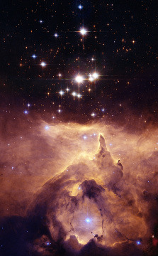
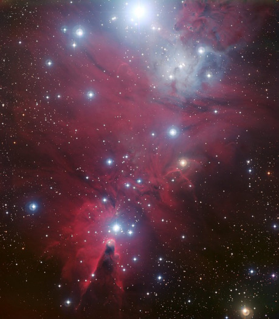
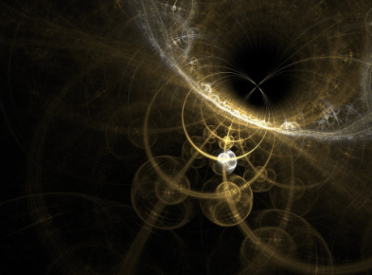

## Telesná stavba

Spoločenstvá Chandra sa v galaxií vyskytujú v niekoľkých druhoch, genetický sú s našimi živočíchmi značne nepodobné ale je možné dostopovať spoločného predka až na úrovní článkonožcov. Toto podporuje teóriu panspermie a teda, že život na zemi pochádza z kozmu. Ich telá sú pokrýté exoskeletom a rozdelené na hlavohruď a brucho. Z hlavohrude im vyrastá päť párov nôh zakončených malými klepetami. U väčšiny druhov sú zadné dva páry používané primárne na pohykb a jeden pár na drobnú motoriku a zakrpatený predný pár plní úlohu mandibul, ktoré pomáhajú spracovať potravu. Ústa teda nemajú žiadne zuby a sú schopné prímať iba predspracovanú potravu v malých sústach alebo tekutiny.

Okrem toho sa na tvári nachádza pár zložených očí, ktoré zabezpečujú vysokú reakčnú rýchlosť a veľké zorné pole avšak nepríliš dobrý zrak. Zvláštnym orgánom sú tykadlá, ktoré hlavný čuchový, hmatový ale aj komunikačný orgán. Uši týchto tvorov sú veľmi primitívne a viac než na zvuk reagujú skôr na hluky a otrasy. Hlavnou funkciou je ale schopnosť orientovať sa v priestore.

Čo sa týka interných orgánov väčšina z nich sa nachádza v hlavohrudi, ich tráviac sústava však miesto čriev putuje do hrude kde sa nachádzajú špeciálne orgány. Prvým z nich je primordiálna žľaza. Tá vylučuje primordiálnu tekutinu, ktorú sú tieto tvory schopné buď vyvrhnúť alebo poslať do syntetizačnej komory. Primordiálna tekutina umožňuje rozpad molekúl alebo pri správnom prostredí ktoré získa v synttizačnej komore dokáže pretvárať atomárne jadrá samotné - kontrolovaným štiepením a studenou fúziou. Tým tvor zárovaň získa aj množstvo energie.

## Kasty

Jednotlivé exempláre spoločenstiev chandra vykazujú značnú mieru polymorfizmu. Spôsob akým sa tvor vyvinie je určený v štádiu larvy rôznymi faktormi - teplotou, vlhkosťou ale najmä jedlom, ktoré larva konzumuje. Larvám je dodávaná zmes výživných látok a hormónov, ktorou ich kŕmia.

Najvyššou kastou je gamergate. Ako sme už povedali každá larva sa rodí rovnaká s rovnakým potenciálom stať sa kráľovnou. Väčšina druhov spoločenstiev chandra však nechce miešanie genómu v rámci jedného palácu a preto gamergate po vyliahnutí každej larve odstránia thoratické gemmae, orgán ktorý smeruje vývoj na kráľovnú. Občas sa však stane, že niektorá larva utečie pozornosti a v paláci sa objavia dve kráľovné. To podľa druhu vyústi do bratovražednej občianskej vojny, ktorá určí nového panovníka, alebo spolu budú bojovať na smrť iba samotné kráľovné, alebo sa spoločnosť rozdelí a časť odíde s jednou z kráľovien založiť nový palác. Najúspešnejšie sú však paláce, kde sa dokáže medzi sebou tolerovať viacero kráľovien a spoločne vytvoria silnú geneticky pestrú spoločnosť.

Niektoré druhy spoločenstiev poznajú kastu trubcov. Jedná sa o larvy, ktoré boli špeciálne vyvíjané mimo ostatných vajec vo vyšších, chladnejších poschodiach. Tieto jedince sa stanú samcami a pária sa s gamergatom. Tým je zabezpečená genetická rozmanitosť a vyššia odolnosť spoločenstva. Iné spoločenstvá samcov neuznávajú a jedince sa rodia z vajec obsahujúcich výlučne genetickú informáciu kráľovnej a teda sú v podstate klonmi toho istého jedinca. Trubci a kráľovné sú úplne závislé od starostlivosti robotníc, okrem prípadného sťahovania paláca nikdy nevychádzajú z trónnej sály a dalo by a povedať, že sú otrokmi v zlatej klietke. Myslenie samotného spoločenstva je decentralizované a rozhodnutia kráľovnej nie sú dôležitejšie ako rozhodnutia iných jedincov. Vo výnimočných situáciách, napríklad keď kráľovná prestane byť schopná predčasne reprodukcie, často zbytok spoločenstva preberie kontrolu a usmrtí ju skôr ako sa vyliahnu posledné larvy aby tak zachránili spoločenstvo.

Druhou dôležitou kastou sú alchymisti. Títo jedinci majú obvykle celý organizmus prispôsobený na syntézu materiálov. Niektorí menej mocní alchymisti vyzerajú ako väčšie drony so zväčšeným bruškom, tí najmocnejší majú prerastené bruško, atrofované končatiny a žijú a pohybujú sa iba pomocou minorov a dronov. Ich obrovské brušká sú schopné zvládať omnoho väčšie teploty a tlak a preto sú schopné syntetizovať väčšie množstvo materiálu a pracovať s komplexnejšími látkami. Tam kde bežná drona dokáže syntetizovať iba kyslík, či uhlík, alchymista dokáže vytvoriť ťažké zlúčeniny ako urán alebo titán. Vďaka tomu dokáže spoločenstvo vybudovať nedobytné paláce a spory schopné medzihviezdnych letov.

Ďalšiu kastu tvoria bojovníci. Bojovníkom sa ponecháva thoratické gemmae aj väčšinu larválneho života aby v nich hormóny podporili rast. V čase mieru sa to robí len veľmi zriedkavo a bojovníci sú obvykle len o trochu väčší ako bežná drona. V čase ohrozenia však v paláci nastane aktívna príprava na boj. Množstvo bojovníkov v paláci stúpne až na jednu desatinu a okrem bežných bojovníkov sa rodia aj bojovníci vo veľkostiach major a supermajor, tzv. Titáni. Bojovníci major sa dorastajú veľkosti okolo piatich metrov a sú perfektne pripravení na boj. Sú schopní syntetizovať veľké množstvá primordiálnej tekutiny, ktorú na rozdiel od alchymystov používajú ako zbraň. Dokážu ňou rozkladať steny i panciere tankov a dokážu ju veľmi presne pľuvať na stredne veľké vzdialenosti. V prípade, že spoločenstvo má čas pripraviť sa na boj, ich exoskelet ako aj končatiny bývajú vylepšené tvrdými látkami, titánom, niekedy aj diamantmi, grafénom, či irídiom. Supermajori, nazývaní aj titánmi sú jedinci vytvorení ako zbraň. Dorastajú sa aj dvadsať metrov, majú hrubé exoskelety a nevídanú silu, často je v boji vidieť, že striekajú na nepriateľov primordiálnu tekutinu alebo, že vydychujú superzápalnú zmes vodíka a kyslíka a zapaľujú nepriateľov. Tieto tvory nedokážu prežiť samotné a ich povrch je pokrytý minormi, ktorí ich čistia, zaceľujú zranenia a kŕmia ich výživným sekrétom. Keď vojnový stav skončí, titáni sú pre spoločenstvo príliš veľkou príťažou a preto sa ich zbaví a ich telá kompletne zrecykluje na potravu a stavebný materiál, rovnako ako zlikvidujú aj všetky pozostatky svojich nepriateľov, preto po nich na mieste ostané iba prach a nie je možné zistiť, s čím sa mohli spoločenstvá stretnúť.

Poslednou najrozšírenejšou kastou sú drony. Tie sa vyskytujú v spoločnosti vo všetkých možných veľkostiach a tvaroch. Najmenšie, minor a superminor dosahujú veľkosť až do desiatich centimetrov, v paláci sú ich obrovské kvantá a starajú sa prevažne o čistotu, značkovanie feromónmi a spracovanie potravy. Bežné drony s nimi v týchto činnostiach úzko spolupracujú a tiež sa venujú stavbe paláca. Špeciálnym druhom sú babice, ktoré sa starajú o larvy od ich vyliahnutia až po zakuklenie. Podávajú im špeciálnu stravu, vďaka ktorej sa z nich stane neskor taký jedinec akého spoločenstvo potrebuje. Tak ako bojovníci aj drony majú formy major a supermajor, tie sú obvykle používané na ťažkú stavebnú prácu a ťažbu. Špeciálnym druhom majorov sú drony ktoré spracúvajú a roznášajú potravu vo svojich útrobách.

Tieto kasty sa podarilo odhaliť Chandrovi po vstupe do paláca jedného zo spoločenstiev, zoznam nemusí byť kompletný, pred svojou smrťou už však žiadne ďalšie reporty neodoslal.

## Jazyky a komunikácia

Napriek tomu, že spoločenstvá chandra nemajú zvukové orgány a ich sluchové orgány sú veľmi vyvinuté, majú veľmi komplexné spôsoby komunikácie. Najvýznamnejšou časťou komunikácie sú feromóny, feromónové značky používajú na značkovanie ciest, či uloženie znalostí, avšak feromóny používajú aj v priamej komunikácií hlavne na vyjadrenie emócií. Aj keď feromóny sú silný nástroj ich rozmanitosť len málo umožňuje vyjadriť komplexné myšlienky a pri dlhšej komunikácií sa feromóny miešajú a význam komuniké sa stráca. Na bežnú komunikáciu používajú farby a zvláštny tanec, ktorý je akousi znakovou rečou. Farby vytvárajú pomocou bioluminiscencie vo svojich bruškách. Tieto tri komunikácie často kombinujú veľmi komplexným spôsobom a pre ľudí je táto komunikácia prakticky nerozlúštiteľná. Preto pri stretoch s inými civilizáciami snahy o komunikáciu obvykle ústia v konflikty, vojny a úplnú genocídu jednej zo zúčastnených strán.

## Kultúra

Spoločenstvá Chandra sú preskúmané najmä vďaka iniciatíve profesora Chandru. Ten počas svojho života objavil množstvo rôznych palácov a preskúmal ich správanie. S použitím syntetických feromónov sa mu podarilo vstúpiť priamo do komnát paláca a stredne dlhú dobu pozorovať tvory ktoré tu žijú. Svoj posledný vstup podnikol do spoločenstva v neskorej fázy vojny. Odvysielal odtiaľ množstvo významných informácií, ktoré dovtedy neboli sledované, s teamom pyrotechnikov úspešne rozložil v paláci vodíkové bomby, avšak boli odhalení a kontakt sa prerušil.

Hoci laik by si mohol myslieť, že v prípade spoločenstiev chandra sa jedná o agresívne kobylky, ktoré putujú vesmirom a požierajú všetko živé i neživé, opak je pravdou. Spoločenstvá sa iba snažia nájsť si miesto pre život a nebyť nikým obmedzované. Život vo vnútri paláca je dokonalou harmóniou. Každý jedinec vie, kde je jeho miesto a aká je jeho úloha, každý jedinec si je rovný a žijú ako jediná bytosť. Možno by sa zdalo, že život týchto tvorov je iba práca avšak je jasné, že sa jedná o inteligentné bytosti, ktoré majú svoj voľný čas a záujmy, niektorí jedinci sa stretávajú v skupinách a je vidno živú komunikáciu, niektorí sa snažia zjednodušiť si život výrobou jednoduchých zariadení, iní sa venujú umeniu. V paláci sú miestnosti kde drony sledujú iné drony akoby boli v divadle, v iných miestnostiach sú zasa psychadelické zariadenia, ktoré drony sledujú a zdá sa že tým odpočívajú. Podarilo sa pozorovať aj dronu, ktorá vytvárala feromónové značky na kameňoch a tieto kamene si potom iné drony medzi sebou vymieňali akoby sa jednalo o poéziu.

Architektúra spoločenstiev chandra je samostatnou kapitolou. Nie je možné slovami popísať krásu a komplexnosť ich palácov, krása a úžitkovosť sa spájajú v jedno v obrovských biomechanických sieťach ako vytrhnutých z diel Gigera. Nachádzame tu komplexné štruktúry a kompozitné materiály spájajúce prvky na mikroskopickej úrovni. Materiálové technológie, ktoré ľudstvo dodnes neovláda. Väčšina palácou zasahuje hlboko do zeme, kde je možné nájsť trónnu sálu, v ktorej je uväznený gamergate, prípadne trubači s ich suitov dron a minorov, ktoré sa o nich starajú. Hneď vedľa sa nachádza liaheň plná vajec, ktoré sú veľké iba asi štyri palce. Liaheň nie je prístupná zo žiadnej inej miestnosti a gamergate má možnosť preskúmať a vyklieśtiť každú narodenú larvu. Niektoré paláce majú však ešte sekundárnu liaheň pre trubcov a bojovníkov vo vyššej, chladnejšej časti paláca.

Hneď vedľa trónnej sály nachádzame jasle. Jedná sa o obrovskú sálu, v ktorej sa stovky špecializovaných dron starajú o larvy. Podľa potrieb spoločenstva vyrábajú špeciálnu stravu, ktorá v larvách iniciuje hormonálne zmeny a rapídny rast. Larvám sa venuje rôzna pozornosť, minori a superminori spolu prvé dni prežijú v jednej veľkej kadi a poter sa už čoskoro zakuklí, alchymistom a titánom je naopak venovaná individuálna pozornosť a v larválnom štádiu žijú oveľa dlhšie. Na konci larválnej fázy larva dostane špeciálnu stravu, ktorá v nej vyvolá zakuklenie. Začne vylučovať špeciálny sekrét, ktorý ju pokryje bielou tvrdou látkou.

Kukly sú vyzbierané dronami a prenesené do sály snov. Opäť sa jedná o jednu z najväčších sál v paláci a sú tu uložené kukly ktoré spia a čakajú na svoj čas. Miestnosť je vysoká skoro ako celý palác a po obvode sa špirálovo zvažuje. Obvykle tu je nečakané ticho aby mali kukly nerušený vývoj. Iba občas drony niektorú prenesú do inej časti. Kukly ktoré sú uložené vyššie dokážu v pohotovosti hybernovať aj celé roky. Čím nižšie je kukla prenesená, tým rýchlejšia je jej premena. Tým je možné presnejšie regulovať zloženie spoločenstva. Niektoré spoločenstvá si takto zvyknú poistiť prežitie a majú vždy zahybernovanú nástupníčku gamergata.

Ďalšie veľké haly sú skladisko, kde spoločenstvo ukladá svoje zásoby, veľká hala, ktorá je hlavnou miestnosťou, z ktorej ústi väčšina chodieb, nekropola, kam spoločenstvo odkladá telá mŕtvych, tie sú tu uchovávané v tichosti a bázni bez narušenia až do príchdu krízy, kedy spoločenstvo musí prežiť hladomor, alebo naopak vyžaduje prísny nárast populácie, napríklad v prípade vojny. Vtedy sú telá z nekropoly spracované na výživnú hmotu, ktorá obsahuje všetky bielkoviny v takej forme ako budú použité v novom tvorovi. V neposlednej rade je tu hala premien. V nej sídli väčšina alchymistov a syntetizuje prvky. Vedľajším produktom je teplo, ktoré zásobuje zbytok paláca.

Okrem toho tu je množstvo malých sekundárnych hál ktorých význam sa mení podľa potreby, zabezpečujú miesto na odpočinok, výrobu, zhromažďovanie a skladovanie.

Samostatnou kapitolou sú spory. Tie sú vlastne únikové moduly paláca. Jedná sa o malé samostatne fungujúce paláce, ktoré dokážu prežiť medzihviezdny let. Sú uložené v dolných častiach mraveniska a vystrelené von dlhým tunelom. Tu získajú únikovú rýchlosť a správny uhol letu. Samotná spóra následne skoriguje smer a od tohoto momentu je sebestačná. V skladisku má veľké množstvo ťažkých kovov, tie sa syntetizujú na prvky potrebné na prežitie spóry, uhlík, kyslík, vodík… vodík a kyslík sa ďalej používajú ako palivo pre spóru. Na palube spory sa vezie gamergate, malé množstvo dron a alchymisti, ktorí zabezpečujú celý jej chod. V nákladových priestoroch je potom množstvo kukiel a materiál na cestu. Keď spora pristane na planéte okamžite začne stavba nového paláca, postaví sa trónna sála, liaheň a sála snov a z kukiel sa vyrojí nová pracovná sila. S ňou sa všetky práce výrazne zrýchlia.

Spoločenstvá Chandra sú divokou kartou a vďaka svojmu rozmnožovaniu sa budú po galaxií stabilne rozširovať. Je iba otázkou prístupu, či sa z nich stane nová hrozba, alebo neočakávaný spojenec.
