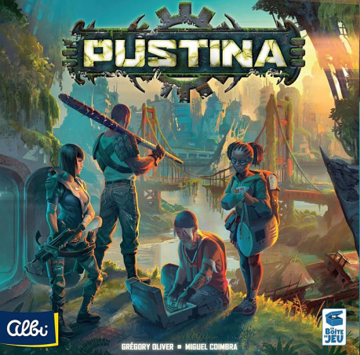
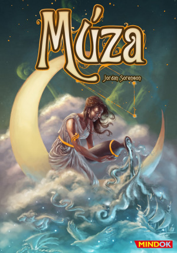
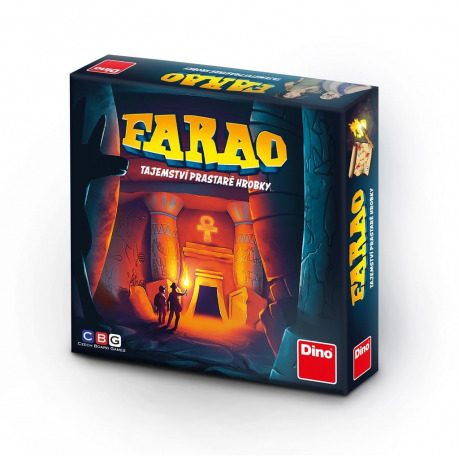

## Pustina

autor: Grégory Oliver

rok vydání: 2016

vydavatel: La Boite de Jeu, Albi

počet hráčů: 2–4

Pustina je kompetitivní postapokalyptická hra klasického střihu. Hráči přes den pátrají po všem, co by se dalo sníst nebo jinak využít, v noci budují podzemní bunkr a odstraňují následky ozáření. Nečekejte však žádný drsný survival. Když se vám nebude dařit, možná vám sem tam umře nějaký člověk (ve hře nazývaný „přeživší“), ale to na vaši akceschopnost nebude mít velký vliv.

Každá fáze (den) hry začíná úsvitem, v němž hráči mají (v pořadí) možnost odvrátit negativní událost. Za úspěšné odvrácení je hráč odměněn poměrně významným ziskem bodů. Pokud událost není odvrácena, postihuje všechny hráče ve všech následujících fázích.

V průběhu 6 fází umísťují hráči své hrdiny na 8 různých lokací, kde je možné sbírat střelivo, suroviny, lovit zvěř na maso, čerpat vodu, rekrutovat přeživší a prohledávat ruiny měst.

Systém sběru surovin je nastaven tak, že nutí hráče využívat ty lokace, které v minulém kole neobsadili. V rámci něho také probíhá jediná přímá interakce mezi hráči, kdy je možné pomocí hrdinů s vyšší silou provádět nátlak na soupeřovy hrdiny, což může vést k uloupení malého množství surovin. Tato interakce je však jen jednou z mnoha taktických možností, nikoli hybnou silou hry.

Po každém sběru následuje noc, kdy hráči mohou vylepšovat své bunkry o místnosti s různými speciálními vlastnostmi a zprovozňovat nalezené nástroje (např. baterka, krumpáč, vystřelovací hák).

Vítěz se na konci určí pomocí komplexního bodového vyhodnocení množství aspektů. Toto vše, spolu se základní mechanikou workerplacement, řadí Pustinu spíše k eurohrám.

Hlavní devizou Pustiny jsou snadná a intuitivní pravidla (relativně k velikosti hry a počtu komponent) a zároveň široké taktické možnosti. Hra uspokojí každého, kdo si užívá mikromanagement zdrojů, budování, a chce si pečlivě plánovat strategii. Grafické zpracování je slušné, nicméně vzhledem k neustále rostoucím nárokům nevyčnívá z průměru. Herní mechaniky jsou dobře provázané s příběhovým prostředím, což se rozhodně nedá říct o většině euroher.

Jako nedostatek lze snad vytknout titěrnost komponentů, která znepříjemňuje jak hru samotnou, tak i její přípravu i úklid. Vhledem k obrovskému množství součástí je však jejich (pod)dimenzování vcelku pochopitelné. Rovněž zpracování místností je až příliš úsporné – místnosti nemají žádná jména, podle kterých by si je hráč zapamatoval, a je těžké se v nich orientovat jen na základě ikonek.

Celkový dojem, který na mě Pustina udělala, byl nakonec slabší hlavě kvůli tomu, že nepřináší nic opravdu zajímavého, čím by chytla za srdce. Nepatří mezi hry, u nichž po ukončení partie mám hned chuť na odvetu, i když přijatelná hrací doba by k tomu vybízela. Skóre: 3/5

## Múza

autor: Jordan Sorenson

rok vydání: 2017

vydavatel: QuickSimpleFunGames, Mindok

počet hráčů: 2+, lépe 4+

Po fenomenálním úspěchu Dixitu je na světě další párty hra, která sází na obrázkové karty bez textu a fantazii hráčů. „Polovina nákladů na design padla jistě na hulení pro ilustrátora.“ Tahle myšlenka vás možná napadne, když rozbalíte Dixit, a platí to i pro Múzu. Obrázky sice mají trochu jiný styl, ale pocity vzbuzují podobné. Jsou surrealistické, znepokojivé, možná až úchylné, a jsou natištěny na kartách úctyhodného formátu.

Ve hře Múza hráči soupeří v týmech. Každý tým v každém kole vybere svého zástupce (Múzu), který na zbytku týmu napovídá na základě karet vybraných soupeřícím týmem. Obdrží vždy jednu obrázkovou kartu a jednu kartičku definující způsob, jak má nápověda probíhat (např. jmenujte film, vydejte zvířecí zvuk, předveďte pohyb celým tělem). Obrázkovou kartu vybírá soupeřící tým ze šesti náhodně vybraných karet tak, aby nápověda byla pro Múzu co nejtěžší. Zbývajících 5 karet uvidí Múza i její spoluhráči až poté, co je nápověda daná. Tým se musí shodnout a určit tu kartu ze šesti nabídnutých, které se nápověda týkala. V případě úspěchu má bod, v případě neúspěchu má bod soupeřící tým. Hraje se do pěti bodů.

Múza je designérský kalkul – zcela očividné spojení dvou veleúspěšných her, Dixitu a Activity. A tak není překvapivé, že funguje velmi dobře, a že zároveň trpí stejným neduhem – omezenou znovuhratelností. Obrázkových karet je něco přes 80, karet s nápovědou 30. To sice dává velký počet kombinací, ale po určitém počtu her se stejnými lidmi zákonitě narazíte na stejná spojení a asociace. Uvidíme, jak to bude s rozšířeními a dalšími verzemi, jež jsou pro tento typ her téměř povinností.

Nebýt zjevného napodobování slavných předchůdců, dostala by Múza maximální hodnocení. Takhle si zaslouží slušných 80 %.

Skóre: 4/5

## Farao: Tajemství prastaré hrobky

autor: Jiří Slavík

rok vydání: 2018

vydavatel: CBG + Dino Toys

Počet hráčů: 2 - 6

Možná si vzpomínáte na hru Labyrinth, která u nás byla k sehnání už koncem osmdesátých let a pod patronací vydavatelství Ravensburger se jí dostalo i několika variant. Nová původně česká hra Farao je svěží variací na toto osvědčené téma.

Ve hře Farao prozkoumáváte bludiště uvnitř egyptské pyramidy, abyste postupně nasbírali potřebný počet svitků a dostali se do hrobky uprostřed plánu. Velikost plánu se modifikuje dle počtu hráčů. K dispozici máte více hrdinů, kteří se sice neliší schopnostmi, ale umožňují taktizovat. Vždy si totiž vybíráte, kterou postavou ve svém tahu pohnete, což má zásadní vliv na úspěch váš i vašich soupeřů. Kromě svitků potřebných pro ukončení hry sbíráte rozličné předměty, z nichž některé vám umožní i znepříjemnit živost soupeři. Nehraje se na vítězné body, ale na klasické „kdo dřív přijde“. Vítězem je hráč, který jako první vstoupí do faraonovy hrobky, k jejímuž otevření je třeba pěti svitků.

Svým zaměřením je Farao rodinnou hrou. Její pravidla jsou snadno srozumitelná i dětem. Popravdě, jsou naprosto intuitivní. Házíte kostkou, postupujete vpřed a otáčíte kartičky, dokud nenarazíte na překážku. Každý předmět smíte vlastnit pouze v jediném exempláři, využití předmětů je naprosto jednoduché – používáte je kdykoli, když to dává smysl, použitím se spotřebují. Příkladem předmětu je pochodeň, která odhalí pole, aniž byste na ně museli vstoupit, nebo lektvar umožňující procházet zdí. Taktické možnosti jsou překvapivě široké a vyvažují tak značný podíl náhody daný principem otáčení kartiček. Hru si užijí i dospělí, i když se nedá srovnat s „vyspělými“ dungeoncrawl hrami jako je například Descent.

Farao je povedená rodinná hra, v rámci žánru si přidejte k hodnocení klidně jeden bod.

Skóre: 4/5
