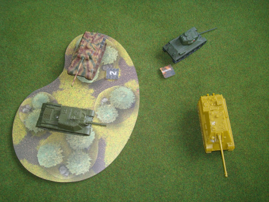
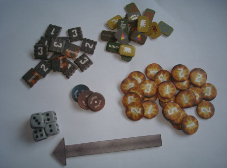
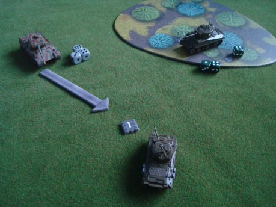
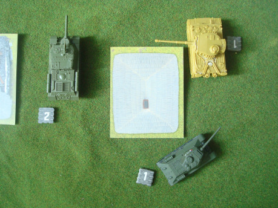
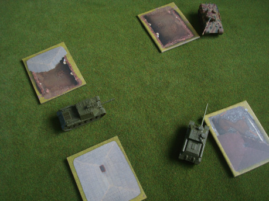

Vzhledem k tomu, že _Tanks_ jsou jakýmsi mostem mezi hrami deskovými a válečnými, popíši nejprve pravidla hry, následně obsah základního balení a systém rozšíření a na úplný konec se zaměřím na to, jak probíhá budování tankové čety.

## Pravidla

Hra se skládá z kol, ve kterých se hráči střídají v aktivaci tanků ve své četě. Kolo se skládá ze tří fází, jsou jimi fáze Pohybu, Střelby a Velení.

### Pohyb

Tanky se pohybují na plánu, sestaveném před hrou hráči, pomocí pohybové šipky. Tato šipka se položí před tank a ten se může posunout až k jejímu konci. Za každé kolo tank může udělat dva takového pohyby, a to i tak, že se v jejich průběhu otočí. Ať tak učiní, nebo ne, za každý vykonaný posun se vedle něj položí žeton pohybu. Ty se použijí ve fázi Střelby vysvětlené níže.

Nutno podotknout, že tanky se pohybují podle hodnot iniciativy na svých kartách seřazených vzestupně. Dále se sluší poznamenat, že na čtvercovém plánu o straně 90 centimetrů (či 3 stop, jak chcete) se tanky s pomocí 15 cm dlouhé šipky pohybují opravdu rychle. Některým hráčům toto připadá nevhodné a hru kazící, já si však myslím, že právě tento faktor do hry přináší mnou tolik oceňovaný prvek akce.

### Střelba

Na rozdíl od fáze Pohybu, začíná střílet tank s nejvyšší hodnotou iniciativy. Kolosy jako těžké sovětské samochodky střílejí jako první s nejmenší prodlevou mezi pohybem a střelbou, zatímco tanky lehké musejí čekat. Když se tank dostane na řadu, může jej jeho hráč aktivovat ke střelbě. Poté zvolí cíl, na který je z jeho tanku „vidět“. Díky plně otočné věži mají tanky zajištěný kruhový obstřel, samohybná děla tímto luxusem nedisponují, a proto se musejí spokojit s nepřáteli, kteří jsou před nimi. Ale ani natočení věže požadovaným směrem nezajistí střele přímé spojení hlaveň-pancíř. Terén zde hraje velkou roli, domy a některé jiné kusy krajiny jsou neprostřelitelné, podobně jako lesy, pokud se za nimi nepřítel skrývá.

Po splnění podmínek střelby popsaných výše se u střílejícího tanku vytvoří kostkový bank, jehož základem je hodnota střelby uvedená na jeho kartě. K těmto kostkám se přidají kostky za případné schopnosti posádky a vylepšení stroje. Zatímco střílející hráč sbírá kostky, hráč tanku prohlášeného za cíl palby si vytvoří obdobnou sbírku, jejímž základem je hodnota obrany a přidává se k němu hodnota žetonů pohybu obou tanků – jak střelce, kterého ruší otřesy a prudké zatáčky, tak cíle, který se svými manévry pokouší střelám uniknout. Vliv má i to, jestli je cíl krytý terénem, vzdálenost mezi obrněnci, nebo střelba na slabší boční nebo zadní pancíř.

Poté, co oba hráči mají v rukách potřebně kostky, jimi hodí. Každá hodnota 4 nebo 5 na kostkách útočníka je jeden zásah, 6 je zásah kritický. Pokud si střílející hráč myslí, že mu kostky nepadly, a mohly by padnout lépe, a tank se nehýbal, může hodit ještě jednou všemi kostkami. Druhý hod pak platí. Po oddělení kostek, které mohou způsobit poškození od těch, na kterých nepadlo dost, následuje vyhodnocení střelby jako celku. Podobně kostky rozdělí i hráč zasaženého stroje - za každou 4 či 5 na kostkách cíle musí jeden ze svých zásahů (i kritických) střílející hráč odebrat. 6 dovoluje zasaženému hráči vyřadit jakýkoli zásah podle své volby.

Zbývající zásahy se sečtou a za každý stroj utrpí jedno poškození. Za každý kritický zásah cíl obdrží kartu kritického poškození, která se ihned vyhodnotí. Tyto karty mají mnohdy dvojí efekt: své poškození a většinou dávají tanku nějakou nevýhodu – může se jednat o poškození prstence věže znemožňující její otáčení, takže tank může střílet jen na cíle před sebou, shozený pás znemožňující pohyb či prostě šťastnou trefu za dva body poškození.

Pokud tank utrpí takové poškození, že jeho výdrž klesne na nulu, na konci kola je odebrán ze hry. Do té doby, pokud má možnost, může ještě naposledy vystřelit.

### Fáze velení

Po střelcích se ke slovu dostávají velitelé tanků; pod jejich vedením se posádky snaží opravit své stroje, nebo jejich hořící vraky opustit. Na začátku fáze se tanky, které jsou poškozené tak, že jim již nezbývá na kartě pro další zásahy místo, označí jako zničené k tomu určeným žetonem. Na plánu však zůstanou jako nový prvek krajiny – ostatní se za nimi mohou krýt před palbou.

Po tomto kroku se zkontroluje, pokud nebyly splněny podmínky ukončení hry, které udává mise. Pokud ne, mohou si dosud nezničené tanky opravit kritická poškození, je-li to možné. Hod 4, 5 nebo 6 na jedné kostce znamená, že se posádce podařilo zbavit s nepříjemného efektu, bod poškození však tanku zůstanou. Nakonec se odeberou všechny žetony rychlosti ležící na herní ploše a Pohybem začíná další kolo.

## Obsah základního setu

Papírová krabice nepříliš valné kvality s obrázkem tanku Panther na přední straně obsahuje vše, co je potřeba pro základní hru. Mezi ně patří tenká pravidla popsaná výše s názornými příklady a povedenými ilustracemi, žetony, karty tanků „první série“, členů posádky a kritického poškození, karty krajiny a na úplný závěr modely strojů, které daly hře název.

Karty tanků slouží jako ukazatel výdrže jednotlivých strojů a jejich parametrů, proto by měl mít každý tank vlastní. Ti, kteří hrají za národ sázející na množství tanků, jako jsou Rusové a nekoupili si tanky v oficiálních rozšířeních, kde k modelům jejich karty přidány, mají smůlu – každý tank má nejvýše dvě kopie pro jeden typ vozidla. Na jejich obhajobu mohu ale s čistým svědomím napsat, že jsou velké tak akorát, přehledné a pěkné na pohled.

Další nevýhodou, tentokrát u karet vylepšení tanků a členů posádky je, že základní set se zaměřuje na tankisty Spojených států a Německa, ostatní národy se musejí obejít jen s malým množstvím karet svých barev. Nehledě na jejich počet jsou i tyto pěkně udělané a text je na nich dobře čitelný, navzdory menším rozměrům.

Nezbytným herním komponentem mnoha her jsou žetony, a ani tady tomu není jinak. Pro hru jsou potřeba hlavně ty indikující poškození a počet pohybů za kolo. Žetony poškození jsou oboustranně potištěné a kulaté, na sobě mají vzor plamenů, ne nepodobné těm, které jsou v samotném logu hry. Podle mě by se daly udělat i lépe, takže mými favority jsou žetony pohybu s potiskem pásu a výrazným číslem. Jsou hranaté a některé z nich mají na své rubové straně bílý nápis „Destoyed“ na pozadí tvořeném plameny. Ty by se opět daly udělat lépe.

Autoři hry mysleli i na situaci, kdy jeden z hráčů bude mít na bojišti více tanků stejného typu, a aby se mu tyto tanky mezi sebou nepletly, přidali do krabice na plát kartonu s krajinou i čtyři páry malých identifikačních žetonů pro každý národ, což jako hráč početných sovětských tankových jednotek oceňuji.

Hra by byla bez terénu poněkud podivná, proto je v krabici trojici kartónových plát s dvojrozměrným terénem. Dvojice lesů a čtyři domky jsou bojištěm pro historický scénář obsažený v pravidlech, stejně jako pro mnohé hry. Další kusy terénu se dají najít na oficiálních stránkách hry, a to i pro obě hlavní evropská válčiště. Terén je ve stejné velikosti, jako další produkty výrobce z řady Battlefield in the box, dají se proto dokoupit sady trojrozměrného terénu, kterými byl ten dvojrozměrný inspirován.

### Tanky

Modely tanků obsahuje set tři. Dva americké M4 a jeden Panther. Modely mají základní barvu podobnou nátěru svých stokrát větších protějšků, ihned po jejich slepení se mohou zapojit do hry. Jejich výhodou je to, že jsou velmi precizně udělané a dobře se lepily, jen kulomety projevily tendenci se lámat.

Mnohem větším mínusem je, že v gf9 se rozhodlo o recyklaci starších setů pro Flames of War. Ačkoli se u amerických tanků M4 jedná o provedení A1 s jednou věží navíc nesoucí 76mm dělo, kit obsahuje mnoho dalších dílů v poměru, který nedává úplně smysl – pro sestavení verze M4A3E8 chybí jen pásy, tři děla navíc velkorážové kulomety jsou na tom podobně, o plátech přídavného pancéřování nemluvě. Společně s jen schematickým návodem je stavění modelů o něco těžší než obvykle. Na stranu druhou jsem se něco naučil o těchto legendárních strojích.

## Tankové čety ve hře

Poslední věcí, které bych se v tomto článku chtěl věnovat, je stavba tankových čet, kterým hráči velí a systém rozšíření. Samotná stavba začíná výběrem národa, kromě archetypální „druhoválečné čtyřky“ tvořené Brity, Američany, Němci a Rusy se před nedávnem do tankové války zapojili i Italové. Každý národ má jinou schopnost, Němci mohou vykonat ve fázi Velení o jeden pohyb navíc, Američané zase odečítají při své střelbě kostky z banku cíle, Rusové zase lépe střílejí, pokud jich je více, Britové si mohou ponechat některé výsledky z prvního hodu, pokud se jejich tanky nehýbaly.

Každý národ má jin tanky, a ačkoli se mohou lišit jen v drobnostech, rozdíl ve schopnosti nebo některé ze statistik je. Dále má i své unikátní členy posádky, jako je třeba seržant Wardaddy, proslulý díky filmu Železná srdce se svou posádkou. Tam, kde se Wargaming děsil uveřejnění tanků s legendárními tankisty, jako bylo německé eso Wittman, tam gf9 sbírá kuráž a do základní krabice dává kartu jiného muže SS, Ernsta Barkmanna, společně se scénářem na zopakování jeho největšího úspěchu z bojů v Normandii. Společně s kartami vybavení členové posádky odlišují národy od sebe.

Každá z karet má svou bodovou hodnotu. Ještě přede hrou se hráči dohodnou, jak velké armády chtějí na stůl z hlediska bodů postavit – na začátek se doporučuje hrát s padesáti body, pozdější hry se dají hrát i na sto a více. Oba hráči jsou tedy limitováni svým národem a body. Prozatím se nijak neomezovalo setkání tanků z různých období války, toto je tedy zcela na úsudku hráčů.

Hrát se dvěma Shermany a jedním Pantherem časem omrzí, proto se vydávají rozšiřující sety. Ty vždy obsahují jeden tank s jeho kartou a několika dalšími kartami vylepšení a posádek (a to jako pro dotyčný národ, tak neutrální). Jejich cena se pohybuje okolo dvou set korun, v přepočtu vychází poměrně příjemně.

Nevýhodou těchto setů je podle mě, že někdy obsahují možnost postavit jeden ze dvou tanků – příkladem může být set Panthera obsahující jak díly pro tento ikonický tank, tak i pro stíhač tanků na jeho podvozku s dělem ráže 88mm. Na internetu jsem narazil na řešení používat při stavbě magnety pro střídání nástaveb. Bohužel se tak stalo příliš pozdě, a tak se mi v šuplíku válí nástavba navíc pro stíhač tanků SU-85 a pár věží Pantherů.

## Závěr

Myslím, že o _Tanks_ nějakou představu tedy již máte. Ti, kteří se trochu vyznají, ji mohli posoudit z hlediska herní teorie a ti, kteří vědí naprosto přesně, co chtějí, ji buď mohli zavrhnout, nebo již objednat. Pro ostatní bych rád napsal nějaké shrnutí.

Takže co to _Tanks_ vlastně jsou? Jsou hrou na posádky tanků za druhé světové války. Ale to vám asi nic neřeklo. Takže trochu obsáhleji: TANKS jsou hlavně dynamickou hrou s jednoduchými pravidly. Tah střídá tah, akce akci, až je za necelou půl hodinu dobojováno. Tvrdí o sobě, že běží na mechanice _„konej, nebo zemři“_, což je naprostá pravda. Dlouhé přemýšlení se nevyplácí, je spousta možností, jak se situace vyvine.

A komu bych to doporučil? Lidem, co chtějí s wargmingem začít. Fandům strojů z pancéřové oceli z doby před sedmdesáti pěti lety. Všem, pro které je X-Wing moc drahý a nevadí jim změna žánru. Těm, kteří moc nemusejí složitá pravidla. Anebo těm, kteří jsou kombinací předchozího. Pro ty všechny TANKS určitě stojí za to. A ti, kteří by se raději proháněli v pozdějších strojích z ocele, mám dobrou zprávu: před nedávnem bylo rozhodnuto a vydání nové linie, a to tanků z 80. let, kdy podle gf9 mohla začít třetí světová válka. Společně s ikonickými „téčky“ čekají i vrtulníky a podpůrná vozidla.
