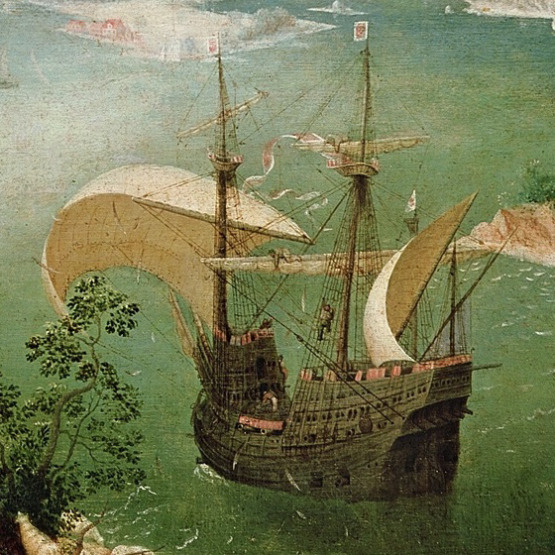

## 1. Černý rytíř

> Sir Altair Marchogion, První rytíř, Princo-vrah

Kapitán, platonicky zamilován do princovy snoubenky, kdysi mladého tyrana zavraždil, aby zabránil znásilnění o svatební noci. Původně čestný rytíř je nyní královskou odměnou odsouzen k životu na moři. Posádka respektuje jeho bojové schopnosti, ale je vidět na první pohled, že nesdílí jeho rytířský kód.

## 2. Královna vlků

> Camilla z Umbraccu, Bledý kanibal

Posádka sestává pouze z žen. Nikdy se nevrací na pevninu. Nikdy nevyhrožují, nikdy nevydírají. Hned taranují, kradou a vězní. Muže zkonzumují, ženy přijmou jako otrokyně, nějnižší v hierarchii jejich posádky. Krvácení způsobené zuby Camilliny prokleté šavle dokáží zastavit jen její sliny.

## 3. Karnival

> Anna Bardem, Šermující poeta

Začínají každý přepad jako přidrzlé pasivně agresivní pozvání na mejdan. Sváží svoji loď s přepadenou a hodují. Vypijí všechno víno, snědí zásoby, něco málo pokradou a agresivně flirtují se vším, co se hýbe. A přestože z jejich návštěvy nikdy hrozba násilí plně nevymizí, na první pohled se opravdu chtějí hlavně bavit.

## 4. Poslední trůn

> Marion Stellgard, první dáma Svobodných ostrovů

Majestátní galéra doprovázená třemi kogami. Státnický postoj, nehybné brokátové šaty a vševidoucí ptačí oči dělají z Lady Marion zneklidňujícího vyjednavače. Námořníci vyděšení setkáním s její flotilou často přistoupí na její nenásilné požadavky. Postupně tak ovlivňuje podobu obchodu ve zdejších mořích ve prospěch svůj a svých ostrovů.

## 5. Centurion

> Lloyd Clayton, profesor automatiky z elbské univerzity

Jakkoli malicherný spor vědec s děkanem má, bylo mu to dost na to, aby vyměnil univerzitní zdroje za vlastní. Centurion je gigantická železná loď vybavená nejrůznějšími vynálezy; lodní harpuny, plamenomety, teleskopické plachtové konstrukce, magnetické šípolapy, raketové akcelerátory apod. Hlavním projektem ovšem stále zůstává automaton; mechanický človek.

## 6. Hrdlořezova pomsta

> Starý Beacher, nejkrutější ze všech pirátů

Legendární loď duchů. Poloprůsvitná, doprovázená mrtvolnou aurou slabosti a úzkosti. Vynoří se z hlubin a prolne přepadenou lodí, včetně posednutí jednotlivých námořníku dávno mrtvými duchy. Oslavují nová těla karnálními požitky; jídlem, pitím, sexem, násilím, a když je to omrzí, zakončí své řádění sebevražedným nájezdem na Zintaru, přístavní město, ze kterého kdysi vypluli.

## 7. Krogalianský kolos

> Ker’saka Rükka, nejrychlejší čepel na jih od Edsbynu

Elegantně tvarovaná, bronzem pobitá karavela, s permanentně skasanými plachtami. Namísto větru či vesel ji pohání krogalianský titán, oceánská bestie připevněná k lodi dvěma předními kotvami. Přestože je většina pirátských přepadů na strachu založená nenásilná transakce, Ker’saka vyžaduje z každé lodě jednu lidskou oběť pro svého titána.

## 8. Světlonoš

> Lord Graham Andarnon, samozvaný paladin

Mladý kapitán je extrémně efektivní námořník a válečník s dokonale alabastrovou pletí a havraními vlasy. Je pevně přesvědčen o božím právu čisté lidské rasy na vlastní kontinent. Neopustí palubu přepadené lodi, dokud nebudou všichni nelidští pasažéři sterilní, a dokud neulehne s nejkrásnější ženou na lodi. Nikdy nelže a neporuší svoje slovo.

## 9. Sultánův věštec

> Kapitán neznámý

Fata morgana legendární pirátské lodi z dalekého jihu. Zjeví se jen na moment. Všichni, kteří na ni pohlédnou, budou následující noc snít o své smrti. Budoucnost je ovšem touto znalostí změněna a je jen na nich, jak s varováním naloží.

## 10. Líheň

> Claata i Sökka, Matrona z Kaatu, sedmý prst krále pod horou

Kly a bodce trčí ze všech stran, zkamenělá kokatrice na přídi, kožené plachty, chaotické bubny a davy pomalovaných skřetů. Vedeni morbidně obézní matronou, goblini napadají lidské lodě rachejtlemi, katapultovanými berserky, horkovzdušnými balony z nafouknutých ryb, nespolehlivou časoprostorovou magií a nezřízeným nadšením pro chaos.

## 11. Diplomatico

> Elric Faelorn, dítě staré krve (tzn. půlelf)

Jejich mohutná karaka garantuje přirozený respekt, a zatímco Elric, telepat, zdržuje nebo odvádí pozornost, jeho bratr Solfir, obdařený schopností teleportace, vykrádá podpalubí. Oba soutěží o přízeň Delyth, půlelfí krásky, telekinetika a prvního důstojníka. Oni jsou zloději s „dobrým“ srdcem, ona je psychopatický hrdlořez.

## 12. Sentinel

> Mortimer Craven, korzár ve službách královny

Bitevní loď dlouho sloužila jen jako lovec pirátů a sabotér valintijsko-iskandarského obchodu, ale v posledních letech si lord Craven dovoluje příliš. Technicky sice nepřepadá, pouze rekvíruje ve jménu královny, ale i tak je postrachem pobřeží. S některými kapitány o jejich náklad hraje šachy nebo pořádá duely tréninkovými zbraněmi.
