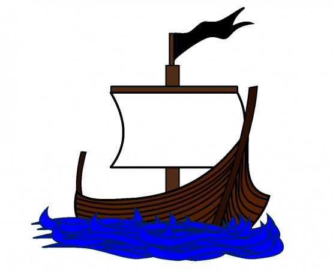
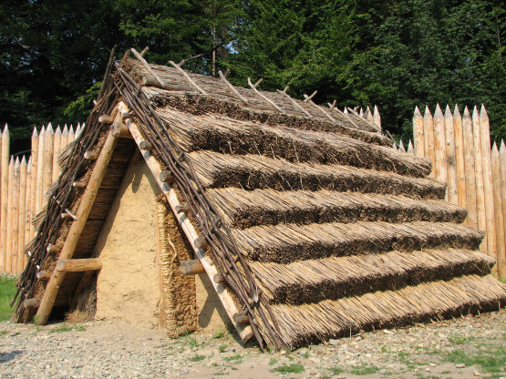
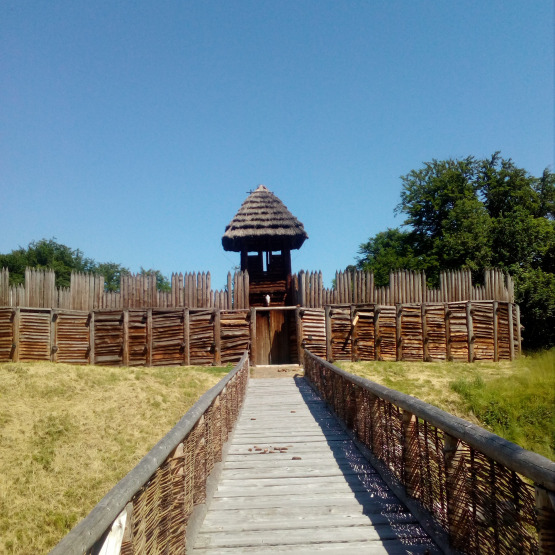
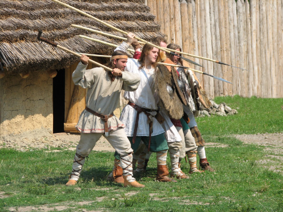
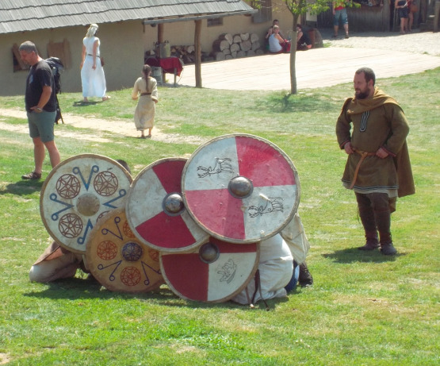
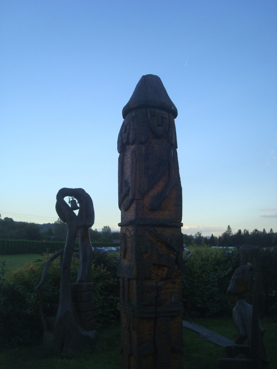

Za poněkud podivným nadpisem se skrývá článek o slovanských pirátech plavících se na chladných vodách Baltu, kteří jsou dnes poněkud přehlíženi a ve známosti ustupují před těmi skandinávskými. Ovšem z historického střetu vítězně vyšli právě Ránové, Pomořané, Obodrité a Lutici, tedy plavci z pobřeží dnešního Polska a Německa. A já vám nyní ukážu, jak k tomu došlo.

Začal bych ale jménem článku, přece jen vám dlužím vysvětlení. Nevybral jsem jej náhodou, vztahuje se k bohovi Ránů Rujevítovi, jehož jméno znamená totéž, co pán Rujány. A právě Ránové se do historie zapsali jako největší ze slovanských nájezdníků.

Nebudu se ale věnovat jen jim – bylo by to nespravedlivé vůči ostatním, kteří opouštěli své domovy a vydávali se na moře, kde se živili ohněm a mečem. Pomořané tak organizovali největší z nájezdů, ze kterého dodnes mrazí, Luticové zase pomohli udržet jednomu normanskému vévodovi korunu Anglosasů a Obodrité s nájezdy začali. Sami sebe nazývali chasnici, mezi Dány pak byli známi jako Vindové nebo prostě vikingové – piráti.

## Lodě pohanů

### Historie plaveb

Slované začali vyrábět lodě hned, když se dostali na mořská pobřeží, ačkoli to byly z počátku jen dlabanice z jednoho kmenu. Později se konstrukce stávala složitější a na moře vypluly první plnohodnotné koráby.

Nejprve sloužily neválečným účelům: vyplouvali na nich rybáři a obchodníci, později se začaly měnit na nástroj války, když na nich muži odplouvali společně s Dány a Nory bojovat na západ do vzdálené Anglie. Poslední období v historii slovanské mořeplavby byly nájezdy na pobřeží Jutského a Skandinávského poloostrova. Tehdy i obávaní Dánové, před nimiž se třásla celá Evropa, poznali na vlastní půdě strach.

### Konstrukce lodí

Slovanské lodě se vzdáleně podobaly lodím Skandinávců, při nájezdu na Konungahelu si je dokonce místní spletli s loděmi vlastních lidí. Mohlo by se tedy zdát, že se jednalo o kopii starší severské konstrukce, jenže zdání klame. Lodě Slovanů byly samostatnou skupinou lodí, seveřany zvanou vindaskip, mající nad svými protějšky ze Skandinávie řadu výhod.

Jedním z mála společných znaků je malý ponor plavidla. Tam, kde byl ponor malý u drakkarů, šli slovanští loďaři ještě dál: ponor dosahoval nejvýše půl metru, lodě tehdy mohly plout i do mělčích vod a jejich plavci si nemuseli dělat hlavu s překážkami na řece nebo mělčinami a kosami zrádného Baltu.

Dalším společným znakem je dřevo, ze kterého se lodě obou národů vyráběly – převážně to byl dub. I zde však podobnost končí: Slované vycpávali mezery mezi prkny mechem a místo želených hřebíků používali dřevěné kolíky o průměru 9–15 mm.

Co se možnosti přepravy týče, uvezly vindaskipy až pět tun nákladu (a stále si zachovávaly ponor okolo 50 cm), nebo okolo 50 válečníků s dvěma koňmi. Podle Snorriho Sturlusona uvezly válečníků 44, což se stalo hlavním faktorem při odhadování síly slovanských nájezdů: počet lodí se vynásobí číslem 44 a před výsledek se přidá slovo maximálně. Nikdo se nestará o to, jestli některé z lodí byly prázdné, protože ta bohatá kořist se prostě neměla kam jinam vlézt, nebo jestli někdo stavěl lodě podle jednotného plánu.

Z experimentů s replikami lodí se dá usuzovat, že za den urazily až 77 mil s použitím plachty a vesel, do významného obchodního centra v Dánsku, Haithabu (také Hedeby, dnes již nestojí, v blízkosti Šlesviku) trvala cesta čtyři dny a do vzdáleného Novgorodu dobří plavci dopluli za týden.

## Námořníci

### Důvody námořních cest

Jak jsem již psal, zprvu se pobaltští Slované vydávali na cestu za obchodem a teprve později za kořistí. Obchod ani v té době ale neustal a Adam Brémský ještě v druhé polovině jedenáctého století píše o Wolinu jako o místu, kde se dá najít vše, co je pokládáno _„za příjemné či vzácné“._

Válka se ale do kronik vryla většími písmeny. Obodritská knížata se vydávala na moře, aby získala peníze na zaplacení daní, vybíraných od nich velmoži z Říše. Biskupu Geroldovi si tak postěžoval obodritský kníže Přibyslav, což zaslechl i mnich Helmold, který celý rozhovor zapsal do své kroniky.

Tady je hlavní rozdíl mezi piráty z řad seveřanů a Slovanů: první jmenovaní se na moře vydávali mimo jiné proto, že jejich země je nebyla schopna uživit všechny. Zakládali tedy kolonie v nových zemích, jako Danelaw ve východní Anglii, nebo severské državy na pobřeží Irska. Kvůli tomu si nemohli dovolit naprosté zničení dané země. Slované novou zemi nepotřebovali. Snad i proto se kronikáři zmiňují o zemích zničených Venedy a po deset let neobývaných. Dnes někteří historici soudí, že v polovině dvanáctého století padla třetina dánské populace pod meči slovanských nájezdníků.

### Sídla pirátů

Pobřeží od polského Kolobřehu po holštýnský Oldenburg muselo být poseto desítkami menších osad, samot o pár zemnicích a větších hradišť, ze kterých vyplouvali Slované na své nájezdy. Já se zde zaměřím jen na dvě nejvýznamnější střediska pirátů.

Rujána ve svém středu ukrývá vesnici Ralswik skrytou za na konci dvojitého zálivu fungující jako dokonalý skrýš. Zde nejspíš kotvila flotila Ránů, která je tak proslavila a právě tady se našly trupy lodí, díky nimž o lodích Slovanů víme praktické věci o jejich konstrukci. O významu Ralswiku svědčí mimo jiné i nalezená pohřební loď skandinávského vikinga a mince z mnoha zemí tehdejšího světa.

Dále na severozápad, na poloostrově Wittov ležela na skalním ostrohu nad mořem slavná Arkona. I dnes budí pozůstatky jejího valu úžas, jen rozloha se zmenšila oproti časům Svantovítových kněží asi na třetinu, když se kus křídového útesu zřítil do Baltského moře. Mys je mnohému našinci známý díky majestátnímu plátnu Alfonse Muchy, které, bohužel nezobrazuje realitu tak, jak by mělo.

Arkona neměla kvůli výšce útesu vlastní přístaviště, zato se v ní však nacházel další symbol dávných Ránů: svatyně čtyřhlavého boha Svantovíta. Ta se do popředí politiky polabských Slovanů dostala po pádu své „sestřenice“, svatyně v Retře a posledních sto let její existence tak do ní proudily dary ze zemí na pobřeží Baltu a třetina veškeré kořisti Ránů připadla jejich čtyřhlavému bohu.

Právě zde byl chován posvátný bílý kůň používaný při věštbách, kdy měl překračovat kopí položená na zemi, když klopýtnul, místní opustili od úmyslu, ať už byl jakýkoli.

Proti samotné Arkoně se snažili zakročit mnozí. Jindřicha Lva však zklamalo počasí a Erik II. nedokázal ztéci její dvacet dva metrů vysoké hradby. Dobýt ji se podařilo až Valdemaru I., dánskému králi, nejspíš v roce 1168. Požár hradeb a následná kapitulace znamenala konec pohanství na Rujáně a přijetí kříže. Dnes je tato událost mnohými vykládána jako konec slovanství, rodné víry, starých bohů a podobných věcí s tím, že z jejích obránců se stávají noví Nibelungové v hořící síni hunského krále.

Dalším velkým sídlem pirátů byl Štětínský záliv. Dříve oblast patřila do kmenového svazu Luticů, později ji dobyli Pomořané. Na pánu však moc nezáleželo, místní po celou dobu vyráželi na širé moře za kořistí. V oblasti byla tři velká sídla: Wolin, Volgast a Štětín.

Ve Štětíně, po kterém je záliv pojmenován, ctili boha Triglava a odehrávaly se zde podobné věštby jako na Arkoně. Jen kůň byl černý a klopýtnutí na jednom z devíti položených kopí znamenalo, že se Štěčané nevydají na nájezd na hřbetech koní, ale buď pěšky, nebo na lodích. O tom rozhodla další věštba.

Ve Wolinu a Volgastu byl ctěn Jarovít. Ve Wolinu měli jeho kopí, ve Volgostu pak jeho štít. Byly to relikvie vytahované jen v čase války a popis štítu nám může přiblížit, jak vypadaly štíty Slovanů. Ale o tom až za chvíli.

### Výzbroj pirátů

Snad nejpočetnější zbraní ve slovanském vojsku byla sekera, jednoduchá na výrobu a efektivní v boji. Dnes se zažil trend, že na rekonstrukcích ustupuje před meči, které jsou hojnější. Tento jev však nezobrazuje historii úplně věrně: meč byl znakem bohatství bojovníka a vládce, proto jej drželi v rukou slovanští bohové, jako byl třeba Rujevít. Kopí byla rovněž hojná.

V druhé ruce měl slovanský pirát většinou štít. Z několika zpráv co máme o tvarech štítů, se dá usuzovat, že měly tzv. jízdní držení, tedy na zední straně byly dva řemeny, kterými se provlékala ruka. Další řemen sloužil k přehození štítu přes rameno.

Prameny se zmiňují o tom, jak Pomořané dokázali udělat ze štítů zeď tak pevnou, že dokázala vydržet i jízdní útok. Existence této formace nám ukazuje vojenský um, disciplínu a organizaci pomořanských vojsk.

Další zbraní, o které se kroniky zmiňují, a kterou dokázali Slované mistrně ovládat, byl luk. Jednalo se o jednoduchý, byť oproti těm saským prodloužený, luk. Polabští Slované nebyli v kontaktu s žádným kočovným etnikem, takže na rozdíl od svých jižních příbuzných nepoužívaly luky reflexní. To ale neznamená, že by byly jejich luky méně nebezpečné. Naopak.

Dánský letopisec Snorri Sturluson se například ve svém letopisu u útoku na Konungahelu zmiňuje o slovanském ostrostřelci krytém skupinou bojovníků se štíty, jehož likvidace si vyžádala spoustu dánských životů.

Většina zbrojí byly ty kroužkové, ovšem rozhodně nebyly výsadou všech. Poskytovaly poměrně dobrou ochranu proti sečným ranám, ale kopí a šípy ze silnějších luků je dokázaly prorazit. Jejich nevýhodou byla jejich konstrukce: při silnějším úderu se síť kroužků rozbila a kroužky se mohly zarývat do těla. Proti tomu se bránilo dalšími vrstvami látky nošenými pod zbrojí.

Obyčejní bojovníci byli odkázáni na kožené pancíře a košile s našitými kusy kůže. Helmy se nosily kuželovitého tvaru, méně majetní bojovníci měli helmy jednoduchého tvaru, zevnitř vystlané slámou, bohatší, jako družiníci knížat, je měli z kvalitnějšího kovu, s nánosníkem a zesílené kříži. Mohli je nakoupit od Skandinávců, nebo je sebrat mrtvým. Podobnou helmu máme i u nás: je jí helma svatého Václava, prokazatelně severského původu.

## Umění mořeplavců

V této části článku se budu věnovat některým pozoruhodným plavbám, velké části české veřejnosti zela neznámým. A dovolím si trochu zpřeházet vžité role v raném středověku.

### Slované na Islandu

Samotný nadpis hovoří za vše, a ač se to zdá skoro nemožné, je zde velká šance, že se tak opravdu stalo a Slovanské lodě přistály u islandských břehů. Má ale pravdu? Posuďte sami.

V islandské Knize osídlení se píše o muži zvaném Natfarri, jehož přezdívka v překladu znamená „Noční chodec“. Ten zakotvil v zátoce pojmenované po něm a založil si tam usedlost. Nějakou dobu v ní žil, jenže si ji nezabral v duchu skandinávského práva a proto o ní přišel. Právě to, že byl v právní oblasti neznalý, a že je v knize uvedena jej jeho přezdívka a nikoli pravé jméno je pro polského profesora Urbańczyka jasným důkazem, že Noční chodec byl Slovan.

Dobře, jednoho bychom měli. Ale máme ještě nějaký další důkaz? Možná. Na Islandu se totiž našly základy budov z vikinského věku. Ovšem ani jeden z nich nevypadá jako základy typických severských budov. Tyto byly zahloubené z části do země a byly velice malé. Nikdo nedokázal spolehlivě vysvětlit, k čemu sloužily, až výše zmiňovaný profesor přišel s tím, že to jsou domy slovanských kolonistů.

### Slované v Anglii

Zanechme tedy spekulací o slovanských výpravách na Island a přejděme k jiným, které máme doložené písemně.

Slavný cestovatel Ibrahím Ibn Jakúb ve svém cestopise píše, že se plavci z pobřeží Baltu vydávají na daleké cesty na sever, kde se občas srážejí s plovoucími horami ledu. Jenže to není jediná zmínka. Helmold například píše, že se obodritský kníže Gotšalk vydal na cestu do Anglie, kde bojoval po boku Dánů. Jistě nejel sám, spíše se svou vlastní družinou.

To je ale cesta malé hrstky, která se ještě navíc vrátila zpět do své země. Ačkoli celá zpráva svědčí o tom, že se Obodrité dostali do Anglie, některým to jako důkaz stačit nebude.

Proto se podíváme blíž na jednoho z největších králů raně anglické historie. Knuta Velikého. Ačkoli to byl Dán, který přijel na ostrov plenit, byl Anglosasy prohlášen za jejich krále. Otcem byl známý král Dánů Sven Vidlivous, matka je nejistá. Uvažuje se o dceři polského vládce Měška. Myslíte, že by šla takto významná osoba z Polska do cizí země sama, bez ochrany alespoň hrstky otcových družiníků?

Ale je tady ještě jedna zpráva. V první polovině 12. století píše anglický mnich Vitalis, vlastním jménem Orderik, své Církevní dějiny. K roku 1069, tedy kdy nový král Anglie Vilém Dobyvatel vládl tři léta, píše, že se mu nově nabytý trůn pokusil vzít dánský král Sven II. Na pomoc novému králi Anglosasů přispěchali i Luticové, příslušníci slovanského kmene z dnešního Západního Pomořanska.

Jejich přítomnost svědčí o tom, že věděli, kam plují a nějak se museli o blížící se válce dozvědět. Rovněž museli mít nějakou motivaci, aby na moře vůbec vypluli. Mohly jí být peníze … nebo snaha ochránit své příbuzné za Severním mořem.

### Konungahela 1136

Konungahela byla sídlo dánského krále Erika II. Pamětihodného a jedno z nejbohatších měst ve Skandinávii. Ležela přibližně 10 km od ústí řeky Göte, spojující jej s mořem. Ačkoli to tehdy bylo hlavní město Dánska, dnes je na území Švédska, nedaleko dnešního Göteborgu.

A právě to, že zde sídlil dánský král, se Konungahela stalo osudným.

Roku 1136 se město stalo cílem největšího nájezdu západních Slovanů. V jeho čele stanul kníže Pomořanů, Ratibor I. Nevíme přesně, proč byl nájezd zorganizován, pravděpodobně kvůli dánsko-německému spojenectví, které bylo namířeno právě proti polabským Slovanům. Měl tedy nejspíš pomoct rozbít toto spojenectví a uškodit Dánům.

Jen Pomořané by takto náročný úkol nezvládli. Dobýt pevnost, o které se mluvilo jako o nedobytné a zasáhnout krále Erika tam, kde to nejvíc bolí, byl úkol nad jejich síly. Proto se spojili s Rány (kteří mimochodem byli později terčem odvetného úderu) a ostatními slovanskými knížaty. Dohromady dali mezi 650 a 700 loděmi. Podle moderních historiků to znamená sílu 29 000 mužů, já však soudím, že je toto číslo přehnané, neboť některé lodě musely být prázdné kvůli kořisti a jiné zase musely vézt alespoň nějaké zásoby na desetidenní cestu.

V průběhu dlouhé plavby se slovanskému loďstvu postavilo to dánské, nápor spojených kmenů ale neudrželo a pohanští bojovníci si připsali první vítězství. Následovalo plenění pobřeží až po cíl jejich cesty – chloubu Dánska.

Ještě před tím, než došlo k útoku na město, rozdělil kníže Ratibor flotilu na dvě části, každá z nich se měla přiblížit k městu po jednom říčním ramenu. Zde nastal kritický moment celé akce.

Místní, kteří se dověděli o blížící se slovanské flotile, se na její příchod připravili. Několik obchodních lodí, které tou dobou byly v přístavu, ozbrojili a další se rozestavili podél říčního břehu. Plán byl jasný. Střetnout se s nimi na řece za podpory střelců stojících na břehu. Plán by to byl dobrý, Dánové ovšem nepočítali s počtem nepřátel.

Ačkoli se jim zpočátku dařilo, Slované se na paluby bývalých obchodních lodí dostali, některé z nich zapálili a i přes těžkou palbu se vylodili. Osud města byl zpečetěn.

Ale vyrabování města by nebylo tak velkým úspěchem, kdyby nepadl i hrad chránící jej z pevniny. Zatímco v podhradí nájezdníci rabovali, místní, kteří se stihli stáhnout za jeho hradby, se připravovali na obranu. Kníže Ratibor projevil jistou velkorysost: nabídl obráncům možnost vzdát se s tím, že mu vydají pevnost a sami svobodně odejdou. Odmítli.

Brána pevnosti byla prolomena následujícího dne. Obránci odmítli knížecí nabídku vzdát se, o nějaké milosrdnosti ze strany dobyvatelů nebylo proto ani řeči. Všechny, které nemohli vzít do zajetí zabili na místě a vše, co nemohli vzít s sebou nebo nemělo cenu, spálili. Konungahela se nikdy ze slovanského nájezdu plně nevzpamatovala.

## Konec chasniků na Baltu

Od poloviny dvanáctého věku začínají slovanská knížata přijímat křesťanskou víru a zavrhují staré bohy. Roku 1168 padá Arkona, poslední velká a mocná svatyně starých bohů a ránské loďstvo se dostává mimo hru. Přibyslav, syn slavného Niklota, končí svůj boj proti Říši o patnáct let později a do země Obodritů a Luticů se hromadně stěhují němečtí osadníci, jejichž způsobem obživy již nejsou nájezdy. Pomoří si podrobil polský král a z místních si udělal poddané připoutané k půdě. Počátkem třináctého století už není nikdo, kdo by vyplouval na moře, aby se živil nájezdy. Jedna kapitola slovanské historie se uzavřela.
