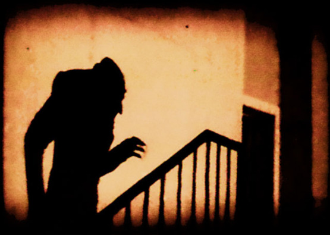
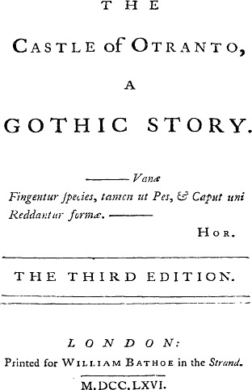
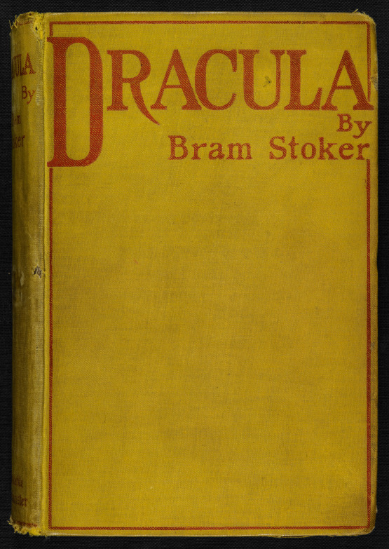

Fantastická literatura je od počátku prokleta opakováním. Mrtvá hraběnka znovu ožije a hrdina zjistí, že má nadpřirozené schopnosti. Posmívala se tomu už Jane Austenová na počátku 19. století a stvořila parodii. A podobné odmítání trvá; nejenže jsou ty fantastické historky nereálné, ale navíc jsou také stejné. Nečtěte to a vraťte se k Dostojevskému. Jak se tomuto problému vyhnout? A máme se mu vůbec vyhýbat?

## I.

[Klišé](https://cs.wikipedia.org/wiki/Klišé) je obávaným nepřítelem vypravěče. Vymyslíte dějový obrat, třeba tu nečekaně obživlou hraběnku; a v dalším ději vyjde najevo, že hraběnka ostatním postavám nenápadně vysává krev. Pak si nevyhnutelně uvědomíte, že _tohle už tu párkrát bylo._

Musí proto následovat zásadní otázka: _Je to opravdu jenom klišé, nebo je to archetyp?_

Odlišit tyto jevy je nesnadné, protože na první pohled jde o úplně to samé.

Podstatný rozdíl vězí v tom, že klišé je povrchní a krátkodeché; něco, co se vám zalíbí díky efektnímu vzhledu, ale také vás stejně rychle omrzí. Archetyp naproti tomu stále vyvolává efekt, i když ho znáte. Nějakým divem funguje. I po desáté.

[Wikipedie](https://cs.wikipedia.org/wiki/Archetyp) praví, že archetyp v literatuře je symbolický model, soustava myšlenek a představ, které se během historie neustále vrací nebo jsou trvale přítomny a působí se stejnou emocionální intenzitou. Archetyp se jako vzorec reality nemění, mění se však jeho ztvárnění, které akcentuje jiné významové vrstvy vzhledem k době a prostředí, ve kterých dílo vzniká.

Nevyčerpatelným zdrojem archetypů jsou lidové pohádky, které je možno odkrývat a rozkládat na jakési hlubší sdělení a významy, nicméně vždy opředené tajemstvím, neboť každý archetyp je v podstatě nedefinovatelný a nevyjádřitelný. Právě proto je potřeba narace, příběhů a mýtů, abychom se skrze ně dostali k archetypům do osobní blízkosti. Nepůsobí totiž na racionální složky osobnosti, ale spíše na její nevědomou, archaickou složku, kde vyvolávají určitou rezonanci, neboť jsou v nás již určitým způsobem přítomny. Skrze naraci dochází k jejich oživení. (kráceno)

Toto vyjádření mi připadá velice výstižné. Odkaz na pohádky je důležitý; archetyp souvisí zjevně s dětskou myslí, s prvními silnými zážitky, které na tomto světě získáte. Při koupání v rybníce jste se zamotali to rákosí a prožili jste panický strach, že se už nikdy nevymotáte. Nesmysl, řekne si rozum dospělého. Jenže to někde v dolních šuplících vaší mysli stále leží, a pak na vás nečekaně zafunguje obměna situace se spoustou chapadel, které stahují hrdinu do hlubin. Je to notoricky známé a opakované, ale stále se najde někdo, na koho to platí. Potom z toho má _takové to mrazení v zádech._ A pokud toho dosáhnete, pak vězte, že to je přesně to slavné umění, o které všichni usilují.

Druhý znak, kterým poznáme archetyp, je to, že vede obvykle do mytologického dávnověku. Není to něco, co napadlo někoho poměrně nedávno, ale něco, o čem si vyprávěli už ve starém Řecku, nebo alespoň ve středověku. Vypráví se to stovky let, a stále existuje důvod, proč to vyprávět znovu. Módní klišé boj s časem nakonec vždy prohraje. Archetyp drží dál.

<h4 style="text-align: center;"> ◆ ◆ ◆  

Naším dnešním průvodcem světem archetypů bude hrabě [Dracula](https://cs.wikipedia.org/wiki/Drákula_(kniha)). Poprvé spatřil světlo světa v roce 1897. O upírech se už vědělo dávno před ním, v literatuře se zjevili díky Polidoriho lordu Ruthvenovi skoro o sto let dříve. Ze starších upírů stojí snad ještě za zmínku Le Fanuova lesbická upírka _Carmilla_ (1871). _Dracula_ mezi nimi na první pohled nevynikal; byl to několikátý román nevýznamného [irského spisovatele](https://cs.wikipedia.org/wiki/Bram_Stoker), nijak zvlášť dobře napsaný. Původní náklad 3000 kusů nesvědčí o tom, že by vydání byla epochální událost. Lze předpokládat, že řada současníků to vůbec nezaznamenala. Kult upíra všech upírů se začal rodit až dodatečně, díky filmu. Za což mohl hlavně ten první [z roku 1922](https://cs.wikipedia.org/wiki/Upír_Nosferatu_(film,_1922)), který dokonce neměl autorovo svolení a vznikl tak trochu pirátsky. Potom se móda upírů periodicky vracela, aby někdy ke konci 20. století přerostla v upíří lavinu. Připomenu jen nejznámější opusy paní Meyerové _Stmívání_, _Interview s upírem_ Ann Riceové, sérii her _World of Darkness_ a upírobijce jménem _Blade_.

Vysvětlení upířího úspěchu se samo nabízí; nade všechno ostatní je to hromada skvostných archetypů, ze kterých si tvůrci další mohli bez nesnází vybírat.

A ze kterých si vy sami můžete směle vybírat, při psaní nebo při hře, neb je to veřejný majetek.

## II.

Takže vzhůru do toho.

Upírská mytologie byla kanonizována v románu _Dracula_, nicméně __archetyp návratu nemrtvých__ je mnohem starší. A to i s tím podstatným vysáváním krve, které vlastně udržuje nemrtvého při životě. Protože krev byla v dávných dobách synonymem života. Třeba v _Neplachově kronice_, 14. století, se praví:

Když byla probita třemi olšovými kůly, krev z ní tak velmi tekla jako z hovada nějakého. Předtím spolkla svůj šlojíř až do polovice, a když se z úst vytáhl, byl všecek krvavý. Byvši probita, vždy ještě z hrobu vstávala a lidi hubila. Měla tedy být spálena, ale hranici nemohli nikterak zanítit, až jim staré ženy poradily, aby užili k zážehu šindele ze střechy kostelní. Jakmile shořela, přestala lidi trápit.

Archetyp lze tedy pojmout jako krvavou řezničinu na způsob toho Neplacha. Touto cestou jde třeba jedna z nejlepších epizod _Písně ledu a ohně_ jménem _Hardhome_.

◆ ◆ ◆

Bram Stoker na to ale šel úplně jinak a podle mne zajímavěji. Dracula vysával svoje oběti tiše a nenápadně, takže si často ani dlouho nevšimly, že je něco v nepořádku.

Mina Harkerová vypráví, že:

Když jsem došla téměř až na konec schodů, byla jsem už tak blízko, že jsem i v mihotavých stínech mohla rozeznat lavici s bílou postavou. Nad dozadu zakloněnou Lucy se opravdu sklánělo něco dlouhého a černého. Vyděšeně jsem zvolala: „Lucy! Lucy!“ a ta postava zdvihla hlavu a z místa, kde jsem byla, jsem zahlédla bledou tvář a rudé žhnoucí oči. Lucy neodpověděla a já jsem běžela dál k vchodu na hřbitov. Když jsem tam vběhla, octl se mezi mnou a lavicí kostel a asi na minutu jsem ztratila Lucy z očí. Jakmile jsem byla za kostelem, mrak již přešel a měsíc svítil tak jasně, že jsem ji uviděla, jak sedí s hlavou spočívající na opěradle lavice. Byla zcela sama, široko daleko ani stopa po něčem živém. Sklonila jsem se nad ni a zjistila, že dosud spí.

Je možné, že to celé byl jen sen a šálení zraku. A ty dvě dírky na Lucyině krku, hmotný důkaz, možná způsobila Mina svojí neobratnou manipulací se špendlíkem, jak sama vysvětluje.

Později, když už Lucy přece jen něco tuší, vede s Van Helsingem tuto debatu:

„Vy nechcete usnout?“

„Ne, bojím se.“

„Bojíte se usnout? Proč? Vždyť je to dobrodiní, po němž všichni touží!“

„Ach, kdybyste na tom byl jako já, tak ne! Kdyby pro vás byl spánek předzvěstí hrůzy!“

„Předzvěstí hrůzy? Co tím probůh chcete říci?“

„Nevím, ach nevím. A to je právě to strašné. Všechna ta slabost mě zmáhá ve spánku a já už se děsím pouhého pomyšlení na spaní!“

Je to __archetypální strach z bezmoci ve spánku__; z toho, že v noci se s námi děje něco a my nevíme co. Napadne to kdejaké dítě, a proto se také děti někdy bojí usnout. _Noční můra v Elm Street_, to je cvičení na tohle téma, kupodivu také vlastně Draculovské. Úplně nejstarší mně známý upír se nachází v _Izaijášově proroctví_ a bývá překládán _Kralickou Biblí_ také jako _noční přeluda_, a v některých verzích jako _lamia_, což je starořecké strašidlo, které bere matkám děti a pije jim krev. Ostatně přesně takto končí Lucy Westenrová v tom _Draculovi_. Za povšimnutí stojí také řada výtvarných zpracování nočních můr, jak nám je předvádějí obrázky, odkázané [wikipedií](https://en.wikipedia.org/wiki/The_Nightmare). V těchto kalných vodách s oblibou lovil nejen Lovecraft, ale opravdu kdejaký autor hororů. Zapomenuté to není ani náhodou a funguje to skvěle.

## III.

Ve střední části románu se potom odehraje souboj Van Helsinga s Draculou o Lucy Westenrovou. Je to vzor mnohem pozdějšího veleslavného hororu _Exorcista_. Bojuje kněz a ďábel, oběť je naprosto pasivní a je jen objekt pokusů o ovládnutí z obou stran. Všechny další postavy jsou odsunuty do rolí bezmocných statistů. A je v tom další __archetyp, strach o pacienta a boj o jeho život i duši__, neb se s ním děje něco nepochopitelně strašného. Zaručeně to zažil v nějaké podobě každý, a proto to funguje také, i když je to nedějové a nehrdinské. Horor totiž může být klidně statický a nehrdinský.

Podstatou zápasu je při tom odhalování informací. Upíra totiž v této větvi příběhů nepotřebujeme přemoci hrubou silou jako draka – což ostatně není moc snadné – ale je třeba ho __archetypálně odhalit a přelstít jako zlého čaroděje__, zjistit, kde má slabé místo. Forma dopisu a deníku, kterou je román Dracula napsán, nám nenápadně cloní skutečnosti, které chtěl autor před čtenářem schovat.

Samozřejmě opět leckdo vzpomene na Lovecrafta v [Případu Dextera Warda](http://drakkar.sk/31/lovecraft-okultni.html). Ano, tam jsou k vidění ty samé dopisové techniky, a není pochyb, odkud vítr vane. _Pozorování strašidel skrze dopis_, toť jádro Stokerova vynálezu, který je nakonec pro horor možná stejně významný, jako ten upír.

Významu informační roviny si je vědom nejen autor, ale i hrdinové románu. Pečlivě si čtou vzájemně svoje deníky a dopisy, opisují je a kopírují. Evidují si všechno, co zjistili, jako nějaká policie. Je to tedy vlastně detektivka.

Bizarním vrcholem této detektivní formy vyprávění je situace v samotném závěru knihy. Zde zůstanou postavy při pronásledování upíra bez plánu někde na pobřeží Rumunska. Do toho vpadne dokument _„Souhrnné zhodnocení Miny Harkerové“._ Vypadá to jako něčí reálné poznámky, řešící problém. Třeba studentův záznam přednášky. Jako kdyby se tu zjevil sám Sherlock Holmes a jedné postavě věnoval trochu svého pověstného rozumu.

V důsledku toho nám detektivka na chvíli úplně sežrala horor. Je to také naprosto mimo dosavadní charakter Miny Harkerové, do té chvíle trochu ufňukané viktoriánské ženy. Mám podezření, že je to kouzlo nechtěného, a že autor, který zjevně moc neznal pokračování, sem v jakémsi hnutí mysli vrazil vlastní úvahy. Výsledek dává tušit, jak mohl vypadat Dracula úplně jinak, kdyby se potenciál tohoto stylu domyslel někde na začátku. Už by to asi nebyl horor plný pocitů, ale racionální studená temná detektivka, připomínající Thomase Harrise.

Technické překlápění detektivky v horor a zpátky je poučná záležitost. Z hlediska podstaty vyprávění jde o něco jiného – _v hororu se bojíme a v detektivce pátráme_ – ale přesto tu je příbuznost a v případě potřeby můžeme vyprávění posunout k té formě, kterou zrovna potřebujeme.

## IV.

__Archetypální podstata hororu Dracula je křesťanská.__ Vylézá to najevo zvláště v té střední části; Van Helsing a jeho parta mávají kříži a lepí spáry dveří hostiemi. A ještě patrnější to je v rozhodujícím střetnutí ve 23. kapitole, kdy upíra zaženou na ústup vlastně jen pomocí křížů. Což je pro mnoho dnešních čtenářů tak trochu zklamání.

Dejme tomu, že upír žije díky tomu, že krade cizí krev; to má svoji jednoduchou logiku. I když biolog a lékař by měli asi plno výhrad. Jako čtenář mohu být velkomyslnější a připustím to, v rámci fikce. Podobně přijatelné se mi jeví být přivolávání vlků, nebo to, že upíři z nějakého důvodu – nejspíš chemického – nesnáší česnek. Ale to, že upíra zastaví kříž nebo hostie, a to už na dálku, bez přímého dotyku, to znamená připustit další složitou soustavu předpokladů. Hlavně je třeba uvěřit v Ježíše Krista. Jinak to nedává sebemenší smysl. Že by čtenář mohl nebýt věřící, to si irský autor zjevně vůbec nepřipustil.

Obávám se dokonce, že by s tím mohl mít problém i leckterý dnešní křesťan. Ona je to spíš taková divná magická parodie na křesťanství. Dnes se obvykle bere kříž či hostie jako symbol, samy o sobě nějaké zázračné vlastnosti nemají. Při napadení se ostatně většina křesťanů všech věků nepokouší bránit křížem a berou do ruky daleko užitečnější sekeru nebo pistoli.

Nemělo by ale být přehlédnuto, že i po setření toho trochu podezřelého pámbíčkářského nátěru celé historky najdeme uvnitř všeho daleko solidnější starý __archetyp; boj o lidskou duši__. Můžeme ignorovat definice a dumání, jak to s nesmrtelnou duší vlastně je, a zda je to monopol křesťanů, budhistů nebo nějaké další víry. Jádro nápadu je srozumitelné i pohanům; _jsou horší věci než smrt._ Například ta představa, že i po smrti budu vraždit další oběti, je hodně nepříjemná. Barkerovo _Věčné zatracení_, jdoucí přesně po téže trase, ukazuje, že i dnes je to zajímavá cesta.

## V.

Potom je tu ještě __archetypální rovina čiré erotiky__.

Pozdější věky mají technicky jasno, co upíři přesně dělají; prostě se vám zahryznou do tepny a sají krev, někde napůl cesty mezi klíštětem a dravou šelmou. U Stokera tohle tak jasné ještě není, a podle mnoha náznaků v citované scéně napadení Lucy Westenrové si lze domýšlet leccos. Oběť je vždy malátná či dokonce spící; pročež moc přesně neví, co se dělo.

Útok upíra zahrnuje vždy velmi intimní přiblížení. V první takové scéně – útoku tří Draculových nevěst – se rovnou mluví o _líbání_. Těžko lze vymyslet starožitnější a romantičtější nápad než možnost _zemřít polibkem_. Upír je pro oběť zjevně lákavý a žádoucí, stejně jako zároveň děsivý; a taky trochu zakázaný; což je podstata vší erotiky ve velkolepé zkratce. Z tohoto archetypu žijí celé generace dalších autorů, s Clivem Barkerem v čele.

Ve výsledku je z toho třeba takováto scéna:

Plavá dívka klesla na kolena a upřeně na mě hledíc sklonila se nade mnou. Čišela z ní uvážená smyslnost, současně vzrušující a odpudivá, a jak dívka natáhla krk, dokonce si olizovala rty jako zvíře, až jsem v měsíčním světle viděl odlesk slin na šarlatových rtech a rudém jazyku, povystrčeném mezi bílými ostrými zuby. Níž a níž se skláněla její hlava, až mi její rty sklouzly pod ústa a bradu, jako by mi chtěly utkvět na hrdle. Vtom se zarazila a já slyšel, jak si jazykem mlaskavě olizuje rty a zuby, a na krku jsem ucítil její horký dech. Pak mě začala svědit kůže na hrdle asi tak, jako začíná svědit pokožka, když se víc a víc blíží ruka, která ji bude hladit. A už jsem cítil měkký, chvějivý dotek jejích rtů na neobyčejně citlivé kůži hrdla. Současně se mě dotkly tvrdé špičky dvou ostrých zubů a zarazily se. V mdlém vytržení jsem zavřel oči a čekal — čekal s bušícím srdcem.

Je jasné, že tohle viktoriánský čtenář mohl vnímat jako pornografii. Věřím, že zejména díky takovýmto scénám získal román pověst čehosi skandálního a neslýchaného.

## VI.

Vraťme se k Draculovým proměnám. Poprvé padne slovo _upír_ vedle slova _vlkodlak_, což je kupodivu pokládáno za synonymum. Dnešního čtenáře to jistě zaskočí. Dracula je popisován jako román o upírovi, ale on by to stejně tak bez problémů mohl být román o vlkodlakovi. Neb jeho příchod se děje v podobě psa, a jedno z úplně prvních nadpřirozených kouzel je přivolání smečky vlků, což se vícekrát opakuje. Draculovi je vytí vlků nejmilejší hudbou; a ti vlci ho všichni poslouchají na slovo. V jednom místě Dracula použije běžného vlka jako beranidlo k rozbití okna; postup hodný RPG hry.

Jenomže kromě této vlkodlačí roviny může být Dracula i netopýr. A později se ukáže, že _v dosahu své moci ovládá živly: bouři, mlhu, hrom; také poroučí menším živočichům — krysám, sovám, netopýrům, můrám, liškám a vlkům. Dokáže se zvětšiti nebo zmenšiti a mizí i nepozorovaně přichází podle svých potřeb._

Autorovi šlo evidentně o něco jiného, než o nějaké konkrétně stanovené zvířecí podoby, do kterých se může jeho strašidlo měnit. Je to další __archetypální příběh, ve kterém se dívka mění ve všechno možné, aby unikla svému osudu__, třeba na _„takú holubičku a já ti uletím na Uherskú stranu“_, jak se praví v jedné písničce, a její milenec se mění zase podle potřeby v orla, aby ji dostihl a přemohl. Nebo je ona v pevné hradní věži a on pronikne dovnitř oknem jako zlatý déšť, což je v příběhu _o Danaé a Diovi_. Zkratka, ať ona zkouší unikat, jak chce, on ji stejně nakonec dostihne a uloví, neb sexuální pud je strašlivě mocný a nakonec to dopadne pokaždé stejně – _„a ty musíš býti má, lebo mi tě Pánbůh dá.“_

Přesně jako Lucy Westenrová, která podlehla Draculovi, jak jsme viděli v deníku Miny Murrayové. Lucyiny další pokusy o únik jsou tím marnější. Je jeho, všechno je ztraceno, a další děj tento hrůzný osud už jen potvrzuje. Viktoriánova noční můra.

I když necháme plavat tu mileneckou rovinu archetypálního mýtu, má tahle __pohádková archetypální neodvratnost__ zvláštní sílu i v jiných směrech, a pokud na ní natrefíte, nebudete toho litovat. Za užitečný pokládám opět způsob vyprávění, jakým je to podáno; to nejdůležitější se vlastně už stalo na samém začátku, kdy čtenář moc nedával pozor a ještě to úplně nechápe, a další děj jen pomalu potvrzuje a rozšiřuje čtenářovu povědomost o tom, o co šlo. Pointa byla na začátku, a na konci se k ní ještě rádi s překvapením vrátíte.

Z hlediska dnešního upírského dogmatu byla tato pohádková rovina poněkud zapomenuta. Třeba to, že běžné zbraně na upíra nefungují, což se zdá naznačovat třeba případ z _Neplachovy kroniky_. Mrtvého prostě nelze – naprosto logicky – zabít podruhé, bojuje pořád dál jako _Terminátor_, nelze ho zastavit jinak, než úplným zničením integrity těla nasekáním nadrobno, spálením, nebo probodnutím srdce kůlem. U toho Neplacha to důkladné _trojí přibití_ dokonce naznačuje, že jde prostě o pevné zafixování mrtvoly k půdě. Zkrátka, když likvidujete upíra, rozhodně to nemáte podcenit a nechat nějaké náhodě.

Úzce příbuzný je __archetyp pronásledovatele, kterého nelze zničit__. Velmi známá příšera ze snů, dětských i pozdějších. Dost přesně je to ten _Terminátor_. A je to mnohonásobně děsivější, než to, co předvedl originální _Dracula_, kníže všech upírů, který se trapně rozpadl po dvou zásazích obyčejnou zbraní. Stejně tak je určitým zklamáním poněkud prozaická metoda ničení upírových rakví, kterou van Helsing užívá po velkou část zápasu. Člověk má pocit, že proti biblickému archetypálnímu strašidlu by bylo vhodné nasadit stejně osudové metody boje. Autor tu nebyl důsledný ve vlastních nápadech a zdá se, že sám moc netušil, jak se nezničitelného upíra vlastně zbavit.

## VII.

Jako z jiného románu působí linie zápisků doktora Sewarda. Lze v tom vidět Frankensteinovský __archetyp vědce, který objevil něco, co neměl__. Doktor Seward pozoruje blázna Renfielda, který trpí divnou mánií, že chce pozřít co nejvíce životů. Takže loví mouchy, těmi krmí pavouky, těmi krmí ptáky, a nakonec je sní. Celkově lze říci, že tahle linie je především podivná a k románu místy skoro nepatří. Hodně adaptací ji také úspěšně vynechalo, třeba hodně povedený český Hrabě Drákula, [model 1970](https://www.csfd.cz/film/208119-hrabe-drakula/prehled/).

Skutečná funkce Renfielda v příběhu je, že je __archetypálním heroldem hlavního nepřítele, který ohlašuje jeho příchod__. Podobně jako míval podobného ohlašovatele každý šlechtic, a tím spíše král, pak to dobový zvyk přenáší automaticky na všechny významné bytosti a božstva. Ani Ježíš z Nazaretu nevpadl do děje jen tak, ale byl řádně ohlášen Janem Křtitelem. Renfield právě tak vykřikuje „Přichází to! Přichází to!“ A strašidlo vskutku přichází do všední reality Londýna, k nám sem domů. Už není někde daleko v Transylvánii, ani někde v daleké galaxii, ale tady, u mne a u vás.

Renfield také je zodpovědný za nejpřekvapivější místo v celém románu, které zřejmě neuhádnete, takže vám o něm schválně nic neřeknu.

Podobnou ohlašovací funkci má v románu i starý námořník Swales, posedlý hroby a pohřbíváním. __Archetyp zdánlivě nepodstatného tlachání starého blázna__ je od té doby další oblíbený vyprávěcí manévr, vlastně doslova okopírovaný třeba v Lovecraftových _Stínech nad Innsmouthem_.

Jen tak mimochodem za starým námořníkem následuje další __archetypální strašidelná loď, kterou řídí mrtví__. Kdo nevěří, že to může fungovat ještě dnes, nechť zhlédne _Piráty z Karibiku_, kde je to podstatný a vlastně jediný zdroj energie celého vyprávění. Nic víc v tom za ty kolosální stamiliony dolarů vlastně není, než tato jednoduchá klasika. A poznamenám ještě, že v drtivé většině adaptací Draculy celá pozoruhodná odbočka se Swalesem a s lodí zmizela, případně je jen letmo zmíněna.

## VIII.

První čtyři kapitoly románu Dracula lze chápat jako skvělou samostatnou povídku, která nemá zcela záměrně konec. Její funkcí je expozice příběhu i nálady; představuje nám Draculu osobně. Jakýsi prequel Draculy, propojený postavou vypravěče Jonathana Harkera. Je asi ze všeho nejznámější a scény odtud se nejlépe pamatují. Kdyby z toho udělal autor samostatný jednoduchý příběh tím, že by to nějak zakončil, i tak by udělal pro svět dost.

Odpověď, proč tohle tak pěkně funguje, je další __archetypální téma gotického románu__, kde se __hrdina plíží chodbami strašidelného hradu__.

[Tohle téma](https://cs.wikipedia.org/wiki/Gotický_román) by jistě vydalo na samostatný článek, takže jen encyklopedicky. Má se za to, že tento typ literatury vynalezl pan Horace Walpole roku 1764 jako zřejmě úplně první model zábavné, pokleslé, brakové či jinak kritizované a zavrhované literatury. Ta kritika propukla již kolem roku 1820, kdy gotický román oficiálně zemřel, a vydržela skoro dvě staletí. Navzdory ní ovšem je gotický román předchůdcem hororu, zamilovaného románu, historického románu a detektivky, a tím nepřímo i jejich vnuků, tedy fantasy, scifi a vesmírné opery, a tedy vlastně úplně kdečeho, co se dnes doopravdy čte.

To podstatné, čím se „gotický“ román liší od opravdového středověkého rytířského románu je založeno na omylu; jsou to ty tísnivé chodby a interiéry, které jsou dlouhé, temné a za rohem na vás může něco číhat. Tohle všechno se totiž ve středověké architektuře prakticky nevyskytovalo. Středověké hrady byly naprosto přehledné jednoduché stavby, často s jedinou místností, do které jste mohli vejít a zase vyjít; a k dopravě se používaly dřevěné vnější pavlače, ochozy na hradbách a schodiště, případně nádvoří. Řetěz mnoha propojených sálů je naopak pozdější architektura zámecká, nejméně renesanční, ale spíš barokní a klasicistní. Taktéž dlouhé kryté chodby na hradbách nebo v nich jsou důsledkem vynálezu střelného prachu, kdy vznikla potřeba, aby na střelce nepršelo. Pan Walpole si zkrátka kdysi na začátku neuvědomil, že _Zámek Otranto_ vypadal ve středověku v době křižáků podstatně jinak, než v době, kdy o něm psal a viděl ho.

Svět zná málo tak úspěšných a konstruktivních omylů. Literatura byla takto obohacena o úplně nové pocity a dojmy, které nejenže náramně fungovaly na Walpoleho současníky, ale báječně fungují dodnes. Stačí si uvědomit, že je tu vlastně řeč o podstatě _dungeonu_, mnohem později vylepšeném panem Howardem v _Šarlatové citadele_ o strašidelné fantastické prvky. A i zdánlivě kosmické strašení ve _Vetřelcích_, kde se hrdinové plíží dlouhými chodbami, je stále jen obměnou tohoto geniálního vynálezu.

## IX.

Nyní další prastarý __archetyp, zvaný v anglosaské literatuře Damsel in distress__, česky nejspíše Dáma v nesnázích. Jde o to, že původní dokonale pasivní princezna, kterou je třeba zachraňovat, stojí skromně někde v koutku, případně je dokonce přivázaná řetězem, aby nerušila (_Andromeda_), a veškerý děj a vše zajímavé nám obstará akční hrdina – rytíř.

_Dracula_ je jedno z prvních dobrodružství, kde si autor postupně uvědomuje, že tato pozice je neudržitelná. V jednom místě je Mina Harkerová až ponižujícím způsobem z dalšího dobrodružství vyhnána. Leč, jak jsme viděli, ve finále se vrací v plné slávě a vlastně to celé zachrání. Žena se uplatní jako naprosto rovnocenná zejména v tomto detektivním typu vyprávění, kde jde daleko víc o znalosti než o nějakou sílu svalů.

Dnes už by se zdálo, že jde o dávno vyřešenou věc, po zjevení hrdinek jako Xena nebo Ripleyová. Ječící neschopné blondýny jsou dnes naprosto z módy. Přesto se ještě občas vyskytne starožitně pojaté vyprávění, kde třeba _Spiderman_ zachytí padající Mary Jane, která se nezmotá na víc než na to ječení.

Řekl bych, že to je všeobecně na ústupu, a od dnešních hrdinek se očekává zatraceně víc. Například mohou nabídnout to, co už zvládla Mina Harkerová, __archetyp duchovního propojení s nepřítelem__. Nějak prostě ví, co se právě děje v hlavě nejstrašidelnějšího strašidla. Samozřejmě ne neustále, ale občas; jsou to malá okénka, kterými lze do plánů nahlédnout. Může za to věštba, prokletí, kouzlo; v tomto případě je to důsledek jejího nakažení upíří nemocí. Něco podobného zvládl také _Harry Potter_ a byla to jedna z podstatných rovin celého příběhu. Vůbec to není nezajímavá možnost.

## X.

Archetypů lze objevit ve starých vyprávěních spoustu dalších. I mimo působení upírů.

Naprosto nejdůležitější otázka je, __co s tím archetypem udělat, když ho najdeme__.

To je právě to, co se od nás jakožto vypravěče požaduje. Chytili jsme zlatou rybu, ale teď jde o to, nenechat si ji uplavat. A je to něco dost těžkého; chce se po nás vyřešení paradoxu z úvodu. Že totiž archetyp sice každý zná, ale měl by zafungovat úplně nově.

Úplně dokonalá varianta je __objevit nějaké provedení, které tu ještě nebylo__.

Řekněme, že máme toho nezničitelného pronásledovatele ze snu. Co s ním, aby působil nově?

Dokonalý příklad je _Terminátor_. Nezničitelné strašidlo je ve skutečnosti robot z budoucnosti. Je nezničitelný, protože je prostě z kvalitní oceli. Když to takto jednoduše odhalíte, vypadá to až dětinsky naivně. Je to všeobecně známý a vyzkoušený přístup science fiction; racionalizace nápadu, a to klidně ad absurdum, nebo dokonce těsně za hranice možností reálné vědy a techniky. Pokud ale budete přesní, výsledek se dostaví.

Mohli byste na to také jít metodami fantazy. Postavíte to na starobylosti, nadsmyslové zkušenosti, mytologii. Nic moc nevysvětlujete, na rozdíl od scifi; naopak, čím neurčitější, tím lepší. Vylezla by vám z toho jiná potvora, stejně zajímavá. Třeba Velký Cthulhu, pokud budete maximalisti. Nebo Balrog, pokud budete skromnější.

Nebo na to půjdete přes dětské školní vzpomínky. Ten topič, kterého jste se jako dítě strašně báli. A je z toho Fredy Krueger.

Potíž je, že všechno tohle už nové není, ježto to někdo použil, jak je právě citováno. Takže to musíte vzít a pojmout malinko jinak, nějak, jak to ještě užito nebylo. Nebo jak to obvykle užito sice již bylo, ale použil to někdo v obskurním zapomenutém díle v roce 1867. Nebo to užito bylo i častěji, ale vlastně malinko jinak. Ostatně, kolik běhá po světě napodobených _Draculů_ a _Terminátorů_, to asi nikdo nespočítá. A některé varianty jsou tak vzdálené a nečekané, že zase začínají mít svoji vlastní cenu.

◆ ◆ ◆

Druhá varianta je __puristické provedení__. Vychází z toho, že nové může být také to, co se dokonale zapomnělo. Čehož skvělý příklad jsou ty variace na plížení v gotickém románu. Samozřejmě že to každý zná. Od chvíle, kdy byla podobná architektura stavěna, tedy zřejmě někdy v renesanci, tak se lidé z nejrůznějších důvodů plíží chodbami nebo nepřehlednými místnostmi. Kde někdo nebo něco může číhat za rohem. I kdyby se jednalo jen o dětskou hru, stejně je to napínavé. Protože topologický tvar interiéru je daný, nemůžete vyrazit, kam byste chtěli; a protože za ten zatracený roh prostě nevidíte.

Takže když vezmete hrdinku – ježto o holky se lidi víc bojí, to nám zůstalo z archetypu _damsel in distress_ – a necháte ji plížit se dlouhou a hlavně klikatou chodbou, kde se může skrývat za každým rohem něco děsného, a provedete to naprosto čistě, beze všech zbytečných nesmyslů, vězte, že to bude výtečně fungovat.
