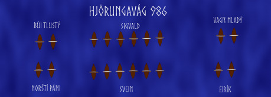
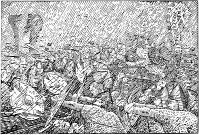

## Situace na severu před biatvou

Roku 958 dánský trůn obsadil syn prvního známého krále celého Dánska, Gorma Starého, Harald zvaný Modrozub. Do historie vstoupil díky centralizaci severského státu, měl tedy podobnou roli v dějinách jako náš kníže Boleslav I. Oba na upevnění své moci stavěli ve svých zemích hradiště, na která dosazovali své správce a vojsko. V případě Boleslava se jedná o tzv. hradskou soustavu, kdežto Harald stavěl kruhové pevnosti.

Dánský krále si ale nehleděl jen svého, snažil se svůj vliv rozšířit za hranice své země. Neúspěšně vedl válku s Říší, v důsledku čehož musel přijmout křest, při válkách s jižními sousedy dostal přezdívku „Vrah Slovanů“, získal část Štětínského zálivu a v neposlední řadě se mu podařilo ovládnout Norsko.

Místní Jarl Hakon se stal jeho leníkem a dobře mu sloužil v mnoha bojích. Pak ale Harald přijal křest a Hakon se okolo roku 980 z dánské říše odtrhl. Odplata přišla záhy. Léta Páně 982 svolal dánský král vojsko a vytáhl na vzbouřeného jarla. Poplenil pobřeží, když se ale na obzoru objevily norské lodě, stáhl se domů. Hakon zůstal neporažen.

K další výpravě se Harald odhodlal o čtyři roky později. V Říši ve stejné době oficiálně vládl malý Ota III., faktickou moc však v rukou měla jeho matka, císařovna Theofano. Ta měla vlastních problémů až dost a o záležitosti severu se nezajímala, takže Dánové měli volné ruce k útoku na své sousedy.

## Bitva samotná

Nového tažení se ovšem Modrozub nemohl zúčastnit. Zaměstnávaly jej boje s jeho synem Sveinem, a tak místo sebe poslal Sigvalda Strútharaldssona, aby Nory potrestal. Pod jeho velení dal 60 lodí. Kostky byly vrženy.

Když celá flotila vplula do norských vod a začala plenit pobřeží, byl jarl Hakon na 500 km vzdáleném statku, kam mu zprávu o Dánech přinesl jeden sedlák z jihu. Jarl dal okamžitě svolat vojsko a po několika dnech, poté, co se jeho vazalové shromáždili, vyplul proti vetřelcům.

Obě loďstva se setkala ve vodách zálivu u Hjörungavágu. Překvapení Dánů muselo být obrovské, když zjistili, že proti jejich 60 lodím jich pluje třikrát tolik norských. Jenže jinou možnost než bitvu přijmout neměli. Rozdělili tedy flotu na tři části a některé lodě svázali, aby vznikl prostor na boj na jejich palubách. Podobně se na boj připravili jejich protivníci.

Dánskému pravému křídlu velel předák legendárních jómských vikingů Búi Tlustý. Proti němu na drakkarech stanuli norští leníci a malí páni. Na středu se utkal samotný velitel Dánů Sigvald se Sveinem, synem Hakona. Vagn zvaný Mladý vedl křídlo levé a jeho protivníkem se stal Eirík, druhý Hakonův syn.

Na začátku bitvy se srazily středy obou formací a vedly spolu vyrovnaný boj, který neměl dlouho vítěze. Na levém křídle Dánů Búi rozprášil útočící Nory a sám se na ně vrhl. Eirík si povšiml krize a opustil se svou lodí bitevní vřavu na norském pravém křídle, aby vyrazil na pomoc vazalům svého otce.

Vagn ale vytušil příležitost a vystupňoval tlak. Eirík se musel vrátit do boje a zamířil k hlavní lodi svého protivníka. Podle ság neodolal a přeskočil na drakkar Hakonova syna, kde dostal po krátkém boji přes hlavu palicí. Záhy se ale vzpamatoval, smrtelně ranil svého soka a přeskočil zpět na vlastní loď. Jeden z jeho spolubojovníků takové štěstí neměl — podle ság byl zabit, když po něm přítomný islandský básník hodil kovadlinu.

Po boji, který byl velmi únavný, i kvůli pražícímu severskému slunci, se lodě od sebe odpoutaly a Norové přistáli u břehu, aby mohli z lodí vynést mrtvé. Legendy tvrdí, že se Hakon vydal na obětiště svého rodu, kde bohům nabídl život vlastního třetího syna za vítězství v bitvě. Na to bohové podle islandských básní odpověděli krupobitím, ve kterém se údajně objevily i obryně metající blesky.

Pravdivost zprávy o obryních se nedá prokázat, jisté je, že Dánové začali prohrávat. Mohla za to hlavně trojnásobná převaha Norů, kteří mohli do boje vrhat nové muže, kdežto Dánové byli již vyčerpaní. Sigvald s přibližne 35 loděmi z bitvy unikl, Búi a ostatní jómští vikingové zůstali na místě se zbylými drakkary, kde bojovali až do konce. Búi skočil do vln se svým pokladem poté, co mu nepřátelé usekli obě ruce a část obličeje (čímž dal pravděpodobně vzniknout legendě o hadovi na dně střežícím veliký poklad), kdežto Vagn se probojoval na pevninu. Tam se dalšího dne vzdal Hakonovým mužům.

Se svými druhy měl být z jarlova rozkazu popraven, když ale kat došel až k němu, Vagn jej přemohl v nerovném boji, čímž sobě i ostatním zajatcům zachránil život. Přijal místo v Hakonově družině, v níž se v budoucnu vyznamenal.

## Dopad bitvy

Norové po boji získali to, co chtěli. Stali se nezávislými na dánském králi.

Zato Harald prohrál vše. Po bitvě se proti němu postavili i ti, kteří dosud stáli při něm. Musel se uchýlit až do své pevnosti ve Volinu, kde rok po osudném boji umírá. Vlády v Dánsku se zmocnil vzpurný syn Svein Vidlivous. Až jemu se podařilo dosáhnout toho, při čem jeho otec neuspěl, a to dobytí Norska. A později se vydal ještě dál — po dlouhé době obnovil tradici vikinských králů Anglie.
