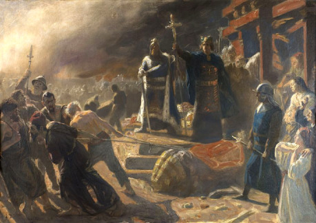
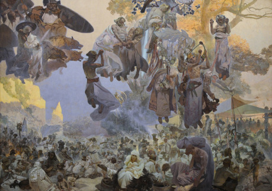

Podobná scéna se odehrála v myslích mnoha (nejen) českých rodnověrců, národních obrozenců a historiků, když si asociovali spojení „Arkona 1168“. A k tomu se přidala spojení jako „konec pohanství v Evropě“, „konec slovanské kultury“, popřípadě u radikálnějších „vítězství germánského živlu“. Ale událo se tak opravdu 15. 6. léta Páně 1168 před hradbami Arkony, hradiště na útesu nad Baltským mořem, místem, kde stál legendární Svatovítův chrám?

## Shon před bouří

Svým tažením roku 1168 se Valdemar přiblížil jinému dánskému královi, Erikovi, který už proti Ránům jednou vyplul. Stalo se tak skoro o třicet let dříve, přesněji roku 1136. Erik se rozhodl vrátit úder za zničení jeho sídla v Konungahelle, proti níž směřoval velký slovanský nájezd o rok dříve. Ačkoli nebyli jeho hlavními organizátory Rujánci, ale Pomořané, na ostrovní stát dopadla pomsta.

Erik byl úspěšný: oblehl hradiště a to po krátkém boji složilo zbraně. Arkonci se zavázali přijmout víru a z chrámu vytáhli Svatovítovu sochu. Když zmizela poslední dánská loď z dohledu, hned ji tam zase vrátili a Krista odvrhli.

Další léta se nesla ve znamení války. Válečné štěstí je ale věc vrtkavá, a tak se stalo, že dříve mocní ostrované najednou začali prohrávat. Jejich slabosti využil tehdy Valdemar, když poprvé v roce 1160 shromáždil vojsko proti Rujáně.

Ránové, kteří si nevěřili dost na to, aby se vypravili do námořní bitvy raději poslali vyjednavače jménem Domabor, který měl sjednat mír za každou cenu. Zastihl Dány na cestě a začal jednat s biskupem Absalonem o míru. V průběhu rozhovorů ale některým lodím začalo docházet jídlo, načež Domabor vycítil příležitost, zaútočil a domů přivezl čestný mír mezi Slovany a Dány.

Valdemar se ale svého cíle nevzdal a začal shromažďovat spojence. Na jihu se spřátelil s Jindřichem Lvem, mocným říšským šlechticem, který nedávno porazil Obodrity. Na východě zase žili Pomořané, dřívější spojenci Rujány, nyní ale křesťané, kteří si od války slibovali zisk. Bratři Kazimír a Bohuslav se společně s Jindřichem s svými vojsky přidali k armádě Valdemara.

Síla to byla impozantní. Žrecové ze svatyně se i nyní rozhodli jednat o míru. Vyslali opět posla, který měl nyní další úkol, a to zjistit o Dánech co nejvíc, a vše to potom povědět svým lidem.

## Valdemarovo tažení

Posla si, pro jistotu, aby neřekl Slovanům nic, co neměl, Dánové nechali u sebe a vypluli proti Rujáně. Podle Saxa našli bohatou kořist, o příležitost k boji ale byla velká nouze, a tak se vydali přímo k Arkoně. Na úzké spojnici mezi ostrovním vnitrozemím a poloostrovem Vitov, kde hradiště stálo, vybudovali val, který měl zamezit, aby obléhaným přišlo na pomoc ránské vojsko. Tímto zopakovali strategii z minulého tažení, kdy val, jakožto velmi chytré opatření zachránilo dánské vojsko před porážkou. Roku 1168 ale žádné posily nepřišly. 6000 mužů se schovalo za hradby Korenice, kde vyčkávalo, jak všechno dopadne.

Valdemar s Absalonem nechali rozbít tábor a stavět žebříky a obléhací stroje, které měly pomoct při zteči na přibližně 25 metrů vysoký val. Samotný král pak chodil po táboře, kde povzbuzoval vojáky tvrzením, že svatý Vít, který se na Arkoně uctíval, když ji pokřtili mniši z Corvey, a který je nyní uctíván jako bůh (a tím vlastně i hanoben) pomůže svým zachráncům. Pravdivost celé zkazky byla již dávno vyvrácena, zakládá se totiž na zfalšované listině, kterou měl darovat Ludvík Němec mnichům ostrov. V době expanze křesťanství byla Rujána lukrativní záležitostí.

Zatímco se vojáci divili králově řeči, chlapci, které s sebou bojovníci vzali, začali na hradby Arkony házet kameny. Arkonští chlapci jim odpověděli vlastní palbou a po chvíli se hra rozrostla v šarvátku mezi dospělými. Slované se soustředili na hradby, kam také směřoval dánský nápor. Hlavní bránu do města zabarikádovali tak, že před ní navršili hromadu hlíny, vyvěsili na ni prapory s podobiznami bohů a nechali ji jinak nechráněnou. Proti ohni ji ještě pomazali hlínou, aby se nedala zapálit. Jenže tato důmyslná obrana se sloupla pod náporem slunečních paprsků.

Toho si povšiml jeden dánský chlapec a přišel s velmi odvážným plánem. Hned se podělil s ostatními, kteří nakonec souhlasili s jeho plněním. Před nehlídanou bránu dotlačili vůz se senem a do míst, kde se hlína odloupla nastříleli šípy a naházeli oštěpy. Jejich statečný kamarád po nich vylezl a oni mu nahoru podávali slámu. Když jí naplnil všechny výplně ve svém dosahu, suchou trávu zapálil. Věž, ač předtím pomazána zeminou, vzplála.

Obránci se požár snažili hasit, ale boj proti němu a nepřátelům byl pro ně příliš. Někteří se nemínili vzdát a umírali tam, kde se postavili na odpor. Jiní se celkem ochotně stahovali a snažili se zachránit holý život. Nikde jsem nenašel nic o žrecích z chrámu, ale dá se předpokládat, že se snažili vést obranu.

Mezi lidmi ze druhé skupiny se nakonec objevil jeden schopný muž, který se rozhodl jednat s Absalonem. Ten výpravu fakticky vedl, o dalších krocích po vypuknutí požáru rozhodoval právě on. Biskup se rozhodl výzvu k jednání přijmout, jen se přesunuli na valu do míst, kam požár dosud nezasáhl.

Rán nabídl Absolonovi kapitulaci města. Biskup se zamyslel a požádal o to, aby obyvatelé nehasili dále požár. S tím souhlasili, a tak se Absolon vydal zpět do tábora na poradu. Dánové neměli v plánu Arkonu jen poplenit, jak před třiceti lety. Jejich záměr byl dalekosáhlejší, chtěli si Rány na dobro podrobit. Proto vyžadovali propuštění dánských vězňů, přijetí křtu, přenechání pozemků svatyně dánské církvi, účast na dánských výpravách a placení daní.

Ránové by moc prohloupili, kdyby odmítli nabídku. Město by možná ubránili, ale příště by se to už nemuselo povést. Dánský král a biskup byli navíc daleko, na rozdíl od žreců, kteří si pro sebe nárokovali třetinu kořisti. Valdemar dal Ránům možnost bojovat, aniž by tuto saň museli platit a navíc ostrov zbavil Svatovítových kněží. Slované přijali.

## Podmanění Rujány

Arkona ale byla jen začátek. Ovládnutí jednoho města ještě nedostalo do Valdemarových rukou celý ostrov, o což velmi stál. Naštěstí pro Dány se Ránové sami rozhodli jednat o míru. Noc po kapitulaci hradiště přijel za Absolonem posel, který přivezl nabídku míru od dalšího velkého města na Rujáně, Korenice. Biskup přislíbil, že se jednání zúčastní. Nejprve ale musel skoncovat se sochou čtyřhlavého boha Svatovíta.

Ráno se do chrámu odebrala malá skupinka mužů se sekerami mající za úkol modlu zničit. Vysekali do zdí chrámu díru a porazili vysoký idol. Ten pak vynesli na světlo, kde jej před zraky Slovanů rozsekali na malé kousky a spálili v táborové kuchyni. Podle kroniky Činy Dánů po pádu sochy vyběhl démon, který v ní sídlil. Po zničení centra kultu se na řadu dostal zbytek ostrova.

Ke Korenici se vydal Absolon se svým doprovodem, zbytek vojska měl dorazit později. Z města je přišlo přivítat ránské vojsko: šest tisíc dobře vyzbrojených bojovníků Dány sice vyděsili, ale když jim poslové vysvětlili, že nechtějí bojovat, zase se uklidnili. Po jednání přijala i Korenica Valdemara za svého vládce a i tam byly zničeny modly bohů.

Naskýtá se otázka, proč se vlastně koreničtí nebránili, když měli tolik mužů. Odpověď je prostá, pro tolik mužů, místních a uprchlíků nebylo na hradišti dost zásob. Navíc podle pamětníků stály domy tak blízko sebe, že kdyby se podařilo střelou zapálit jeden, vzplálo by celé město. Toto nebezpečí si místní uvědomovali a rozhodli se neriskovat.

Kořist z tažení sice nebyla nijak velká, což se prostým vojákům nijak moc nelíbilo, ale Dánům se podařilo získat ostrovní stát takřka nezničený. Velká hradiště se vzdala buď po krátkém, nebo vůbec žádném boji, Ránové se zavázali platit daně a poskytovat bojovníky (a že až 12 tisíc mužů nebylo málo) a vlastní ztráty neměli nijak velké.

Ale úspěch měl i stinnou stránku. Pomořanská knížata, bratři Bohuslav a Kazimír, očekávala, že Rujánu za věrné služby dostanou do správy oni. Po vítězství se s Valdemarem rozkmotřili a mezi oběma státy začala válka.

Ostrov byl po pádu starých bohů rozdělen na 12 částí, každá měla svůj kostel podléhající dánské církvi, a o světské záležitosti se starala domácí knížata.

## Konec jednoho věku

Nyní je čas, aby byla zodpovězena otázka položená na začátku článku. Co (a jak) se vlastně toho dne stalo? Již jsme si na ni tak trochu odpověděli, když jsem popsal, jak probíhalo dánské tažení. Otazníky tak stále visí ještě nad jeho dopady.

Jisté tedy je, že v horkých červnových dnech přijal křest poslední ze slovanských států. Mnoha lidmi je to pokládáno za konec slovanské tradiční víry jako takové a završení zotročení polabských Slovanů. Ani jedno ale není tak úplně pravda.

Slovanská víra ve Svatovíta, Černoboha, Peruna či Triglava hned nezemřela. Na to církev potřebovala mnohem víc, než vykoupat tisíce lidí ve velkých kádích, naučit je latinsky otčenáš a postavit kostely. Potřebovala čas, a potřebovala jej hodně. I u nás Homiliář opatovický ještě dlouho po křtu prvních českých knížat varuje, aby se nedodržovaly pohanské zvyky. V Rusku mohla víra ve staré bohy vydržet ještě dlouho do středověku, a pokud se díváme na pohanství jako celek, tak na východě stále žili pohanští Prusové. Svatovít již neměl velký krásný chrám s překrásnou modlou a podílem z kořisti, své přívržence ale jistě neztratil.

A co to rozšířené tvrzení o zotročení Slovanů? Pokud tak nazýváte lenní systém, pak byli dosud svobodní Slované poraženi otroky z řad Dánů a Němců. Do slovanských krajin tak zavítal po letech mír a ty tak mohly zažít obnovu. Jen pro zajímavost můžu uvést, že Slované, které si podmanil Jindřich Lev se velmi radovali, když jim v sedmdesátých letech umožnil plenit na území jeho nového nepřítele: krále Valdemara, nově zvaného Veliký. Ani pirátské řemeslo tak nebylo opuštěno.

Na stranu druhou ale musím říct, že by se tak nestalo bez kolonistů z německy mluvících zemí, v důsledku čehož nakonec slovanský jazyk v oblasti vymizel. Podobné praxe, ale se slovanskými osadníky, se držela i knížata před německým a dánským podrobením (ačkoli Rujána nové obyvatele tak moc jako kontinentální státy nepotřebovala). Tudy se dostáváme k problematice „Co by se stalo, kdyby…“, která je nepochybně přitažlivá, ale mimo rámec tématu o dobytí Arkony.
