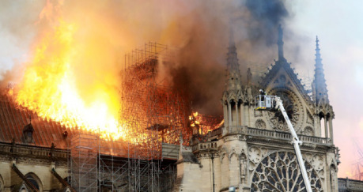
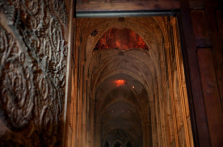
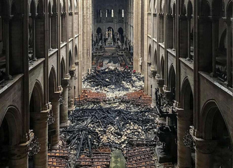
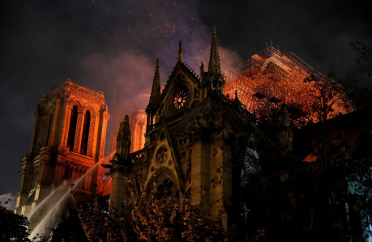
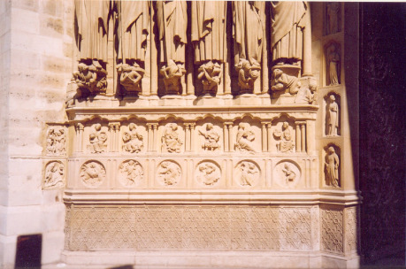
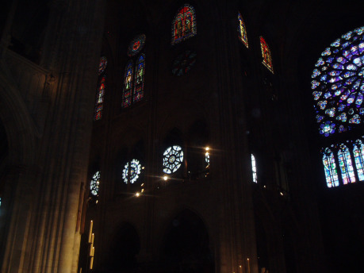
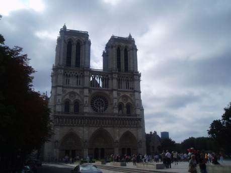

> __Hasiči nedokázali v dnešní době uhasit středně velkou budovu.__

Chrám Notre Dame v Paříži má plochu přes pět tisíc čtverečních metrů. Což znamená okolo dvaceti činžáků běžné velikosti nebo padesát rodinných domků. Je tedy obrovský i v dnešních měřítkách, kdy naše civilizace vyrábí často i několikahektarová monstra. Pokud chrám vnímáme z perspektivy doby, kdy vznikl, pak jsou jeho rozměry ještě daleko nepochopitelnější, protože jsou srovnatelné s úplným malým středověkým městem. Pokud si představíme běžnou městskou zástavbu, tehdy málokdy přesahující deset metrů, pak je musela katedrála převyšovat přímo drtivě. Ústřední dominanta města a úplně všeho. Střed tehdejšího vesmíru.

Nyní si představme na chvíli podkroví katedrály. Je to docela obtížný cvik, protože ten prostor je pro laiky zcela nepřístupný. Na půdu se chodit vlastně moc nemělo, jen při nějaké opravě. Takovou půdu také není snadné přirovnat k něčemu známému. Půdní prostory všech velkých budov s klasickými krovy jsou krásné a zvláštním způsobem působivé; ale představit totéž o délce sta metrů je skoro nemožné. Pravděpodobně za běžného osvětlení vůbec neuvidíte na konec. Mimořádná je i velikost trámů; s délkou roste jejich tloušťka, a trámy přes deset metrů dlouhé vyžadují obrovské lesní velikány už při svém vzniku. Máme zprávy, že při stavbě katedrál bylo hodně obtížné takové stromy vůbec najít, v podobně kolosálním množství. Půdní prostor tedy tvoří něco jako hodně fantastický les, který činí ještě zvláštnějším, že mnohé ty stromy vyrostly před sedmi nebo osmi stoletími.

No, a když to začne hořet, vznikne něco jako menší apokalypsa. Oheň, který má skoro nekonečný přísun perfektně suchého paliva, obrovské zásoby vzduchu kolem a při tom je dokonale nepřístupný, v uzavřeném prostoru a ve výšce třicet metrů. Hasičova noční můra.

Ve středověku je úplně nemožné s tím něco udělat. A dnes jsme na tom jen nepatrně lépe. Většina hasičské techniky je konstruována na ty běžné domy, zhruba o deset metrů nižší. Nepočítá se s nějakými nepravděpodobně velkými objemy vody zvenku, protože mimořádně velké budovy – třeba mrakodrapy – s podobnou situací počítají už při svém vzniku a voda bývá zavedena do vyšších pater pomocí takzvaných suchovodů. A v místech, kde se pohybuje hodně lidí, jsou sprinklery a požární hlásiče a jiné důmyslné vynálezy. Takový moderní dům tedy hasičům umí účinně pomáhat sám, a na tom je jeho obrana před požárem založena. Katedrála pochází z poněkud jiného věku.

A nic nevyřeší ani hrubá letecká síla, navrhovaná panem prezidentem Trumpem. Svrhnout na křehkou klenbu chrámu z výšky tuny jakéhokoli materiálu je přesně to, čemu se hasiči pokoušeli zabránit úplně nejvíc ze všeho. Protože klenba, to je, oč tu běželo především. A z převážné většiny byla jejich úsilím zachráněna.

> __Myslíte, že se od začátku počítalo s tím, že půda prostě shoří a klenba uchrání interiér?__

Tahle konspirativně znějící otázka reportéra vypadá jako nesmysl, ale je pouze nesprávně vy­stavěna. _Ve skutečnosti totiž právě tyto zkušenosti a nebezpečí požáru vedly středověké stavitele k přemýšlení nad kamennými klenbami_.

Byl to nápad pocházející z válečných zkušeností. Oheň byl asi nejničivější a snadno dostupná středověká bojová technika. Bylo možné spálit opravdu kdeco, protože dřevěná byla drtivá většina budov a zařízení. To, že se lidé trápili s daleko dražšími, nepohodlnějšími a pracnějšími konstrukcemi z kamene, bylo právě způsobeno obavami z ohně. Bohatý kupec si postavil na svoje drahé zboží stavbu v podobě kamenného kvádru, zakrytou klenbou i shora. Něco jako obrovský trezor. To byl původní a hlavní smysl měšťanského domu. Stejně tak hradní architektura postupně zakrývala vršky věží a paláců kamennými klenbami a kupolemi, právě proto, aby to nešlo jednoduše spálit.

V 11. století technika západní evropské civilizace nabývala na síle a velký chrám byl jednou z ústředních civilizačních výzev. Ta technika toho ještě neuměla mnoho, jen nedávno opustila úroveň tribálních kmenových společenství, trávících velkou většinu času venku. Schopnost postavit interiér, do kterého se vejdou současně tisíce lidí, kteří při tom navíc mohou ještě všichni sledovat kněze, je fascinující.

Spousta řešení při tom neměla žádnou tajemnou duchovní podstatu, ale byla prostě prakticky vynucena okolnostmi. Třeba právě podstatné rozšíření chrámových lodí proti původním pozdně římským kostelům se dělo kvůli té snaze vidět na oltář a udržet kontakt mezi přítomnými. Pouť ke svatým ostatkům zase vyžadovala nutnost zajistit plynulý příchod a odchod spousty lidí, jako na nějaké výstavě. To vyvolalo konstrukci poutního chrámu s ochozem kolem oltáře, což je dnes jeden z definičních znaků katedrály. _Katedrála to je, když mohu chodit i za oltářem_.

A když si představíme ten dav lidí vybavený svíčkami nebo loučemi, a nad nimi rovné trámové stropy ze dřeva – neb tak to prostě v románském věku vypadalo [skoro všude](http://drakkar.sk/69/) – pak je jasné, že k nějakému požáru nebylo daleko. Něco takového se nedalo uhlídat a požár nastal skoro s matematickou jistotou. Také snad úplně všechny velké a slavné chrámy v těch dobách vyhořely, některé dokonce vícekrát. To je pádný důvod zakrýt interiér kamennou klenbou.

Což byla, při výšce a šířce prostoru, další složitá výzva; antická technika tu již nestačila a bylo nutno ji značně zdokonalit. Představovalo to zhruba sto let různých nápadů a jejich zdokonalování na nejrůznějších chrámech. Tak vznikla postupně zpevňující žebra v křížové klenbě (Caen), lomené oblouky (Cluny), vnější opěrný systém (Durham, Vézelay).

V každém případě se díky kamenné klenbě nahoře podařilo vyrobit obrovskou budovu, nespalitelnou ohněm, do které se vejde spousta lidí. Kdyby byla nějaká taková možnost, středověký stavitel by určitě vynechal i dřevěný krov a nahradil ho jiným materiálem. A jistě by neprotestoval, kdyby tušil, že u mnoha katedrál k této výměně nakonec později došlo. Svatý Vít v Praze a Notre Dame v Chartres mají krovy ze železa a k podobnému požáru tam tedy vůbec dojít nemůže.

> __Notre Dame v Paříži je Notre Dame celé Evropy.__

Při požáru padlo mnoho vzletných prohlášení; toto má například na svědomí pan Donald Tusk, předseda Evropské rady. Na první pohled se to zdá všechno poněkud přehnané.

Jak velký význam má tedy Notre Dame v Paříži?

Pokud si zasadíme tuto katedrálu do naznačeného kontextu, vývojové řady velkých středověkých chrámů v Evropě, i potom zůstane jeho postavení naprosto zásadní. Ano, není jediný ani v samotné Paříži; mají tu také neméně úžasnou katedrálu St. Denis, a navrch ještě Sainte Chapelle. V celé Francii je asi šedesát katedrál, a jednou tolik dalších velkých chrámů, které z různých důvodů tento statut nemají. Se zbytkem Evropy – především díky trojici Anglie, Německo a Španělsko – lze tento počet ještě přibližně zdvojnásobit.

Jenže pokud zkoumáme tu záplavu nejrůznějších chrámů z různých hledisek, ukáže se, že téměř všechny jsou menší, novější, hůře zachované, s méně autentickými detaily. Srovnání s naším chrámem svatého Víta, v tisku dost časté, je zrovna velmi nepřípadné; svatý Vít je o dvě staletí mladší a z poloviny dostavěný v moderní době. Autentické barevné okno nemáme ani jedno, soch jen nepatrné množství. V kontextu těch francouzských katedrál by zřejmě svatý Vít skončil někde hluboko uvnitř té šedesátky.

Notre Dame v Paříži patří naopak zcela přesvědčivě do první pětky, na kterou zbytek světa žádnou odpověď vůbec nemá.

 Taková stavba jinde prostě není. V této skupině je každá z těch nejslavnějších katedrál čímsi naprosto unikátní a ohromující. [Remeš](https://en.wikipedia.org/wiki/Reims_Cathedral) je vrcholná, korunovační a má nejlepší západní stěnu. [Bourges](https://en.wikipedia.org/wiki/Bourges_Cathedral) nabízí nepochopitelně kompaktní obří prostor a neuvěřitelnou sbírku původních vitrají k tomu. [Amiens](https://en.wikipedia.org/wiki/Amiens_Cathedral) je vrchol vývojové řady a po něm následovaly už jen více či méně zjednodušené repliky. [Chartres](https://en.wikipedia.org/wiki/Chartres_Cathedral) je potom třída sama pro sebe, překonává všechny a ve všem.

No a [Notre Dame v Paříži](https://en.wikipedia.org/wiki/Notre-Dame_de_Paris)… je z této skupiny jasně nejstarší. Jediná z raných katedrál, která má k tomu i ty obří rozměry. Pětilodní, ještě s emporou, takže fakticky dvěma patry první postranní lodi. Styl časný, málem románský, jednoduchý, elegantní. Mnoho lidí tohle favorizuje před daleko bohatší, leč komplikovanější vrcholnou gotikou. A narážejí na to, že raných katedrál je hodně málo i v samotné Francii.

Potom tu máme to [Tajemství katedrál](https://www.databazeknih.cz/knihy/tajemstvi-katedral-a-esotericky-vyklad-hermetickych-symbolu-velkeho-dila-36355), nazvané podle jisté knihy, která je sama podobně ohromujícím výtvorem, jako sama katedrála. Fulcanelli věnoval Notre Dame v Paříži nakonec úplně nejvíc prostoru, skoro polovinu svého pojednání. Při čemž nepopisuje zdaleka celý chrám, ale vlastně se věnuje jen těm dvěma nenápadným řadám reliéfů vedle středního vchodu do chrámu. Ne proto, že by bylo toto provedení alchymického cyklu nejdůmyslnější ze všech, ale právě proto, že je velmi jednoduché, instruktivní a málo zamlžené stále komplikovanějšími odkazy. Při tom jen letmo poznamenává, že prakticky to samé a v barvách najdeme na vitrajích, především na hlavní západní rozetě. Tady potom zbývá jen doufat, že tato zcela mimořádná vzácnost požár přežila. Na všech fotografiích, které jsem zkoumal, podezřele chybí.

Samozřejmě, daleko populárnější než Fulcanelli je román [Chrám Matky Boží v Paříži](https://cs.wikipedia.org/wiki/Chr%C3%A1m_Matky_Bo%C5%BE%C3%AD_v_Pa%C5%99%C3%AD%C5%BEi), v důsledku událostí v tuto chvíli jedna z nejprodávanějších knih na světě. K němu je asi zbytečno cokoli dodávat, každý o něm slyšel ve škole.

Pochybuji, že by existovalo mnoho tak známých chrámů. Donald Tusk nijak nepřehání. Musíme přistoupit na úplně jiná pravidla, abychom mohli srovnat takové skvosty, jako barokní chrám svatého Petra v Římě, nebo chrám Hagia Sofia v Instanbulu, nebo pyramidy u Káhiry, nebo podzemní stavbu CERN u Ženevy. Nebavíme se o úrovni památky UNESCO, ale o něčem, co by šlo klidně zařadit do divů středověkého a potažmo i našeho dnešního světa. Takovou stavbu většina zemí vůbec nemá.

Vedle toho vlastně bledne i kolosální význam chrámu pro samotné Francouze, nebo že je Notre Dame v Paříži, a je to asi nejdůležitější a nejtrvalejší symbol města, proti němuž je Eif­felova věž jen epizoda. Nebo význam pro katolickou církev, často zmiňovaný, pro které je to nakonec zase jen další kostel.

> __Ono na něm vlastně moc historicky původního není.__

Běh času je neúprosný, a vůbec žádná stavba se nám nedochovala v čistě původní podobě. I tak bytelné stavby jako [Koloseum](https://en.wikipedia.org/wiki/Colosseum) nebo [Pont du Gard](https://en.wikipedia.org/wiki/Pont_du_Gard) byly mnohokrát opravovány a ne každý kámen umístila na místo ruka římského zedníka. Tím spíš to platí o křehké stavbě uprostřed moderního města s hodně agresivním ovzduším, zbudované z měkkého vápence. Přes kterou přešlo mnoho válek, povstání, a konečně ta Velká revoluce.

Takže ano; plno konkrétních kamenů, soch nebo oken bylo více či méně restaurováno. U některých není snadné zkontrolovat, jak moc se liší od původní podoby. U jiných to naopak snadné je, protože máme nezávislé zprávy. Katedrála je jako prastará kniha, dochovaná v kdovíkolikátém přepisu; mnohokrát drobně pozměněná, a přesto zachovává to hlavní, původní ráz a původní ideje, z dob až nepochopitelně dávných.

> __Jak moc nepochopitelně dávných?__

No, opravdu hodně dávných. Přesně se to neví; stavba byla zahájena někdy kolem roku 1163, možná i o něco dříve, a to hlavní bylo zřejmě dokončeno do roku 1200, kdy chrám už plnil svoji úlohu. Do roku 1245 byly dokončeny věže a další úpravy probíhaly až do 14. století.

Pokud lze tento chrám zařadit mezi Argonantovy kostely, pak to tedy není přehnané; Argonantus ho mohl ještě během svého života navštívit. Je důležité si tento rozměr uvědomit, pokud zkoušíme Notre Dame s čímkoli srovnávat; u nás je současnou stavbou chrám svatého Jiří na Pražském hradě. Což je poněkud jiná liga.

> __Pro mne nemá Trnová koruna valné ceny. A jeden život nestojí za všechny katedrály světa.__

Ano, lze to tak vidět. Trnová koruna je sestrou celé katedrály v tom smyslu, že obě dvě nemají materiální smysl… vlastně vůbec žádný.

Kdysi dávno mne učitelé bombardovali poznatkem, že _základem života je uspokojování materiálních potřeb_. Soudobý klasik to trefně zobrazil slavnou úvahou, kterak život představuje _první dovolenou v Jugoslávii, kterou následuje první dítě, druhou dovolenou v Jugoslávii, druhé dítě, a tak dále, samá pozitiva a sociální jistoty_.

Byl to Jan Werich, kdo si správně všiml, že _život je třeba žít, protože ono se s ním nic jiného dělat nedá_. Takže, ať riskneme okamžitou ztrátu života [pro záchranu Trnové koruny](https://www.blesk.cz/clanek/zpravy-pribehy/603644/trnovou-korunu-v-notre-dame-zachranil-hrdina-z-vystrileneho-klubu-vynesl-z-plamenu-i-vzacnou-monstranci.html), jako tento pán, nebo utratíme život postupně a opatrně ve jménu sociálních jistot a životních pozitiv, utratíme ho v každém případě nevyhnutelně a nenapravitelně.

A v tomto smyslu mi riskování života ve jménu záchrany relikvie, kterou ocení leckdo, nepřipadá tak nesmyslné. Stejně tak ostatně riskoval i ten svatý Ludvík, jeden z nejromantičtějších a nejrytířštějších králů středověku, když zorganizoval dvě křížové výpravy, vlastně za tou Trnovou korunou. Někdo hledá svatý Grál, někdo Kristovu korunu.

Riskovali ti stavitelé katedrály, když se ve středověku vyšplhali na dřevěné lešení a tam manipulovali s nebezpečně velkými bloky kamene. Je prakticky jisté, že to někteří z nich nepřežili. A byli následování neméně velkolepou armádou těch, co katedrálu v dalších století opravovali. Většinou je to nezabilo, ale určitě to spotřebovalo velký kus jejich života.

Předpokládám, že katedrálu také někteří lidé bránili, třeba v době Velké revoluce, kdy část veřejnosti zastávala názor, že by bylo dobré tuto připomínku starého režimu rovnou zbourat. Což se v některých méně šťastných případech skutečně stalo.

No a konečně, tento týden hodně hasičů zkoušelo katedrálu zachránit, nebo alespoň zajistit, aby při zkáze střechy nebyly zničeny i západní věže a klenba. Někteří se u toho zranili, jeden prý docela vážně.

Svým způsobem také katedrála spotřebovala životy mnoha historiků, kteří je utratili tím, že prolézali katedrály a psali o nich spoustu slov. Současný badatel [Peter Kováč](http://dejinyasoucasnost.cz/archiv/2007/5/peter-kovac-katedrala-v-chartres/), například, kterého lze velmi doporučit. A také ukousla životy nás dalších, kdož jsme některou katedrálu oslavili v nějakém příběhu; nikoli jako znalci, ale jen z čirého nadšení nad tím, že můžeme sdílet kousek starého světa, který existuje tak překvapivě dlouho.

Požár nám připomněl, že ani tak dlouhý věk, jaký má katedrála, nemusí nutně znamenat ještě věčnost. Všechno je pomíjející. Pokusy tomuto stavu věcí vzdorovat jsou heroické a velkolepé, a asi proto také lidské jepice fascinují.

A požár, který se stal a kterému už zpětně nelze zabránit, může být užitečný také pro ty, kdo utrácejí život ve vymyšlených světech. Vzpomeňte na to, až budete potřebovat virtuální požár většího rozsahu. Protože k čemu jinému je nám katastrofa, než k vyprávění.
